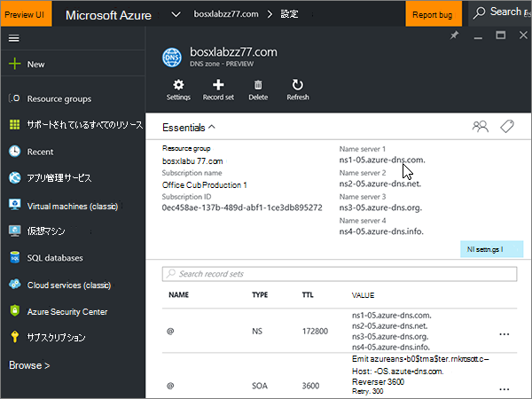

# Azure DNS ゾーンの DNS レコードを作成するCreate DNS records for Azure DNS zones

 探している内容が見つからない場合は、**[ドメインに関する FAQ を確認Q](../setup/domains-faq.md)** を参照してください。**[Check the Domains FAQ](../setup/domains-faq.md)** if you don't find what you're looking for. 
  
Azure が DNS ホスティングプロバイダーである場合は、この記事の手順に従って、ドメインを確認し、電子メール、Skype for Business Online などの DNS レコードを設定します。If Azure is your DNS hosting provider, follow the steps in this article to verify your domain and set up DNS records for email, Skype for Business Online, and so on.
  
追加する主なレコードは次のとおりです。These are the main records to add. 
  
- [ドメインのネーム サーバー (NS) レコードを変更するChange your domain's nameserver (NS) records](#change-your-domains-nameserver-ns-records)
    
- [確認用に TXT レコードを追加するAdd a TXT record for verification](#add-a-txt-record-for-verification)

- [MX レコードを追加して、自分のドメインのメールが Microsoft に届くようにするAdd an MX record so email for your domain will come to Microsoft](#add-an-mx-record-so-email-for-your-domain-will-come-to-microsoft)
    
- [Microsoft に必要な4つの CNAME レコードを追加するAdd the four CNAME records that are required for Microsoft](#add-the-four-cname-records-that-are-required-for-microsoft)
    
- [迷惑メールの防止に役立つ、SPF の TXT レコードを追加するAdd a TXT record for SPF to help prevent email spam](#add-a-txt-record-for-spf-to-help-prevent-email-spam)
    
- [Microsoft で必要な 2 つの SRV レコードを追加するAdd the two SRV records that are required for Microsoft](#add-the-two-srv-records-that-are-required-for-microsoft)
    
これらのレコードを Azure で追加すると、使用しているドメインが Microsoft サービスで機能するように設定されます。After you add these records at Azure, your domain will be set up to work with Microsoft services.
  
> [!NOTE]
> 通常、DNS の変更が有効になるのに 15 分ほどかかります。ただし、インターネットの DNS システム全体を更新する変更の場合、さらに長くかかることもあります。DNS レコードの追加でメール フローなどに問題が発生した場合は、「[ドメイン名または DNS レコードの変更後の問題に関するトラブルシューティング](../get-help-with-domains/find-and-fix-issues.md)」を参照してください。Typically it takes about 15 minutes for DNS changes to take effect. However, it can occasionally take longer for a change you've made to update across the Internet's DNS system. If you're having trouble with mail flow or other issues after adding DNS records, see [Troubleshoot issues after changing your domain name or DNS records](../get-help-with-domains/find-and-fix-issues.md). 
  
## ドメインのネーム サーバー (NS) レコードを変更するChange your domain's nameserver (NS) records

> [!IMPORTANT]
> この手順は、ドメインを購入して登録したドメイン レジストラーで実行する必要があります。You must perform this procedure at the domain registrar where you purchased and registered your domain. 
  
Azure にサインアップしたときに、DNS ゾーン内にリソースグループを作成し、そのリソースグループにドメイン名を割り当てました。When you signed up for Azure, you created a resource group within a DNS zone, and then assigned your domain name to that resource group. そのドメイン名は、外部ドメインレジストラーに登録されています。Azure では、ドメイン登録サービスは提供されません。That domain name is registered to an external domain registrar; Azure does not offer domain registration services.
  
Microsoft でドメインの DNS レコードを確認および作成するには、まず、ドメインレジストラーでネームサーバーを変更して、リソースグループに割り当てられている Azure ネームサーバーを使用できるようにする必要があります。To verify and create DNS records for your domain in Microsoft, you first need to change the nameservers at your domain registrar so that they use the Azure nameservers assigned to your resource group.
  
ドメイン レジストラーの Web サイトで、自分でドメインのネーム サーバーを変更するには、次の手順に従います。To change your domain's name servers at your domain registrar's website yourself, follow these steps.
  
1. ドメイン レジストラーの Web サイトで、ドメインのネーム サーバーを編集できる場所を見つけます。Find the area on the domain registrar's website where you can edit the nameservers for your domain.
    
2. 次の表の値を使用して、2 つのネーム サーバー レコードを作成するか、またはこれらの値と一致するように、既存のネーム サーバー レコードを編集します。Either create two nameserver records by using the values in the following table, or edit the existing nameserver records so that they match these values. Azure に割り当てられたネームサーバーの例を次に示します。An example of Azure assigned nameservers is shown below.
    

**最初のネームサーバー:** Azure によって割り当てられた名前サーバーの値を使用します。**First nameserver:** Use the name server value assigned by Azure.  
**2 番目のネームサーバー:** Azure によって割り当てられた名前サーバーの値を使用します。**Second nameserver:** Use the name server value assigned by Azure.  

  
> [!TIP]
> You should use at least two name server records.You should use at least two name server records. ドメインレジストラーの web サイトに他のネームサーバーが表示されている場合は、それらを削除する必要があります。If there are any other name servers listed at your domain registrar's website, you should delete them. 
  
3. 変更内容を保存します。Save your changes.
    
> [!NOTE]
> ネーム サーバー レコードの更新がインターネットの DNS システム全体に反映されるまでに、最大で数時間かかる場合があります。Your nameserver record updates may take up to several hours to update across the Internet's DNS system. その後、自分のドメインで使用できるように、Microsoft メールとその他のサービスがすべて設定されます。Then your Microsoft email and other services will be all set to work with your domain. 
  
## 確認のための TXT レコードを追加するAdd a TXT record for verification

Microsoft のドメインを使うには、ドメインを所有していることを確認する必要があります。自分のドメイン レジストラーで自分のアカウントにログインし、DNS レコードを作成することができれば、Microsoft に対してドメインを所有していることを確認することができます。Before you use your domain with Microsoft, we have to make sure that you own it. Your ability to log in to your account at your domain registrar and create the DNS record proves to Microsoft that you own the domain.
  
> [!NOTE]
> このレコードは、ドメインを所有していることを確認するためだけに使用されます。その他には影響しません。 必要に応じて、後で削除することができます。This record is used only to verify that you own your domain; it doesn't affect anything else. You can delete it later, if you like. 
  
1. まず、 [このリンク](https://portal.azure.com )を使用して Azure でドメインページにアクセスします。To get started, go to your domains page at Azure by using [this link](https://portal.azure.com ). 最初にログインするように求められます。You'll be prompted to log in first.
    
    
  
2. **ダッシュボード**ページの**検索バー**を使用して、[ **DNS ゾーン**] に入力します。Using the **search bar** on the **Dashboard** page, type in **DNS zones**. 結果の表示で、[**サービス**] の下にある [ **DNS zones** ] を選択します。In the results display, select **DNS zones** under the **Services** portion. リダイレクトされたら、更新するドメインを選択します。Once you've been redirected, select the domain that you want to update.
    
    
  
3. ドメインの [ **設定** ] ページの [ **DNS ゾーン** ] 領域で、[ **+ Record set**] を選択します。On the **Settings** page for your domain, in the **DNS zone** area, select **+ Record set**.
    
    
  
4. [ **Add record set** ] 領域の新規レコードセットのボックスで、次の表の値を選択します。In the **Add record set** area, in the boxes for the new record set, select the values from the following table. 
    
    (ドロップダウンリストから [ **Type** ] と [ **TTL の単位** ] の値を選びます。)(Choose the **Type** and **TTL unit** values from the drop-down lists.) 
    
    |**名前****Name**|**Type****Type**|**TTL****TTL**|**TTL 単位****TTL unit**|**値****Value**|
    |:-----|:-----|:-----|:-----|:-----|
    |@    |TXTTXT    |1-d1    |時間Hours    |MS=ms *XXXXXXXX*MS=ms *XXXXXXXX*    **注:** これは例です。**Note:** This is an example. この表から **[宛先またはポイント先のアドレス]** の値を指定してください。Use your specific **Destination or Points to Address** value here, from the table.           [確認する方法How do I find this?](../get-help-with-domains/information-for-dns-records.md)          |
   
    
  
5. **[OK]** を選択します。Select **OK**.
  
6. 数分待つと、続行できます。この間、作成したレコードがインターネット全体で更新されます。Wait a few minutes before you continue, so that the record you just created can update across the Internet.
    
これで、ドメイン レジストラーのサイトでレコードが追加されました。Microsoft に戻り、レコードをリクエストします。Now that you've added the record at your domain registrar's site, you'll go back to Microsoft and request the record.
  
Microsoft で正しい TXT レコードが見つかった場合、ドメインは確認済みとなります。When Microsoft finds the correct TXT record, your domain is verified.
  
1. 管理センターで、**[設定]** \> <a href="https://go.microsoft.com/fwlink/p/?linkid=834818" target="_blank">[ドメイン]</a> ページの順に移動します。In the admin center, go to the **Settings** \> <a href="https://go.microsoft.com/fwlink/p/?linkid=834818" target="_blank">Domains</a> page.
    
2. **[ドメイン]** ページで、確認するドメインを選択します。On the **Domains** page, select the domain that you are verifying. 
    
    
  
3. **[セットアップ]** ページで、**[セットアップの開始]** を選択します。On the **Setup** page, select **Start setup**.
    
    
  
4. **[ドメインの確認]** ページで、**[確認]** を選択します。On the **Verify domain** page, select **Verify**.
    
    
  
> [!NOTE]
>  通常、DNS の変更が有効になるのに 15 分ほどかかります。ただし、インターネットの DNS システム全体を更新する変更の場合、さらに長くかかることもあります。DNS レコードの追加でメール フローなどに問題が発生した場合は、「[ドメイン名または DNS レコードの変更後の問題に関するトラブルシューティング](../get-help-with-domains/find-and-fix-issues.md)」を参照してください。Typically it takes about 15 minutes for DNS changes to take effect. However, it can occasionally take longer for a change you've made to update across the Internet's DNS system. If you're having trouble with mail flow or other issues after adding DNS records, see [Troubleshoot issues after changing your domain name or DNS records](../get-help-with-domains/find-and-fix-issues.md). 
  
## MX レコードを追加して、自分のドメインのメールが Microsoft に届くようにするAdd an MX record so email for your domain will come to Microsoft

1. まず、 [このリンク](https://portal.azure.com )を使用して Azure でドメインページにアクセスします。To get started, go to your domains page at Azure by using [this link](https://portal.azure.com ). 最初にログインするように求められます。You'll be prompted to log in first.
    
    
  
2. [ **ダッシュボード** ] ページの [ **すべてのリソース** ] 領域で、更新するドメインを選択します。On the **Dashboard** page, in the **All resources** area, select the domain that you want to update. 
    
    
  
3. ドメインの [ **設定** ] ページの [ **DNS ゾーン** ] 領域で、[ **+ Record set**] を選択します。On the **Settings** page for your domain, in the **DNS zone** area, select **+ Record set**.
    
    
  
4. [ **Add record set** ] 領域の新規レコードセットのボックスで、次の表の値を選択します。In the **Add record set** area, in the boxes for the new record set, select the values from the following table. 
    
    (ドロップダウンリストから [ **Type** ] と [ **TTL の単位** ] の値を選びます。)(Choose the **Type** and **TTL unit** values from the drop-down lists.) 
    
    |**名前****Name**|**Type****Type**|**TTL****TTL**|**TTL 単位****TTL unit**|**Preference****Preference**|**メール交換****Mail Exchange**|
    |:-----|:-----|:-----|:-----|:-----|:-----|
    |@    |MXMX    |1-d1    |時間Hours    |10  10    優先度の詳細については、「[MX 優先度とは何ですか?](https://docs.microsoft.com/microsoft-365/admin/setup/domains-faq)」を参照してください。For more information about priority, see [What is MX priority?](https://docs.microsoft.com/microsoft-365/admin/setup/domains-faq)   | *\<domain-key\>*  .mail.protection.outlook.com*\<domain-key\>*  .mail.protection.outlook.com    \**注:\*\*\*\<domain-key\>* Microsoft アカウントからを取得します。**Note:** Get your  *\<domain-key\>*  from your Microsoft account.   [確認する方法How do I find this?](../get-help-with-domains/information-for-dns-records.md)  
   
    
  
5. **[OK]** を選択します。Select **OK**.
    
    
  
6. その他の MX レコードが [ **Mx records** ] セクションに一覧表示されている場合は、それらを削除する必要があります。If there are any other MX records listed in the **MX Records** section, you must delete them. 
    
    最初に、[ **DNS ゾーン** ] 領域で **MX レコードセット**を選択します。First, in the **DNS zone** area, select the **MX Record set**.
    
    
  
    次に、削除する MX レコードを選択します。Next, select the MX record you want to delete.
    
    
  
7. **コンテキストメニュー (...)** を選択し、[**削除**] を選択します。Select the **Context menu (…)**, and then choose **Remove**.
    
    
  
8. **[保存]** を選択します。Select **Save**.
    
    
  
## Microsoft に必要な4つの CNAME レコードを追加するAdd the four CNAME records that are required for Microsoft

1. まず、 [このリンク](https://portal.azure.com )を使用して Azure でドメインページにアクセスします。To get started, go to your domains page at Azure by using [this link](https://portal.azure.com ). 最初にログインするように求められます。You'll be prompted to log in first.
    
    
  
2. [ **ダッシュボード** ] ページの [ **すべてのリソース** ] 領域で、更新するドメインを選択します。On the **Dashboard** page, in the **All resources** area, select the domain that you want to update. 
    
    
  
3. ドメインの [ **設定** ] ページの [ **DNS ゾーン** ] 領域で、[ **+ Record set**] を選択します。On the **Settings** page for your domain, in the **DNS zone** area, select **+ Record set**.
    
    
  
4. 4 つのレコードの最初の CNAME レコードを追加します。Add the first of the four CNAME records.
    
    [ **Add record set** ] 領域にある新規レコードセットのボックスに、次の表の最初の行の値を入力するか、コピーして貼り付けます。In the **Add record set** area, in the boxes for the new record set, type or copy and paste the values from the first row in the following table. 
    
    (ドロップダウンリストから [ **Type** ] と [ **TTL の単位** ] の値を選びます。)(Choose the **Type** and **TTL unit** values from the drop-down lists.) 
    
    |**名前****Name**|**Type****Type**|**TTL****TTL**|**TTL 単位****TTL unit**|**Alias****Alias**|
    |:-----|:-----|:-----|:-----|:-----|
    |autodiscoverautodiscover    |CNAMECNAME    |1-d1    |時間Hours    |autodiscover.outlook.comautodiscover.outlook.com    |
    |sipsip    |CNAMECNAME    |1-d1    |時間Hours    |sipdir.online.lync.comsipdir.online.lync.com    |
    |lyncdiscoverlyncdiscover    |CNAMECNAME    |1-d1    |時間Hours    |webdir.online.lync.comwebdir.online.lync.com    |
    
   
    
  
5. **[OK]** を選択します。Select **OK**.
    
    
  
6. 他の 3 つの CNAME レコードをそれぞれ追加します。Add each of the other three CNAME records.
    
    [ **DNS zone** ] 領域で、[ **+ Record set**] を選択します。In the **DNS zone** area, select **+ Record set**. 空のレコードセットで、表の次の行の値を使用してレコードを作成し、もう一度 [ **OK** ] を選択してそのレコードを完成させます。Then, in the empty record set, create a record by using the values from the next row in the table, and again select **OK** to complete that record. 
    
    4 つの CNAME レコードの作成がすべて完了するまで、このプロセスを繰り返します。Repeat this process until you have created all four CNAME records.
    
7.  オプションMDM に2つの CNAME レコードを追加します。(Optional) Add 2 CNAME records for MDM.

> [!IMPORTANT]
> Microsoft 用のモバイルデバイス管理 (MDM) を使用している場合は、2つの CNAME レコードを追加作成する必要があります。If you have Mobile Device Management (MDM) for Microsoft, then you must create two additional CNAME records. Follow the procedure that you used for the other four CNAME records, but supply the values from the following table.Follow the procedure that you used for the other four CNAME records, but supply the values from the following table. (MDM を持っていない場合は、この手順を省略できます)。(If you do not have MDM, you can skip this step.) 
  
|**名前****Name**|**Type****Type**|**TTL****TTL**|**TTL 単位****TTL unit**|**Alias****Alias**|
|:-----|:-----|:-----|:-----|:-----|
|enterpriseregistrationenterpriseregistration    |CNAMECNAME    |1-d1    |時間Hours    |enterpriseregistration.windows.netenterpriseregistration.windows.net    |
|enterpriseenrollmententerpriseenrollment    |CNAMECNAME    |1-d1    |時間Hours    |enterpriseenrollment-s.manage.microsoft.comenterpriseenrollment-s.manage.microsoft.com    |
   
## 迷惑メールの防止に役立つ、SPF の TXT レコードを追加するAdd a TXT record for SPF to help prevent email spam

> [!IMPORTANT]
> 1 つのドメインで、SPF に複数の TXT レコードを設定することはできません。You cannot have more than one TXT record for SPF for a domain. 1 つのドメインに複数の SPF レコードがあると、メール、配信の分類、迷惑メールの分類で問題が発生することがあります。If your domain has more than one SPF record, you'll get email errors, as well as delivery and spam classification issues. 使用しているドメインに既に SPF レコードがある場合は、Microsoft 用に新しいレコードを作成しないでください。If you already have an SPF record for your domain, don't create a new one for Microsoft. 代わりに、値のセットを含む  *1 つ*  の SPF レコードがあるように、現在のレコードに必要な Microsoft の値を追加します。Instead, add the required Microsoft values to the current record so that you have a  *single*  SPF record that includes both sets of values. 
  
1. まず、 [このリンク](https://portal.azure.com )を使用して Azure でドメインページにアクセスします。To get started, go to your domains page at Azure by using [this link](https://portal.azure.com ). 最初にログインするように求められます。You'll be prompted to log in first.
    
    
  
2. [ **ダッシュボード** ] ページの [ **すべてのリソース** ] 領域で、更新するドメインを選択します。On the **Dashboard** page, in the **All resources** area, select the domain that you want to update. 
    
    
  
3. [ **DNS zone** ] 領域で、 **TXT レコードセット**を選択します。In the **DNS zone** area, select the **TXT record set**.
    
    
  
4. [ **レコードセットのプロパティ** ] 領域の新規レコードセットのボックスで、次の表の値を選択します。In the **Record set properties** area, in the boxes for the new record set, select the values from the following table. 
    
    (ドロップダウンリストから [ **Type** ] と [ **TTL の単位** ] の値を選びます。)(Choose the **Type** and **TTL unit** values from the drop-down lists.) 
    
    |**名前****Name**|**Type****Type**|**TTL****TTL**|**TTL 単位****TTL unit**|**値****Value**|
    |:-----|:-----|:-----|:-----|:-----|
    |@    |TXTTXT    |1-d1    |時間Hours    |v=spf1 include:spf.protection.outlook.com -allv=spf1 include:spf.protection.outlook.com -all    **注:** スペースも正しく入力されるように、この値をコピーして貼り付けることをお勧めします。**Note:** We recommend copying and pasting this entry, so that all of the spacing stays correct.           

    
  
5. **[保存]** を選択します。Select **Save**.
    
    
  
## Microsoft で必要な 2 つの SRV レコードを追加するAdd the two SRV records that are required for Microsoft

1. まず、 [このリンク](https://portal.azure.com )を使用して Azure でドメインページにアクセスします。To get started, go to your domains page at Azure by using [this link](https://portal.azure.com ). 最初にログインするように求められます。You'll be prompted to log in first.
    
    
  
2. [ **ダッシュボード** ] ページの [ **すべてのリソース** ] 領域で、更新するドメインを選択します。On the **Dashboard** page, in the **All resources** area, select the domain that you want to update. 
    
    
  
3. ドメインの [ **設定** ] ページの [ **DNS ゾーン** ] 領域で、[ **+ Record set**] を選択します。On the **Settings** page for your domain, in the **DNS zone** area, select **+ Record set**.
    
    
  
4. 2 つの SRV レコードの最初のレコードを追加します。Add the first of the two SRV records.
    
    [ **Add record set** ] 領域の新規レコードセットのボックスで、次の表の最初の行の値を選択します。In the **Add record set** area, in the boxes for the new record set, select the values from the first row in the following table. 
    
    (ドロップダウンリストから [ **Type** ] と [ **TTL の単位** ] の値を選びます。)(Choose the **Type** and **TTL unit** values from the drop-down lists.) 
    
    |**名前****Name**|**Type****Type**|**TTL****TTL**|**TTL 単位****TTL unit**|**Priority****Priority**|**Weight****Weight**|**Port****Port**|**対象****Target**|
    |:-----|:-----|:-----|:-----|:-----|:-----|:-----|:-----|
    |_sip._tls_sip._tls    |SRVSRV    |1-d1    |時間Hours    |100100    |1-d1    |443443    |sipdir.online.lync.comsipdir.online.lync.com    |
    |_sipfederationtls._tcp_sipfederationtls._tcp    |SRVSRV    |1-d1    |時間Hours    |100100    |1-d1    |50615061    |sipfed.online.lync.comsipfed.online.lync.com    

    
  
5. **[OK]** を選択します。Select **OK**.
    
    
  
6. 残りの SRV レコードを追加します。Add the other SRV record.
    
    新規レコードのボックスに、表の2行目の値を入力するか、コピーして貼り付けます。In the boxes for the new record, type or copy and paste the values from the second row of the table.
    
> [!NOTE]
> 通常、DNS の変更が有効になるのに 15 分ほどかかります。ただし、インターネットの DNS システム全体を更新する変更の場合、さらに長くかかることもあります。DNS レコードの追加でメール フローなどに問題が発生した場合は、「[ドメイン名または DNS レコードの変更後の問題に関するトラブルシューティング](../get-help-with-domains/find-and-fix-issues.md)」を参照してください。Typically it takes about 15 minutes for DNS changes to take effect. However, it can occasionally take longer for a change you've made to update across the Internet's DNS system. If you're having trouble with mail flow or other issues after adding DNS records, see [Troubleshoot issues after changing your domain name or DNS records](../get-help-with-domains/find-and-fix-issues.md). 
  
