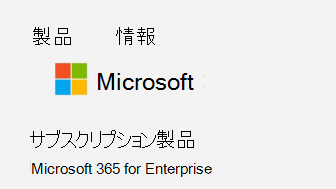

# <a name="determine-if-centralized-deployment-of-add-ins-works-for-your-organization"></a><span data-ttu-id="901e7-103">組織でアドインの一元展開が機能するかどうかを判断する</span><span class="sxs-lookup"><span data-stu-id="901e7-103">Determine if Centralized Deployment of add-ins works for your organization</span></span>

<span data-ttu-id="901e7-104">一元展開は、ほとんどのお客様が組織内のユーザーやグループに Office アドインを展開するために推奨される最も豊富な方法です。</span><span class="sxs-lookup"><span data-stu-id="901e7-104">Centralized Deployment is the recommended and most feature-rich way for most customers to deploy Office add-ins to users and groups within your organization.</span></span> <span data-ttu-id="901e7-105">管理者である場合は、このガイダンスを使用して、組織とユーザーが一元展開を使用できるように要件を満たしているかどうかを判断します。</span><span class="sxs-lookup"><span data-stu-id="901e7-105">If you're an admin, use this guidance to determine if your organization and users meet the requirements so that you can use Centralized Deployment.</span></span>

<span data-ttu-id="901e7-106">一元展開には、次のような利点があります。</span><span class="sxs-lookup"><span data-stu-id="901e7-106">Centralized Deployment provides the following benefits:</span></span>
  
- <span data-ttu-id="901e7-107">グローバル管理者は、ユーザー、グループ、または組織内のすべてのユーザーに対して、アドインを直接ユーザーに割り当てることができます。</span><span class="sxs-lookup"><span data-stu-id="901e7-107">A Global admin can assign an add-in directly to a user, to multiple users via a group, or to everyone in the organization.</span></span>
    
- <span data-ttu-id="901e7-108">関連する Office アプリケーションを起動すると、アドインが自動的にダウンロードされます。</span><span class="sxs-lookup"><span data-stu-id="901e7-108">When the relevant Office application starts, the add-in automatically downloads.</span></span> <span data-ttu-id="901e7-109">アドインがアドインコマンドをサポートしている場合、アドインは自動的に Office アプリケーション内のリボンに表示されます。</span><span class="sxs-lookup"><span data-stu-id="901e7-109">If the add-in supports add-in commands, the add-in automatically appears in the ribbon within the Office application.</span></span>
    
- <span data-ttu-id="901e7-110">管理者がアドインをオフまたは削除した場合、またはユーザーが Azure Active Directory またはアドインが割り当てられているグループから削除された場合は、アドインがユーザーに表示されなくなります。</span><span class="sxs-lookup"><span data-stu-id="901e7-110">Add-ins no longer appear for users if the admin turns off or deletes the add-in, or if the user is removed from Azure Active Directory or from a group that the add-in is assigned to.</span></span>

<span data-ttu-id="901e7-111">一元展開は、3つのデスクトッププラットフォーム Windows、Mac、およびオンライン Office アプリをサポートします。</span><span class="sxs-lookup"><span data-stu-id="901e7-111">Centralized Deployment supports three desktop platforms Windows, Mac and Online Office apps.</span></span> <span data-ttu-id="901e7-112">一元展開では、iOS および Android もサポートされています (Outlook モバイルアドインのみ)。</span><span class="sxs-lookup"><span data-stu-id="901e7-112">Centralized Deployment also supports iOS and Android (Outlook Mobile Add-ins Only).</span></span>

<span data-ttu-id="901e7-113">すべてのユーザーについて、アドインがクライアントに対して表示されるまでに最大24時間かかる場合があります。</span><span class="sxs-lookup"><span data-stu-id="901e7-113">It can take up to 24 hours for an add-in to show up for client for all users.</span></span>
  
## <a name="requirements"></a><span data-ttu-id="901e7-114">Requirements</span><span class="sxs-lookup"><span data-stu-id="901e7-114">Requirements</span></span>

<span data-ttu-id="901e7-115">アドインを一元展開するには、ユーザーが Microsoft 365 Apps for enterprise または Microsoft 365 Business Premium (および組織 ID を使用して Office にサインインしている) を使用しており、Exchange Online および Exchange Online の Exchange Online メールボックスを持っている必要があります。</span><span class="sxs-lookup"><span data-stu-id="901e7-115">Centralized deployment of add-ins requires that the users are using Microsoft 365 Apps for enterprise, or Microsoft 365 Business Premium (and are signed into Office using their organizational ID), and have Exchange Online and active Exchange Online mailboxes.</span></span> <span data-ttu-id="901e7-116">サブスクリプションディレクトリは、に含まれているか、Azure Active Directory にフェデレーションされている必要があります。</span><span class="sxs-lookup"><span data-stu-id="901e7-116">Your subscription directory must either be in, or federated to Azure Active Directory.</span></span>
<span data-ttu-id="901e7-117">以下の Office および Exchange の特定の要件を確認することも、[集中展開の互換性チェック](#centralized-deployment-compatibility-checker)を使用することもできます。</span><span class="sxs-lookup"><span data-stu-id="901e7-117">You can view specific requirements for Office and Exchange below, or use the[Centralized Deployment Compatibility Checker](#centralized-deployment-compatibility-checker).</span></span>

<span data-ttu-id="901e7-118">一元展開は、次の機能をサポートしていません。</span><span class="sxs-lookup"><span data-stu-id="901e7-118">Centralized Deployment doesn't support the following:</span></span>
  
- <span data-ttu-id="901e7-119">Office 2013 の Word、Excel、または PowerPoint を対象とするアドイン</span><span class="sxs-lookup"><span data-stu-id="901e7-119">Add-ins that target Word, Excel, or PowerPoint in Office 2013</span></span> 
- <span data-ttu-id="901e7-120">オンプレミスのディレクトリ サービス</span><span class="sxs-lookup"><span data-stu-id="901e7-120">An on-premises directory service</span></span>
- <span data-ttu-id="901e7-121">Exchange オンプレミスメールボックスへのアドインの展開</span><span class="sxs-lookup"><span data-stu-id="901e7-121">Add-in Deployment to an Exchange On-Prem Mailbox</span></span>
- <span data-ttu-id="901e7-122">SharePoint に展開するアドイン</span><span class="sxs-lookup"><span data-stu-id="901e7-122">Add-in deployment to SharePoint</span></span>  
- <span data-ttu-id="901e7-123">Teams アプリ</span><span class="sxs-lookup"><span data-stu-id="901e7-123">Teams apps</span></span>
- <span data-ttu-id="901e7-124">コンポーネント オブジェクト モデル (COM) アドインまたは Visual Studio Tools for Office (VSTO) アドインの展開</span><span class="sxs-lookup"><span data-stu-id="901e7-124">Deployment of Component Object Model (COM) or Visual Studio Tools for Office (VSTO) add-ins</span></span>
- <span data-ttu-id="901e7-125">Microsoft 365 の展開には、Microsoft 365 Apps for business などの Exchange は含まれていません。</span><span class="sxs-lookup"><span data-stu-id="901e7-125">Deployments of Microsoft 365 that do not include Exchange such as Microsoft 365 Apps for business</span></span>

### <a name="office-requirements"></a><span data-ttu-id="901e7-126">Office の要件</span><span class="sxs-lookup"><span data-stu-id="901e7-126">Office Requirements</span></span>

- <span data-ttu-id="901e7-127">Word、Excel、PowerPoint のアドインでは、ユーザーが次のいずれかを使用している必要があります。</span><span class="sxs-lookup"><span data-stu-id="901e7-127">For Word, Excel, and PowerPoint add-ins, your users must be using one of the following:</span></span>
  - <span data-ttu-id="901e7-128">Windows デバイスで、バージョン1704以降の Microsoft 365 Apps for enterprise、または Microsoft 365 Business Premium。</span><span class="sxs-lookup"><span data-stu-id="901e7-128">On a Windows device, Version 1704 or later of Microsoft 365 Apps for enterprise, or Microsoft 365 Business Premium.</span></span>
  - <span data-ttu-id="901e7-129">Mac では、バージョン15.34 以降。</span><span class="sxs-lookup"><span data-stu-id="901e7-129">On a Mac, Version 15.34 or later.</span></span>

- <span data-ttu-id="901e7-130">Outlook の場合、ユーザーは次のいずれかを使用する必要があります。</span><span class="sxs-lookup"><span data-stu-id="901e7-130">For Outlook, your users must be using one of the following:</span></span> 
  - <span data-ttu-id="901e7-131">バージョン1701以降の Microsoft 365 Apps for enterprise、または Microsoft 365 Business Premium。</span><span class="sxs-lookup"><span data-stu-id="901e7-131">Version 1701 or later of Microsoft 365 Apps for enterprise, or Microsoft 365 Business Premium.</span></span>
  - <span data-ttu-id="901e7-132">バージョン1808以降の Office Professional Plus 2019 または Office Standard 2019。</span><span class="sxs-lookup"><span data-stu-id="901e7-132">Version 1808 or later of Office Professional Plus 2019 or Office Standard 2019.</span></span>
  - <span data-ttu-id="901e7-133">16.0.4494.1000 以降のバージョンの Office Professional Plus 2016 (MSI) または Office Standard 2016 (MSI)\*</span><span class="sxs-lookup"><span data-stu-id="901e7-133">Version 16.0.4494.1000 or later of Office Professional Plus 2016 (MSI) or Office Standard 2016 (MSI)\*</span></span>
  - <span data-ttu-id="901e7-134">15.0.4937.1000 以降のバージョンの Office Professional Plus 2013 (MSI) または Office Standard 2013 (MSI)\*</span><span class="sxs-lookup"><span data-stu-id="901e7-134">Version 15.0.4937.1000 or later of Office Professional Plus 2013 (MSI) or Office Standard 2013 (MSI)\*</span></span>
  - <span data-ttu-id="901e7-135">Office 2016 for Mac のバージョン16.0.9318.1000 以降</span><span class="sxs-lookup"><span data-stu-id="901e7-135">Version 16.0.9318.1000 or later of Office 2016 for Mac</span></span> 
- <span data-ttu-id="901e7-136">IOS 版 Outlook mobile のバージョン2.75.0 以降</span><span class="sxs-lookup"><span data-stu-id="901e7-136">Version 2.75.0 or later of Outlook mobile for iOS</span></span> 
- <span data-ttu-id="901e7-137">Outlook mobile for Android のバージョン2.2.145 以降</span><span class="sxs-lookup"><span data-stu-id="901e7-137">Version 2.2.145 or later of Outlook mobile for Android</span></span> 
    
    <span data-ttu-id="901e7-138">\* MSI バージョンの Outlook では、[個人用アドイン] セクションではなく、適切な Outlook リボンに管理者がインストールしたアドインが表示されます。</span><span class="sxs-lookup"><span data-stu-id="901e7-138">\*MSI versions of Outlook show admin-installed add-ins in the appropriate Outlook ribbon, not the "My add-ins" section.</span></span>
    

#### <a name="find-out-if-microsoft-365-apps-for-enterprise-is-installed"></a><span data-ttu-id="901e7-139">Microsoft 365 Apps for enterprise がインストールされているかどうかを確認する</span><span class="sxs-lookup"><span data-stu-id="901e7-139">Find out if Microsoft 365 Apps for enterprise is installed</span></span>

<span data-ttu-id="901e7-140">Microsoft 365 Apps for enterprise を使用するには、ユーザーは Microsoft 365 アカウントを持っていて、ライセンスが割り当てられている必要があります。</span><span class="sxs-lookup"><span data-stu-id="901e7-140">To use Microsoft 365 Apps for enterprise, a user must have an Microsoft 365 account and must have been assigned a license.</span></span> <span data-ttu-id="901e7-141">詳細については、「 [Microsoft 365 Apps for enterprise](https://go.microsoft.com/fwlink/p/?linkid=846328)」を参照してください。</span><span class="sxs-lookup"><span data-stu-id="901e7-141">For more information, see [Overview of Microsoft 365 Apps for enterprise](https://go.microsoft.com/fwlink/p/?linkid=846328).</span></span>

<span data-ttu-id="901e7-142">ユーザーがエンタープライズ向けの Microsoft 365 アプリをインストールしていて、それを最近使用しているかどうかを検出する最も簡単な方法は、microsoft 365 管理センターで利用できる Microsoft Office ライセンス認証レポートを使用することです。</span><span class="sxs-lookup"><span data-stu-id="901e7-142">The simplest way to detect if a user has Microsoft 365 Apps for enterprise installed and has been using it recently is to use the Microsoft Office Activations report, which is available in the Microsoft 365 admin center.</span></span> <span data-ttu-id="901e7-143">このレポートでは、過去7日間、30日間、90日間、または180日以内に、エンタープライズ向けの Microsoft 365 アプリをアクティブ化したすべてのユーザーの一覧を示します。</span><span class="sxs-lookup"><span data-stu-id="901e7-143">The report provides a list of all users who have activated Microsoft 365 Apps for enterprise within the last 7 days, 30 days, 90 days, or 180 days.</span></span> <span data-ttu-id="901e7-144">一元展開をするという目的のため、Windows または Mac のデスクトップで行ったライセンス認証は、レポートの重要な列に表示されます。</span><span class="sxs-lookup"><span data-stu-id="901e7-144">For centralized deployment purposes, the desktop activations for Windows or Mac are the important columns in the report.</span></span> <span data-ttu-id="901e7-145">このレポートは、Excel にエクスポートできます。</span><span class="sxs-lookup"><span data-stu-id="901e7-145">You can export the report to Excel.</span></span> <span data-ttu-id="901e7-146">レポートの詳細については、「 [Microsoft Office ライセンス認証」の「microsoft 365 レポート](../activity-reports/microsoft-office-activations.md)」を参照してください。</span><span class="sxs-lookup"><span data-stu-id="901e7-146">For more information about the report, see [Microsoft 365 Reports in the Admin Center - Microsoft Office activations](../activity-reports/microsoft-office-activations.md).</span></span>
  
<span data-ttu-id="901e7-147">ライセンス認証レポートを使用しない場合は、ユーザーが Word などの Office アプリケーションを自分のコンピューターで開くように求めることができます。次に、[**ファイル**アカウント] を選択し \> **Account**ます。</span><span class="sxs-lookup"><span data-stu-id="901e7-147">If you don't want to use the Activations report, you can ask a user to open an Office application such as Word on their machine, and then choose **File** \> **Account**.</span></span> <span data-ttu-id="901e7-148">[ **製品情報**] の下に、次の図に示すように、 **サブスクリプション製品** と **microsoft 365 for Enterprise**または microsoft 365 Business Premium が表示されます。</span><span class="sxs-lookup"><span data-stu-id="901e7-148">Under **Product Information**, you should see **Subscription Product** and **Microsoft 365 for enterprise**,or Microsoft 365 Business Premium, similar to what is shown in the following image.</span></span>


  
<span data-ttu-id="901e7-150">Microsoft 365 App for enterprise のヘルプについては、「 [microsoft 365 apps for enterprise のトラブルシューティングのヒント](https://go.microsoft.com/fwlink/p/?linkid=846339)」を参照してください。</span><span class="sxs-lookup"><span data-stu-id="901e7-150">For help with Microsoft 365 Apps for enterprise, see [Troubleshooting tips for Microsoft 365 Apps for enterprise](https://go.microsoft.com/fwlink/p/?linkid=846339).</span></span>


### <a name="exchange-online-requirements"></a><span data-ttu-id="901e7-151">Exchange Online の要件</span><span class="sxs-lookup"><span data-stu-id="901e7-151">Exchange Online requirements</span></span>

<span data-ttu-id="901e7-152">Microsoft Exchange では、アドインのマニフェストが組織のテナントに格納されます。</span><span class="sxs-lookup"><span data-stu-id="901e7-152">Microsoft Exchange stores the add-in manifests within your organization's tenant.</span></span> <span data-ttu-id="901e7-153">管理者がアドインを展開し、アドインを受信するユーザーは、OAuth 認証をサポートする Exchange Online のバージョンになっている必要があります。</span><span class="sxs-lookup"><span data-stu-id="901e7-153">The admin deploying add-ins and the users receiving those add-ins must be on a version of Exchange Online that supports OAuth authentication.</span></span>
  
<span data-ttu-id="901e7-p109">組織の Exchange 管理者に、どの構成を使用できるのかを確認してください。ユーザーごとの OAuth 認証接続は、[Test-OAuthConnectivity](https://go.microsoft.com/fwlink/p/?linkid=846351) PowerShell コマンドレットを使用して、検証できます。</span><span class="sxs-lookup"><span data-stu-id="901e7-p109">Check with your organization's Exchange admin to find out which configuration is in use. OAuth connectivity per user can be verified by using the [Test-OAuthConnectivity](https://go.microsoft.com/fwlink/p/?linkid=846351) PowerShell cmdlet.</span></span> 


### <a name="centralized-deployment-compatibility-checker"></a><span data-ttu-id="901e7-156">一元的な展開の互換性チェック</span><span class="sxs-lookup"><span data-stu-id="901e7-156">Centralized Deployment Compatibility Checker</span></span>

<span data-ttu-id="901e7-157">一元展開の互換性チェックを使用して、テナントのユーザーが Word、Excel、PowerPoint の一元展開を使用するように設定されているかどうかを確認できます。</span><span class="sxs-lookup"><span data-stu-id="901e7-157">Using the Centralized Deployment Compatibility Checker, you can verify whether the users on your tenant are set up to use Centralized Deployment for Word, Excel and PowerPoint.</span></span> <span data-ttu-id="901e7-158">互換性チェックは、Outlook のサポートには必要ありません。</span><span class="sxs-lookup"><span data-stu-id="901e7-158">The Compatibility Checker is not required for Outlook support.</span></span> <span data-ttu-id="901e7-159">互換性チェックを [ここ](https://aka.ms/officeaddindeploymentorgcompatibilitychecker)にダウンロードします。</span><span class="sxs-lookup"><span data-stu-id="901e7-159">Download the compatibility checker [here](https://aka.ms/officeaddindeploymentorgcompatibilitychecker).</span></span>
  
#### <a name="run-the-compatibility-checker"></a><span data-ttu-id="901e7-160">互換性チェックを実行する</span><span class="sxs-lookup"><span data-stu-id="901e7-160">Run the compatibility checker</span></span>
  
1. <span data-ttu-id="901e7-161">管理者特権での PowerShell.exe ウィンドウを起動します。</span><span class="sxs-lookup"><span data-stu-id="901e7-161">Start an elevated PowerShell.exe window.</span></span>
    
2. <span data-ttu-id="901e7-162">次のコマンドを実行します。</span><span class="sxs-lookup"><span data-stu-id="901e7-162">Run the following command:</span></span>

   ```powershell
   Import-Module O365CompatibilityChecker
   ```
    
3. <span data-ttu-id="901e7-163">**CompatabilityCheck**コマンドを実行します。</span><span class="sxs-lookup"><span data-stu-id="901e7-163">Run the **Invoke-CompatabilityCheck** command:</span></span>

   ```powershell
   Invoke-CompatibilityCheck
   ```
   <span data-ttu-id="901e7-164">このコマンドは、  *_Tenantdomain_* (たとえば、 *TailspinToysIncorporated </span> ) の入力を求めます。com*) と  *_TenantAdmin_* の資格情報 (グローバル管理者の資格情報を使用) を使用して、同意を要求します。</span><span class="sxs-lookup"><span data-stu-id="901e7-164">This command prompts you for  *_TenantDomain_* (for example, *TailspinToysIncorporated.onmicrosoft.</span>com*) and  *_TenantAdmin_* credentials (use your global admin credentials), and then requests consent.</span></span>
    
   > [!NOTE]
   > <span data-ttu-id="901e7-165">テナントのユーザー数によって、チェックが完了するのに数分または数時間かかる場合があります。</span><span class="sxs-lookup"><span data-stu-id="901e7-165">Depending on the number of users in your tenant, the checker could complete in minutes or hours.</span></span> 
  
<span data-ttu-id="901e7-166">ツールの実行が完了すると、コンマ区切り (.csv) 形式で出力ファイルが作成されます。</span><span class="sxs-lookup"><span data-stu-id="901e7-166">When the tool finishes running, it produces an output file in comma-separated (.csv) format.</span></span> <span data-ttu-id="901e7-167">既定では、ファイルは **C:\windows\system32** に保存されます。</span><span class="sxs-lookup"><span data-stu-id="901e7-167">The file is saved to **C:\windows\system32** by default.</span></span> <span data-ttu-id="901e7-168">出力ファイルには、次の情報が含まれます。</span><span class="sxs-lookup"><span data-stu-id="901e7-168">The output file contains the following information:</span></span>
  
- <span data-ttu-id="901e7-169">ユーザー名</span><span class="sxs-lookup"><span data-stu-id="901e7-169">User Name</span></span>
    
- <span data-ttu-id="901e7-170">ユーザー ID (ユーザーのメール アドレス)</span><span class="sxs-lookup"><span data-stu-id="901e7-170">User ID (User's email address)</span></span>
    
- <span data-ttu-id="901e7-171">一元展開の準備完了 - 残りの項目が TRUE の場合</span><span class="sxs-lookup"><span data-stu-id="901e7-171">Centralized Deployment ready - If the remaining items are true</span></span>
    
- <span data-ttu-id="901e7-172">Office プラン-ライセンスが付与されている Office のプラン</span><span class="sxs-lookup"><span data-stu-id="901e7-172">Office plan - The plan of Office they are licensed for</span></span>
    
- <span data-ttu-id="901e7-173">ライセンス認証された Office - Office をライセンス認証している場合</span><span class="sxs-lookup"><span data-stu-id="901e7-173">Office Activated - If they have activated Office</span></span>
    
- <span data-ttu-id="901e7-174">サポートされているメールボックス - OAuth 対応メールボックスを使用している場合</span><span class="sxs-lookup"><span data-stu-id="901e7-174">Supported Mailbox - If they are on an OAuth-enabled mailbox</span></span>


  
## <a name="user-and-group-assignments"></a><span data-ttu-id="901e7-175">ユーザーとグループの割り当て</span><span class="sxs-lookup"><span data-stu-id="901e7-175">User and group assignments</span></span>

<span data-ttu-id="901e7-176">一元展開機能は、現在、Microsoft 365 グループ、配布リスト、セキュリティグループなど、Azure Active Directory でサポートされているグループの大部分をサポートしています。</span><span class="sxs-lookup"><span data-stu-id="901e7-176">The Centralized Deployment feature currently supports the majority of groups supported by Azure Active Directory, including Microsoft 365 groups, distribution lists, and security groups.</span></span>
  
> [!NOTE]
> <span data-ttu-id="901e7-177">メールが有効ではないセキュリティ グループは、現段階ではサポートされていません。</span><span class="sxs-lookup"><span data-stu-id="901e7-177">Non-mail enabled security groups are not currently supported.</span></span> 
  
<span data-ttu-id="901e7-178">一元展開では、テナント内の個々のユーザー、グループ、および全員への割り当てがサポートされます。</span><span class="sxs-lookup"><span data-stu-id="901e7-178">Centralized Deployment supports assignments to individual users, groups, and everyone in the tenant.</span></span> <span data-ttu-id="901e7-179">一元展開では、最上位のグループまたは親グループのないグループのユーザーがサポートされますが、親グループを持つグループまたはグループのユーザーはネストできません。</span><span class="sxs-lookup"><span data-stu-id="901e7-179">Centralized Deployment supports users in top-level groups or groups without parent groups, but not users in nested groups or groups that have parent groups.</span></span>
   
<span data-ttu-id="901e7-p113">次の例では、Sandra、Sheila、「営業部門」のグループがアドインに割り当てられています。「西海岸営業部門」は入れ子のグループのため、Bert と Fred はアドインに割り当てられていません。</span><span class="sxs-lookup"><span data-stu-id="901e7-p113">Take a look at the following example where Sandra, Sheila, and the Sales Department group are assigned to an add-in. Because the West Coast Sales Department is a nested group, Bert and Fred aren't assigned to an add-in.</span></span>
  


   
### <a name="find-out-if-a-group-contains-nested-groups"></a><span data-ttu-id="901e7-183">グループにネストされたグループが含まれているかどうかを調べる</span><span class="sxs-lookup"><span data-stu-id="901e7-183">Find out if a group contains nested groups</span></span>

<span data-ttu-id="901e7-184">グループにネストされたグループが含まれているかどうかを調べる最も簡単な方法は、Outlook 内のグループの連絡先カードを確認することです。</span><span class="sxs-lookup"><span data-stu-id="901e7-184">The easiest way to detect if a group contains nested groups is to view the group contact card within Outlook.</span></span> <span data-ttu-id="901e7-185">電子メールの [宛先] フィールド **に** グループ名を入力し、解決時にグループ名を選択すると、ユーザーまたはネストしたグループが含まれている場合は、そのグループの名前が表示されます。</span><span class="sxs-lookup"><span data-stu-id="901e7-185">If you enter the group name within the **To** field of an email and then select the group name when it resolves, it will show you if it contains users or nested groups.</span></span> <span data-ttu-id="901e7-186">次の例では、「テスト グループ」での Outlook 情報先カードの [ **メンバー**] タブには、ユーザーはなく、2 つのサブ グループのみが表示されています。</span><span class="sxs-lookup"><span data-stu-id="901e7-186">In the example below, the **Members** tab of the Outlook contact card for the Test Group shows no users and only two sub groups.</span></span> 
  
![Outlook 連絡先カードの [メンバー] タブ](../../media/d9db88c4-d752-426c-a480-b11a5b3adcd6.png)
  
<span data-ttu-id="901e7-p115">反対のクエリを実行できます。グループを解決して、任意のグループのユーザーがいないかどうかを表示します。次の例では、「サブ グループ 1」が「テスト グループ」のメンバーである Outlook 情報先カードの [ **メンバーシップ**] タブの下に表示されます。</span><span class="sxs-lookup"><span data-stu-id="901e7-p115">You can do the opposite query by resolving the group to see if it's a member of any group. In the example below, you can see under the **Membership** tab of the Outlook contact card that Sub Group 1 is a member of the Test Group.</span></span> 
  
![Outlook 連絡先カードの [メンバーシップ] タブ](../../media/a9f9b6ab-9c19-4822-9e3d-414ca068c42f.png)
  
<span data-ttu-id="901e7-p116">または、Azure Active Directory Graph API でクエリを実行して、グループ内でのグループ一覧を見つけます。詳細については、「[Operations on groups | Graph API reference (グループに対する操作 | Graph API リファレンス)](https://go.microsoft.com/fwlink/p/?linkid=846342)」を参照してください。</span><span class="sxs-lookup"><span data-stu-id="901e7-p116">Alternately, you can use the Azure Active Directory Graph API to run queries to find the list of groups within a group. For more information, see [Operations on groups | Graph API reference](https://go.microsoft.com/fwlink/p/?linkid=846342).</span></span>
  
### <a name="contacting-microsoft-for-support"></a><span data-ttu-id="901e7-193">Microsoft に連絡してサポートを受ける</span><span class="sxs-lookup"><span data-stu-id="901e7-193">Contacting Microsoft for support</span></span>

<span data-ttu-id="901e7-194">中央で展開された web 用 Office アプリ (Word、Excel など) を使用しているときにアドインの読み込みに問題が発生した場合は、Microsoft サポートに問い合わせる必要があります ([詳細につい](../contact-support-for-business-products.md)ては、「」を参照してください)。</span><span class="sxs-lookup"><span data-stu-id="901e7-194">If you or your users encounter problems loading the add-in while using Office apps for the web (Word, Excel, etc.), which were centrally deployed, you may need to contact Microsoft support ([learn how](../contact-support-for-business-products.md)).</span></span> <span data-ttu-id="901e7-195">サポートチケットに、Microsoft 365 環境に関する以下の情報を提供します。</span><span class="sxs-lookup"><span data-stu-id="901e7-195">Provide the following information about your Microsoft 365 environment in the support ticket.</span></span>
  
|<span data-ttu-id="901e7-196">**プラットフォーム**</span><span class="sxs-lookup"><span data-stu-id="901e7-196">**Platform**</span></span>|<span data-ttu-id="901e7-197">**デバッグ情報**</span><span class="sxs-lookup"><span data-stu-id="901e7-197">**Debug information**</span></span>|
|:-----|:-----|
|<span data-ttu-id="901e7-198">Office</span><span class="sxs-lookup"><span data-stu-id="901e7-198">Office</span></span>  <br/> | <span data-ttu-id="901e7-199">Charles/Fiddler ログ</span><span class="sxs-lookup"><span data-stu-id="901e7-199">Charles/Fiddler logs</span></span>  <br/>  <span data-ttu-id="901e7-200">テナント ID ( [詳細情報](https://docs.microsoft.com/onedrive/find-your-office-365-tenant-id.aspx))</span><span class="sxs-lookup"><span data-stu-id="901e7-200">Tenant ID ( [learn how](https://docs.microsoft.com/onedrive/find-your-office-365-tenant-id.aspx))</span></span>  <br/>  <span data-ttu-id="901e7-201">CorrelationID.</span><span class="sxs-lookup"><span data-stu-id="901e7-201">CorrelationID.</span></span> <span data-ttu-id="901e7-202">いずれかの office ページのソースを表示し、関連付け ID の値を探して、サポートに送信します。</span><span class="sxs-lookup"><span data-stu-id="901e7-202">View the source of one of the office pages and look for the Correlation ID value and send it to support:</span></span>  <br/>`<input name=" **wdCorrelationId**" type="hidden" value=" **{BC17079E-505F-3000-C177-26A8E27EB623}**">`  <br/>  `<input name="user_id" type="hidden" value="1003bffd96933623"></form>`  <br/> |
|<span data-ttu-id="901e7-203">リッチ クライアント (Windows、Mac)</span><span class="sxs-lookup"><span data-stu-id="901e7-203">Rich clients (Windows, Mac)</span></span>  <br/> | <span data-ttu-id="901e7-204">Charles/Fiddler ログ</span><span class="sxs-lookup"><span data-stu-id="901e7-204">Charles/Fiddler logs</span></span>  <br/>  <span data-ttu-id="901e7-205">クライアントアプリのビルド番号 ( **ファイル/アカウント**のスクリーンショットとして推奨)</span><span class="sxs-lookup"><span data-stu-id="901e7-205">Build numbers of the client app (preferably as a screenshot from **File/Account**)</span></span>  <br/> |
   

