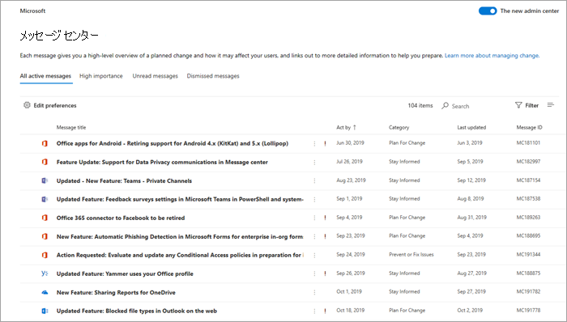
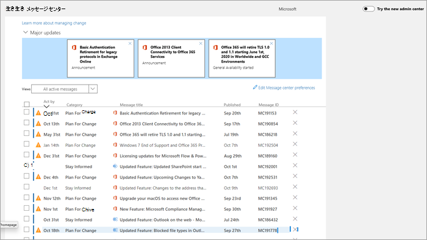

# メッセージ センターでメッセージを管理するManage messages in Message center

メッセージ センターの投稿は、新機能や変更された機能に関する重要なお知らせです。この記事では、メッセージで行うことができる操作の詳細について説明します。こうした操作は、組織内での変更管理に役立ちます。Message center posts are important announcements about new and changed features. This article provides more information about the things you can do with messages to help with change management in your organization.
  
## メッセージの閲覧Read a message

メッセージ センターに移動するには、管理センターに移動 [し](https://go.microsoft.com/fwlink/p/?linkid=2024339)、正常性メッセージ **センターを**  >  **選択します**。To go to the Message center, go to the [admin center](https://go.microsoft.com/fwlink/p/?linkid=2024339), and select **Health** > **Message center**. 

メッセージのタイトルを選択して、閲覧ウィンドウで開きます。Select a message title to open it in the reading pane. すべてのメッセージには、変更の概要、変更がユーザーに与える影響に関する声明、変更に備えて組織を準備する方法に関する情報、(ほとんどの場合) 詳細を確認できる追加情報リンクが含まれている。Every message contains a summary of the change, a statement of how the change may affect you, information about how you can prepare your organization for the change, and (in most cases) an additional information link where you can learn more. この追加情報は、メッセージの有効期限が切れた後も、引き続き確認することができます。The additional information continues to be available, even after a message expires.

## フィルターと並べ替えFilter and sort

::: moniker range="o365-worldwide"

[フィルター **] ドロップダウン** メニューを使用して、メッセージのフィルター処理されたビューを選択します。Use the **Filter** drop-down menu to select a filtered view of messages.

任意の列見出しを選択して、メッセージを昇順または降順で並べ替えます。You can select any column heading to sort messages in ascending or descending order. たとえば、この図のメッセージは、[ **対応期限**] の日付に基づいて並べ替えられています。For example, in this diagram the messages are sorted on the **Act by** date.

::: moniker-end

::: moniker range="o365-germany"

メッセージの **フィルター処理** されたビューを選択するには、[ビュー] ドロップダウン メニューを使用します。Use the **Views** drop-down menu to select a filtered view of messages. 
 
任意の列見出しを選択して、メッセージを昇順または降順で並べ替えます。You can select any column heading to sort messages in ascending or descending order. たとえば、この図では、メッセージは Act の日付 **順に並べ替** えされています。For example, in this illustration the messages are sorted on the **Act by** date.

::: moniker-end

::: moniker range="o365-21vianet"

メッセージの **フィルター処理** されたビューを選択するには、[ビュー] ドロップダウン メニューを使用します。Use the **Views** drop-down menu to select a filtered view of messages. 
 
任意の列見出しを選択して、メッセージを昇順または降順で並べ替えます。You can select any column heading to sort messages in ascending or descending order. たとえば、この図では、メッセージは Act の日付 **順に並べ替** えされています。For example, in this illustration the messages are sorted on the **Act by** date.

::: moniker-end

## 投稿に関するフィードバックを送信するGive feedback on a post

メッセージ センターで、メッセージを選択して詳細を表示できます。In the Message center, you can select a message to see details.

メッセージに対するフィードバックを提供する場合は、[Like] または **[Dislike]** アイコンを選択し、表示されるテキスト ボックスにフィードバックを入力します。If you want to provide feedback on the message, select either the **Like** or **Dislike** icon and provide feedback in the text box that appears. 個人情報を提供しない。Do not provide any personal information. 必要に応じて、[この **フィードバックについて連絡して問題ない** ] を選択し、[送信] を選択 **します**。You can optionally select **It's OK to contact me about this feedback** and then select **Send**.

## メッセージの共有Share a message

他のユーザーが対応する必要があるメッセージが表示される場合See a message that someone else needs to act on? メッセージの内容は、電子メールで任意のユーザーと共有できます。You can share the contents of the message with any user by email:
  
1. メッセージを選択して開き、[共有] を **選択します**。Select the message to open it, and then select **Share**.
  
2. メッセージを共有するには、最大 2 つの電子メール アドレスをコロンで区切って入力します。To share the message, enter up to two email addresses separated by a colon. 個別のメール アドレスとグループの電子メール アドレスに送信できます。You can send to individual and to group email addresses. 必要に応じて、電子メールでメッセージのコピーを受信するか (メッセージはプライマリ メール アドレスに移動します)、受信者にコンテキストを追加する個人用メッセージを追加することができます。Optionally, you can choose to receive a copy of the message in email (the message will go to your primary email address) or add a personal message to provide recipients with more context.
  
3. [共有 **] を** 選択してメールを送信します。Select **Share** to send the email.
    
## リンクの取得Get a link

別の管理者をフォローアップして、変更と操作の実行について確実に知らせる必要がある場合は、メールまたはインスタント メッセージで共有リンクを作成し、たとえば、ユーザーがメッセージに直接接続されるようにします。Need to follow up with another admin to make sure they're aware of a change and taking action? リンクの共有先のユーザーは、組織の Office 365 の管理者である必要があります。You can generate a link to share in email or instant messaging, for example, that will connect the user directly to that message. リンクを共有するユーザーは、組織の Microsoft 365 の管理者である必要があります。または、リンクされたメッセージにアクセスできない場合。The person you share the link with has to be an admin in Microsoft 365 for your organization or they won't have access to the linked message.

::: moniker range="o365-worldwide"

1. メッセージを選択して開きます。Select the message to open it.

2. [クリップボード **にリンクをコピー]** (リンク) アイコンを選択します。Select the **Copy link to Clipboard** (link) icon.

3. Web ページがクリップボードにアクセスできるようにします。Allow the webpage to access your Clipboard. 直接リンクがクリップボードにコピーされます。A direct link is copied to your Clipboard.

4. Ctrl + V キーを押すか、右クリックして [貼り付 **け]** を選択してリンクを挿入します。Use Ctrl+V or right-click and select **Paste** to insert the link.

::: moniker-end

::: moniker range="o365-germany"

1. メッセージを選択して開きます。Select the message to open it.

2. Choose **More** \> **Get a link** from the action bar.Choose **More** \> **Get a link** from the action bar.

3. Web ページがクリップボードにアクセスできるようにします。Allow the webpage to access your Clipboard. 直接リンクがクリップボードにコピーされます。A direct link is copied to your Clipboard.

4. Ctrl + V キーを押すか、右クリックして [貼り付 **け]** を選択してリンクを挿入します。Use Ctrl+V or right-click and select **Paste** to insert the link.

::: moniker-end

::: moniker range="o365-21vianet"

1. メッセージを選択して開きます。Select the message to open it.

2. Choose **More** \> **Get a link** from the action bar.Choose **More** \> **Get a link** from the action bar.

3. Web ページがクリップボードにアクセスできるようにします。Allow the webpage to access your Clipboard. 直接リンクがクリップボードにコピーされます。A direct link is copied to your Clipboard.

4. Ctrl + V キーを押すか、右クリックして [貼り付 **け]** を選択してリンクを挿入します。Use Ctrl+V or right-click and select **Paste** to insert the link.

::: moniker-end

## 開封状態と未開封状態Read and unread states

メッセージ センター内の未開封メッセージは太字で表示されます。Any message in Message center that is unread will appear in bold. メッセージを開くと、既読になります。Opening a message marks it as read. メッセージを未読としてマークできます。You can mark a message as unread.

::: moniker range="o365-worldwide"

1. メッセージ センターのメイン ページで、メッセージを選択します。On the main page of the message center, select a message.

2. メッセージの **上部にある [** 未読 (封筒としてマーク] アイコン) を選択します。Select the **Mark as unread** (envelope) icon at the top of the message.
  
::: moniker-end

::: moniker range="o365-germany"

1. メッセージを選択して開きます。Select the message to open it.

2. Select **More** \> **Mark as unread**.Select **More** \> **Mark as unread**.

3. メッセージ ボックスを閉じます。Close the message.

::: moniker-end

::: moniker range="o365-21vianet"

1. メッセージを選択して開きます。Select the message to open it.

2. Select **More** \> **Mark as unread**.Select **More** \> **Mark as unread**.

3. メッセージ ボックスを閉じます。Close the message.

::: moniker-end

## アーカイブと復元Archive and restore

自分に関係ないメッセージが表示された場合、または既に処理済みのメッセージが表示された場合は、メッセージをアーカイブして、メッセージ センター ビューから削除できます。If you see a message that doesn't pertain to you, or maybe you've already acted on it, you can archive the message to remove it from the Message center view. メッセージ センターに表示されるビューはユーザー アカウントに固有のビューなので、ビューからアーカイブしても他の管理者には影響を与えされません。The view that you see in the Message center is specific to your user account, so archiving it from your view doesn't affect other admins.

::: moniker range="o365-worldwide"

- メッセージ センターのメイン ページで、メッセージを選択し、メッセージの一覧の上にある [アーカイブ] を選択します。On the main page of the Message center, select a message, and then select **Archive** above the list of messages.

- メッセージを開き、 **メッセージの下部** にある [アーカイブ] を選択します。Open the message, and then select **Archive** at the bottom of the message.

アーカイブされたメッセージを取得する必要がありますか?Need to get a archived message back? 大丈夫。No problem.
  
1. メッセージ センター **の上部にある** [アーカイブ済みメッセージ] タブを選択します。Select the **Archived messages** tab at the top of the Message center. アーカイブされたメッセージの一覧が表示されます。A list of archived messages appears. 

2. メッセージを選択し、[ **復元] を** 選択すると、メッセージはアクティブなメッセージに復元されます。Select the message, select **Restore**, and the message is restored to active messages.

::: moniker-end

::: moniker range="o365-germany"

メッセージをアーカイブするには 2 つの方法があります。There are two ways to archive a message.
  
- メッセージ ID の右側に表示される X を選択します。Select the X that appears to the right of the Message ID. メッセージが一覧から削除されます。The message is removed from your list. Or,Or,

- メッセージを開き、 **メッセージの上部** にある [アーカイブ] を選択します。Open the message, and then select **Archive** at the top of the message.

メッセージを閉じてもらう必要がありますか?Need to get a dismissed message back? 大丈夫。No problem.
  
1. [ビュー **] ドロップダウン メニュー** から [ **アーカイブ済み** メッセージ] フィルターを選択します。Select the **Archived messages** filter from the **Views** drop-down menu. アーカイブされたメッセージの一覧が表示されます。A list of archived messages appears.

2. メッセージ **ID** の右側にある [復元] を選択すると、メッセージはアクティブなメッセージに復元されます。Select **Restore** to the right of the Message ID, and the message is restored to active messages.

::: moniker-end

::: moniker range="o365-21vianet"

メッセージをアーカイブするには 2 つの方法があります。There are two ways to archive a message.
  
- メッセージ ID の右側に表示される X を選択します。Select the X that appears to the right of the Message ID. メッセージが一覧から削除されます。The message is removed from your list. Or,Or,

- メッセージを開き、 **メッセージの上部** にある [アーカイブ] を選択します。Open the message, and then select **Archive** at the top of the message.

アーカイブされたメッセージを取得する必要がありますか?Need to get a archived message back? 大丈夫。No problem.
  
1. [ビュー **] ドロップダウン メニュー** から [ **アーカイブ済み** メッセージ] フィルターを選択します。Select the **Archived messages** filter from the **Views** drop-down menu. アーカイブされたメッセージの一覧が表示されます。A list of archived messages appears.

2. メッセージ **ID** の右側にある [復元] を選択すると、メッセージはアクティブなメッセージに復元されます。Select **Restore** to the right of the Message ID, and the message is restored to active messages.

::: moniker-end

## Planner でメッセージ センターのタスクを追跡するTrack your message center tasks in Planner

Microsoft 365 サービスの変更に関する実践的な情報の多くは、Microsoft 365 メッセージ センターに届きます。A lot of actionable information about changes to Microsoft 365 services arrives in the Microsoft 365 message center. タスクを実行する必要がある変更、いつ、誰が行う必要があるのか、および各タスクを完了まで追跡することは困難な場合があります。It can be difficult to keep track of which changes require tasks to be done, when, and by whom, and to track each task to completion. また、何かをメモして、後で確認するためにタグを付けておきたいと思うかも知れません。You also might want to make a note of something and tag it to check on later. Microsoft 365 管理センターから Microsoft Planner にメッセージを同期すると、これ以上の操作を実行できます。You can do all this and more when you sync your messages from the Microsoft 365 admin center to Microsoft Planner. 詳細については、「Planner でメッセージ [センターのタスクを追跡する」を参照してください](https://docs.microsoft.comoffice365/planner/track-message-center-tasks-planner)。For more information, see [Track your message center tasks in Planner](https://docs.microsoft.comoffice365/planner/track-message-center-tasks-planner).

メッセージ センターの概要については [、Microsoft 365 のメッセージ センターを参照してください](message-center.md)。For an overview of Message center, see [Message center in Microsoft 365](message-center.md). または、メッセージ センターの投稿に対して機械翻訳を有効にするために言語の基本設定を設定する方法については、「メッセージ センターの投稿の言語翻訳」 [を参照してください](language-translation-for-message-center-posts.md)。Or, to learn how to set your language preferences to enable machine translation for Message center posts, see [Language translation for Message center posts](language-translation-for-message-center-posts.md). リアルタイムのサービス正常性情報とメッセージ センター通信を取得する別の方法をプログラムする場合は [、Microsoft 365 サービス](https://go.microsoft.com/fwlink/p/?linkid=848507)通信 API の概要を参照してください。If you'd like to program an alternative way to get real-time service health information and Message Center communications, please reference [Microsoft 365 Service Communications API Overview](https://go.microsoft.com/fwlink/p/?linkid=848507).
  
