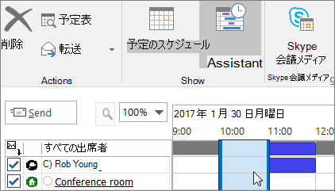
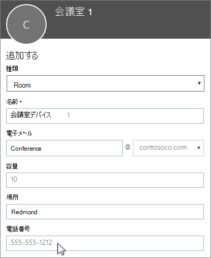

# 会議室メールボックスと備品用メールボックス

全ユーザーが使用する必要のある会議室、社用車、備品がある場合、それらのリソースはすべてのユーザーが予約できるようにする必要があります。 このような場合、各リソースについて Microsoft 365 で会議室メールボックスまたは備品用メールボックスを作成することをお勧めします。 たとえば、1 階の会議室用、メディア機器用、移動台車用にメールボックスを作成することができます。
  
会議室メールボックスまたは備品用メールボックスを作成すると、社内の全ユーザーが Outlook を使用して会議やイベント用にそのメールボックスを予約できます。 次の 2 つのタブで **使用方法** と **設定方法** について説明します。 会議室メールボックスと備品用メールボックスについてよく寄せられる質問について説明します。
  
## 会議室メールボックスと備品用メールボックスを使用する

会議室メールボックスまたは備品用メールボックスを使用するには、コンピューターから Outlook を開くか、Outlook on the web にサインインします。 新しい会議をスケジュールし、他の従業員や顧客を招待する場合と同様に、会議室または備品を会議に追加します。 これで予約は完了です。
  
1. コンピューターで **Outlook** を起動します。

2. [**ホーム**] タブで、[**新しいアイテム**] \> [**会議**] の順に選択します。

   ![会議をスケジュールするには、[新しいグループ]の[ホーム] タブ上で、[新しいアイテム]、[会議] の順に選択します。](../../media/ffd575a8-1036-4d67-b839-73941fc60276.png)

   または、予定表から [**新しい会議**] を選択します。
    
3. [宛先] フィールドに、招待する出席者に加えて、予約する会議室または備品の名前も入力します。

   または、[**宛先**] を選択し、一覧から会議室または備品をダブルクリックします。 次に [**OK**] を選びます。

   
  
4. [**件名**] 行に、予約または会議の目的を入力します。 
    
5. [**場所**] の値を変更するか、そのままにします。 
    
6. [**開始時刻**] と [**終了時刻**] を変更します。 または、[**終日イベント**] を選択します。 会議または予約を繰り返す場合は、上部の [**定期的なアイテム**] を選択します。
 
   
  
7. 必要に応じて目的を説明するメッセージを入力し、ファイルを添付します。
    
8. 他のユーザーがオンラインまたは電話で会議に参加できるようにするには、[**Skype 会議**] を選択します。
    
9. 招待した会議室、備品、ユーザーの空き状況を確認するには、上部の **[スケジュール アシスタント]** をクリックします。予定表で空き時間を選びます。

   

   > [!TIP]
   > スケジュール カレンダーで、青色は会議室または備品が予約されているか、使用中であることを示します。 予定表で白色の領域 (つまり空いている時間) を選びます。 
  
10. 完了したら、[**送信**] を選択します。
    
## 会議室メールボックスと備品用メールボックスをセットアップする

会議室または備品用メールボックスを設定するには、 <a href="https://go.microsoft.com/fwlink/p/?linkid=2024339" target="_blank">Microsoft 365 管理センター</a>に移動します。 (この操作には管理者アクセス許可が必要です。) メールボックスを作成し、会議やイベントの予約に使用できることを全ユーザーに知らせます。
  
1. 管理センターで、[**リソース**] \> [[会議室&amp;備品](https://go.microsoft.com/fwlink/p/?linkid=2067334)] ページの順に移動します。
  
2. [**追加**] を選択します。
    
3. 会議室または備品のフィールドに入力します。

   
  
   - [**会議室**] または [**備品**]: 作成するメールボックスの種類。
    
   - [**名前**]: わかりやすい名前または簡単な説明。
    
   - [**電子メール**]: 会議室や備品の電子メール エイリアス。 会議出席依頼を会議室または備品に送信するために必要です。
    
   - [**定員**]: 同時に会議室に収容できる、または備品を使用できる最大人数。
    
   - [**場所**]: 建物内または地域内の会議室の部屋番号または場所。
    
   - [**電話番号**]: 会議室の電話番号。 これは、Skype for Business の使用時に生成される会議の電話番号とは異なります。
    
4. [**追加**] を選択します。
    
5. 作成した会議室メールボックスまたは備品用メールボックスを選択し、詳細を表示または編集します。
  
6. 変更した場合は、[**保存**]、[**閉じる**] の順に選択します。

> [!Note]
> 会議室メールボックスと備品用メールボックスを保護するには、これらのメールボックスへのサインインをブロックします。 詳細については、「[共有メールボックス アカウントのサインインをブロックする](/office365/admin/email/create-a-shared-mailbox#block-sign-in-for-the-shared-mailbox-account)」を参照してください。

## 会議室メールボックスと備品用メールボックスについてよく寄せられる質問

### 会議室または備品を使用できる時間を確認する方法を教えてください。

Outlook を起動し、新しい会議を作成します。 ユーザーを追加する場合と同様に、会議室または備品を会議に追加し、[**スケジュール アシスタント**] を選択すると、会議室または備品の最新の空き状況が予定表に表示されます。 時間枠が空白の場合は利用できます。青色の場合は予約済みです。 
  
### 会議室または備品の依頼を取り消すにはどうすればよいですか?

Outlook でスケジュールした会議を開き、出席者の場合と同様に、会議から会議室や備品を削除します。これで、その会議室や備品が解放され、他のユーザーが予約できるようになります。
  
### 誰かが会議室または備品の依頼を承認または却下する必要はありますか?

いいえ。依頼を承認または却下するユーザーは必要ありません。社内の誰かが会議室または備品を自動的に予約または管理できるようにするかどうかを決定できます。 
  
### 会議室メールボックスまたは備品用メールボックスに製品のライセンスは必要ですか?

いいえ。Microsoft 365 を利用するには、組織内のほとんどの人がライセンスを必要としますが、リソースメールボックスのサイズが 50GB 以上である必要がない場合や、一部の機能が不要な場合 (セキュリティとコンプライアンスによる保持ポリシーや、Exchange Online による保持)、または、リソースメールボックスにオンラインアーカイブを添付する必要がない場合には、ルームメールボックスや機器メールボックスにライセンスを割り当てる必要はありません。
  
### 会議室や備品の予約を担当する所有者は必要ですか?

 いいえ。会議室メールボックスまたは備品用メールボックスの担当者は必要ありません。
