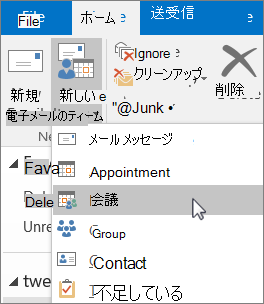

# 会議室メールボックスと備品用メールボックスRoom and equipment mailboxes

全ユーザーが使用する必要のある会議室、社用車、備品がある場合、それらのリソースはすべてのユーザーが予約できるようにする必要があります。If you have a conference room, company car, or equipment that everyone needs to use, then you need to come up with a way to make those resources reservable to everyone. このような場合、各リソースについて Microsoft 365 で会議室メールボックスまたは備品用メールボックスを作成することをお勧めします。The best way to do that is to create a room or equipment mailbox in Microsoft 365 for each resource. たとえば、1 階の会議室用、メディア機器用、移動台車用にメールボックスを作成することができます。You might create one for your first floor conference room, media equipment, or a moving truck.
  
会議室メールボックスまたは備品用メールボックスを作成すると、社内の全ユーザーが Outlook を使用して会議やイベント用にそのメールボックスを予約できます。Once you create a room or equipment mailbox, everyone in the company can reserve it for meetings or events using Outlook. 次の 2 つのタブで**使用方法**と**設定方法**について説明します。Learn **how to use it** and **how to set it up** on the next two tabs. 会議室メールボックスと備品用メールボックスについてよく寄せられる質問について説明します。Here are some other common questions about room and equipment mailboxes. 
  
## 会議室メールボックスと備品用メールボックスを使用するUse room and equipment mailboxes

会議室メールボックスまたは備品用メールボックスを使用するには、コンピューターから Outlook を開くか、Outlook on the web にサインインします。To use room or equipment mailboxes, open Outlook from your computer or sign in to Outlook on the web. 新しい会議をスケジュールし、他の従業員や顧客を招待する場合と同様に、会議室または備品を会議に追加します。Schedule a new meeting and add the room or equipment to the meeting like you would when inviting other employees or customers. これで予約は完了です。You've now reserved it.
  
1. コンピューターで **Outlook** を起動します。Open **Outlook** on your computer. 
    
2. [**ホーム**] タブで、[**新しいアイテム**] \> [**会議**] の順に選択します。On the **Home** tab, choose **New Items** \> **Meeting**. ![会議を計画するには、[ホーム] タブの [新規作成] で [新しいアイテム] を選択し、[会議] を選択します。](../../media/ffd575a8-1036-4d67-b839-73941fc60276.png) または、予定表から [**新しい会議**] を選択します。Or, from your Calendar, just select **New Meeting**.
    
3. [宛先] フィールドに、招待する出席者に加えて、予約する会議室または備品の名前も入力します。In the To field, type the name of the conference room or equipment you want to reserve, in addition to any attendees you'd like to invite. または、[**宛先**] を選択し、一覧から会議室または備品をダブルクリックします。Or, select **To** then double-click the conference room or equipment from the list. 次に [**OK**] を選びます。Then select **OK**. 
  
4. [**件名**] 行に、予約または会議の目的を入力します。In the **Subject** line, type the purpose of the reservation or meeting. 
    
5. [**場所**] の値を変更するか、そのままにします。Change the **Location** value or leave as is. 
    
6. [**開始時刻**] と [**終了時刻**] を変更します。Change the **Start time** and **End time**. または、[**終日イベント**] を選択します。Or, select **All day event**. 会議または予約を繰り返す場合は、上部の [**定期的なアイテム**] を選択します。To make the meeting or reservation repeat, select **Recurrence** at the top. 
  
7. 必要に応じて目的を説明するメッセージを入力し、ファイルを添付します。Type a message describing the purpose and attach any files if needed.
    
8. 他のユーザーがオンラインまたは電話で会議に参加できるようにするには、[**Skype 会議**] を選択します。To allow others to join online or call in to the meeting, select **Skype Meeting**.
    
9. 招待した会議室、備品、ユーザーの空き状況を確認するには、上部の [**スケジュール アシスタント**] を選択します。To make sure the room, equipment, and people you've invited are available, select **Scheduling Assistant** at the top. 予定表で空き時間を選びます。Then select an available time in the calendar.   ヒント: スケジュールの予定表で青色は会議室または備品が予約済み、つまり空いていないことを示します。TIP: In the scheduling calendar, blue means the room or equipment is reserved, or busy. 予定表で白色の領域 (つまり空いている時間) を選びます。Select the white, or free, area on the calendar. 
  
10. 完了したら、[**送信**] を選択します。When finished, select **Send**.
    
## 会議室メールボックスと備品用メールボックスをセットアップするSet up room and equipment mailboxes

会議室メールボックスまたは備品用メールボックスを設定するには、Microsoft 365 管理センターに移動します To set up a room or equipment mailbox, go to the Microsoft 365 admin center. (この操作には管理者アクセス許可が必要です。) メールボックスを作成し、会議やイベントの予約に使用できることを全ユーザーに知らせます。(You'll need to have admin permission to do this.) Create the mailbox and let everyone know they can start reserving it for meetings and events.
  
1. 管理センターで、[**リソース**] \> [[会議室&amp;備品](https://go.microsoft.com/fwlink/p/?linkid=2067334)] ページの順に移動します。In the admin center, go to the **Resources** \> [Rooms &amp; equipment](https://go.microsoft.com/fwlink/p/?linkid=2067334) page.
  
2. [**追加**] を選択します。Select **Add**.
    
3. 会議室または備品のフィールドに入力します。Fill out the room or equipment fields:  
  
  - [**会議室**] または [**備品**]: 作成するメールボックスの種類。**Room** or **Equipment**: the type of mailbox you'd like to create.
    
  - [**名前**]: わかりやすい名前または簡単な説明。**Name**: a friendly name or even short description.
    
  - [**電子メール**]: 会議室や備品の電子メール エイリアス。**Email**: the email alias of the room or equipment. 会議出席依頼を会議室または備品に送信するために必要です。This is necessary to send a meeting request to the room or equipment.
    
  - [**定員**]: 同時に会議室に収容できる、または備品を使用できる最大人数。**Capacity**: the number of people who can fit in the room or use the equipment at the same time.
    
  - [**場所**]: 建物内または地域内の会議室の部屋番号または場所。**Location**: the room number or location of the room in a building or region.
    
  - [**電話番号**]: 会議室の電話番号。**Phone number**: the number of the room itself. これは、Skype for Business の使用時に生成される会議の電話番号とは異なります。This is different from the meeting phone number generated when using Skype for Business.
    
4. [**追加**] を選択します。Select **Add**.
    
5. 作成した会議室メールボックスまたは備品用メールボックスを選択し、詳細を表示または編集します。Select the room or equipment mailbox you created to see or edit the details.
  
6. 変更した場合は、[**保存**]、[**閉じる**] の順に選択します。If you made changes, select **Save** and then **Close**.

> [!Note]
> 会議室メールボックスと備品用メールボックスを保護するには、これらのメールボックスへのサインインをブロックします。To keep your room and equipment mailboxes secure, block sign-in to these mailboxes. 詳細については、「[共有メールボックス アカウントのサインインをブロックする](https://docs.microsoft.com/office365/admin/email/create-a-shared-mailbox?view=o365-worldwide#block-sign-in-for-the-shared-mailbox-account)」を参照してください。For more information, see [Block sign-in for the shared mailbox account](https://docs.microsoft.com/office365/admin/email/create-a-shared-mailbox?view=o365-worldwide#block-sign-in-for-the-shared-mailbox-account).

## 会議室メールボックスと備品用メールボックスについてよく寄せられる質問Common questions about room and equipment mailboxes

### 会議室または備品を使用できる時間を確認する方法を教えてください。How can you tell when the room or equipment is available?

Outlook を起動し、新しい会議を作成します。Open Outlook and create a new meeting. ユーザーを追加する場合と同様に、会議室または備品を会議に追加し、[**スケジュール アシスタント**] を選択すると、会議室または備品の最新の空き状況が予定表に表示されます。Add the room or equipment to the meeting as if it were a person and select **Scheduling Assistant** to see a live calendar view of the room or equipment's availability. 時間枠が空白の場合は利用できます。青色の場合は予約済みです。If the hour slot is clear, it's available; if it's blue, it's reserved. 
  
### 会議室または備品の依頼を取り消すにはどうすればよいですか?How do you cancel a room or equipment request?

Outlook でスケジュールした会議を開き、出席者の場合と同様に、会議から会議室や備品を削除します。Open the meeting you scheduled in Outlook and then remove the room or equipment from the meeting like you would an attendee. これで、その会議室や備品が解放され、他のユーザーが予約できるようになります。This will free up the room for others to reserve.
  
### 誰かが会議室または備品の依頼を承認または却下する必要はありますか?Does someone have to accept or decline every room or equipment request?

 いいえ。依頼を承認または却下する担当者は必要ありません。No, you don't need someone to accept or decline requests. 社内の誰かが会議室または備品を自動的に予約または管理できるようにするかどうかを決定できます。You can decide whether you want to let the room or equipment be automatically booked or managed by someone in your company. 
  
### 会議室メールボックスまたは備品用メールボックスに製品のライセンスは必要ですか?Does a room mailbox or equipment mailbox need a product license?

いいえ。No. 組織内のほとんどのユーザーは Microsoft 365 を使用するためにライセンスが必要ですが、会議室メールボックスまたは備品用メールボックスにライセンスを割り当てる必要はありません。While most people in your organization need a license to use Microsoft 365, you don't need to assign a license to a room mailbox or equipment mailbox.
  
### 会議室や備品の予約を担当する所有者は必要ですか?Do I need an owner in charge of booking the rooms or equipment?

 いいえ。会議室メールボックスまたは備品用メールボックスの担当者は必要ありません。No, you don't need someone in charge of the room mailbox or equipment mailbox. 
