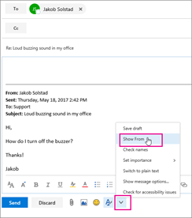

# 配布リストとして電子メールを送信するSend email as a distribution list

Microsoft 365 では、電子メールを配布リストとして送信できます。In Microsoft 365, you can send email as a distribution list. 配布リストのメンバーであるユーザーが配布リストに送信されたメッセージに返信すると、メールは個別のユーザーからではなく、配布リストからであることが表示されます。When a person who is a member of the distribution list replies to a message sent to the distribution list, the email appears to be from the distribution list, not from the individual user. このトピックでは、この操作を行う方法を示します。This topic shows you how to do this.
  
## 配布リストとして電子メールを送信するSend email as a distribution list

これらの手順を実行する前に、Microsoft 365 配布リストに追加され、そのリストに対するアクセス許可として送信が許可されている必要があります。Before you perform these steps, make sure you've been added to a Microsoft 365 distribution list and you've have been granted Send as permission on it.
  
 **管理者**: [「Microsoft 365](../email/add-user-or-contact-to-distribution-list.md) ユーザーまたは連絡先をリストに追加する」および「メンバーが [Microsoft 365](../../solutions/allow-members-to-send-as-or-send-on-behalf-of-group.md#allow-members-to-send-email-as-a-group) グループ トピックとしてメールを送信できる」の手順に従い、配布リストに正しいユーザーを追加していることを確認します。**Admins**: Make sure you've followed the steps in the [Add a Microsoft 365 user or contact to a list](../email/add-user-or-contact-to-distribution-list.md) and [Allow members to send email as a Microsoft 365 Group](../../solutions/allow-members-to-send-as-or-send-on-behalf-of-group.md#allow-members-to-send-email-as-a-group) topics, and added the correct people to the distribution list.
  
1. Outlook on the web を開き、受信トレイに移動します。Open Outlook on the web and go to your inbox. 
    
2. 配布リストに送信されたメッセージを開きます。Open a message that was sent to the distribution list. 
    
3. [返信 **] を選択します**。Select **Reply**. 
    
4. メッセージの下部で、[より多くの表示] **を** \> **選択します**。At the bottom of the message, select **More** \> **Show from**.  ![[詳細] を選択し、[Show From] を選択します。](../../media/534f13b7-9f15-48ea-8835-ea2ed1863ece.png)
  
5. From アドレス (など) を右クリックし、[ `Ina@weewalter.me` 削除] を **選択します**。Right-click on the From address - such as `Ina@weewalter.me` - and choose **Remove**.  
  
6. 次に、support@contoso.com などの配布リストを入力して、メッセージを送信します。Then type the distribution list address such as support@contoso.com, and send the message. 次に配布リストから返信すると、そのアドレスが [From] リストにオプションとして **表示** されます。The next time you reply from the distribution list, its address will appear as an option in the **From** list. 
