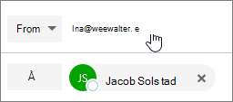
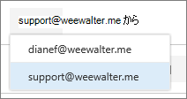

# 配布リストとして電子メールを送信する

このMicrosoft 365、配布リストとして電子メールを送信できます。 配布リストのメンバーであるユーザーが配布リストに送信されたメッセージに返信すると、メールは個別のユーザーからではなく、配布リストからであることが表示されます。 このトピックでは、この操作を行う方法を示します。
  
## 開始する前に

これらの手順を実行する前に、Microsoft 365 配布リストに追加され、その配布リストに対する送信権限が付与されている必要があります。
  
 **管理者**: [[Microsoft 365](../email/add-user-or-contact-to-distribution-list.md)ユーザーまたは連絡先をリストに追加する] および [メンバーが [Microsoft 365](../../solutions/allow-members-to-send-as-or-send-on-behalf-of-group.md#allow-members-to-send-email-as-a-group)グループ トピックとして電子メールを送信するを許可する] の手順に従い、配布リストに正しいユーザーを追加していることを確認します。
  
## Outlook on the web

1. Outlook on the web を開き、受信トレイに移動します。 
    
2. 配布リストに送信されたメッセージを開きます。 
    
3. [返信 **] を選択します**。 
    
4. メッセージの下部で、[より多くの表示] **を** \> **選択します**。  ![[詳細] を選択し、[Show From] を選択します。](../../media/534f13b7-9f15-48ea-8835-ea2ed1863ece.png)
  
5. From アドレス (など) を右クリックし、[ `Ina@weewalter.me` 削除] を **選択します**。  
  
6. 次に、support@contoso.com などの配布リストを入力して、メッセージを送信します。 次に配布リストから返信すると、そのアドレスが [From] リストにオプションとして **表示** されます。 

## Outlook

1. デスクトップ Outlookを開きます。

2. 新しいメールを作成します。 [From] **フィールドをクリック** し、[その他の **メール アドレス] を選択します**。 [From] フィールドが表示されない場合は、[オプション] に移動し、[フィールドの表示] セクションで **[From]** を選択します。

3. グローバル アドレス **一覧から** 配布リスト アドレスを選択します。

4. 電子メールを送信します。

## 関連コンテンツ

[セキュリティ グループを](../email/create-edit-or-delete-a-security-group.md)作成、編集、または削除するには、Microsoft 365 管理センター (記事)\
[電子メールの共同作業](../email/email-collaboration.md) (記事)\
[配布グループにユーザーまたは連絡先を追加する](../email/add-user-or-contact-to-distribution-list.md) (記事)