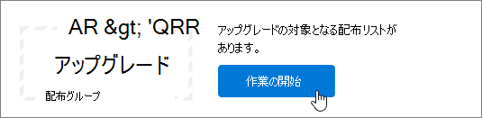

# <a name="upgrade-distribution-lists-to-microsoft-365-groups-in-outlook"></a><span data-ttu-id="a731c-103">配布リストを、Microsoft 365グループにアップグレードOutlook</span><span class="sxs-lookup"><span data-stu-id="a731c-103">Upgrade distribution lists to Microsoft 365 Groups in Outlook</span></span>

<span data-ttu-id="a731c-104">配布リストを、Microsoft 365グループにアップグレードOutlook。</span><span class="sxs-lookup"><span data-stu-id="a731c-104">You can upgrade distribution lists to Microsoft 365 Groups in Outlook.</span></span> <span data-ttu-id="a731c-105">これは、組織の配布リストに、組織のグループのすべての機能と機能を提供Microsoft 365です。</span><span class="sxs-lookup"><span data-stu-id="a731c-105">This is a great way to give your organization's distribution lists all the features and functionality of Microsoft 365 Groups.</span></span> [<span data-ttu-id="a731c-106">Outlook で配布リストをグループにアップグレードする理由</span><span class="sxs-lookup"><span data-stu-id="a731c-106">Why you should upgrade your distribution lists to groups in Outlook</span></span>](https://support.microsoft.com/office/7fb3d880-593b-4909-aafa-950dd50ce188)

<span data-ttu-id="a731c-107">配布リストは 1 つずつ、または複数を同時にアップグレードできます。</span><span class="sxs-lookup"><span data-stu-id="a731c-107">You can upgrade DLs one at a time, or several at the same time.</span></span>

## <a name="upgrade-one-or-many-distribution-list-groups-to-microsoft-365-groups-in-outlook"></a><span data-ttu-id="a731c-108">1 つ以上の配布リスト グループを、Microsoft 365グループにアップグレードOutlook</span><span class="sxs-lookup"><span data-stu-id="a731c-108">Upgrade one or many distribution list groups to Microsoft 365 Groups in Outlook</span></span>

<span data-ttu-id="a731c-109">配布リスト グループをアップグレードするには、Exchange管理者または管理者である必要があります。</span><span class="sxs-lookup"><span data-stu-id="a731c-109">You must be a global admin or Exchange admin to upgrade a distribution list group.</span></span> <span data-ttu-id="a731c-110">配布リスト グループMicrosoft 365アップグレードするには、メールボックスを持つ所有者が必要です。</span><span class="sxs-lookup"><span data-stu-id="a731c-110">To upgrade to Microsoft 365 Groups, the distribution list group must have an owner with a mailbox.</span></span>

### <a name="use-the-new-eac-to-upgrade-one-or-many-distribution-list-groups-to-microsoft-365-groups-in-outlook"></a><span data-ttu-id="a731c-111">新しい EAC を使用して、1 つ以上の配布リスト グループを、Microsoft 365グループにアップグレードOutlook</span><span class="sxs-lookup"><span data-stu-id="a731c-111">Use the new EAC to upgrade one or many distribution list groups to Microsoft 365 Groups in Outlook</span></span>

1. <span data-ttu-id="a731c-112">管理センターの新しい [Exchangeに移動し](https://admin.exchange.microsoft.com)、[受信者グループ]**に移動** \> **します**。</span><span class="sxs-lookup"><span data-stu-id="a731c-112">Go to the new [Exchange admin center](https://admin.exchange.microsoft.com), and navigate to **Recipients** \> **Groups**.</span></span>

2. <span data-ttu-id="a731c-113">[グループ] ページから、配布リスト グループ (配布 **グループとも呼** ばれる) を選択して、Microsoft 365グループ **にアップグレード** します。</span><span class="sxs-lookup"><span data-stu-id="a731c-113">Select the distribution list group (also called a **distribution group**) that you want to upgrade to Microsoft 365 group from the **Groups** page.</span></span>

3. <span data-ttu-id="a731c-114">ツール バー **から [アップグレード配布グループ** ] を選択します。</span><span class="sxs-lookup"><span data-stu-id="a731c-114">Select the **Upgrade distribution group** from the tool bar.</span></span>

4. <span data-ttu-id="a731c-115">[アップグレードの準備完了] ダイアログ ボックス **で、[アップグレード]** を **クリックします**。</span><span class="sxs-lookup"><span data-stu-id="a731c-115">In the dialog box **Ready to upgrade?**, click **Upgrade**.</span></span> <span data-ttu-id="a731c-116">プロセスがすぐに開始されます。</span><span class="sxs-lookup"><span data-stu-id="a731c-116">The process begins immediately.</span></span> <span data-ttu-id="a731c-117">アップグレードする配布リスト グループのサイズと数に応じて、プロセスには数分または数時間かかる場合があります。</span><span class="sxs-lookup"><span data-stu-id="a731c-117">Depending on the size and number of distribution list groups you're upgrading, the process can take minutes or hours.</span></span>

> [!NOTE]
> <span data-ttu-id="a731c-118">上部のバナーは、アップグレード (配布グループなど) がアップグレード *された状態を示します。変更を反映するには 5 分かかります。アップグレードされたMicrosoft 365グループ* を表示するには、グループでフィルター処理します。</span><span class="sxs-lookup"><span data-stu-id="a731c-118">A banner at the top indicates the upgrade, for example, *Distribution group(s) has been upgraded. It will take 5 minutes to reflect the changes. Filter by Microsoft 365 groups to see the upgraded distrubtion groups(s)*.</span></span>

### <a name="use-the-classic-eac-to-upgrade-one-or-many-distribution-list-groups-to-microsoft-365-groups-in-outlook"></a><span data-ttu-id="a731c-119">クラシック EAC を使用して、1 つ以上の配布リスト グループを、Microsoft 365グループにアップグレードOutlook</span><span class="sxs-lookup"><span data-stu-id="a731c-119">Use the Classic EAC to upgrade one or many distribution list groups to Microsoft 365 Groups in Outlook</span></span>

1. <span data-ttu-id="a731c-120">クラシック 管理センターに<a href="https://go.microsoft.com/fwlink/p/?linkid=2059104" target="_blank">Exchangeします</a>。</span><span class="sxs-lookup"><span data-stu-id="a731c-120">Go to the Classic <a href="https://go.microsoft.com/fwlink/p/?linkid=2059104" target="_blank">Exchange admin center</a>.</span></span>

2. <span data-ttu-id="a731c-121">クラシック 管理センターでExchange[受信者グループ **] に移動** \> **します**。</span><span class="sxs-lookup"><span data-stu-id="a731c-121">In the Classic Exchange admin center, go to **Recipients** \> **Groups**.</span></span><br/><span data-ttu-id="a731c-122">配布リスト (配布グループとも呼 **ばれる)** が存在し、配布グループにアップグレードする資格があるという通知Microsoft 365表示されます。</span><span class="sxs-lookup"><span data-stu-id="a731c-122">You'll see a notice indicating you have distribution lists (also called **distribution groups**) that are eligible to be upgraded to Microsoft 365 Groups.</span></span><br/> <span data-ttu-id="a731c-123">![[スタート] ボタンを選択する](../../media/8cf838b4-2644-401f-a366-08c1eea183eb.png)</span><span class="sxs-lookup"><span data-stu-id="a731c-123"></span></span>

3. <span data-ttu-id="a731c-124">[グループ] ページから 1 つ以上の配布リスト (配布 **グループ** とも呼ばれる) **を選択** します。</span><span class="sxs-lookup"><span data-stu-id="a731c-124">Select one or more distribution lists (also called a **distribution group**) from the **groups** page.</span></span><br/><span data-ttu-id="a731c-125"></span><span class="sxs-lookup"><span data-stu-id="a731c-125"></span></span>

4. <span data-ttu-id="a731c-126">アップグレード アイコンを選択します。</span><span class="sxs-lookup"><span data-stu-id="a731c-126">Select the upgrade icon.</span></span><br/>![[グループへのMicrosoft 365] アイコン](../../media/1e28cb3d-bff3-4be3-8329-1902d2d54720.png)

5. <span data-ttu-id="a731c-128">情報ダイアログで、[はい] **を選択して** アップグレードを確認します。</span><span class="sxs-lookup"><span data-stu-id="a731c-128">On the information dialog, select **Yes** to confirm the upgrade.</span></span> <span data-ttu-id="a731c-129">プロセスがすぐに開始されます。</span><span class="sxs-lookup"><span data-stu-id="a731c-129">The process begins immediately.</span></span> <span data-ttu-id="a731c-130">アップグレードする配布リストのサイズや数に応じて、処理には数分または数時間かかることがあります。</span><span class="sxs-lookup"><span data-stu-id="a731c-130">Depending on the size and number of DLs you're upgrading, the process can take minutes or hours.</span></span><br/><span data-ttu-id="a731c-131">配布リストをアップグレードできない場合は、それを示すダイアログが表示されます。</span><span class="sxs-lookup"><span data-stu-id="a731c-131">If the distribution list can't be upgraded, a dialog appears saying so.</span></span> <span data-ttu-id="a731c-132">「 [アップグレードできない配布リスト」を参照してください](#which-distribution-lists-cant-be-upgraded)。</span><span class="sxs-lookup"><span data-stu-id="a731c-132">See [Which distribution lists cannot be upgraded?](#which-distribution-lists-cant-be-upgraded).</span></span>

6. <span data-ttu-id="a731c-133">複数の配布リストをアップグレードする場合は、ドロップダウン リストを使用して、アップグレードされた配布リストをフィルター処理します。</span><span class="sxs-lookup"><span data-stu-id="a731c-133">If you're upgrading multiple distribution lists, use the drop-down list to filter which distribution lists have been upgraded.</span></span> <span data-ttu-id="a731c-134">リストが完了しない場合は、しばらく待ち、次に [更新] を選択して、正常にアップグレードされた項目を確認します。</span><span class="sxs-lookup"><span data-stu-id="a731c-134">If the list isn't complete, wait a while longer and then select **Refresh** to see what's been successfully upgraded.</span></span><br/><span data-ttu-id="a731c-p107">選択した配布リストのすべてのアップグレード プロセスが完了しても、通知は表示されません。[ **アップグレード可能** ] または [ **アップグレードされた配布リスト** ] に一覧された内容を確認して、これを把握することができます。</span><span class="sxs-lookup"><span data-stu-id="a731c-p107">There's no notice that tells you when the upgrade process has completed for all DLs you selected. You can figure this out by looking to see what's listed under **Available for upgrade** or **Upgraded DLs**.</span></span>

7. <span data-ttu-id="a731c-137">アップグレード用に DL を選択したが、アップグレード可能としてページに表示された場合、アップグレードに失敗しました。</span><span class="sxs-lookup"><span data-stu-id="a731c-137">If you selected a DL for upgrade, but it's still appeared on the page as Available to upgrade, then it failed to upgrade.</span></span> <span data-ttu-id="a731c-138">「[アップグレードが機能しない場合の対処方法](#what-to-do-if-the-upgrade-doesnt-work)」を参照してください。</span><span class="sxs-lookup"><span data-stu-id="a731c-138">See [What to do if the upgrade doesn't work](#what-to-do-if-the-upgrade-doesnt-work).</span></span>

> [!NOTE]
> <span data-ttu-id="a731c-p109">グループのダイジェスト メールを受け取っている場合は、下部に通知が表示され、所有者になっている対象の配布リストをアップグレードできるように示されることがあります。ダイジェスト メールの詳細については、「[Have a group conversation in Outlook](https://support.microsoft.com/office/a0482e24-a769-4e39-a5ba-a7c56e828b22)」 (Outlook でグループ会話を使用する) を参照してください。</span><span class="sxs-lookup"><span data-stu-id="a731c-p109">If you're getting the groups digest emails you may notice at the bottom that it will sometimes offer to let you upgrade any eligible distribution lists that you're the owner of. See [Have a group conversation in Outlook](https://support.microsoft.com/office/a0482e24-a769-4e39-a5ba-a7c56e828b22) for more information about digest emails.</span></span>

## <a name="what-to-do-if-the-upgrade-doesnt-work"></a><span data-ttu-id="a731c-141">アップグレードが機能しない場合の対処方法</span><span class="sxs-lookup"><span data-stu-id="a731c-141">What to do if the upgrade doesn't work</span></span>

<span data-ttu-id="a731c-142">アップグレードに失敗した配布リストは、変更されないまま保持されます。</span><span class="sxs-lookup"><span data-stu-id="a731c-142">Distribution lists that fail to upgrade remain unchanged.</span></span>

<span data-ttu-id="a731c-p110">1 つ以上の **対象** の配布リストがアップグレードに失敗した場合は、 [サポート チケット](../../business-video/get-help-support.md)を開きます。問題を解決するために、この問題をグループ エンジニアリング チームにエスカレーションする必要があります。</span><span class="sxs-lookup"><span data-stu-id="a731c-p110">If one or more **eligible** distribution lists fail to be upgraded, open a [Support ticket](../../business-video/get-help-support.md). The issue will need to be escalated to the Groups Engineering team for them to figure out the problem.</span></span>

<span data-ttu-id="a731c-145">サービスの停止により配布リストがアップグレードされませんが、可能性は低い可能性があります。</span><span class="sxs-lookup"><span data-stu-id="a731c-145">It's possible that the distribution list didn't get upgraded because of a service outage, but unlikely.</span></span> <span data-ttu-id="a731c-146">必要な場合は、しばらく待ってから、もう一度配布リストをアップグレードします。</span><span class="sxs-lookup"><span data-stu-id="a731c-146">If you want, wait a while and then try to upgrade the DL again.</span></span>

## <a name="how-to-use-powershell-to-upgrade-several-distribution-lists-at-the-same-time"></a><span data-ttu-id="a731c-147">PowerShell を使用して複数の配布リストを同時にアップグレードする方法</span><span class="sxs-lookup"><span data-stu-id="a731c-147">How to use PowerShell to upgrade several distribution lists at the same time</span></span>

<span data-ttu-id="a731c-p112">PowerShell の使用経験がある場合は、UI ではなく、この手順を使用することをお勧めします。配布リストのアップグレードに役立つ一連のコマンドレットが用意されています。以下を参照してください。</span><span class="sxs-lookup"><span data-stu-id="a731c-p112">If you're experienced at using PowerShell, you might want to go this route instead of using the UI. We have a set of cmdlets that will help you upgrade distribution lists. See below.</span></span>

### <a name="upgrade-a-single-dl"></a><span data-ttu-id="a731c-151">1 つの DL をアップグレードする</span><span class="sxs-lookup"><span data-stu-id="a731c-151">Upgrade a single DL</span></span>

<span data-ttu-id="a731c-152">単一の DL をアップグレードするには、次のコマンドを実行します。</span><span class="sxs-lookup"><span data-stu-id="a731c-152">To upgrade a single DL, run the following command:</span></span>

```PowerShell
Upgrade-DistributionGroup -DlIdentities <Dl SMTP address>
```

<span data-ttu-id="a731c-153">たとえば、SMTP アドレスを使用して DL をアップグレードする場合は dl1@contoso.com コマンドを実行します。</span><span class="sxs-lookup"><span data-stu-id="a731c-153">For example, if you want to upgrade a DL with SMTP address dl1@contoso.com, run the following command:</span></span>

```PowerShell
Upgrade-DistributionGroup -DlIdentities dl1@contoso.com
```

> [!NOTE]
> <span data-ttu-id="a731c-154">[New-UnifiedGroup](/powershell/module/exchange/new-unifiedgroup) PowerShell コマンドレットを使用してMicrosoft 365配布リストを 1 つのグループにアップグレードすることもできます。</span><span class="sxs-lookup"><span data-stu-id="a731c-154">You can also upgrade a single distribution list to a Microsoft 365 group using the [New-UnifiedGroup](/powershell/module/exchange/new-unifiedgroup) PowerShell cmdlet</span></span>

### <a name="upgrade-multiple-dls-in-a-batch"></a><span data-ttu-id="a731c-155">複数の DL を一括してアップグレードする</span><span class="sxs-lookup"><span data-stu-id="a731c-155">Upgrade multiple DLs in a batch</span></span>

<span data-ttu-id="a731c-156">複数の DL をバッチとして渡し、まとめてアップグレードすることもできます。</span><span class="sxs-lookup"><span data-stu-id="a731c-156">You can also pass multiple DLs as a batch and upgrade them together:</span></span>

```PowerShell
Upgrade-DistributionGroup -DlIdentities <DL SMTP address1>, <DL SMTP address2>,
<DL SMTP address3>, <DL SMTP address4>
```

<span data-ttu-id="a731c-157">たとえば、SMTP アドレスを使用して 5 つの DLL をアップグレードする場合 `dl1@contoso.com` 、および `dl2@contoso.com` `dl3@contoso.com` 、 `dl4@contoso.com` `dl5@contoso.com` 次のコマンドを実行します。</span><span class="sxs-lookup"><span data-stu-id="a731c-157">For example, if you want to upgrade five DLs with SMTP address `dl1@contoso.com` and `dl2@contoso.com`, `dl3@contoso.com`, `dl4@contoso.com` and `dl5@contoso.com`, run the following command:</span></span>

`Upgrade-DistributionGroup -DlIdentities dl1@contoso.com, dl2@contoso.com, dl3@contoso.com, dl4@contoso.com, dl5@contoso.com`

### <a name="upgrade-all-eligible-dls"></a><span data-ttu-id="a731c-158">対象となるすべての DL をアップグレードする</span><span class="sxs-lookup"><span data-stu-id="a731c-158">Upgrade all eligible DLs</span></span>

<span data-ttu-id="a731c-159">対象となるすべての DL をアップグレードするには、2 つの方法があります。</span><span class="sxs-lookup"><span data-stu-id="a731c-159">There are two ways in which you can upgrade all the eligible DLs.</span></span>

> [!NOTE]
> <span data-ttu-id="a731c-160">このUpgrade-DistributionGroupコマンドレットはパイプラインからデータを受け取らないので、"foreach-object" 演算子を使用して正常に {} 実行する必要があります。</span><span class="sxs-lookup"><span data-stu-id="a731c-160">The Upgrade-DistributionGroup cmdlet doesn't receive data from the pipeline, for this reason it's required to use "foreach-object{}" operator to run successfully.</span></span>

1. <span data-ttu-id="a731c-161">テナント内の適格な DLL を取得し、upgrade コマンドを使用してアップグレードします。</span><span class="sxs-lookup"><span data-stu-id="a731c-161">Get the eligible DLs in the tenant and upgrade them using the upgrade command:</span></span>

```PowerShell
Get-EligibleDistributionGroupForMigration | Foreach-Object{
    Upgrade-DistributionGroup -DlIdentities $_.PrimarySMTPAddress
}
```

2. <span data-ttu-id="a731c-162">2.すべての DL の一覧を取得し、対象となる DL のみをアップグレードします。</span><span class="sxs-lookup"><span data-stu-id="a731c-162">Get the list of all DLs and upgrade only the eligible DLs:</span></span>

```PowerShell
Get-DistributionGroup| Foreach-Object{
    Upgrade-DistributionGroup -DlIdentities $_.PrimarySMTPAddress
}
```

## <a name="faq-about-upgrading-distribution-lists-to-microsoft-365-groups-in-outlook"></a><span data-ttu-id="a731c-163">配布リストのグループへのアップグレードに関する FAQ Microsoft 365のグループOutlook</span><span class="sxs-lookup"><span data-stu-id="a731c-163">FAQ about upgrading distribution lists to Microsoft 365 Groups in Outlook</span></span>

### <a name="which-distribution-lists-cant-be-upgraded"></a><span data-ttu-id="a731c-164">アップグレードできない配布リスト</span><span class="sxs-lookup"><span data-stu-id="a731c-164">Which distribution lists can't be upgraded?</span></span>

<span data-ttu-id="a731c-165">クラウド管理されている、単純で入れ子になっていない配布リストのみをアップグレードできます。</span><span class="sxs-lookup"><span data-stu-id="a731c-165">You can only upgrade cloud-managed, simple, non-nested distribution lists.</span></span> <span data-ttu-id="a731c-166">次の表に、アップグレードできない **配布リスト** を示します。</span><span class="sxs-lookup"><span data-stu-id="a731c-166">The table below lists distribution lists that **CANNOT** be upgraded.</span></span>

|<span data-ttu-id="a731c-167">**プロパティ**</span><span class="sxs-lookup"><span data-stu-id="a731c-167">**Property**</span></span>|<span data-ttu-id="a731c-168">**対象**</span><span class="sxs-lookup"><span data-stu-id="a731c-168">**Eligible?**</span></span>|
|:-----|:-----|
|<span data-ttu-id="a731c-169">オンプレミスで管理される配布リスト</span><span class="sxs-lookup"><span data-stu-id="a731c-169">On-premises managed distribution list.</span></span>  <br/> |<span data-ttu-id="a731c-170">いいえ</span><span class="sxs-lookup"><span data-stu-id="a731c-170">No</span></span>  <br/> |
|<span data-ttu-id="a731c-p114">入れ子になった配布リスト子グループがあるか、または別のグループのメンバーである配布リスト</span><span class="sxs-lookup"><span data-stu-id="a731c-p114">Nested distribution lists. Distribution list either has child groups or is a member of another group.</span></span>  <br/> |<span data-ttu-id="a731c-173">いいえ</span><span class="sxs-lookup"><span data-stu-id="a731c-173">No</span></span>  <br/> |
|<span data-ttu-id="a731c-174">**UserMailbox**、SharedMailbox **、TeamMailbox** **、MailUser** 以外のメンバー **RecipientTypeDetails** を持つ配布リスト</span><span class="sxs-lookup"><span data-stu-id="a731c-174">Distribution lists with member **RecipientTypeDetails** other than **UserMailbox**, **SharedMailbox**, **TeamMailbox**, **MailUser**</span></span>  <br/> |<span data-ttu-id="a731c-175">いいえ</span><span class="sxs-lookup"><span data-stu-id="a731c-175">No</span></span>  <br/> |
|<span data-ttu-id="a731c-176">所有者が 100 人を超える配布リスト</span><span class="sxs-lookup"><span data-stu-id="a731c-176">Distribution list that has more than 100 owners</span></span>  <br/> |<span data-ttu-id="a731c-177">いいえ</span><span class="sxs-lookup"><span data-stu-id="a731c-177">No</span></span>  <br/> |
|<span data-ttu-id="a731c-178">メンバーのみを持ち、所有者がない配布リスト</span><span class="sxs-lookup"><span data-stu-id="a731c-178">Distribution list that only has members but no owner</span></span>  <br/> |<span data-ttu-id="a731c-179">いいえ</span><span class="sxs-lookup"><span data-stu-id="a731c-179">No</span></span>  <br/> |
|<span data-ttu-id="a731c-180">特殊文字を含むエイリアスを含む配布リスト</span><span class="sxs-lookup"><span data-stu-id="a731c-180">Distribution list that has alias containing special characters</span></span>  <br/> |<span data-ttu-id="a731c-181">いいえ</span><span class="sxs-lookup"><span data-stu-id="a731c-181">No</span></span>  <br/> |
|<span data-ttu-id="a731c-182">配布リストが共有メールボックスの転送アドレスになるように構成されている場合</span><span class="sxs-lookup"><span data-stu-id="a731c-182">If the distribution list is configured to be a forwarding address for Shared Mailbox</span></span>  <br/> |<span data-ttu-id="a731c-183">いいえ</span><span class="sxs-lookup"><span data-stu-id="a731c-183">No</span></span>  <br/> |
|<span data-ttu-id="a731c-184">DL が別の DL の **送信者制限の一** 部である場合。</span><span class="sxs-lookup"><span data-stu-id="a731c-184">If the DL is part of **Sender Restriction** in another DL.</span></span>  <br/> |<span data-ttu-id="a731c-185">いいえ</span><span class="sxs-lookup"><span data-stu-id="a731c-185">No</span></span>  <br/> |
|<span data-ttu-id="a731c-186">セキュリティ グループ</span><span class="sxs-lookup"><span data-stu-id="a731c-186">Security groups</span></span>  <br/> |<span data-ttu-id="a731c-187">いいえ</span><span class="sxs-lookup"><span data-stu-id="a731c-187">No</span></span>  <br/> |
|<span data-ttu-id="a731c-188">動的配布リスト</span><span class="sxs-lookup"><span data-stu-id="a731c-188">Dynamic Distribution lists</span></span>  <br/> |<span data-ttu-id="a731c-189">いいえ</span><span class="sxs-lookup"><span data-stu-id="a731c-189">No</span></span>  <br/> |
|<span data-ttu-id="a731c-190">**RoomLists** に変換された配布リスト</span><span class="sxs-lookup"><span data-stu-id="a731c-190">Distribution lists that were converted to **RoomLists**</span></span>  <br/> |<span data-ttu-id="a731c-191">いいえ</span><span class="sxs-lookup"><span data-stu-id="a731c-191">No</span></span>  <br/> |

### <a name="check-which-dls-are-eligible-for-upgrade"></a><span data-ttu-id="a731c-192">アップグレードの対象となる DLL を確認する</span><span class="sxs-lookup"><span data-stu-id="a731c-192">Check which DLs are eligible for upgrade</span></span>

<span data-ttu-id="a731c-193">ある DL がアップグレード対象かどうかを確認するには、次のコマンドを実行します。</span><span class="sxs-lookup"><span data-stu-id="a731c-193">If you want to check whether a DL is eligible or not, you can run the below command:</span></span>

`Get-DistributionGroup <DL SMTP address> | Get-EligibleDistributionGroupForMigration`

<span data-ttu-id="a731c-194">アップグレード対象の DL を確認する場合は、次のコマンドを実行します。</span><span class="sxs-lookup"><span data-stu-id="a731c-194">If you want to check which DLs are eligible for upgrade just run the following command:</span></span>

`Get-EligibleDistributionGroupForMigration`

### <a name="who-can-run-the-upgrade-scripts"></a><span data-ttu-id="a731c-195">どのユーザーがアップグレード スクリプトを実行できますか?</span><span class="sxs-lookup"><span data-stu-id="a731c-195">Who can run the upgrade scripts?</span></span>

<span data-ttu-id="a731c-196">グローバル管理者または管理者権限を持Exchangeユーザー。</span><span class="sxs-lookup"><span data-stu-id="a731c-196">People with global admin or Exchange admin rights.</span></span>

### <a name="why-is-the-contact-card-still-showing-a-distribution-list-what-should-i-do-to-prevent-an-upgraded-distribution-list-from-showing-up-in-my-auto-suggest-list"></a><span data-ttu-id="a731c-197">連絡先カードに依然として配布リストが表示されるのはなぜでしょうか。</span><span class="sxs-lookup"><span data-stu-id="a731c-197">Why is the contact card still showing a distribution list?</span></span> <span data-ttu-id="a731c-198">アップグレードされた配布リストが自動提案リストに表示されるのを防ぐには、どのような操作を行う必要がありますか?</span><span class="sxs-lookup"><span data-stu-id="a731c-198">What should I do to prevent an upgraded distribution list from showing up in my auto suggest list?</span></span>

- <span data-ttu-id="a731c-199">[Outlook: 移行後に Microsoft 365 グループ名を入力して Outlook で電子メールを送信しようとすると、受信者はグループの代わりに配布リストとして解決されます。</span><span class="sxs-lookup"><span data-stu-id="a731c-199">For Outlook: When someone tries to send an email in Outlook by typing the Microsoft 365 group name after migration, the recipient will be resolved as the distribution list instead of the group.</span></span> <span data-ttu-id="a731c-200">受信者の連絡先カードは配布リストの連絡先カードとなります。</span><span class="sxs-lookup"><span data-stu-id="a731c-200">The contact card of the recipient will be the distribution lists contact card.</span></span> <span data-ttu-id="a731c-201">これは Outlook の受信者キャッシュまたはニックネーム キャッシュに起因します。</span><span class="sxs-lookup"><span data-stu-id="a731c-201">This is because of the recipient cache or nick name cache in Outlook.</span></span> <span data-ttu-id="a731c-202">電子メールはグループに正常に送信されますが、送信者に混乱を招く可能性があります。</span><span class="sxs-lookup"><span data-stu-id="a731c-202">The email will be sent successfully to the group, but might cause confusion to the sender.</span></span><br/><span data-ttu-id="a731c-203">この記事の手順を実行[できます。この](/outlook/troubleshoot/contacts/information-about-the-outlook-autocomplete-list)問題を解決するキャッシュをリセットOutlookオートコンプリート リストに関する情報を参照してください。</span><span class="sxs-lookup"><span data-stu-id="a731c-203">You can perform the steps in this article, [Information about the Outlook AutoComplete list](/outlook/troubleshoot/contacts/information-about-the-outlook-autocomplete-list) to reset the cache, which will fix this issue.</span></span>

- <span data-ttu-id="a731c-204">[Outlook on the web: Outlook on the web場合、配布リストの受信者は引き続きキャッシュに残ります。</span><span class="sxs-lookup"><span data-stu-id="a731c-204">For Outlook on the web: In case of Outlook on the web, the distribution list recipient will still remain in the cache.</span></span> <span data-ttu-id="a731c-205">「自動完了リストから推奨[](https://support.microsoft.com/office/9E1419D9-E88F-445B-B07F-F558B8A37C58)される名前または電子メール アドレスを削除する」の手順に従って、キャッシュを更新してグループ連絡先カードを表示できます。</span><span class="sxs-lookup"><span data-stu-id="a731c-205">You can follow the steps in [Remove suggested name or email address from the Auto-Complete List](https://support.microsoft.com/office/9E1419D9-E88F-445B-B07F-F558B8A37C58) to refresh the cache to see the group contact card.</span></span>

### <a name="do-new-group-members-get-a-welcome-email-in-their-inbox"></a><span data-ttu-id="a731c-206">新しいグループのメンバーは、受信トレイでウェルカム メッセージを受け取りますか?</span><span class="sxs-lookup"><span data-stu-id="a731c-206">Do new group members get a welcome email in their inbox?</span></span>

<span data-ttu-id="a731c-p118">いいえ。ウェルカム メッセージを有効にする設定は、既定で false に設定されています。この設定は、既存のグループ メンバーにも、移行が完了した後に参加する可能性がある新しいグループ メンバーにも影響します。グループの所有者が後でゲスト ユーザーを許可した場合、ゲスト ユーザーは受信トレイでウェルカム メールを受け取ることはありません。ゲスト メンバーはグループで継続して作業を行うことができます。</span><span class="sxs-lookup"><span data-stu-id="a731c-p118">No. The setting to enable welcome messages is set to false by default. This setting affects both existing and new group members who may join after the migration is complete. If the group owner later allows guest users, guest users won't receive a welcome email in their inbox. Guest members can continue working with the group.</span></span>

### <a name="what-if-one-or-some-of-the-dls-are-not-upgraded"></a><span data-ttu-id="a731c-212">1 つまたは一部の DLL がアップグレードされていない場合は、どうしますか。</span><span class="sxs-lookup"><span data-stu-id="a731c-212">What if one or some of the DLs are not upgraded?</span></span>

<span data-ttu-id="a731c-213">DL が対象ですが、アップグレードできない場合もあります。</span><span class="sxs-lookup"><span data-stu-id="a731c-213">There are some cases in which though DL is eligible but could not be upgraded.</span></span> <span data-ttu-id="a731c-214">DL はアップグレードされません。DL として残ります。</span><span class="sxs-lookup"><span data-stu-id="a731c-214">The DL does not get upgraded and remains as a DL.</span></span>

- <span data-ttu-id="a731c-215">管理者が組織内の **グループ** にグループ メール アドレス ポリシーを適用し、条件を満たしていない DLL をアップグレードしようとする場合、DL はアップグレードされません。</span><span class="sxs-lookup"><span data-stu-id="a731c-215">Where admin has applied **Group Email Address Policy** for the groups in an organization and they try to upgrade DLs that doesn't fulfill the criteria, the DL does not get upgraded</span></span>

- <span data-ttu-id="a731c-216">**MemberJoinRestriction** または **MemberDepartRestriction** が **Closed** に設定されている DLL をアップグレードできない</span><span class="sxs-lookup"><span data-stu-id="a731c-216">DLs with **MemberJoinRestriction** or **MemberDepartRestriction** set to **Closed**, could not be upgraded</span></span>

### <a name="what-happens-to-the-dl-if-the-upgrade-from-eac-fails"></a><span data-ttu-id="a731c-217">EAC からのアップグレードに失敗した場合、配布リストはどうなりますか?</span><span class="sxs-lookup"><span data-stu-id="a731c-217">What happens to the DL if the upgrade from EAC fails?</span></span>

<span data-ttu-id="a731c-p120">呼び出しがサーバーに送信された場合にのみ、アップグレードが発生します。アップグレードが失敗した場合、配布リストはそのまま保持されます。配布リストは、以前のように動作します。</span><span class="sxs-lookup"><span data-stu-id="a731c-p120">The upgrade will happen only when the call is submitted to the server. If the upgrade fails, your DLs will be intact. They will work like they used to.</span></span>

## <a name="related-content"></a><span data-ttu-id="a731c-221">関連コンテンツ</span><span class="sxs-lookup"><span data-stu-id="a731c-221">Related content</span></span>

<span data-ttu-id="a731c-222">[グループの比較](../create-groups/compare-groups.md) (記事)</span><span class="sxs-lookup"><span data-stu-id="a731c-222">[Compare groups](../create-groups/compare-groups.md) (article)</span></span>\
<span data-ttu-id="a731c-223">[ユーザー Microsoft 365グループの説明](../create-groups/explain-groups-knowledge-worker.md)(記事)</span><span class="sxs-lookup"><span data-stu-id="a731c-223">[Explaining Microsoft 365 Groups to your users](../create-groups/explain-groups-knowledge-worker.md) (article)</span></span>\
[<span data-ttu-id="a731c-224">管理センターを使用して、Microsoft 365グループのメンバーを追加または削除する</span><span class="sxs-lookup"><span data-stu-id="a731c-224">Add or remove members from Microsoft 365 groups using the admin center</span></span>](../create-groups/add-or-remove-members-from-groups.md)
