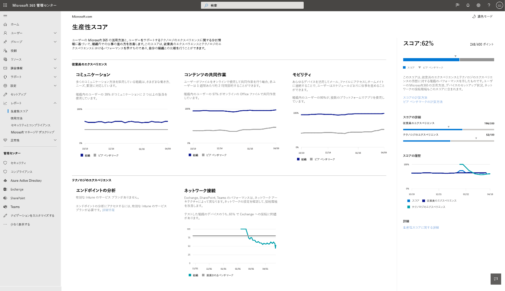

# Microsoft プロダクティビティスコア (プレビュー)Microsoft Productivity Score (Preview)

生産性スコアは、ユーザーが Microsoft 365 を使用する方法と、それらをサポートするテクノロジエクスペリエンスについて、組織がどのように作業を遂行するかを分析するのに役立ちます。Productivity Score helps organizations transform how work gets done with insights about how people use Microsoft 365 and the technology experiences that support them. スコアはユーザーやテクノロジエクスペリエンスに対する組織の業績を反映し、自分のスコアを自分のような組織と比較します。The score reflects your organization’s performance against people and technology experiences measures and compares your score with organizations like yours.

スコアには次のものが含まれます。The score includes:

- ユーザーがどのように Microsoft 365 製品を使用してプラットフォーム間でコラボレーション、コミュニケーション、作業を行っているかを確認するのに役立つ**指標**。**Metrics** to help you see how people are using Microsoft 365 products to collaborate, communicate, and work across platforms.
- 従業員の生産性と満足度を向上させるチャンスを特定するのに役立つデータに関する**洞察**。**Insights** about the data to help you identify opportunities to improve employee productivity and satisfaction.
- 組織内のユーザーが Microsoft 365 製品を効率的に使用できるようにするために推奨される**処置**。すべてのユーザーが最善の作業を行うことができます。**Recommended actions** you can take to help the people in your organization use Microsoft 365 products efficiently so everyone can do their best work.

データ、洞察、推奨事項は、次の2つの領域で提供されています。We provide data, insights, and recommendations in two areas: 

- **ユーザーエクスペリエンス:** ユーザーがどのようにコンテンツをグループ作業するか、どのように Microsoft 365 製品を使用して通信するか、また、プラットフォームごとに Microsoft 365 を使用するかどうかを測定します。**People experiences:** We measure how people collaborate on content, how they use Microsoft 365 products to communicate, and whether they use Microsoft 365 across platforms. 

    ユーザーがオンラインで作業するときには時間を節約できるため、このような洞察が提供されます。We provide these insights because when people collaborate online, they save time. 任意のデバイスで自由に作業できるため、生産性が高まり、満足しています。With the freedom to work on any device, they are more productive and satisfied. 柔軟な方法でコミュニケーションを行うことにより、ユーザーの作業効率が向上し、リレーションシップがより効率的になります。Communicating in a flexible way makes people more efficient, form better relationships, and your organization is more unified. エビデンスについては、「 [Forrester report](https://vc2prod.blob.core.windows.net/vc-resources/TEIStudies/TEI%20of%20Microsoft%20365%20E5%20-%20Oct%202018.pdf)」を参照してください。For evidence, see [Forrester report](https://vc2prod.blob.core.windows.net/vc-resources/TEIStudies/TEI%20of%20Microsoft%20365%20E5%20-%20Oct%202018.pdf).

- **テクノロジエクスペリエンス:** 生産性は、信頼性とパフォーマンスの高いテクノロジに加えて、Microsoft 365 を効率的に使用することによっても異なります。**Technology experiences:** Productivity depends on reliable and performant technology as well as the efficient use of Microsoft 365. [エンドポイント分析](https://aka.ms/endpointanalytics)を提供することで、エンドポイントのハードウェアとソフトウェアのパフォーマンスと正常性の問題によってユーザーの生産性がどのように影響されるかを理解するのに役立つ情報を提供します。We provide [endpoint analytics](https://aka.ms/endpointanalytics), which helps you understand how your users’ productivity can be impacted by performance and health issues with your endpoint hardware and software. また、お客様の組織のために Microsoft 365 network connectivity insights に加えて、推奨される処置を行うこともできます。We also provide recommended actions to remediate them as well as Microsoft 365 network connectivity insights for your organization.

概要と前提条件の詳細については、「 [エンドポイント分析とは](https://docs.microsoft.com/mem/analytics/overview) 」を参照してください。See [What is Endpoint Analytics](https://docs.microsoft.com/mem/analytics/overview) for an overview and prerequisite details. Microsoft 365 network connectivity insights の詳細については、「 [ネットワーク接続の概要」](https://docs.microsoft.com/microsoft-365/enterprise/microsoft-365-networking-overview)を参照してください。To learn more about Microsoft 365 network connectivity insights, read [the network connectivity overview](https://docs.microsoft.com/microsoft-365/enterprise/microsoft-365-networking-overview).
  

## スコアの計算方法How the score is calculated

生産性スコアは、ユーザーとテクノロジエクスペリエンスのカテゴリの組み合わせに基づいています。Your Productivity Score is based on the combined scores of your people and technology experiences categories. 各カテゴリは同じように重み付けされ、カテゴリごとに合計100ポイントになります。Each category is weighted equally, with a total of 100 points per category. 生産性スコアに使用可能な合計ポイントは500です。The total possible points for Productivity Score are 500.

### スコアカテゴリScore categories 

- コンテンツコラボレーション (100 ポイント)Content collaboration (100 points)
- 通信 (100 ポイント)Communication (100 points)
- モビリティ (100 ポイント)Mobility (100 points)
- エンドポイント分析 (100 ポイント)Endpoint analytics (100 points)
- ネットワーク接続 (100 ポイント)Network connectivity (100 points)
- **使用可能な合計 = 500 ポイント****Total possible = 500 points**
 
 各カテゴリでは、ユーザーがどのように Microsoft 365 製品を使用してプラットフォーム間でコラボレーション、コミュニケーション、作業を行うかを示す指標となる主要なアクティビティのパターンを特定します。In each category, we identify patterns for key activities that are indicators for how people use Microsoft 365 products to collaborate, communicate, and work across platforms. 重要なアクティビティについては、28日と180日のビューが提供されています。We provide 28-day and 180-day views of the key activities. また、スコアの計算の一部ではないサポート指標も提供していますが、ドライブの変更に対して実行できる基本的な動作と設定を特定するのに役立ちます。We also provide supporting metrics that are not part of the score calculation but are important for helping you identify underlying behaviors and settings that you can act on to drive change.

### 生産性スコアに含まれる製品Products included in Productivity Score 

生産性スコアには、Exchange、SharePoint、OneDrive、Teams、Word、Excel、PowerPoint、OneNote、Outlook、Yammer、Skype からのデータが含まれます。Productivity Score includes data from Exchange, SharePoint, OneDrive, Teams, Word, Excel, PowerPoint, OneNote, Outlook, Yammer, and Skype.

スコアは毎日更新され、最後の 28 (現在の日付を含む) で完了したユーザー操作を反映します。Your score is updated daily and reflects user actions completed in the last 28 (including the current day).

## 前提条件Pre-requisites 

ユーザーエクスペリエンスデータを取得するには、Microsoft 365 for business または Office 365 for enterprise サブスクリプションが必要で、マルチテナントクラウドサービスを使用する必要があります。You need a Microsoft 365 for business or Office 365 for enterprise subscription to get people experiences data, and you need to be using multi-tenant cloud services. テナントのエンドポイント分析データを取得するには、サブスクリプションに Microsoft Intune を追加する必要があります。To get endpoint analytics data for your tenant, you need to add Microsoft Intune to your subscription. Intune は、デバイスとアプリを管理することによって、組織のデータを保護することができます。Intune helps you protect your organization’s data by managing devices and apps.       Intune を使用すると、Intune でエンドポイント分析を有効にすることができます。Once you have Intune, you can turn on endpoint analytics within the Intune experience. Microsoft Intune の詳細について説明します。Learn more about Microsoft Intune. 

組織の生産性スコアを表示するには、次のいずれかの役割を持っている必要があります。To view the Productivity Score for your organization, you must have of one of the following roles: 

- グローバル管理者Global admin 
- Exchange の管理者Exchange admins
- SharePoint 管理者SharePoint admin 
- Skype for Business 管理者Skype for Business admin 
- Teams 管理者Teams admin 
- グローバル閲覧者Global Reader 
- レポート閲覧者Reports Reader 

Microsoft 365 管理ホームから、[**レポート**の  >  **生産性スコア**] の下にある [experience] にアクセスできます。You can access the experience from Microsoft 365 Admin home under **Reports** > **Productivity Score**.

## 生産性スコアを解釈するInterpreting Productivity Score 

[プロダクティビティスコア] ホームページには、カテゴリごとの総得点と得点履歴、および主要な洞察が表示されます。The Productivity Score home page shows your total score and score history as well as the primary insight for each category

**得点** は、ポイント (分子) と最大可能なポイント (分母) を表示できるように、パーセント値として表示されます。**Your score** is shown as a percent value as well as in points so you can see your points (numerator) and maximum possible points (denominator).

**ピアベンチマーク** を使用すると、自分のスコアを自分のような組織と比較することができます。**Peer benchmarks** allow you to compare your score with organizations like yours. People エクスペリエンスカテゴリの場合、ピアベンチマーク測定値は、同様の組織のセット内のメジャーの平均として計算されます。For the people experiences categories, the peer benchmark measure is calculated as the average of measures within a set of similar organizations. このセットは、ライセンスが付与されたユーザーの数、ライセンス、業界、tenure の種類がある、地域内の組織で構成されています (Microsoft 365 を使用)。The set is composed of organizations in your region with a similar number of licensed users, types of licenses, industry, and tenure with Microsoft 365. 

Endpoint analytics ピアベンチマークには、すべてのテナントでの集約された中央値に基づいた、デバイスの起動パフォーマンスおよび推奨されるソフトウェア構成のターゲットが含まれています。The endpoint analytics peer benchmark includes targets for device startup performance and recommended software configuration based on aggregated median values across all tenants.

ネットワーク接続の場合、推奨されるベンチマークは80ポイントです。For network connectivity, the recommended benchmark is 80 points.

「 **Score 降伏** 」セクションでは、ユーザーとテクノロジの分野によるベンチマークを使用して、生産性スコアの内訳を示します。The **Score breakdown** section provides a breakdown of your Productivity Score with benchmarks by people and technology experience areas.

スコア履歴では、各カテゴリのスコアが過去6か月にどのように変化したかが表示されます。Score history displays how your score in each category has changed in the past 6 months.

**ユーザーエクスペリエンス**と**テクノロジエクスペリエンス**の分野には、これらの分野のカテゴリの主要な情報が含まれています。The **People experiences** and **Technology experiences** areas contain the primary insights for the categories in those areas. 各カテゴリをクリックすると、さらに詳しい情報を参照できます。You can click on each category to see deeper insights.

## カテゴリ詳細ページCategory details pages

各カテゴリ詳細ページには、主要な洞察とサポート指標のほか、組織内での変更を促進するために実行できる関連調査とアクションが表示されます。Each category details page shows the primary insight and supporting metrics as well as related research and actions you can take to drive change in your organization. 調査では、各カテゴリの主要な洞察の背後にある重要事項と論理的根拠がサポートされています。Research supports the importance and rationale behind the primary insights for each category. 詳細については、 [Forrester レポートを参照して](https://vc2prod.blob.core.windows.net/vc-resources/TEIStudies/TEI%20of%20Microsoft%20365%20E5%20-%20Oct%202018.pdf)ください。for more information, [read the Forrester report](https://vc2prod.blob.core.windows.net/vc-resources/TEIStudies/TEI%20of%20Microsoft%20365%20E5%20-%20Oct%202018.pdf).

### コンテンツコラボレーションの詳細Content collaboration details

コンテンツコラボレーションの主な洞察は、オンラインでの作成、読み取り、共同作業 (編集と共有) を行うユーザーの数です。The primary insight for content collaboration is the number of people who create, read, and collaborate (edit and share) online. 調査では、ユーザーがオンラインファイルを使用して共同作業するときに、各ユーザーが毎週1週間に約2時間を節約することを示しているため、これらのメジャーは重要です。These measures are important because research shows that when people collaborate with online files, each person saves an average of almost 2 hours per week.

Office ファイルを1人のユーザーが作成して共有した後、少なくとも1人のユーザーがそれを読むことにより、コンテンツのコラボレーションを定義しています。We define content collaboration as one person creating and sharing an Office file, and then at least one other person reading it. 

**閲覧**者: OneDrive または SharePoint のオンラインファイルにアクセスしたり、ダウンロードしたりするユーザー。**Readers**: People who access or download online files in OneDrive or SharePoint.

**クリエーター:** OneDrive または SharePoint のオンラインファイルを作成、変更、アップロード、同期、チェックイン、コピー、または移動するユーザー。**Creators:** People who create, modify, upload, sync, check in, copy, or move online OneDrive or SharePoint files.

**コラボレーター**: OneDrive または SharePoint を使用してオンラインファイルで共同作業を行うユーザー。**Collaborators**: People who collaborate with online files  using OneDrive or SharePoint. 2人のユーザーが、他のユーザーが作成または変更した後に、オンラインの Office アプリまたは PDF クラウドドキュメントを28日のウィンドウ内で読み取りまたは編集した場合に、共同作業を行うことができます。Two people are collaborators if one of them reads or edits an online Office apps or PDF cloud document after the other person has created or modified it, within a 28-day window.

グループ作業の対象となるファイルの種類は、Word、Excel、PowerPoint、OneNote、および PDF のファイルです。The file types considered for collaboration are Word, Excel, PowerPoint, OneNote, and PDF files.

オンラインファイルコラボレーションでは、迅速に開始して最新のソフトウェアを提供するとともに、Microsoft 365 への接続を有効にしているので、コンテンツコラボレーションのために、開始時間とデバイスの設定についての洞察を行います。We provide insights into the startup times and set up for devices in your organization as well as network connectivity insights for content collaboration because online file collaboration requires reliable devices that start quickly and have up-to-date software as well as good connectivity to Microsoft 365.

### コミュニケーションの詳細Communication details

コミュニケーションの主要な洞察は、組織内のユーザーが電子メール、チャット、コミュニティ投稿を使用して通信する頻度です。The primary insight for communication is how frequently people in your organization use email, chat, and community posts to communicate. さまざまなリアルタイム通信ツールを使用している場合は、コミュニケーションのモードを選択して、office の場所を越えた関係を開発するためのチャットやコミュニティなど、コミュニケーションの方法を選択することができます。When people use a variety of real-time communication tools, they are able to choose the mode of communication that helps them to be most efficient, like chat and communities that help them develop relationships across office locations.

### モビリティの詳細Mobility details

モビリティの主要な洞察は、ファイルにアクセスし、複数のプラットフォームで電子メールとチャットを使用するユーザーの数です。The primary insight for mobility is the number of people who access files and use email and chat across multiple platforms. 営業の役割、シニアマネージャー、コンサルタント、および他のユーザーが生産性を高めるために作業を行う必要があるユーザーにとって、どのような場所からでも、どこからでも作業することが重要です。The ability to work from any location on whatever device they choose is important for people with sales roles, senior managers, consultants, and others who need to do work away from the office to be productive. これらの作業者の改善は大きな影響を与えます。Improvements for these workers have a large impact. 

デスクトップ、モバイル、web を含む2つ以上のプラットフォームで少なくとも1つの Microsoft 365 生産性アプリを使用したユーザーの割合と絶対量を測定します。We measure the percentage and absolute number of people who used at least one Microsoft 365 productivity app across two or more platforms, including desktop, mobile and web. It が測定する生産性アプリは、Outlook、Teams、Word、Excel、PowerPoint、OneNote、Yammer、Skype です。The productivity apps we measure are Outlook, Teams, Word, Excel, PowerPoint, OneNote, Yammer, and Skype. ユーザーは、エンタープライズ、Exchange、Yammer、Skype、または Teams のライセンス用の Microsoft 365 アプリを測定する必要があります。People must have Microsoft 365 apps for enterprise, Exchange, Yammer, Skype, or Teams licenses to be measured. 

## ビジネス継続性の特別なレポートBusiness continuity special report

ビジネス継続性レポートは、Microsoft 365 のすべてのお客様が、このような問題が発生している間に組織をガイドするのに役立つ、限られたタイムワークプレースインテリジェンスレポートです。The Business continuity report is a limited-time Workplace Intelligence report available to all Microsoft 365 customers to help them guide their organizations during this challenging time.  

このレポートは、ビジネスリーダーが理解しやすくなります。This report helps business leaders understand: 

- Shift キーを押したときのリモート処理によるコラボレーションと通信への影響How collaboration and communication are affected by the shift to remote work. 

- ユーザーが自宅から作業するために調整したときのワークライフバランスへの影響。The impact on work-life balance as people adjust to working from home. 

- リモート会議が効果的な意思決定をサポートしている場合。If remote meetings support effective decision-making.

[ビジネス継続性レポートの詳細情報Learn more about the Business continuity report](https://aka.ms/bcrps)

[Microsoft Graph の詳細情報Learn more about Microsoft Graph](https://docs.microsoft.com/graph/)

## ご意見をお聞かせください。We want to hear from you

生産性スコアに関する考えと、それを改善する方法についてのアイデアを共有します。Share your thoughts about Productivity Score and your ideas about how to improve it. 製品内の **フィードバック** セクションを使用して、ProductivityScorePreview@service.microsoft.com の生産性スコアチームに連絡します。Use the **Feedback** sections within the product and/or reach out to the Productivity Score team at ProductivityScorePreview@service.microsoft.com.
