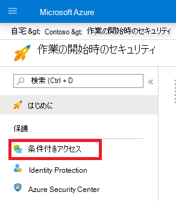

# ユーザーの多要素認証Microsoft 365

パスワードは、コンピューターまたはオンライン サービスへのサインインを認証する最も一般的な方法ですが、最も脆弱な方法でもあります。 ユーザーは、簡単なパスワードを選択して、異なるコンピューターやサービスに対して同じパスワードを使用できます。

サインインに追加のレベルのセキュリティを提供するには、パスワードの両方を使用する多要素認証 (MFA) を使用する必要があります。これは強力である必要があります。また、次に基づく追加の検証方法を使用します。

- 容易に複製できないユーザーの所有物 (スマート フォンなど)。
- ユーザーに固有の生物学的特徴 (指紋、顔、または他の生体認証属性など)。

追加の検証方法は、ユーザーのパスワードが確認されるまで使用されません。 MFA では、強力なユーザー パスワードが侵害された場合でも、攻撃者がスマート フォンや指紋を持っていないため、サインインを完了できません。

## Microsoft 365 の MFA サポート

既定では、Microsoft 365 および Office 365 は、ユーザー アカウントに対する MFA を次の方法でサポートします。

- 電話に送信される、確認コードの入力に必要なテキスト メッセージ。
- 電話呼び出し。
- Microsoft Authenticator スマート フォン アプリ。

どちらの場合も、MFA サインインでは、追加の検証に "重複しがちではない" メソッドを使用しています。 Microsoft 365 および Office 365 の MFA は、次の複数の方法で有効にできます。

- セキュリティの既定値を使用する
- 条件付きアクセス ポリシーを使用する
- 個別のユーザー アカウントごとに設定する (推奨されません)

これらの方法は、ご利用の Microsoft 365 プランに応じて決まります。

|計画|推奨事項|お客様の種類|
|---|---|---|
|すべての Microsoft 365 プラン|すべてのユーザー アカウントに対して MFA を要求する、セキュリティの既定値を使用します。 
 個々のユーザー アカウントでユーザーごとの MFA を構成することもできますが、これはお勧めしません。|小規模企業|
|Microsoft 365 Business Premium 
 Microsoft 365 E3 
 Azure Active Directory (Azure AD) Premium P1 ライセンス|条件付きアクセス ポリシーを使用して、グループ メンバーシップ、アプリ、その他の条件に基づいてユーザー アカウントに MFA を要求します。|小規模企業から大規模企業まで|
|Microsoft 365 E5 
 Azure AD Premium P2|Azure AD Identity Protection を使用して、サインイン リスクの条件に基づいて MFA を要求します。|大規模企業|
||||

### セキュリティの既定値

セキュリティの既定値は、2019 年 10 月 21 日以降に作成された Microsoft 365 および Office 365 の有料または試用版サブスクリプションの新機能です。 これらのサブスクリプションでは、次のセキュリティの既定値が有効になっています。

- すべてのユーザーが Microsoft Authenticator アプリで MFA を使用する必要があります。
- 従来の認証をブロックします。

ユーザーは、スマートフォンから Microsoft Authenticator アプリを使用して MFA に 14 日間登録できます。これは、セキュリティの既定値が有効になった後、初めてサインインしたときから始まります。 14 日が経過すると、ユーザーは MFA 登録が完了するまでサインインできなくなります。

セキュリティの既定値では、すべての組織が、既定で有効になっているユーザー サインインの基本レベルのセキュリティを確保しています。 条件付きアクセス ポリシーを使用する MFA を優先して、セキュリティの既定値を無効にすることができます。

Azure ポータル内の Azure AD の **プロパティ** ウィンドウで、セキュリティの既定値を有効または無効にします。

![[ディレクトリのプロパティ] ページの図。](../../media/multi-factor-authentication-microsoft-365/security-defaults-mfa.png)

すべての Microsoft 365 プランで、セキュリティの既定値を使用できます。

詳細については、こちらの「[セキュリティの既定値の概要](/azure/active-directory/fundamentals/concept-fundamentals-security-defaults)」をご覧ください。

### 条件付きアクセス ポリシー

条件付きアクセス ポリシーは、サインインが評価および許可される条件を指定する一連のルールです。 たとえば、次のような条件付きアクセス ポリシーを作成できます。

- ユーザー アカウント名が Exchange、ユーザー、パスワード、セキュリティ、SharePoint、またはグローバル管理者の役割を割り当てられたユーザーのグループのメンバーである場合、アクセスを許可する前に MFA が必要です。

このポリシーを使用すると、これらの管理者の役割から割り当てられたり、または割り当てられなかったりした場合に、個別のユーザー アカウントを MFA 用に構成しようとするのではなく、グループ メンバーシップに基づいて MFA を要求することができるようになります。

また、条件付きアクセス ポリシーを使用して、特定のアプリに対して MFA を要求する、または Windows 10 を実行しているノート PC などの準拠デバイスからのサインインを要求するなど、より高度な機能を使用することもできます。

Azure ポータル内の Azure AD の **セキュリティ** ウィンドウで、条件付きアクセス ポリシーを構成します。

条件付きアクセス ポリシーは、次のプランで使用できます。

- Microsoft 365 Business Premium
- Microsoft 365 E3 および E5
- Azure AD Premium P1、Azure AD Premium P2 ライセンス

Microsoft 365 Business Premium を使用している小規模企業の場合、次の手順で、条件付きアクセス ポリシーを簡単に使用できます。

1. MFA を必要とするユーザー アカウントを含むグループを作成します。
2. **グローバル管理者に対して MFA を要求する** ポリシーを有効にします。
3. 次の設定を使用して、グループ ベースの条件付きアクセス ポリシーを作成します
    - 割り当て > ユーザーとグループ: 上記の手順 1 で作成したグループの名前。
    - 割り当て > クラウド アプリまたは操作: すべてのクラウド アプリ。
    - アクセス制御 > 許可 > アクセス権の付与 > 多要素認証を要求する。
4. ポリシーを有効にします。
5. 上記の手順 1 で作成したグループにユーザー アカウントを追加してテストします。
6. 追加のユーザー アカウントに MFA を要求するには、手順 1 で作成したグループに追加します。

この条件付きアクセス ポリシーを使用すると、お客様のペースでユーザーに MFA の要件を展開できます。

大規模企業は、[一般的な条件付きアクセス ポリシー](/azure/active-directory/conditional-access/concept-conditional-access-policy-common)を使用して、次のポリシーを構成する必要があります。

- [管理者に対して MFA を要求する](/azure/active-directory/conditional-access/howto-conditional-access-policy-admin-mfa)
- [すべてのユーザーに対して MFA を要求する](/azure/active-directory/conditional-access/howto-conditional-access-policy-all-users-mfa)
- [従来の認証をブロックする](/azure/active-directory/conditional-access/howto-conditional-access-policy-block-legacy)

詳細については、こちらの[条件付きアクセスの概要](/azure/active-directory/conditional-access/overview)をご覧ください。

### Azure AD Identity Protection

Azure AD Identity Protection を使用すると、追加の条件付きアクセス ポリシーを作成して、[サインインのリスクが中以上のとき MFA を要求する](../../security/office-365-security/identity-access-policies.md#require-mfa-based-on-sign-in-risk)ことができます。

Azure AD Identity Protection とリスク ベースの条件付きアクセス ポリシーは、次のプランで使用できます。

- Microsoft 365 E5
- Azure AD Premium P2

詳細については、こちらの [Azure AD Identity Protection の概要](/azure/active-directory/identity-protection/overview-identity-protection)をご覧ください。

### 従来のユーザーごとの MFA (推奨されません)

ユーザー アカウントのサインインに MFA を要求するには、セキュリティの既定値または条件付きアクセス ポリシーを使用する必要があります。これらのいずれも使用できない場合は、あらゆるサイズのサブスクリプションについて、管理者ロール、特にグローバル管理者ロールを持つユーザー アカウントに対する MFA を強く推奨します。

ユーザー アカウントごとに MFA を有効にするには、ユーザー アカウント <a href="https://go.microsoft.com/fwlink/p/?linkid=834822" target="_blank">**の [**</a>アクティブなユーザー] ウィンドウMicrosoft 365 管理センター。

![[アクティブ ユーザー] ページの [多要素認証の画像] オプション。](../../media/multi-factor-authentication-microsoft-365/per-user-mfa.png)

有効にすると、ユーザーが次回サインインしたときに、MFA に登録し、追加の確認方法を選択してテストするように求められます。

### これらの方法を組み合わせて使用する

この表は、セキュリティの既定値、条件付きアクセス ポリシー、およびユーザーごとのアカウント設定で MFA を有効にした結果を示しています。

|*アイテム*|Enabled|無効|第 2 の認証方法|
|---|---|---|---|
|**セキュリティの既定値**|条件付きアクセス ポリシーを使用できない|条件付きアクセス ポリシーを使用できる|Microsoft Authenticator アプリ|
|**条件付きアクセス ポリシー**|有効になっている場合は、セキュリティの既定値を有効にできません|すべてが無効になっている場合は、セキュリティの既定値を有効にすることができます|MFA 登録中にユーザーが指定|
|**従来のユーザーごとの MFA (推奨されません)**|毎回のサインインで MFA を要求して、セキュリティの既定値と条件付きアクセス ポリシーを上書きします|セキュリティの既定値と条件付きアクセス ポリシーによって上書きされます|MFA 登録中にユーザーが指定|
||||

セキュリティの既定値が有効になっている場合、すべての新しいユーザーは、次回のサインイン時に MFA 登録と Microsoft Authenticator アプリの使用を求められます。

## MFA 設定を管理する方法

以下の 2 種類の方法で MFA 設定を管理できます。

Azure ポータルでは、次のことができます。

- セキュリティの既定値を有効または無効にする
- 条件付きアクセス ポリシーを構成する

[ユーザー Microsoft 365 管理センター、ユーザーごとの MFA 設定とサービス MFA 設定<a href="https://go.microsoft.com/fwlink/p/?linkid=2169174" target="_blank">を構成できます</a>。

## 次の手順

[Microsoft 365 の MFA を設定する](set-up-multi-factor-authentication.md)

## 関連コンテンツ

[多要素認証をオンにする](../../business-video/turn-on-mfa.md) (ビデオ)\
[スマートフォンの多要素認証をオンにする](../../business-video/set-up-mfa.md) (ビデオ)