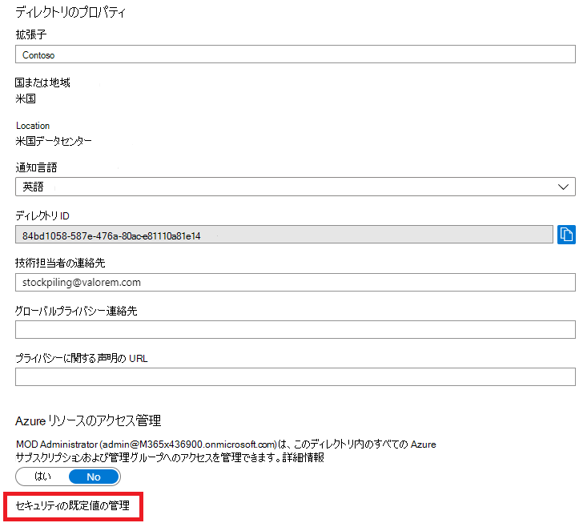

# Microsoft 365 の多要素認証Multi-factor authentication for Microsoft 365

パスワードは、コンピューターまたはオンラインサービスへのサインインを認証する最も一般的な方法ですが、最も脆弱なものでもあります。Passwords are the most common method of authenticating a sign-in to a computer or online service, but they are also the most vulnerable. ユーザーは、簡単なパスワードを選択したり、複数のサインインに同じパスワードを使用して異なるコンピュータやサービスに対して使用したりすることができます。People can choose easy passwords and use the same passwords for multiple sign-ins to different computers and services.

サインインのセキュリティレベルを追加するには、多要素認証 (MFA) を使用する必要があります。これには、パスワード (強力なものにする必要があります) と、次のものに基づく追加の検証方法を使用する必要があります。To provide an additional level of security for sign-ins, you must use multi-factor authentication (MFA), which uses both a password, which should be strong, and an additional verification method based on:

- スマートフォンなどの、簡単には再現できないものがあります。Something you have with you that is not easily duplicated, such as a smart phone.
- 個人で biologically したもの、指紋、顔、その他のバイオメトリクス属性など。Something you uniquely and biologically have, such as your fingerprints, face, or other biometric attribute.

追加の認証方法は、ユーザーのパスワードが確認されるまで使用されません。The additional verification method is not employed until after the user’s password has been verified. MFA では、強力なユーザーパスワードが侵害された場合でも、攻撃者はスマートフォンや指紋を持ってサインインを完了できません。With MFA, even if a strong user password is compromised, the attacker does not have your smart phone or your fingerprint to complete the sign-in.

## Microsoft 365 での MFA サポートMFA support in Microsoft 365
既定では、Microsoft 365 と Office 365 はどちらも、次のものを使用するユーザーアカウントに対して MFA をサポートしています。By default, both Microsoft 365 and Office 365 support MFA for user accounts using:

- ユーザーが確認コードを入力する必要がある、電話に送信されるテキストメッセージ。A text message sent to a phone that requires the user to type a verification code.
- 通話。A phone call.
- Microsoft Authenticator スマートフォンアプリ。The Microsoft Authenticator smart phone app.

いずれの場合も、MFA サインインは、追加の確認のための "簡単には複製されていないものがあります" という方法を使用しています。In both cases, the MFA sign-in is using the “something you have with you that is not easily duplicated” method for the additional verification.
Microsoft 365 および Office 365 で MFA を有効にするには、複数の方法があります。There are multiple ways in which you can enable MFA for Microsoft 365 and Office 365:

- セキュリティの既定値With security defaults
- 条件付きアクセスポリシーを使用するWith Conditional Access policies
- 個別のユーザーアカウントごと (推奨されません)For each individual user account (not recommended)

これらの方法は、Microsoft 365 プランに基づいています。These ways are based on your Microsoft 365 plan.
    
|プランPlan  |推奨事項Recommendation  | 顧客の種類Type of customer |
|---------|---------|----------|
| すべての Microsoft 365 プランAll Microsoft 365 plans | セキュリティの既定値を使用します。これには、すべてのユーザーアカウントに対して MFA が必要です。Use security defaults, which require MFA for all user accounts.   ユーザーごとのアカウントごとに MFA を要求することもできますが、この方法はお勧めしません。You can also require MFA on a per-user account basis, but this is not recommended. | Small BusinessSmall business |
| Microsoft 365 Business PremiumMicrosoft 365 Business Premium    Microsoft 365 E3Microsoft 365 E3    Azure Active Directory (Azure AD) プレミアム P1 ライセンスAzure Active Directory (Azure AD) Premium P1 licenses | 条件付きアクセスポリシーを使用して、グループメンバーシップ、アプリ、またはその他の条件に基づいてユーザーアカウントに MFA を要求します。Use Conditional Access policies to require MFA for user accounts based on group membership, apps, or other criteria. | 小規模企業からエンタープライズへSmall business to enterprise |
| Microsoft 365 E5Microsoft 365 E5    Azure AD Premium P2 ライセンスAzure AD Premium P2 licenses | Azure AD Identity Protection を使用して、サインインリスク基準に基づいて MFA を要求します。Use Azure AD Identity Protection to require MFA based on sign-in risk criteria. |  EnterpriseEnterprise |
||||

### セキュリティの既定値Security defaults

セキュリティの既定値は、2019 年 10 月 21 日以降に作成された Microsoft 365 および Office 365 の有料または試用版サブスクリプションの新機能です。Security defaults is a new feature for Microsoft 365 and Office 365 paid or trial subscriptions created after October 21, 2019. これらのサブスクリプションのセキュリティの既定値は、次のとおりです。These subscriptions have security defaults turned on, which:

- すべてのユーザーに対して、Microsoft Authenticator アプリで MFA を使用することを要求します。Requires all of your users to use MFA with the Microsoft Authenticator app.
- 従来の認証をブロックします。Blocks legacy authentication.

ユーザーは、スマートフォンから Microsoft Authenticator アプリを使用して MFA に 14 日間登録できます。これは、セキュリティの既定値が有効になった後、初めてサインインしたときから始まります。Users have 14 days to register for MFA with the Microsoft Authenticator app from their smart phones, which begins from the first time they sign in after security defaults has been enabled. 14 日が経過すると、ユーザーは MFA 登録が完了するまでサインインできなくなります。After 14 days have passed, the user won't be able to sign in until MFA registration is completed.

セキュリティの既定値では、すべての組織が、既定で有効になっているユーザー サインインの基本レベルのセキュリティを確保しています。Security defaults ensure that all organizations have a basic level of security for user sign-in that is enabled by default. セキュリティの既定値を無効にして、条件付きアクセスポリシーを使用して MFA を優先させることができます。You can disable security defaults in favor of MFA with Conditional Access policies.

Azure ポータルの Azure AD の [**プロパティ**] ウィンドウで、セキュリティの既定値を有効または無効にします。You enable or disable security defaults from the **Properties** pane for Azure AD in the Azure portal.

Microsoft 365 プランでは、セキュリティの既定値を使用できます。You can use security defaults with any Microsoft 365 plan.

詳細については、こちらの「[セキュリティの既定値の概要](https://docs.microsoft.com/azure/active-directory/fundamentals/concept-fundamentals-security-defaults)」をご覧ください。For more information, see this [overview of security defaults](https://docs.microsoft.com/azure/active-directory/fundamentals/concept-fundamentals-security-defaults). 

### 条件付きアクセス ポリシーConditional Access policies

条件付きアクセス ポリシーは、サインインが評価および許可される条件を指定する一連のルールです。Conditional Access policies are a set of rules that specify the conditions under which sign-ins are evaluated and allowed. たとえば、次のような条件付きアクセス ポリシーを作成できます。For example, you can create a Conditional Access policy that states:

- ユーザーアカウント名が、Exchange、user、password、security、SharePoint、または全体管理者の役割を割り当てられているユーザーのグループのメンバーである場合は、アクセスを許可する前に MFA を必要とします。If the user account name is a member of a group for users that are assigned the Exchange, user, password, security, SharePoint, or global administrator roles, require MFA before allowing access.

このポリシーを使用すると、これらの管理者の役割に割り当てられるか、または割り当てが解除された場合に、MFA の個々のユーザーアカウントを構成しなくても、グループのメンバーシップに基づいて MFA を要求できます。This policy allows you to require MFA based on group membership, rather than trying to configure individual user accounts for MFA when they are assigned or unassigned from these administrator roles.

また、条件付きアクセスポリシーを使用して、特定のアプリに MFA を要求したり、準拠デバイス (Windows 10 を実行しているラップトップなど) からサインインしたりするなど、より高度な機能を提供することもできます。You can also use Conditional Access policies for more advanced capabilities, such as requiring MFA for specific apps or that the sign-in is done from a compliant device, such as your laptop running Windows 10.

Azure portal で Azure AD の [**セキュリティ**] ウィンドウから条件付きアクセスポリシーを構成します。You configure Conditional Access policies from the **Security** pane for Azure AD in the Azure portal.

条件付きアクセスポリシーは、次の方法で使用できます。You can use Conditional Access policies with:

- Microsoft 365 Business PremiumMicrosoft 365 Business Premium
- Microsoft 365 E3 および E5Microsoft 365 E3 and E5
- Azure AD Premium P1 と Azure AD プレミアム P2 ライセンスAzure AD Premium P1 and Azure AD Premium P2 licenses 

Microsoft 365 Business Premium を使用する小規模な企業では、次の手順を使用して、条件付きアクセスポリシーを簡単に使用できます。For small businesses with Microsoft 365 Business Premium, you can easily use Conditional Access policies with the following steps:

1. MFA を必要とするユーザーアカウントを含むグループを作成します。Create a group to contain the user accounts that require MFA.
2. [**グローバル管理者の MFA を必要と**する] ポリシーを有効にします。Enable the **Require MFA for global admins** policy.
3. 次の設定を使用して、グループベースの条件付きアクセスポリシーを作成します。Create a group-based Conditional Access policy with these settings:
    - ユーザーおよびグループ > の割り当て: 上記の手順1でグループの名前を指定します。Assignments > Users and groups: The name of your group from Step 1 above.
    - クラウドアプリまたはアクション > の割り当て: すべてのクラウドアプリ。Assignments > Cloud apps or actions: All cloud apps.
    - アクセス権の付与には、多要素認証を必要と > アクセス許可 > 付与する > を制御します。Access controls > Grant > Grant access > Require multi-factor authentication.
4. ポリシーを有効にします。Enable the policy.
5. 上記の手順1で作成したグループにユーザーアカウントを追加してテストします。Add a user account to the group created in Step 1 above and test.
6. 追加のユーザーアカウントに MFA を要求するには、手順1で作成したグループに MFA を追加します。To require MFA for additional user accounts, add them to the group created in Step 1.

この条件付きアクセスポリシーを使用すると、ユーザーに対して MFA の要件を自分のペースでロールアウトできます。This Conditional Access policy allows you to roll out the MFA requirement to your users at your own pace.

企業では、次のポリシーを構成するために、[一般的な条件付きアクセスポリシー](https://docs.microsoft.com/azure/active-directory/conditional-access/concept-conditional-access-policy-common)を使用する必要があります。Enterprises should use [Common Conditional Access policies](https://docs.microsoft.com/azure/active-directory/conditional-access/concept-conditional-access-policy-common) to configure the following policies:

- [管理者に MFA を要求するRequire MFA for administrators](https://docs.microsoft.com/azure/active-directory/conditional-access/howto-conditional-access-policy-admin-mfa)
- [すべてのユーザーに MFA を要求するRequire MFA for all users](https://docs.microsoft.com/azure/active-directory/conditional-access/howto-conditional-access-policy-all-users-mfa)
- [従来の認証をブロックするBlock legacy authentication](https://docs.microsoft.com/azure/active-directory/conditional-access/howto-conditional-access-policy-block-legacy)

詳細については、「[条件付きアクセスの概要](https://docs.microsoft.com/azure/active-directory/conditional-access/overview)」をご覧ください。For more information, see this [overview of Conditional Access](https://docs.microsoft.com/azure/active-directory/conditional-access/overview).

### Azure AD Identity ProtectionAzure AD Identity Protection

Azure AD Identity Protection を使用すると、[サインインリスクが中または高の場合に、MFA を必要と](https://docs.microsoft.com/microsoft-365/enterprise/identity-access-policies#require-mfa-based-on-sign-in-risk)する追加の条件付きアクセスポリシーを作成できます。With Azure AD Identity Protection, you can create an additional Conditional Access policy to [require MFA when sign-in risk is medium or high](https://docs.microsoft.com/microsoft-365/enterprise/identity-access-policies#require-mfa-based-on-sign-in-risk).

Azure AD Id 保護とリスクベースの条件付きアクセスポリシーは、次の方法で使用できます。You can use Azure AD Identity Protection and risk-based Conditional Access policies with:

- Microsoft 365 E5Microsoft 365 E5
- Azure AD Premium P2 ライセンスAzure AD Premium P2 licenses

詳細については、この「[Azure AD Identity Protection の概要](https://docs.microsoft.com/azure/active-directory/identity-protection/overview-identity-protection)」をご覧ください。For more information, see this [overview of Azure AD Identity Protection](https://docs.microsoft.com/azure/active-directory/identity-protection/overview-identity-protection).

### 個別のユーザーアカウントの MFA (推奨されません)MFA for an individual user account (not recommended)

ユーザーアカウントのサインインに MFA を必要とするには、セキュリティの既定値または条件付きアクセスポリシーを使用する必要があります。ただし、これらのいずれかを使用できない場合は、管理者の役割、特に全体管理者の役割を持つユーザーアカウントに対して、任意のサイズのサブスクリプションに対して MFA を強くお勧めします。You should be using either security defaults or Conditional Access policies to require MFA for your user account sign-ins. However, if either of these cannot be used, Microsoft strongly recommends MFA for user accounts that have administrator roles, especially the global administrator role, for any size subscription. 

Microsoft 365 管理センターの**アクティブなユーザー**ウィンドウから、個々のユーザーアカウントに対して MFA を有効にします。You enable MFA for individual user accounts from the **Active user** pane of the Microsoft 365 admin center.

有効にすると、ユーザーが次回サインインしたときに、MFA を登録し、追加の検証方法を選択してテストするように求めるメッセージが表示されます。After being enabled, the next time the user signs in, they will be prompted to register for MFA and to choose and test the additional verification method.

### これらの方法を一緒に使用するUsing these methods together

この表は、セキュリティの既定値、条件付きアクセス ポリシー、およびユーザーごとのアカウント設定で MFA を有効にした結果を示しています。This table shows the results of enabling MFA with security defaults, Conditional Access policies, and per-user account settings.

|| EnabledEnabled | 無効Disabled | 第 2 の認証方法Secondary authentication method |
|:-------|:-----|:-------|:-------|
| **セキュリティの既定値****Security defaults** | 条件付きアクセス ポリシーを使用できないCan’t use Conditional Access policies |   条件付きアクセス ポリシーを使用できるCan use Conditional Access policies | Microsoft Authenticator アプリMicrosoft Authenticator app |
| **条件付きアクセス ポリシー****Conditional Access policies** |いずれかが有効になっている場合、セキュリティの既定値を有効にすることはできませんIf any are enabled, you can’t enable security defaults | すべての設定が無効になっている場合は、セキュリティの既定値を有効にできます。If all are disabled, you can enable security defaults | MFA への登録時にユーザー指定User-specified during MFA registration |
| **ユーザーごとのアカウントの設定 (推奨されません)****Per-user account setting (not recommended)** | 各サインインで MFA を必要とするセキュリティの既定値と条件付きアクセスポリシーを上書きします。Overrides security defaults and Conditional Access policies requiring MFA at each sign in | セキュリティの既定値と条件付きアクセスポリシーによって上書きされます。Overridden by security defaults and Conditional Access policies | MFA への登録時にユーザー指定User-specified during MFA registration|
||||

セキュリティの既定値が有効になっている場合は、すべての新規ユーザーが MFA 登録を求め、次のサインイン時に Microsoft Authenticator アプリを使用するように求められます。If security defaults are enabled, all new users are prompted for MFA registration and the use of the Microsoft Authenticator app at their next sign-in.

## MFA 設定を管理する方法Ways to manage MFA settings

MFA の設定を管理する方法は2つあります。There are two ways to manage MFA settings.

Azure portal では、次のことを行うことができます。In the Azure portal, you can:

- セキュリティの既定値を有効または無効にするEnable and disable security defaults
- 条件付きアクセスポリシーを構成するConfigure Conditional Access policies

Microsoft 365 管理センターでは、ユーザー単位およびサービスの MFA 設定を構成できます。In the Microsoft 365 admin center, you can configure per-user and service MFA settings.

## 次の手順Your next step

[Microsoft 365 の MFA をセットアップするSet up MFA for Microsoft 365](set-up-multi-factor-authentication.md)

