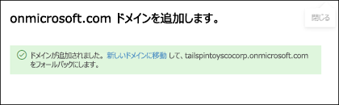
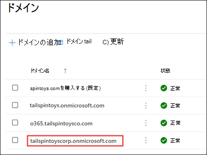
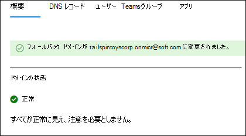

# Microsoft 365で onmicrosoft.com フォールバック ドメインを追加して置き換える

Microsoft 365にサインアップすると、Microsoft は *onmicrosoft.com* ドメイン (**フォールバック ドメイン**) を提供します。ドメインを所有していない場合や、Microsoft 365に接続したくない場合 (tailspintoys.onmicrosoft.com など)。 フォールバック ドメインは、次の場合に既定で使用されます。

- ユーザー名と電子メール アドレス
- Microsoft 365 teams & グループの電子メールエイリアス
- ドメインの依存関係の自動移動

これは、Microsoft 365環境の既定の電子メール ルーティング アドレスとして機能します。 ユーザーがメールボックスを使用して設定されると、電子メールはフォールバック ドメインにルーティングされます。  カスタム ドメイン (tailspintoys.com など) が使用されている場合でも、そのカスタム ドメインがMicrosoft 365環境から削除された場合、フォールバック ドメインによってユーザーの電子メールが正常にルーティングされます。

フォールバック ドメインは、Microsoft 365 管理センターで変更できます。 フォールバック ドメインを変更する一般的な理由は次のとおりです。

- Microsoft 365に初めてサインアップしたときに使用する会社名がわからない。 会社名がわかったので、ユーザーに適切なログイン アカウント名を設定する必要があります。 
- 新しいサイトを作成するときに、SharePoint URL がどのように表示されるかを変更したいと考えています。 Microsoft 365環境のSharePoint URL は、フォールバック ドメイン名に基づいて作成されます。 初めてサインアップしたときに正しい会社名を使用しなかった場合、サイトのSharePoint URL は、新しいSharePoint サイトを作成するときに引き続きその名前を使用します。 

追加の onmicrosoft.com ドメインを追加できますが、フォールバック ドメインとして使用できる onmicrosoft.com ドメインは 1 つだけです。 この記事の手順では、次の方法について説明します。
- 新しい onmicrosoft.com ドメインを作成する
- フォールバック ドメインとして割り当てる

> [!NOTE]
> Microsoft 365環境では、合計で 5 つの onmicrosoft.com ドメインが制限されています。 一度追加されると、削除できません。 
  
## はじめに

ドメインを追加、変更、または削除するには、**ドメイン名管理者** であるか、[ビジネスまたはエンタープライズ プラン](https://products.office.com/business/office)の **グローバル管理者** である **必要があり** ます。これらの変更はテナント全体に影響します。*カスタマイズ管理者* または *正規ユーザー* は、これらの変更を行うことができません。

## 新しい onmicrosoft.com ドメインを追加する

1. Microsoft 365 管理センターで **[設定**] を選択し、[**ドメイン**] を選択します。
2. onmicrosoft.com の既定のドメインを選択します。

    ![[ドメイン] ページ。](../../media/onmicrosoft-domains.png)
  
3. [ドメインのプロパティ] ページの [ **このドメイン** について] セクションで、[ **Add onmicrosoft domain] (onmicrosoft ドメインの追加**) を選択します。

    ![この [ドメイン] ページについて。](../../media/add-onmicrosoft-domain-link.png)

4. [ **Add onmicrosoft domain** ] ページの [ **ドメイン名** ] ボックスに、新しい onmicrosoft.com ドメインの名前を入力します。 

    ![[Add onmicrosoft domain]\(onmicrosoft ドメインの追加\) ページのスクリーンショット。](../../media/add-an-onmicrosoftcom-domain-page.png)

    > [!NOTE]
    > 入力したドメイン名のスペルと正確性を確認してください。 ドメインは 5 つの onmicrosoft.com に制限されており、現在は作成後は削除できません。     

5. [**ドメインの追加**] を選択します。 正常に追加されると、これを示すメッセージが表示されます。 
    
    

## 新しい onmicrosoft.com ドメインをフォールバック ドメインにする

> [!NOTE]
> フォールバック ドメインを新しい onmicrosoft.com ドメインに変更する前に、onmicrosoft.com SharePoint ドメインの変更を検討してください。 追加の onmicrosoft ドメインを作成し、フォールバック ドメインとして使用しても、SharePoint Online の名前は変更されません。 既存のSharePointとOneDrive URL は変わりません。  ドメイン[名の変更プレビュー](/sharepoint/change-your-sharepoint-domain-name) (現在、1,000 サイト未満のテナントで利用可能) SharePoint で提供されている PowerShell の手順を使用して、.onmicrosoft SharePoint ドメインを変更できます。

新しい onmicrosoft.com ドメインを作成したら、次の手順に従ってフォールバック ドメインに変更します。

1. Microsoft 365 管理センターで **[設定**] を選択し、[**ドメイン**] を選択します。 

2. 作成した新しい onmicrosoft.com ドメインを選択します。

     

3. ドメインのプロパティ ページで、[ **フォールバック ドメインの作成**] を選択します。
 
     

4. フォールバック ドメインが新しいドメインに変更されたことを示すメッセージがページに表示されます。

     

## 関連コンテンツ

[ドメインの FAQ](domains-faq.yml) (記事) 
[ドメインとは](../get-help-with-domains/what-is-a-domain.md) (記事) 
[Microsoft 365 でドメイン名を購入する](../get-help-with-domains/buy-a-domain-name.md) (記事) 
[DNS レコードを追加して自分のドメインを接続する](../get-help-with-domains/create-dns-records-at-any-dns-hosting-provider.md) (記事) 
[任意のドメイン レジストラーで Microsoft 365 をセットアップするためにネームサーバーを変更する](../get-help-with-domains/change-nameservers-at-any-domain-registrar.md) (記事)
