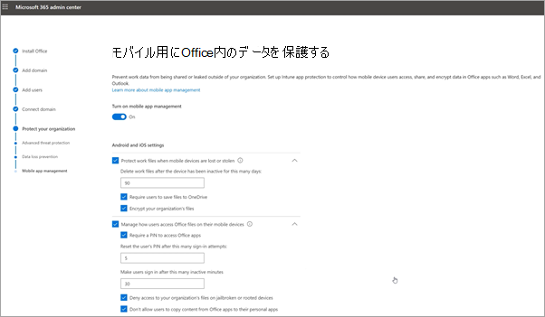

# セットアップ ウィザードでMicrosoft 365 Business Premiumを設定する

## ウォッチ: Microsoft 365セットアップの概要

Microsoft 365 Business Premiumセットアップの概要については、このビデオをご覧ください。  

> [!VIDEO https://www.microsoft.com/videoplayer/embed/RE4jZwg] 

## ウォッチ: Microsoft 365 Business Premiumを設定する

> [!VIDEO https://www.microsoft.com/videoplayer/embed/RE471FJ?autoplay=false]

1. <a href="https://go.microsoft.com/fwlink/p/?linkid=2024339" target="_blank">Microsoft 365 管理センター</a>にサインインし、[**セットアップに移動**] を選択します。 セットアップ ウィザードが起動します。
1. セットアップが完了したら、Microsoft 管理センターに戻ります。 管理センターでは、[**セットアップ]** ページで、Windows 10 ポリシー、DLP などの機能の設定を続行できます。

## ドメイン、ユーザー、ポリシーの設定を追加する

Microsoft 365 Business Premiumを購入する場合は、自分が所有するドメインを使用するか、[サインアップ](../admin-overview/sign-up-for-office-365.md)中にドメインを購入するかのオプションがあります。

- サインアップ時に新しいドメインを購入した場合、お客様のドメインはすべてセットアップされており、[[ユーザーを追加してライセンスを割り当てる](#add-users-and-assign-licenses)] に移動することができます。

### ドメインを追加してサインインをカスタマイズする

1. グローバル管理者の資格情報を使用して、[Microsoft 365 管理センター](https://admin.microsoft.com)にサインインします。 

2. [**セットアップに移動**] を選択して、ウィザードを開始します。

    ![[セットアップに移動] を選択します。](../../media/gotosetupinadmincenter.png)

3. [**Office アプリのインストール**] ページでは、オプションで自分のコンピューターにアプリをインストールすることができます。
    
4. **ドメインの追加** ステップで、使用するドメイン名 (Contoso.com など) を入力します。

    > [!IMPORTANT]
    > サインアップ時にドメインを購入した場合、ここでは **ドメインの追加** ステップは表示されません。[ユーザーの追加](#add-users-and-assign-licenses) に進んでください。

    ![[サインインのカスタマイズ] ページのスクリーンショット。](../../media/adddomain.png)

    
4. ウィザードの手順に従って、ドメインを所有していることを確認する[Microsoft 365の DNS ホスティング プロバイダーで DNS レコードを作成](/office365/admin/get-help-with-domains/create-dns-records-at-any-dns-hosting-provider)します。 ドメイン ホストがわかっている場合は、「[Microsoft 365 にドメインを追加する](/microsoft-365/admin/setup/add-domain)」も参照してください。

    ご利用のホスティング プロバイダーが GoDaddy または [Domain Connect](/office365/admin/get-help-with-domains/domain-connect) を有効にした別のホストである場合、プロセスは簡単です。サインインし、お客様に代わって Microsoft が認証するよう自動的に求められます。

    ![GoDaddy の [Confirm Access] (アクセスの確認) ページで、[承認] を選択します。](../../media/godaddyauth.png)

### ユーザーを追加してライセンスを割り当てる

ウィザードでユーザーを追加することもできますが、管理センターで[後からユーザーを追加](../add-users/add-users.md)することもできます。 さらに、ローカル ドメイン コントローラーを持っている場合には、[Azure AD Connect](/azure/active-directory/hybrid/how-to-connect-install-express) を使用してユーザーを追加することもできます。

#### ウィザードでユーザーを追加する

ウィザードに追加するすべてのユーザーには、Microsoft 365 Business Premium ライセンスが自動的に割り当てられます。

![ウィザードの [新しいユーザーの追加] ページのスクリーンショット。](../../media/addnewuserspage.png)

1. Microsoft 365 Business Premium サブスクリプションに既存のユーザーが存在する場合 (たとえば、Azure AD Connectを使用した場合)、ライセンスを割り当てるオプションが表示されます。 続行して、これらのユーザーにもライセンスを追加します。

2. ユーザーを追加した後、資格証明書をそれらの新規ユーザーに共有するオプションが提供されます。それらをプリントアウトや電子メールで通知、またはダウンロードすることができます。

### ドメインを接続する

> [!NOTE]
> .onmicrosoft ドメインの使用を選択した場合、またはユーザーの設定に Azure AD Connect を使用した場合、このステップは表示されません。
  
サービスを設定するには、DNS ホストまたはドメイン レジストラーにあるレコードを更新する必要があります。
  
1. セットアップ ウィザードでは通常、ユーザーのレジストラーが検出され、レジストラーの Web サイトで NS レコードを更新するための詳しい操作手順へのリンクが表示されます。 そうでない場合は、[ドメイン レジストラーでMicrosoft 365を設定するようにネームサーバーを変更します](../get-help-with-domains/change-nameservers-at-any-domain-registrar.md)。 

    - 既存の DNS レコード (たとえば、既存の Web サイト) を持っているのに、DNS ホストが [Domain Connect](/office365/admin/get-help-with-domains/domain-connect) に対して有効になっている場合には、[**レコードを追加してもらう**] を選択します。 [**オンライン サービスの選択**] ページで、すべて規定値のまま [**次へ**] を選択し、DNS ホストのページで [**承認**] を選択します。
    - 他の DNS ホストとの間に既存の DNS レコードがある場合 (Domain Connect では有効になっていません)、既存のサービスが接続されたままになっていることを確認するために、自分の DNS レコードを管理したいと思うかもしれません。詳しくは [ドメインの基礎](/office365/admin/get-help-with-domains/dns-basics) を参照してください。

        ![[レコードのアクティブ化] ページ。](../../media/activaterecords.png)

2. ウィザードの手順に従えば、メールやその他のサービスが設定されます。

### 組織を保護する 

ウィザードで設定したポリシーは、*すべてのユーザー* という [セキュリティ グループ](/office365/admin/create-groups/compare-groups#security-groups)に自動的に適用されます。 管理センターでポリシーを割り当てる追加のグループを作成することもできます。

1. **高度なサイバー脅威からの保護を強化** する場合は、既定を受け入れて、[Office 365 Advance Threat Protection がOffice](../../security/office-365-security/defender-for-office-365.md) アプリ内のファイルとリンクをスキャンできるようにすることをお勧めします。

    ![[保護の強化] ページのスクリーンショット。](../../media/increasetreatprotection.png)

2. [**機密データの漏えいを防ぐ**] ページで、既定の設定をそのまま使用して、Microsoft Purview データ損失防止を有効にして、Office アプリで機密データを追跡し、組織外でこれらのデータが誤って共有されないようにします。

3. [**モバイル向けのOfficeのデータの保護**] ページで、モバイル アプリの管理をオンのままにし、設定を展開して確認してから、[**モバイル アプリ管理ポリシーの作成**] を選択します。

    

## Windows 10 PC をセキュリティで保護する

左側のナビゲーションで **[セットアップ]** を選択し、[**サインインとセキュリティ] で** [**Windows 10 コンピューターのセキュリティ保護**] を選択します。 [ **表示]** を選択して作業を開始します。 詳細な手順については、「[Windows 10 コンピューターをセキュリティで保護](secure-win-10-pcs.md)する」を参照してください。

## クライアント アプリOffice 365展開する

セットアップ中にOffice アプリを自動的にインストールすることを選択した場合、ユーザーがWindows デバイスからAzure ADにサインインすると、アプリはWindows 10 デバイスにインストールされます。アプリは、作業資格情報を使用します。

モバイル iOS または Android デバイスにOfficeをインストールするには、「[Microsoft 365 Business Premium ユーザー向けのモバイル デバイスのセットアップ](set-up-mobile-devices.md)」を参照してください。

Officeを個別にインストールすることもできます。 手順については、「[PC または Mac にOfficeをインストール](https://support.microsoft.com/office/4414eaaf-0478-48be-9c42-23adc4716658)する」を参照してください。

## 関連コンテンツ

[一般法人向け Microsoft 365 のトレーニング ビデオ](../../business-video/index.yml) (リンク ページ)
