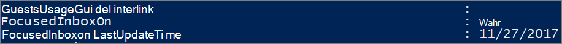

# <a name="configure-focused-inbox-for-everyone-in-your-organization"></a>組織内のすべてのユーザー用に優先受信トレイを構成する

職場のすべてのユーザー用にメールの動作を構成する必要がある場合は、この記事が役立ちます。 ここでは、業務向けにカスタマイズする方法や無効にする方法について説明しており、[よく寄せられる質問](#faq-for-focused-inbox)に回答しています。

自分に対してだけ優先受信トレイを無効にする場合は、「[優先受信トレイを無効にする](https://support.microsoft.com/office/f714d94d-9e63-4217-9ccb-6cb2986aa1b2)」を参照してください。  

ユーザーが業務上の特定のメール メッセージ (たとえば、HR や給与に関するもの) を受信したことを確認する必要がある場合、優先受信トレイを構成して、これらのメッセージを優先ビューに表示することができます。また、組織のユーザーにメールボックスの優先受信トレイを表示するかどうかを制御することもできます。
  
## <a name="turn-focused-inbox-on-or-off-in-your-organization"></a>組織で優先受信トレイの有効/無効を切り替える

組織のすべてのユーザーに対して優先受信トレイの有効/無効を切り替えるには、PowerShell を使用します。 この操作を Microsoft 365 管理センターで行う場合は、 エンジニアリング チームにお知らせください。 **[ここで投票してください。](https://go.microsoft.com/fwlink/?linkid=862489)**
  
**優先受信トレイを無効にする**
  
以下の PowerShell の例では、組織で優先受信トレイを **無効** にします。ただし、ユーザーが機能を使えなくなることはありません。必要な場合は、引き続き、各クライアントでもう一度優先受信トレイを有効にすることができます。 
  
1. [リモート PowerShell で Exchange Online に接続する](/powershell/exchange/connect-to-exchange-online-powershell)。

2. この手順を実行する前にアクセス許可が割り当てられている必要があります。必要なアクセス許可を確認するには、「[メッセージング ポリシーとコンプライアンスのアクセス許可](/exchange/messaging-policy-and-compliance-permissions-exchange-2013-help)」の項目「トランスポート ルール」を参照してください。

3. 
            **Get-OrganizationConfig** コマンドレットを実行します。 

    ```powershell
    Get-OrganizationConfig
    ```

4. **FocusedInboxOn** を探して、現在の設定を表示します。 

    
  
5. 次のコマンドレットを実行して、優先受信トレイを無効にします。

    ```powershell
    Set-OrganizationConfig -FocusedInboxOn $false
    ```

6. **Get-OrganizationConfig** コマンドレットをもう一度実行し、FocusedInboxOn が $false に設定されていることを確認します。これは、FocusedInbox がオフになったことを意味します。 

**優先受信トレイを有効にする**
  
- 上の手順 5 で、次のコマンドレットを実行して、優先受信トレイを有効にします。

  ```powershell
  Set-OrganizationConfig -FocusedInboxOn $true
  ```
    
## <a name="what-do-users-see-after-i-turn-on-focused-inbox"></a>優先受信トレイを有効にすると、ユーザーに何が表示されますか。 

ユーザーが Outlook を終了して再起動した後でのみ、優先ビューが表示されます。Outlook を再起動すると、Outlook ユーザー インターフェイスにヒントが表示され、新しい優先受信トレイを使用する選択肢がユーザーに提供されます。
  

  
低優先メールから優先受信トレイに切り替える場合は、その機能を有効にするか ("試してみる")、解除するかを決めることができます。複数の (サポートされている) クライアントを持つユーザーの場合は、各クライアント上で個別に優先受信トレイを有効/無効にすることができます。次のようなヒントが表示されます。
  

  
ユーザーが優先受信トレイの使用開始を決定すると、低優先メールは自動的に無効になります。低優先メール フォルダーが標準的なフォルダーに変換されると、ユーザーはそのフォルダーの名前の変更または削除を行えるようになります。
  
## <a name="turn-focused-inbox-on-or-off-for-specific-users"></a>特定のユーザーについて優先受信トレイの有効/無効を切り替える

この例では、Contoso 組織内の Tim Matthews に対して優先受信トレイを **無効** にします。 ただし、Tim が機能を使えなくなることはありません。 必要な場合は、引き続き、各クライアントでもう一度優先受信トレイを有効にすることができます。 
  
1. [リモート PowerShell で Exchange Online に接続する](/powershell/exchange/connect-to-exchange-online-powershell)。

2. この手順を実行する前にアクセス許可が割り当てられている必要があります。必要なアクセス許可を確認するには、トピック「メッセージング ポリシーとコンプライアンスのアクセス許可」の項目「トランスポート ルール」を参照してください。

3. **Get-FocusedInbox** コマンドレットを実行します。例を示します。 

    ```powershell
    Get-FocusedInbox -Identity <tim@contoso.com>
    ```

4. FocusedInboxOn を探して、現在の設定を表示します。

    
  
5. 次のコマンドレットを実行して、優先受信トレイを無効にします。

    ```powershell
    Set-FocusedInbox -Identity <tim@contoso.com> -FocusedInboxOn $false
    ```

    または、次のコマンドレットを実行して、優先受信トレイを有効にします。

    ```powershell
    Set-FocusedInbox -Identity <tim@contoso.com> -FocusedInboxOn $true
    ```

## <a name="use-the-ui-to-create-a-transport-rule-to-direct-email-messages-to-the-focused-view-for-all-your-users"></a>トランスポート ルールを作成する UI を使用して、すべてのユーザーの優先ビューにメール メッセージを直接表示する

1. <a href="https://go.microsoft.com/fwlink/p/?linkid=2059104" target="_blank">Exchange 管理センター</a>に移動します。

2. [**メール フロー**] \> [**ルール**] に移動します。 を選択し、[**新しいルールを作成する...**] を選択します。 

3. 新しいルールの作成後、[**保存**] を選択してルールを開始します。

    次の図は、"Payroll Department"(給与課) からのすべてのメッセージを優先受信トレイに配信する例を示しています。

    

    > [!NOTE]
    > この例のメッセージ ヘッダー値のテキストは、**X-MS-Exchange-Organization-BypassFocusedInbox** です。
  
## <a name="use-powershell-to-create-a-transport-rule-to-direct-email-messages-to-the-focused-view-for-all-your-users"></a>トランスポート ルールを作成する PowerShell を使用して、すべてのユーザーの優先ビューにメール メッセージを直接表示する

1. [リモート PowerShell で Exchange Online に接続する](/powershell/exchange/connect-to-exchange-online-powershell)。

2. この手順を実行する前にアクセス許可が割り当てられている必要があります。必要なアクセス許可を確認するには、「[メッセージング ポリシーとコンプライアンスのアクセス許可](/exchange/messaging-policy-and-compliance-permissions-exchange-2013-help)」の項目「トランスポート ルール」を参照してください。

3. たとえば、次のコマンドを実行すると、"Payroll Department"(給与課) からのすべてのメッセージを優先受信トレイに配信できます。

    ```powershell
    New-TransportRule -Name <name_of_the_rule> -From "Payroll Department" -SetHeaderName "X-MS-Exchange-Organization-BypassFocusedInbox" -SetHeaderValue "true"
    ```

> [!IMPORTANT]
> この例の "X-MS-Exchange-Organization-BypassFocusedInbox" と "true" では、大文字と小文字が区別されます。
> また、優先受信トレイは低優先メールをバイパスする X ヘッダーを優先します。したがって、この設定を低優先メールで使用すると、優先受信トレイで使用されます。 詳細な構文とパラメーターについては、「[New-TransportRule](/powershell/module/exchange/new-transportrule)」を参照してください。

### <a name="how-do-you-know-this-worked"></a>正常な動作を確認する方法

メール メッセージのヘッダーをチェックして、そのメール メッセージが、優先受信トレイのトランスポート ルールをバイパスして受信トレイに届いているかどうかを確認できます。 優先受信トレイのトランスポート ルールが適用されている組織のメールボックスからメール メッセージを選択します。 メッセージにスタンプされたヘッダーを調べると、**X-MS-Exchange-Organization-BypassFocusedInbox: true** ヘッダーが表示されます。 これは、迂回が機能していることを意味します。 ヘッダー情報を調べる方法については、「[電子メール メッセージのインターネット ヘッダー情報を表示する](https://go.microsoft.com/fwlink/p/?LinkId=822530)」を参照してください。

### <a name="what-will-the-user-see"></a>ユーザーには何が表示されますか?

トランスポート ルールが設定されている場合、オーバーライドの通知が表示されます。 Outlook on the web は、 [常に他に移動] を無効にし、ツールチップを表示します。 デスクトップ上の Outlook クライアントでは、[常に他に移動] を選択でき、ダイアログがポップアップ表示されます。

## <a name="turn-onoff-clutter"></a>低優先メールをオン/オフにする

Microsoft では、一部のユーザーの低優先メールの動作が突然停止したという報告を受信しています。この問題が発生した場合、特定のユーザーの低優先メールを再び有効にすることができます。[組織での低優先メールの構成](../email/configure-clutter.md)に関するページを参照してください。

## <a name="faq-for-focused-inbox"></a>優先受信トレイに関する FAQ

ここでは、優先受信トレイについてよく寄せられる質問にお答えします。

### <a name="can-i-control-how-i-roll-out-focused-inbox-in-my-organization"></a>組織で優先受信トレイをロール アウトする方法を制御できますか。

はい。組織全体に対して優先受信トレイの有効/無効を切り替えることができます。また、指定したユーザーに対して有効/無効を切り替えることもできます。上記を参照してください。
  
### <a name="is-the-focused-inbox-feature-only-available-for-office-2016-clients"></a>優先受信トレイ機能を使用できるのは Office 2016 クライアントのみですか。

はい、Office 2016 のユーザーのみが利用できます。Outlook 2013 以前にこの機能を移植する予定はありません。
  
### <a name="how-long-does-it-take-for-focused-inbox-changes-to-take-place-in-outlook"></a>優先受信トレイの変更が Outlook で反映されるまでどれくらいかかりますか。

優先受信トレイを有効または無効にした場合、設定は、ユーザーが Outlook​​ を終了して再起動した後に有効になります。
  
### <a name="what-happens-to-clutter-once-i-turn-on-focused-inbox"></a>優先受信トレイを有効にした場合、低優先メールはどうなりますか。

切り替えると、利用可能性の低いメールは [低優先メール] フォルダーに表示されなくなります。切り替え後は、受信トレイの [優先] タブと [その他] タブにメールが振り分けられます。アイテムを [低優先メール] フォルダーに移動するためのアルゴリズムが優先受信トレイに利用されています。つまり、[低優先メール] に移動されていたメールが、[その他] に移動するようになりました。既に [低優先メール] フォルダーにあるメッセージは、削除または移動するまで、[低優先メール] フォルダーに残ります。
  
[Tony Redmond](https://www.petri.com/author/tony-redmond) (Microsoft MVP) による投稿「 [How the Focused Inbox Replaces Clutter Inside Office 365](https://www.petri.com/focused-inbox-office-365)」 (Office 365 内の低優先メールを優先受信トレイに置き換える方法) を参照してください。
  
### <a name="can-i-keep-users-on-clutter-what-is-microsofts-recommendation-when-it-comes-to-using-clutter-vs-focused-inbox"></a>低優先メールのユーザーを保持できますか。低優先メールと優先受信トレイの使用に関する Microsoft の推奨事項は何ですか。

はい、低優先メールのユーザーを保持し、優先受信トレイを無効にすることはできます。ただし、最終的に低優先メールは優先受信トレイに完全に置き換えられるため、Microsoft ではすぐに優先受信トレイに移動することをお勧めします。Exchange Online で低優先メールを使用する場合の詳細については、次のブログの投稿を参照してください。[優先受信トレイに対する更新プログラムと低優先メールに関する Microsoft のプラン](https://techcommunity.microsoft.com/t5/Outlook-Blog/Update-on-Focused-Inbox-and-our-plans-for-Clutter/ba-p/136448)
  
### <a name="should-i-disable-clutter-for-my-end-users-if-we-are-going-to-move-everyone-to-focused-inbox"></a>優先受信トレイにすべてのユーザーを移動する場合、エンド ユーザーに対して低優先メールを無効にすべきですか。

いいえ。Set-Clutter コマンドレットを実行することで、明示的にメールボックスに対して低優先メールを無効にできます。ただし、これを行う場合、メールボックスの所有者に、受信トレイに残っている、[低優先メール] フォルダーに以前リダイレクトされたメッセージが表示されます。クライアントが優先受信トレイをサポートするバージョンにアップグレードされるまでに、これらのメッセージを処理する必要があります。したがって、アップグレードされたクライアントが使用できるようになるまでは、低優先メールを無効にしないことをお勧めします。
  
### <a name="why-are-there-two-different-cmdlets-for-managing-focused-inbox"></a>優先受信トレイを管理するために 2 つの異なるコマンドレットがあるのはなぜですか。

優先受信トレイには、次の 2 つの状態が関連付けられます。
  
- **組織レベル**: 優先受信トレイの状態で、関連付けられた最終更新タイムスタンプ。

- **メールボックス レベル**: 優先受信トレイの状態で、関連付けられた最終更新タイムスタンプ 

### <a name="how-does-outlook-decide-to-show-the-focused-inbox-experience-with-these-two-states"></a>Outlook はどのようにして、これらの 2 つの状態で表示する優先受信トレイの操作環境を決定するのですか。

Outlook は、最終タイムスタンプを持つコマンドレットを選択して、表示する操作環境を決定します。既定では、どちらのタイム スタンプも "null" で、この場合、機能は有効です。
  
### <a name="why-does-the-get-focusedinbox-cmdlet-return-true-when-ive-turned-focused-inbox-off-in-my-organization"></a>組織で優先受信トレイを無効にしているときに、Get-FocusedInbox コマンドレットが "true" を返すのはなぜですか。

優先受信トレイを制御するコマンドレットは 2 つあります。メールボックスに対して Get-FocusedInbox を実行すると、機能のメールボックス レベルの状態が返されます。Outlook の操作環境は、どちらのコマンドレットが最後に変更されたかに基づいて選択されます。
  
### <a name="can-i-run-a-script-to-see-who-has-turned-on-focused-inbox"></a>スクリプトを実行して優先受信トレイを有効にしているユーザーを確認することはできますか。

いいえ。これは仕様です。優先受信トレイを有効にするのはクライアント側の設定なので、コマンドレットが実行できるのは、ユーザーのメールボックスがクライアントの操作環境に適しているかどうかを伝えることのみです。一部のクライアントで有効にして、それと同時に、その他のクライアントで無効にすることができます。たとえば、Outlook アプリと Outlook Mobile で有効にして、Outlook on the web で無効にすることが可能です。

## <a name="related-content"></a>関連コンテンツ

[組織での低優先メールを構成](../email/configure-clutter.md) (記事)\
[共有メールボックスの設定を構成](../email/configure-a-shared-mailbox.md) (記事)\
[署名と免責事項を作成](create-signatures-and-disclaimers.md) (ビデオ)
