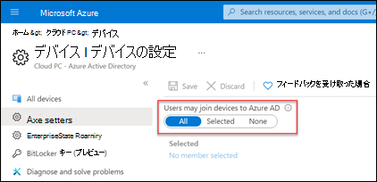
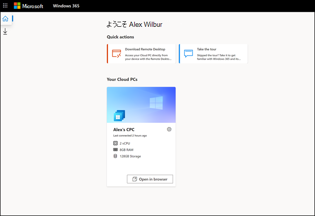

# 365 Business Windowsクラウド PC の使用を開始する

この記事は、組織で 365 Business をWindows設定する予定のユーザー向けです。
  
[Windows 365 Business](https://www.microsoft.com/windows-365/business)は Windows 365 のバージョンで、小規模な企業 (最大 300 シート) で使用されます。 これにより、組織はクラウド PC をユーザーに提供する簡単で合理化された方法を提供できます。  365 Windows 365 クラウド PC を使用すると、Microsoft クラウドからアプリ、データ、コンテンツ、設定、ストレージをストリーミングできます。

> [!NOTE]  
> 開始する前に、ユーザーの [Azure](/azure/active-directory/devices/device-management-azure-portal#configure-device-settings) ADデバイス設定が **[すべて**] に設定されている Azure ADに参加する可能性 **があります。**

   
## 前提条件
365 Business をセットアップするためのWindowsはありません。
## サブスクリプションを購入する

ユーザー向け 365 Business サブスクリプションを購入Windows 2 つの方法があります。

- [365 Windowsサイト](https://www.microsoft.com/windows-365/business/compare-plans-pricing)
- Microsoft 365 管理センター

サブスクリプションを購入した後、組織のユーザーにライセンスMicrosoft 365 管理センター割り当てるには、サブスクリプションを使用できます。
### 365 製品サイトWindowsサブスクリプションを購入する

Microsoft 365 サブスクリプションをまだ持ってない場合は、Windows 365 製品サイトで Windows [365](https://www.microsoft.com/windows-365/business/compare-plans-pricing)Business サブスクリプションWindows購入できます。 次の手順を使用して、[Windows 365 製品] ページから Windows 365 Business サブスクリプションを購入します。

1. [[365 Windows] ページで、プランと価格 **を表示する] を選択します**。
2. 次のページで、購入するサブスクリプションを選択し、[今すぐ購入] **を選択します**。
3. **[365 Business Windowsして** ありがとうございます] ページで、手順に従ってアカウントを設定します。
4. 手順 **5 - 確認** の詳細で、ユーザーにライセンスを割り当てる準備が整った場合は、[開始する] を選択して、Windows 365 のホーム ページに移動します https://windows365.microsoft.com 。
5. [365 Windows] ホーム ページの[クイック アクション] セクションで、[組織の **管理] を選択します**。 これにより、ユーザーにライセンスMicrosoft 365 管理センター割り当て可能な場所にアクセスできます。

### Microsoft 管理センターを通じてサブスクリプションを購入する

Microsoft 365 テナントが既に存在し、グローバル管理者または課金管理者である場合は、Microsoft 365 管理センター を使用して組織の Windows 365 Business サブスクリプションを購入できます。

1. Microsoft 管理センターで、[サービスの購入] ページ **>に移動** します。
2. [サービス **の購入] ページ** で **、365 Business Windowsを検索します**。 見つけたら、[詳細] を **選択します**。
3. **[Windows 365 Business]** ページの **[プロセッサ/Ram/Storage** オプション] セクションで、[サブスクリプションの選択] メニューを使用して、CPU、RAM、およびストレージのニーズに基づいてユーザーのサブスクリプションを選択します。 ユーザー Windows最適なサブスクリプションの選択に関するガイダンスについては[、「365 Business](windows-365-business-sizing.md)サイジング オプション」を参照してください。
4. [チェックアウト **] ページ** で、購入するサブスクリプションの数と支払い情報を入力します。 次に、[ **注文の配置] を選択します**。
5. **You'all set!** ページが表示され、購入の確認が表示されます。

## ユーザーにライセンスを割り当てる

Windows 365 製品サイトまたは Microsoft 365 管理センター を通じてサブスクリプションを購入した場合は、Microsoft 365 管理センター の [課金]ページからユーザーにライセンスを割り当てできます。

365 Business ライセンスの種類Windows、ユーザーのビジネス の必要性に基づいて、ユーザーに異なる種類のライセンスを割り当てできます。 ユーザー[に適Windowsするライセンスの種類については、「365 Business](windows-365-business-sizing.md)のサイズ変更オプション」を参照してください。

> [!IMPORTANT]
> テナントに Windows 365 ライセンスが初めて割り当てられると、"CloudPCBPRT" というシステム アカウントが自動的に作成Azure Active Directory。 このアカウントを削除しない。 システム アカウントが削除された場合、セットアップが失敗する可能性があります。 このシステム アカウントは、スムーズなセットアップ プロセスを保証し、Windows 365 Business のスコープサービス機能を超えて、書き込み機能やテナントへのアクセス権を持ち合わせない。 このユーザーを削除する場合は、サポート セントラルを通じてチケットをファイルします。

## ユーザーにクラウド PC の使用を開始する

ライセンスが割り当てられたら、クラウド PC にアクセスできる 2 つの異なる方法がユーザーに知らせることができます。

- 365 Windowsホーム ページ (https://windows365.microsoft.com)
- クライアントを使用Microsoft リモート デスクトップする

### Windows 365 ホーム ページ

ユーザーは、自分の **https://windows365.microsoft.com** クラウド PC にアクセスするために移動できます。  

ユーザーは Windows 365 のホーム ページで、[クラウド PC] セクションにアクセスできるクラウド **PC が表示** されます。

ユーザーは、[ブラウザーで **開く] を選択** してクラウド PC を開きます。

> [!NOTE]  
> モバイル デバイスは現在サポートされていません。

#### ユーザー操作

365 Windowsページで、ユーザーはクラウド PC カードの歯車アイコンを選択して、クラウド PC でアクションを実行できます。

- **再起動**: クラウド PC を再起動します。

- **リセット**: リセットは、次の手順を実行します。

    - 再インストールWindows 10。
    - 個人用ファイルを削除します。
    - 設定に加えた変更を削除します。
    - アプリを削除します。

    > [!IMPORTANT]  
    > クラウド PC をリセットする前に、クラウド ストレージ サービスまたは外部ストレージに保持する必要がある重要なファイルを必ずバックアップしてください。 クラウド PC をリセットすると、これらのファイルが削除されます。

- **Rename**: 365 ホーム ページのユーザーに表示されるクラウド PC のWindows変更します。

- **トラブルシューティング**: ユーザーがクラウド PC に接続しない可能性がある問題のトラブルシューティングと修正を試みる。 次の表は、チェックによって発生する可能性がある状態を示しています。

    | 状態 | 説明 |
    |:-----|:-----|
    |問題が検出されない |どのチェックも、クラウド PC で問題を検出したのではありません。 |
    |解決された問題 |問題が検出され、修正されました。 |
    |クラウド PC に接続できません。 修正に取り組み、後でもう一度やり直します。 |接続に必要な Microsoft サービスは利用できません。 後でもう一度接続してみてください。 |
    |クラウド PC の問題を修正できません。 管理者に問い合わせてください。 |問題が検出されましたが、修正できません。 これは、継続的な更新プログラムまたは別Windows原因である可能性があります。 このエラーが長い期間続く場合は、クラウド PC をリセットする必要があります。 |

### リモート デスクトップ

このMicrosoft リモート デスクトップアプリを使用すると、ユーザーはクラウド PC を含むリモート PC にアクセスして制御できます。 Windows 365 ユーザーは、365 ホーム ページから必要なリモート デスクトップ Windowsインストールできます。

#### アプリをMicrosoft リモート デスクトップする

リモート デスクトップ クライアントをセットアップするには、次の手順を実行します。

1. **[365 Windows]** ホーム ページで、[アプリ] Microsoft リモート デスクトップ (ホーム アイコンの下) を選択します。
2. [アプリの **Microsoft リモート デスクトップ] ページ** で、必要なリモート デスクトップ アプリをダウンロードしてインストールします。

   

オペレーティング システム別のクライアントの一覧については、「リモート デスクトップ [クライアント」を参照してください](/windows-server/remote/remote-desktop-services/clients/remote-desktop-clients)。

## アプリをインストールする

ユーザーは、アプリケーションの Web サイトからダウンロードするか、Microsoft Store からアプリをダウンロードすることで、通常は Windows でアプリをクラウド PC にインストールMicrosoft Store。

すべての Windows 365 Business ユーザーは、クラウド PC でローカル管理者特権を持つ必要があります。そのため、アプリをワークスペースにインストールするために必要なアクセス許可が必要です。

> [!IMPORTANT]
> ユーザーがクラウド PC で Microsoft 365 Business Standard ライセンスを使用しようとすると、「アカウントの問題: アカウントで見つかった製品を使用して、共有コンピューターのシナリオで Office をアクティブ化できません」というエラーが表示される場合があります。 このシナリオでは、ユーザーはクラウド PC にインストールされているOfficeバージョンをアンインストールし、Office.com から新しいコピーをインストールする必要があります。

## Intune による管理

Windows 365 Business では、プロビジョニング プロセスの一環としてクラウド PC が[Intune](/mem/intune/fundamentals/what-is-intune)に登録されません。 組織とユーザーが適切にライセンスされている場合、Intune にコンピューターを登録する場合と同じ手順を使用して、クラウド PC[を Intune に](/mem/intune/user-help/enroll-windows-10-device)登録Windows 10できます。

## ポート 25 を使用した送信電子メール メッセージの送信はサポートされていません

365 Business Cloud PC からポート 25 で送信電子メール メッセージWindows送信はサポートされていません。 ポート TCP/25 での通信は、セキュリティ上のWindows 365 Business ネットワーク層でブロックされます。 電子メール サービスがメール クライアント アプリケーションに簡易メール転送プロトコル (SMTP) を使用している場合は、使用可能な場合は Web インターフェイスを使用できます。 または、別のポートを使用するトランスポート層セキュリティ (TLS) を使用するセキュリティで保護された SMTP を使用する電子メール クライアント アプリを構成するためのヘルプをメール サービス プロバイダーに求めることができます。

## 解決策の見つけ方

365 Business のセットアップ中にヘルプをWindowsする必要がある場合Microsoft 365 管理センターヘルプまたはサポートを[参照してください](/microsoft-365/business-video/get-help-support)。

## 関連コンテンツ

[Windows 365 Business](https://www.microsoft.com/windows-365/business)  
[Windows 365 Business のサイズ設定オプション](windows-365-business-sizing.md)  
[Windows 365 ビジネス プランの比較](https://www.microsoft.com/windows-365/business/compare-plans-pricing)  
[リモート デスクトップ クライアント アプリの比較](/windows-server/remote/remote-desktop-services/clients/remote-desktop-app-compare) 
[小規模ビジネスMicrosoft Teamsを設定する](/microsoftteams/deploy-small-business)
