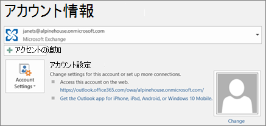

# Microsoft 365 へのメールと連絡先の移行

Gmail やその他のメール プロバイダーから Microsoft 365 にメールをインポートまたは移行します。
  
 **これに関するヘルプが必要な場合**  [一般法人向け Microsoft 365 のサポートにお問い合わせください](../../business-video/get-help-support.md)。 
  
この作業には、デスクトップにインストールされるバージョンの Outlook を使用する必要があります。 Outlook は、大部分の Microsoft 365 の[プラン](https://go.microsoft.com/fwlink/p/?LinkId=723731)に含まれています。
  
### Gmail から Microsoft 365 への移行。

Microsoft 365 でメール、連絡先、予定表を Gmail から Outlook にインポートまたは移行するには、次の手順を実行します。
  
- [Gmail を Outlook にインポートする](https://support.microsoft.com/office/20fdb8f2-fed8-4b14-baf0-bf04b9c44bf7)
    
- [Outlook に連絡先をインポートする](https://support.microsoft.com/office/bb796340-b58a-46c1-90c7-b549b8f3c5f8)
    
- [Google カレンダーをインポートする](https://support.microsoft.com/office/098ed60c-936b-41fb-83d6-7e3786437330)

## ウォッチ: 予定表のインポート
    
> [!VIDEO https://www.microsoft.com/videoplayer/embed/c1e45708-9a92-475b-910b-f5aa40614d92?autoplay=false]
  
### Outlook pst ファイルを Microsoft 365 (デスクトップ) にインポートする

Microsoft 365 を使用してメール、連絡先、予定表を Outlook から .pst ファイルにエクスポートし、そのファイルを Outlook にインポートするには、次の手順を実行します。
  
1. [メール、連絡先、予定表をエクスポートする](https://support.microsoft.com/office/14252b52-3075-4e9b-be4e-ff9ef1068f91)
    
2. [メール、連絡先、予定表をインポートする](https://support.microsoft.com/office/431a8e9a-f99f-4d5f-ae48-ded54b3440ac)
    
連絡先のみが必要な場合は、次の手順を実行します。
  
1. [Outlook から連絡先をエクスポートする](https://support.microsoft.com/office/10f09abd-643c-4495-bb80-543714eca73f)
    
2. [Outlook に連絡先をインポートする](https://support.microsoft.com/office/bb796340-b58a-46c1-90c7-b549b8f3c5f8)
    
To start the process, open Outlook and choose **File** \> **Open &amp; Export** \> **Import/Export**.
  
![Outlook 2016 の [ファイル] メニュー](../../media/2f1c39a5-177e-4052-9dd8-90c0d140be2c.png)![Outlook 2016 の [開く、&amp;エクスポート] コマンド](../../media/eecab6df-c372-45b1-8a8a-2f6d7af0dd68.png)![Outlook 2016 の [インポート/エクスポート] ボタン](../../media/ed90ae47-20db-4be1-b0c0-826008432c6e.png)
  
## Outlook で他のメール アカウントを表示する

Outlook で他のプロバイダー (Gmail、Yahoo、または Live.com など) のメールを単に表示したい場合は、 インポートや移行を行う必要はありません。 Outlook または Outlook Web App を設定して、Microsoft 365 メールボックスと同じ場所から他のアカウントにアクセスし、それらのアカウントに送信されたメールを送受信および閲覧することができます。
  
### Outlook (デスクトップ)

Outlook にアカウント (個人用 Gmail アカウントなど) を追加します。
  
- Open Outlook, then go to **File** \> **Add account**.
    
詳細な手順が必要な場合は、「[アカウントの追加](https://support.microsoft.com/office/6e27792a-9267-4aa4-8bb6-c84ef146101b)」を参照してください。
  

  
## メールボックスが複数の場合: 管理者は Microsoft 365 にメール、連絡先、予定表を一括インポートすることが可能です

ソースのメール システムによっては、いくつかの一括移行処理方法を選択できます。 どの方法が適切かを判断するには、「[複数のメール アカウントを Microsoft 365 に移行する方法](/Exchange/mailbox-migration/mailbox-migration)」を参照してください。

## 関連コンテンツ

[ビジネス向けMicrosoft 365のセットアップを](plan-your-setup.md)計画する (記事)\
[アプリケーションOfficeインストール](install-applications.md)(リンク ページ)\
[Microsoft 365 管理センターの概要](../../business-video/admin-center-overview.md) (ビデオ)