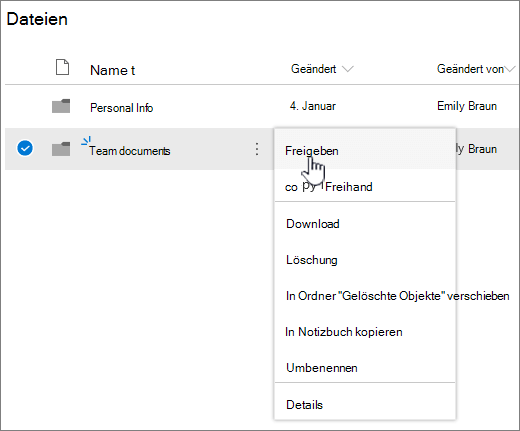
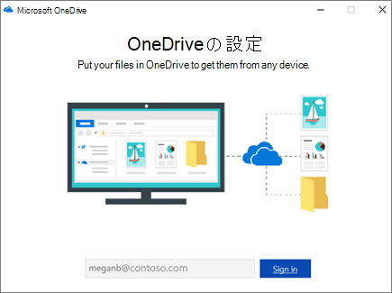

# ファイルストレージと共有を設定する方法は、Microsoft 365

ビジネス用にファイル ストレージと共有をセットアップする最善の方法の 1 つは、OneDriveとチーム サイトを一緒に使用することです。 これは、従業員数の少ない中小企業に最適です。

## ウォッチ: ファイルを格納する場所をOffice 365

> [!VIDEO https://www.microsoft.com/videoplayer/embed/RE1FTHX] 

このビデオがお役に立った場合には、「[小規模企業および Microsoft 365 を初めて使用する企業向けのトレーニング シリーズ](../../business-video/index.yml)」をご覧ください。

## Microsoft 365ストレージと管理

- OneDriveは、ファイルを時折共有して、個別に使用するように設計されています。

- チーム サイトは、ファイルの共有と共同作業を定期的に行う目的で設計されています。 チーム サイトは、複数のユーザーがファイルを所有し、そのファイルで共同作業を行う可能性がある共有所有権を持つファイルを保存する場合に最適です。 チーム サイトを追加する Microsoft チームを作成します。 [詳細については、「チームを作成する」を参照](https://support.microsoft.com/office/174adf5f-846b-4780-b765-de1a0a737e2b)Teams。

ユーザー OneDriveチーム サイトの両方が、ユーザーと従業員に任意の場所にアクセスできます。
  

  
サイトとチーム サイトを一緒に使用する場合に、各場所にOneDrive推奨事項を次に示します。 

  
|ストレージの場所|何のために|保存するファイル|
|:-----|:-----|:-----|
|**OneDrive** |ファイルにコンテンツをOneDriveは、コンピューターにファイルを保存する場合と同じ方法です。他の誰も簡単にアクセスできます。  詳細については、「What [is is OneDrive for Business?](https://support.microsoft.com/office/187f90af-056f-47c0-9656-cc0ddca7fdc2)   |他のチーム メンバーが定期的に共同作業を行ったり、アクセスしたりする必要がないビジネス ファイル。  |
|**SharePoint チーム サイト**   |コラボレーション。 Microsoft 365 グループ (Microsoft 365 管理センター、Outlook、Microsoft Teams でチームを作成する場合など) を作成すると、そのグループに対して SharePoint チーム サイトが作成されます。 同様に、SharePoint ホーム ページまたは新しい SharePoint 管理センターから新しい SharePoint チーム サイトを作成すると、Microsoft 365 グループも作成されます。 詳細については、「チーム サイトとは[SharePointオンライン](https://support.microsoft.com/office/75545757-36c3-46a7-beed-0aaa74f0401e)でチーム サイトを作成する[」をSharePointしてください](https://support.microsoft.com/office/ef10c1e7-15f3-42a3-98aa-b5972711777d)。    |共有所有権を持つファイル。 組織内の作業単位ごとにチーム サイトを分けすることをお勧めします。 たとえば、人員と財務ドキュメントを小さなチームに非公開にするには、別のチーム サイトを作成します。    |

> [!NOTE]
> SharePointビジネスに使用できる他の種類のサイトも含む場合があります。 イントラネット内の [通信サイトを](https://support.microsoft.com/office/7fb44b20-a72f-4d2c-9173-fc8f59ba50eb) 使用して、幅広い対象ユーザーの情報を公開できます。 また、ハブ サイト [を使用して](https://support.microsoft.com/office/fe26ae84-14b7-45b6-a6d1-948b3966427f) イントラネット内のサイトを接続できます。
  
## チーム サイトOneDriveの使用を開始する

### チーム メンバーは、自分のファイルを自分のファイルにOneDrive

ライセンスが割り当てられている (Microsoft 365[オンライン] が選択されている) SharePointの各ユーザーは、OneDriveを取得します。 ビジネス関連のファイルは、任意のデバイスからアクセスするためにここに保存できます。そのユーザーだけが利用できます。 たとえば、提案書の下書き、会議のメモ、配布予定のデモ用スクリプトなどを保存することができます。
  
従業員は、ファイルとフォルダー OneDrive共有することもできます。 従業員が離れた場合、または会社を離れた場合、他のユーザーはチーム フォルダー共有 (OneDrive共有OneDrive共有できます。
  
チームの各ユーザーがファイルの作成と共有をOneDrive方法を次に示します。

1. [パスワード] <a href="https://admin.microsoft.com/ " target="_blank">Microsoft 365 管理センター</a>に移動し、ユーザー名とパスワードでサインインします。

2. アプリ起動ツールで、[アプリの起動]**をOneDrive。**

3. このOneDrive、チーム メンバーは独自のビジネス関連のファイルを保存できます。 個々のファイルまたはフォルダー全体を共有できます。 ファイルまたはフォルダーを選択し、右クリックし、[共有] を **選択します**。

    
  
4. [リンクの **送信] ページ** で、既定の選択のままにします。リンクを持つユーザー **は、表示および編集できます**。

    フォルダーにアクセスするチーム メンバーの名前または電子メール アドレスを入力し、オプションのメッセージを追加します。

    送信される電子メールの独自のコピーが必要な場合は、電子メール アドレスをリストに追加します。

    
  
5. 共有するユーザーの入力が完了したら、[送信] を **選択します**。 メールは、招待するユーザーに直ちに送信されます。

    
  
6. メールの外観を次に示します。 

    ![[メール] フォルダーを共有するOneDriveメール。](../../media/750c92e1-f14f-404c-a6a3-2095e26c680c.png)
  
### アップロードの共同作業のためにチーム サイトにファイルを保存する

チーム サイトには、ドキュメント ライブラリと呼ばれるファイルを保存する場所があります。  
  
ファイルを追加する手順は次のとおりです。
  
1. チーム サイトのホーム ページで、左側 **のナビゲーション** メニューから [ドキュメント] を選択します。 これで、[ **ドキュメント ライブラリ**] が表示されます。
  
2. 引き続きサインインしている間Microsoft 365タスク バー Windows **エクスプローラー** を開きます。 チーム サイトにアップロードするファイルを表示します。

3. チーム サイトにアップロードするファイルを選択し、ドキュメント ライブラリに **ドラッグします**。
  
4. 完了すると、ファイルはチーム サイトとコンピューターの両方に保存されます。
  
5. ファイルをコンピューターから削除することができます。 次の手順では [、PC](#sync-online-files-with-your-pc-or-mac)または Mac とオンライン ファイルを同期し、コンピューター上にこれらのファイルの新しい場所を作成します。

    チーム サイトにアップロードするファイルや大きなファイルが多数ある場合は、ライブラリに大きなファイルまたは多数のファイルをアップロードする方法に関するヒント [を参照してください](https://support.microsoft.com/office/da549fb1-1fcb-4167-87d0-4693e93cb7a0#__toc384119242)。

    記憶域を追加する必要がある場合は、「[サブスクリプションの記憶域を変更する](../../commerce/add-storage-space.md)」を参照してください。

### オンライン ファイルを PC または Mac と同期する

ファイルをチーム サイトに保存したので、PC または Mac と同期するように設定することができます。 この方法では、PC または Mac からファイルを操作する代わりに、Microsoft Edge、Chrome、または別のブラウザーで作業できます。 また、ファイルにアクセスする必要があるが、インターネットに接続していない場合に、同期済みのファイルがコンピューターに保存されていれば便利です。
  
コンピューターと同期するファイルを設定した後、インターネットに接続すると、ファイルは自動的に同期されます。
  
次に、チーム サイトのファイルをデスクトップと同期する方法を示します。
  
1. チーム サイトのホーム ページで、左側 **のナビゲーション** メニューから [ドキュメント] を選択します。 これにより、ドキュメント ライブラリにアクセスできます。

    > [!TIP]
    > チーム サイト上のファイルを同期する場合は、サイト全体ではなく、サイト上の各ファイル ライブラリを同期します。
  
2. [ **同期] を** 選択して、すべてのファイルを同期します。 または、同期する特定のフォルダーを参照します。

3. アプリの切り替えを求めるメッセージが表示されたら、[はい] を **選択します**。 OneDriveは、同期を実行するプロセスです。
  
4. [セットアップ] ダイアログ が表示 **OneDrive、** 仕事用または学校用のアカウントでサインインします。

    
  
5. まだ同期していない場合は、OneDriveフォルダー画面 **が表示OneDriveがあります**。 [自分のファイル] フォルダー **のOneDriveを確認します**。 別の **パスを使用** する場合は、[場所の変更] を選択し、[次へ] を **選択します**。

    
  
6. チーム サイト内のファイルは、組織の名前の下にあるエクスプローラーの左側のウィンドウに表示されます。 このファイルはOneDrive "OneDrive - " の下に表示 \<Name of Organization\> されます。

    
  
7. コンピューター上のチームのフォルダー内のファイルを開いて、同期をテストします。 変更を行い、[保存] を **選択します**。

## ファイル ストレージと共有のベスト プラクティス

チーム サイトまたはチーム サイトから最もOneDrive得SharePointを次に示します。
  
### 他の種類の中小企業のためのファイルの保存と共同作業に関する推奨事項

- **個人所有者:** OneDriveを使用して、独自のファイルを保存し、ケースバイケースで顧客と共有します。

- **共同所有権**: 両方の所有者は、OneDriveファイルを前後に使用します。

- **ファイルへのアクセスが** 必要な外部クライアントまたはパートナーを持つ企業 : 特定の顧客向けドキュメントを保存して共有する新しいチーム サイトを作成します。 その顧客へのアクセスのみを許可するサイトを設定します。 その後、ある顧客が他の顧客を対象とした情報に誤ってアクセスすることを心配する必要はありません。

### 個人ファイルを非公開にする

ファイルを他のユーザー OneDrive共有しない限り、ファイルにアクセスできるのはユーザーのみです。 ファイルを共有する場合は、転送できるリンクを作成するか、特定のユーザーとのみ共有することができます。 また、公開用、個人用、個別のプロジェクト用など、さまざまな目的に合わせて OneDrive 内で各フォルダーを作成できます。 各フォルダーは、異なるユーザーやグループと共有したり、あるいは、誰とも共有しないように設定することもできます。
  
共有の詳細については、「ファイルとフォルダーを共有[する」を参照Microsoft 365。](https://support.microsoft.com/office/72f26d6c-bf9e-432c-8b96-e3c2437f5b65)
  
### 残っている容量を追跡する

ストレージに残っているストレージ容量を確認するには、「OneDriveストレージの管理」[をOneDrive for Businessしてください](https://support.microsoft.com/office/31519161-059C-4764-B6F8-F5CD29F7FE68)。
  
### ユーザーとチーム サイトにOneDriveファイルは何ですか?

ほとんどすべての種類のファイルをアップロードすることができますが、ファイル名の一部のファイル名と文字は使用できません。 詳細については、「ファイル内の[ファイル文字とファイルの種類が無効](https://support.microsoft.com/office/64883A5D-228E-48F5-B3D2-EB39E07630FA)OneDrive for Business。
  
### サードパーティのストレージ サービスを有効または無効にする

Microsoft 365 のユーザーが、Microsoft 365 やチーム サイトに加えて、Dropbox などのサービスを使用してドキュメントを保存および共有OneDriveを有効にできます。 これは、ユーザーが既にビジネス プロジェクトに使用している、または使用することを好むサービスを提供する優良な方法です。 組織内のユーザーがサードパーティ サービスでファイルを開Officeしない場合は、次の手順に従ってオフにします。
  
> [!IMPORTANT]
> サード パーティ製ストレージは既定で有効になっているので、ユーザーが利用できない場合は、これらの手順をすぐ実行する必要があります。
  
1. 管理センターに <a href="https://go.microsoft.com/fwlink/p/?linkid=2024339" target="_blank">サインインします</a>。

2. [組織の設定]**設定** \> <a href="https://go.microsoft.com/fwlink/p/?linkid=2053743" target="_blank">**に移動**</a>します。

3. [サービス **] タブで**、[サービス]**をOffice on the web** します。

4. チェック ボックスをオンまたはオフにしてサード パーティ製ストレージのオン/オフを切り替え、[変更を保存] **を選択します**。

## 次の手順

- [ファイルの保存と共有のためにチーム サイトをカスタマイズします](customize-team-site.md)。 このチュートリアルでは、ストレージとコラボレーションの機能をさらに活用する方法について説明します。

- **タブレットとスマートフォンで Office アプリをセットアップします。** この操作を行って、タブレットや携帯電話から、OneDriveチーム サイトに保存されているファイルを編集する必要があります。 タブレットまたは携帯電話用の Office アプリをインストールしない場合は、ファイルを表示できますが、編集は行うことができます。

  - [アプリを使用して Android OfficeをインストールしてセットアップMicrosoft 365](https://support.microsoft.com/office/cafe9d6f-8b0c-4b03-b20a-12438a82a22d)

  - [インストールとセットアップは、Officeを使用してiPhoneまたはiPadにMicrosoft 365](https://support.microsoft.com/office/9df6d10c-7281-4671-8666-6ca8e339b628)

  - [[OfficeでWindows Phone設定Microsoft 365](https://support.microsoft.com/office/2b7c1b51-a717-45d6-90c9-ee1c1c5ee0b7)

## 関連コンテンツ

[サブスクリプションの記憶域を追加](../../commerce/add-storage-space.md) する (記事)\
[ビジネス (ビデオ) でMicrosoft 365フォルダー](https://support.microsoft.com/office/share-files-and-folders-with-microsoft-365-business-72f26d6c-bf9e-432c-8b96-e3c2437f5b65)を共有する
[ファイルの保存と共有のためにチーム サイトをカスタマイズする](customize-team-site.md) (記事)
