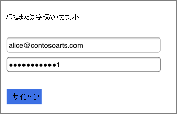
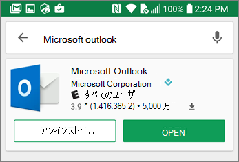
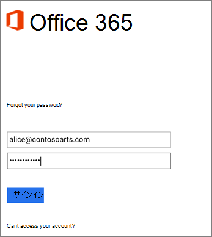
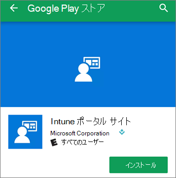

# ビジネス ユーザー向けモバイル Microsoft 365を設定する

タブの指示に従って、Office を iPhone または Android スマートフォンにインストールします。 これらの手順に従った後、Officeアプリで作成された作業ファイルは、Microsoft 365によって保護されます。

この例は Outlook 用ですが、インストールするその他の Office アプリにも適用されます。
  
## モバイル デバイスをセットアップする

## [iPhone](#tab/iPhone)
  
ビジネス向け iOS デバイスでアプリをOfficeする方法の短いMicrosoft 365ご覧ください。  

> [!VIDEO https://www.microsoft.com/videoplayer/embed/RWee2n] 

このビデオがお役に立った場合には、「[小規模企業および Microsoft 365 を初めて使用する企業向けのトレーニング シリーズ](../../business-video/index.yml)」をご覧ください。

**App Store** に移動し、検索フィールドに「 Microsoft Outlook」と入力します。
  

  
クラウドのアイコンをタップして Outlook をインストールします。
  

  
インストールが完了したら、[ **開く**] ボタンをタップして、Outlook を開き、[ **はじめに**] をタップします。
  

  
[メール アカウントの追加]画面で仕事用のメール アドレスを入力し、[アカウントの追加] をクリックし、[ビジネス資格情報 \> Microsoft 365を入力 \> **します**。
  

  
組織がアプリ内のファイルを保護している場合は、組織がアプリ内のデータを保護中であることを示すダイアログが表示され、アプリを再起動して引き続き使用する必要があります。 [ **OK**] をタップして Outlook を終了します。 
  

  
iPhone で Outlook を見つけて、再起動します。 メッセージが表示されたら、PIN を入力して確認します。 これで iPhone で Outlook を使用できるようになりました。
  

  
## [Android](#tab/Android)
  
Android デバイスへのアプリのインストールOutlookとOfficeビデオをご覧ください。  

> [!VIDEO https://www.microsoft.com/videoplayer/embed/ecc2e9c0-bc7e-4f26-8b14-91d84dbcfef0] 

このビデオがお役に立った場合には、「[小規模企業および Microsoft 365 を初めて使用する企業向けのトレーニング シリーズ](../../business-video/index.yml)」をご覧ください。

Android スマートフォンでセットアップを開始するには、Play ストアに移動します。
  

  
[Google Play] Outlookに Microsoft アプリを入力し、[インストール] を **タップします**。 インストールOutlookしたら、[開く] を **タップします**。
  

  
[Outlook] アプリで、[はじめに]をタップし、Microsoft 365ビジネス メール アカウントの [続行] を追加し、組織の資格情報で \> サインインします。
  

  
Intune ポータル サイト アプリをインストールする必要があること示すダイアログで、[ **ストアに移動**] をタップします。
  

  
Play ストアで、アプリをインストールIntune ポータル サイト。
  

  
Outlook をもう一度開き、PIN を入力して確認します。これで Outlook アプリが使用できるようになりました。
  

## 関連コンテンツ

[一般法人向け Microsoft 365 のトレーニング ビデオ](../../business-video/index.yml)

---
