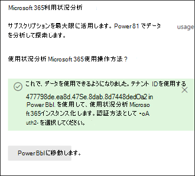
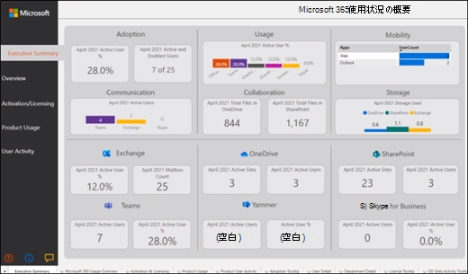

# Connect分析でMicrosoft 365 Government Community Cloud (GCC) データを取得する方法

次の手順を使用して、Microsoft 365 Microsoft 365 Government Community Cloud (GCC) テナントの利用状況分析レポートを使用してデータに接続します。 

> [!NOTE]
> これらの手順は、特にテナントMicrosoft 365 GCCです。 

## 開始する前に

最初に Usage Analytics Microsoft 365構成するには、次の手順を実行します。 

- データ収集を有効にするには、Microsoft 365管理者である必要があります。 
- テンプレート ファイルを[使用Power BI Desktop](https://powerbi.microsoft.com/en-us/desktop/)アプリケーションが必要です。 
- レポートを発行[Power BI Pro プレミアム表示するには、Power BI Pro](https://go.microsoft.com/fwlink/p/?linkid=845347)ライセンスまたはライセンス容量が必要です。 

## 手順 1: 組織のデータを利用状況分析レポートでMicrosoft 365する

1. [レポート] Microsoft 365 管理センターナビゲーション メニューを展開し、[レポート] を **選択し**、[使用状況] を **選択します**。 
2. [利用状況 **レポート] ページ** の [使用状況分析Microsoft 365] セクションで、[はじめに]**を選択します**。 
3. [**使用状況分析Power BIを有効** にする] で、[組織の利用状況データを Microsoft 利用状況分析で使用Power BI] を **選択し、[** 保存] を **選択します**。

     

    これにより、組織のデータをこのレポートでアクセス可能にするプロセスが開始され、使用状況分析の準備が整っているというメッセージが表示Microsoft 365 **されます。** このプロセスの完了には 24 時間かかる場合があります。 

4. 組織のデータの準備ができたら、ページを更新すると、データが利用可能であることを示すメッセージが表示され、テナント ID 番号 **も提供** されます。 テナント データに接続しようとすると、後の手順でテナント ID を使用する必要があります。 
 
     
 
    > [!IMPORTANT]
    > データが使用可能な場合は、[移動] を選択 **Power BIし、** この場合は[マーケット プレース] Power BI表示されます。  テナントに必要なこのレポートGCCアプリは、Power BI Marketplace では使用できません。  

## 手順 2: Power BIテンプレートをダウンロードし、データに接続し、レポートを発行する

Microsoft 365 GCCユーザーは、利用状況分析レポート テンプレート Microsoft 365をダウンロードして使用して、データに接続できます。 テンプレート ファイルを開Power BI Desktop使用するには、次の情報が必要です。 

 > [!NOTE]
 > 現在、Microsoft 365 Usage Analytics レポートのテンプレート アプリは、GCC Marketplace のPower BIできません。  

1. テンプレートをダウンロード[したらPower BIを](https://download.microsoft.com/download/7/8/2/782ba8a7-8d89-4958-a315-dab04c3b620c/Microsoft%20365%20Usage%20Analytics.pbit)使用して開Power BI Desktop。 
2. TenantID の入力を **求めるメッセージが表示** されたら、手順 1 でこのレポートの組織のデータを準備するときに受け取ったテナント ID を入力します。 次に、[読み込 **み] を選択します**。 データの読み込みには数分かかります。 

     

3. 読み込みが完了すると、レポートが表示され、データのエグゼクティブ サマリーが表示されます。 

     
 

4. 変更をレポートに保存します。 
5. [**レポート]** メニューの [Power BI Desktop] を選択して、レポートを表示できる Power BIオンライン サービスに発行します。 これには、ライセンスまたはPower BI Pro容量Power BI Premiumがあります。 発行プロセスの一[環として](/power-bi/create-reports/desktop-upload-desktop-files#to-publish-a-power-bi-desktop-dataset-and-reports)、オンライン サービスで利用可能なワークスペースに発行するPower BI必要があります。

## 関連コンテンツ

[利用状況分析について](usage-analytics.md)  
[利用状況分析の最新バージョンを取得する](get-the-latest-version-of-usage-analytics.md)  
[Microsoft 365 利用状況分析でレポート間を移動して活用する](navigate-and-utilize-reports.md)  