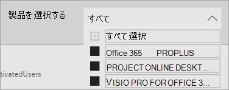
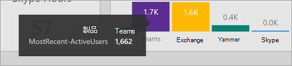

# Microsoft 365 利用状況分析でレポート間を移動して活用する

このダッシュボードでは、利用状況と導入状況の主なメトリックを簡単に確認できます。 最上位のメトリックを選択すると、詳細と分析情報を提供するレポートにアクセスできます。 各レポート タブには、組織の使用状況と導入の側面に固有のデータ視覚化が含まれています。 収集されたデータは各レポートのタイトルで説明され、表示しているレポート タブの視覚化に関する詳細情報を含むタイルが表示されます。

初めに、レポートのヒントをいくつか紹介します。

- 左側のナビゲーション タブまたは **[エグゼクティブサマリー** ] ページの関連メトリックを使用して、各最上位レベルのレポートに移動します。

    

- 各最上位レポートの上部にあるナビゲーション タブを使用して、そのレベル内の異なるレポートに移動します。

    

- 多くのレポートには、表示する製品、AAD属性、またはアクティビティでフィルター処理できるスライサーが含まれています。 これらは、単一選択または複数選択のいずれかです。

    

    

- データ ポイントにマウス ポインターを移動すると、詳細な情報の吹き出しが表示されます。

    

テンプレート アプリをインスタンス化したユーザーは、必要に応じてレポートをカスタマイズできます。 テンプレート アプリをカスタマイズするには:

- レポートの上部にある **[レポートの編集]** を選択します。

    

- 基になる[データセット](usage-analytics-data-model.md)を利用し、独自のビジュアルを作成します。

- Power BI Desktopを使用して、独自のデータ ソースを取り込みます。

レポートを共有するには、[共有] ボタンを選択するだけです  ページの上部に表示されます。

レポートをカスタマイズする方法については、「[Microsoft 365利用状況分析でのレポートのカスタマイズ](customize-reports.md)」を参照してください。

Power BI のヘルプドキュメントで多くの他の情報を見つけることができます。

- [Power BIの基本的な概念](/power-bi/service-basic-concepts)

    ダッシュボード、データセット、レポート、その他のPower BI概念について説明します。

- [Power BI の概要](/power-bi/service-get-started?wt.mc_id=O365_Reports_PBI_contentpack)

    Power BI の基本的な機能について説明します。PowerBI Desktop の使用方法へのリンクを参照してください。

- [ダッシュボードやレポートを共有する](/power-bi/service-share-dashboards)

    組織外の同僚や他のユーザーとレポートを共有する方法について説明します。 レポートまたはフィルター処理されたバージョンのレポートを共有することもできます。