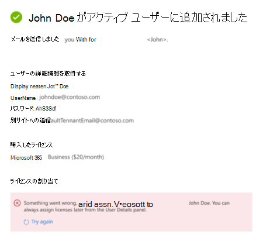
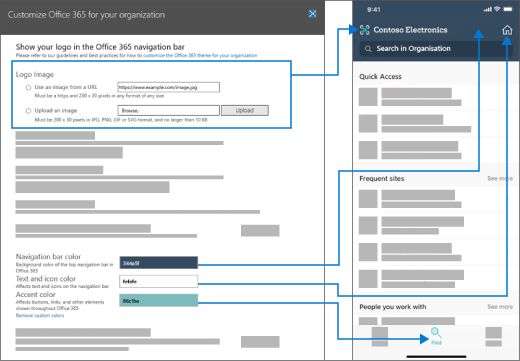
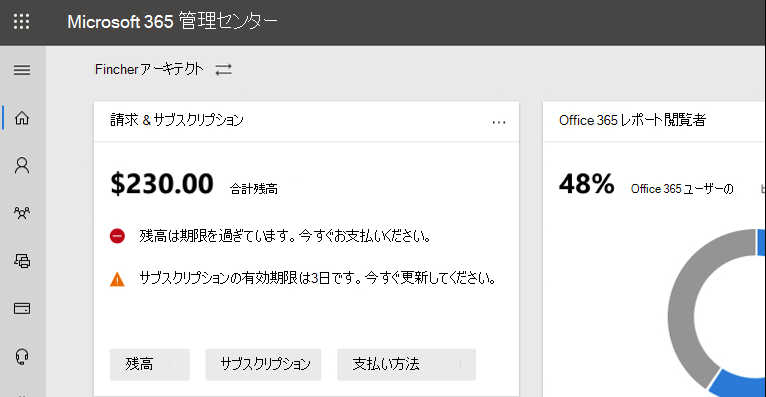

# 新しい機能Microsoft 365 管理センター

::: moniker range="o365-21vianet"

> [!NOTE]
> この記事の一部の情報は、21Vianet によってOffice 365適用されない場合があります。

::: moniker-end

新しい機能を継続的に追加し、Microsoft 365 管理センター問題を解決し、フィードバックに基づいて変更を加えます。 以下を見て、今日利用可能な機能を確認してください。 一部の機能は、お客様に異なる速度で展開されます。 まだ機能が表示されない場合は、ターゲットリリース [に自分自身を追加してみてください](manage/release-options-in-office-365.md)。

他の Microsoft クラウド サービスの新機能を知りたい場合は、次の手順を実行します。

- [新しい機能Azure Active Directory](/azure/active-directory/fundamentals/whats-new)
- [管理センターの新機能Exchange](/Exchange/whats-new)
- [Microsoft Intune の新機能](/mem/intune/fundamentals/whats-new)
- [新しい機能Microsoft 365 コンプライアンス センター](/Office365/SecurityCompliance/whats-new)
- [Microsoft 365 Defender の新機能](../security/mtp/whats-new.md)
- [SharePoint 管理センターの新機能](/sharepoint/what-s-new-in-admin-center)
- [Office 更新プログラム](/OfficeUpdates/)
- [リリースの正常性をWindowsする方法](/windows/deployment/update/check-release-health)

## 2021 年 7 月

### Microsoft 365 管理センター検索

これで、インシデントの 1 つでインシデントのMICROSOFT 365 管理センター。 現在のインシデントについては、ソーシャル メディア、業界の出版物、または他の管理者から確認できます。 これで、管理センターに移動してインシデントの詳細を確認し、組織への影響を理解できます。 管理センターでインシデント ID を検索します。

:::image type="content" source="../media/incident-id.png" alt-text="スクリーンショット: 管理センターでインシデント ID を検索する":::

### プレミア組織のチケットインサイトをサポートする

サポートボリュームに関する視覚的な分析情報を提供するために、製品別のボリューム傾向とボリューム傾向と呼ばれる 2 つのグラフが追加されました。

[ボリュームの傾向 **] タブの下** のライナー グラフは、サポート ケースが月の間に組織の月の増加または減少している場合の傾向を強調表示します。 グラフにカーソルを合わせると、毎月作成されたサポート ケースの数を確認できます。

:::image type="content" source="../media/SuppInsight-voltrnd.PNG" alt-text="スクリーンショット: Graph月のサポート ケースが増加または減少している場合の傾向を強調するデータ":::

製品 **別のボリューム傾向グラフには** 、サポート ケースが最も高い毎月の上位 3 つの製品が表示されます。 表でフィルター処理を有効にし、結果を[製品]、[重大度]、および [日付] でフィルター **処理できます**。

:::image type="content" source="../media/SuppInsight-voltrndproduct.PNG" alt-text="スクリーンショット: Graphサポート ケースが最も高い各月の上位 3 つの製品が表示されます。":::

また、[サービス要求の表示] テーブルに 2つの新しいフィールド[重大度] と [終了日] が追加され、チケットに関する詳細な分析情報が得られます。 

:::image type="content" source="../media/SuppInsight-date-sev.PNG" alt-text="スクリーンショット: サポート チケットの並べ替えを重大度と日付で示す表。":::

これらの更新プログラムを確認するにはMicrosoft 365 管理センター左側のナビゲーション ウィンドウの [**サポート**  >  **ビュー サービス** 要求] に移動します。

## 2021 年 6 月

### Microsoft 365 管理センター検索

検索機能にいくつかの新しいカテゴリが追加されました。

- グローバル検索で管理者Microsoft 365を検索し、任意のページから役割の割り当てをすばやく表示および管理できます。 たとえば、Intune 管理者 **を検索します**。

- グローバル検索を使用して、簡単なセットアップ エクスペリエンスを見つける方法が追加されました。 これにより、新しい機能の使い方を簡単に始めることができます。 たとえば、有効期限が切 **れることはありませんに設定されたパスワードを検索します**。

管理センターでの検索の詳細については、「管理センターの[検索」を参照Microsoft 365 管理センター。](manage/search-in-the-mac.md)

## 2021 年 5 月

### Admin モバイル アプリ

### 管理モバイル アプリを使用してサポート チケットの更新を追跡する

テナントで作成されたサービス要求すべてについて、チケットの状態を追跡し、チケットの詳細を表示し、添付ファイルにメモを追加して追加情報を提供/要求&できます。

:::image type="content" source="../media/Keep-track-support-ticket-updates2.PNG" alt-text="スクリーンショット: サポート チケットの更新を追跡する":::

### アプリとサブスクリプションに関する主要な更新プログラムのMicrosoft 365する

- メッセージ センタープッシュ通知 (既定で有効) を使用して、Microsoft 365サブスクリプションに対する主要な更新プログラムの上に残ります。

- [新機能] セクションを使用して、アプリで利用可能な最新 **の機能を追跡** します。 [新 **しい**  >  **設定] に移動します。**

:::image type="content" source="../media/Stay-on-top-of-updates.PNG" alt-text="スクリーンショット: 主要な更新プログラムと機能を追跡する":::

## 2021 年 4 月

### Admin モバイル アプリ

### 管理モバイル アプリからライセンスと請求書を管理する

- これで、サブスクリプションのすべての利用可能なライセンスと割り当てられたライセンスを表示できます。 ユーザーにライセンスを割り当てるか、または割り当て解除したり、ライセンスを追加または削除したりできます。
- アプリで詳細な請求書を表示できます。
- これらの更新プログラムは [、Android](https://go.microsoft.com/fwlink/p/?linkid=2159786) デバイスと [iOS デバイスの両方で利用](https://go.microsoft.com/fwlink/p/?linkid=2159787) できます。

:::image type="content" source="../media/assign-license-mobile-app2.png" alt-text="スクリーンショット: 管理者のモバイル アプリ割り当てライセンス ページ":::
:::image type="content" source="../media/license-screen-mobile-app2.png" alt-text="スクリーンショット: ユーザーとそのライセンスを含むモバイル アプリの管理画面":::
:::image type="content" source="../media/invoice-summary-mobile-app.png" alt-text="スクリーンショット: [管理] モバイル アプリの請求書の概要ページ":::

### 管理モバイル アプリのメッセージ センター フィードを更新しました

- これで、メッセージ センター フィードの読み取りエクスペリエンスが柔軟になります。 これで、サービスまたはタグに基づいてメッセージをフィルター処理し、メッセージをお気に入りとしてマークする機能が追加されています。 メッセージを読み取り、未読、またはアーカイブとしてマークする一括アクションも追加されました。
- これらの更新プログラムは [、Android](https://go.microsoft.com/fwlink/p/?linkid=2159786) デバイスと [iOS デバイスの両方で利用](https://go.microsoft.com/fwlink/p/?linkid=2159787) できます。

:::image type="content" source="../media/mc-feed-mobile-app.png" alt-text="スクリーンショット: 管理モバイル アプリ [メッセージ センター フィード] ページ":::

## Ignite 2021 (3 月)

Microsoft Ignite へようこそ。 Microsoft [Ignite 2021](https://myignite.microsoft.com/sessions)のセッションに参加できたらと思います。 Ignite で話したいくつかの点を次に示します。
> [!NOTE]
> すべての機能が、すべてのユーザーがすぐ利用できるとは思ってはいられません。 新機能が表示されない場合は、対象リリース [に参加します](manage/release-options-in-office-365.md)。

### メッセージ センター

メッセージ センターが刷新され、関連するメッセージの検出に役立ち、より柔軟な読み取りエクスペリエンスが追加されました。 メッセージが適用されるサービスをスキャンし、サービスおよび他のメタデータによってメッセージをフィルター処理するために、新しい [サービス] 列が追加されました。 メッセージをお気に入りに設定して、フォローアップのマークを付け、メッセージ リストに表示する列を選択し、戻るボタンと次のボタンを使用してメッセージ間を移動できます。 また、メッセージ センターの投稿に関するフィードバックを簡単に提供するプロセスも改善されました。

:::image type="content" source="../media/message-center.png" alt-text="スクリーンショット: 受信トレイとメッセージを示すメッセージ センターのホーム ページ":::

新機能の詳細については、「メッセージ センター」を [参照してください](manage/message-center.md)。

### 新機能

アプリ内のユーザーの "新機能" 機能の表示方法が改善Officeしました。 これで、ユーザーが表示できる [新機能] ウィンドウにリッチ コンテンツを表示できます。 また、機能についてユーザーに知らせる前に、この機能の詳細を確認できます。 詳細については、「新機能」[にOffice機能を管理するを参照してください](manage/show-hide-new-features.md)。

:::image type="content" source="../media/power-bi-whats-new2.png" alt-text="スクリーンショット: Officeの改善点を示す新しいページをアプリにPower BI":::

## Ignite 2020 (8 月 & 9 月)

Microsoft Ignite へようこそ - 最初のオンライン専用 Ignite。 Microsoft [Ignite 2020](https://myignite.microsoft.com/sessions)Session Catalog : セッションの 1 つでお会いできます。 Ignite で話し合う点のほんの一部を次に示します。
> [!NOTE]
> すべての機能が、すべてのユーザーがすぐ利用できるとは思ってはいられません。 新機能が表示されない場合は、対象リリース [に参加します](manage/release-options-in-office-365.md)。

### マルチテナント管理

複数テナントの管理者が仕事をより迅速かつ効率的に完了するための一連の機能を開発しました。 詳細については、「複数のテナント [を管理する」を参照してください](multi-tenant/manage.md)。

- **テナント:** 管理するテナントをすばやく切り替えます。
- **すべてのテナント**: すべてのテナントのサービスの正常性、開いているサービス要求、製品と課金、推奨されるセットアップ タスク、そのテナント内のユーザー数をすばやく確認できる新しいページ。
- **セットアップ**: マルチテナントセットアップ ページでは、[セットアップ] ページのリスト ビューが表示されますが、多くのテナントに対して整理されています。 有効にしていない機能、すべてのテナントに対して完了するタスク、テナントがまだ完了する必要があるタスクを確認できます。 このビューは、機能の導入を追跡し、推奨されるセキュリティセットアップ タスクが常に実行されるのを確認するのに役立ちます。
- **サービスの正常性**: サービス正常性ビューには、テナントに影響を与えるインシデントやアドバイザリが表示されます。 また、影響を受ける管理テナントの数も示されます。 インシデントを選択して[概要] タブの詳細を取得し、[テナントの影響を受ける] タブに切り替えて、そのテナントをドリルダウンしてサポートします。
- **テナント間メールボックスの移行** は、パブリック プレビューの新しいサービスで、オフボードメールボックスとオンボード メールボックスを必要とせずにテナント間でメールボックスを移動できます。 
- **テナント間ドメイン共有**: すぐに、複数のテナント間でドメインを共有できる機能のプライベート プレビューに参加できます。 たとえば、Contoso が Wingtip Toys を取得した場合、Contoso はドメインを Wingtip Toys と共有して、両方のテナントのユーザーが電子メール アドレスとして "contoso.com" を使用できます。

![インシデントが選択され、[テナントの影響を受ける] タブが開いているマルチテナントのサービス正常性ページ。 ナビゲーション メニューには、すべてのテナント、セットアップ、およびサービスの正常性が唯一のオプションとして表示されます。](../media/MAC-WN-MTinServiceHealth.png)

### 最も重要なアカウントを監視する

ビジネスに大きな影響を与えるユーザー (CEO など) に送信された、失敗または遅延した電子メール メッセージを監視および追跡できます。 優先度アカウントを追跡するには、ユーザーを優先アカウントリストに追加Microsoft 365 管理センター。 機密情報または優先度の高い情報にアクセスできる役員、リーダー、マネージャー、その他のユーザーを追加します。

優先度アカウントは、次の両方の要件を満たす組織でのみ使用できます。

- Office 365 E3またはMicrosoft 365 E3、またはOffice 365 E5またはMicrosoft 365 E5。
- 少なくとも 10,000 ライセンスと 50 以上の月次アクティブユーザー Exchange Onlineします。

開始するには、次の 2 つの方法があります。

- [ユーザー]**に移動** し、3 つの点 (その他のアクション) メニューで [優先度アカウントの管理] を選択して、ユーザーをリストに追加します。
- [セットアップ] **に移動し**、セットアップ タスクを見 **つけて、最** も重要なアカウントを監視し、[作業を開始する] **を選択します**。

優先度アカウントの詳細については、「優先度アカウントの監視 [」を参照してください](./setup/priority-accounts.md)。

### 検索を高速化し、任意のページからより良い結果を得る

管理センターの新しい検索エクスペリエンスを展開し始めました。試してみるのを待つ必要があります。 

- [検索] ボックスがヘッダー領域に移動し、"Microsoft 365 管理センター" と表示されたので、ホーム ページではなく、任意のページから検索します。 Alt + S というショートカット **も追加しました**。
- 検索の方がスマートで、より良い結果が得られます。さらに速くなります。 「2fa」と入力して開始してください。
- 検索結果は、実行できるアイテムまたはアクションの種類によって整理されます。
  - **[** ユーザー] : ユーザーの名前を選択すると、そのユーザーを編集できます。 名前の横にある 3 つのドット (その他のアクション) メニューを選択すると、パスワードをリセットできます。 表示名、名、名、ユーザー名またはプライマリ メール アドレス、および電子メール エイリアスで検索できます。 ただし、完全一致を取得するには、プライマリ メール アドレスまたはユーザー名で検索します。
  - **グループ**: 任意のページからグループを編集し、メンバーを追加し、所有者を割り当てる。
  - **アクション**: ユーザーを検索してパスワードをリセットする方法と同様に、任意のページから "パスワードをリセット" を検索し、ユーザーのパスワードを 1 つ以上リセットすることもできます。
  - **ナビゲーション**: [ナビゲーション] の下の結果は、管理センターのページにすばやくアクセスするのに役立ちます。 たとえば、"roles" を検索すると、Azure の [ロール] ページが表示ADされます。
  - **設定**: 組織、サブスクライブしているサービス、セキュリティとプライバシーの設定に関連する設定を検索します。 
  - **ドメイン**: ドメインへのクイック リンクを見つけて、そのドメインの [概要と正常性] ページに移動します。
  - **ドキュメント**: 検索結果が見つからなかった場合は、役立つドキュメントを探します。 一致する記事の一覧を見つけるには少し時間がかかるので、検索で結果を見つけるのにもう少し時間がかかります。 
  - **フィードバック**: お探しの情報が見つからなかった場合 検索からフィードバックをお寄せください。 管理センター全体で、より多くのページと機能の検索機能を追加します。

### Microsoft 365管理者モバイル アプリ

サブスクリプション[Microsoft 365](https://www.microsoft.com/microsoft-365/business/manage-office-365-admin-app)含まれている管理者モバイル アプリを使用すると、モバイル デバイスから Microsoft 365 を管理し、デスクから離れて毎日のタスクを実行できます。 実際、アプリには 90 を超える機能があります。さらにいくつか追加しました。

- **Microsoft Intune のモバイル** アプリケーション管理ポリシーと条件付きアクセス ポリシーのサポート : 組織が Intune のモバイル アプリケーション管理ポリシーと条件付きアクセス ポリシーを有効にしている場合でも、個人用デバイスを使用して Microsoft 365 を管理できるようになりました。
- **メッセージ センター通知**: 新しいメッセージ センターの投稿に関する通知を受 **け** 取る場合設定通知でメッセージ センター通知  >  を有効にします。 通知を通じて、テナント全体の重要な情報とイベントに関する情報を確実に提供します。
- **請求通知**: サブスクリプションの有効期限が切れそうになった場合 **設定** デバイスで請求通知を受け取る場合は、設定 通知で請求通知  >  を有効にすることもできます。
- **ダーク モード**: モバイル アプリの暗い側へようこそ。 これは、最も要求された機能の 1 つでした。 [テーマ]**設定**  >  **に移動** して有効にしてください。
- **問題を報告** する: アプリで問題を報告したり、他の管理者が報告した問題を表示したりできます。 [サービス **の正常性] に** アクセスしてチェックアウトします。

![メッセージ センター、サービスMicrosoft 365課金通知の通知を含む管理アプリの [正常性] ページ。](../media/MAC-WN-AdminMobileApp.png)

### 中小企業向け利用状況に関する推奨事項

組織の一部のユーザーが Teams、OneDrive、または Office アプリを積極的に使用していない場合、中小企業はホーム ページで推奨事項を受け取る場合があります。  推奨事項を表示すると、非アクティブなユーザーに Microsoft トレーニングをすばやくメールで送信して、アプリの使用を開始し、サブスクリプションから完全な値を取得できます。

### リモートワーク コレクション

10 月には、小規模なビジネス所有者とそのスタッフがオンラインでリモートで作業するためのリモート ワーク コレクションを追加します。  **リモート作業の必需品** のセットアップは、リモート作業を安全に有効にし、効果的に共同作業するために Microsoft が推奨するすべての機能の一覧です。 数週間後には、「リモート作業の必需品のセットアップ」  >  **で試してみてください**。

リモート作業を安全に許可する方法と、簡単に覚えて共有できる便利な Web アドレスの詳細については、「aka.ms/remote-business」 [を参照してください](https://aka.ms/remote-business)。

### ヘルプが必要ですか?より多くの管理センターに移動する

製品の変更に対応するために、コンテンツとツールを継続的に見て更新しています。 問題の迅速かつ効率的な解決に役立つセルフサービス診断ツールが多数追加されています。 最近追加されたいくつかの情報を次に示します。

- Web サービスExchangeポリシーを変更する
- 特定のユーザー Teamsプロビジョニングと検証の状態を確認する
- DKIM セットアップに関する問題の解決方法
- Intune ユーザー登録エラーの診断

また、他の管理センターの一部に対して、Microsoft 365 管理センターで既に表示されている新しいサポート エクスペリエンスと改善されたサポート エクスペリエンスを展開しています。 Teams管理センターとセキュリティおよびコンプライアンス管理センターには、既にこの新しいエクスペリエンスがあります。 すぐに **、Exchange センター** **、SharePoint** 管理センター **、Office.com** が管理者向けこの新しいヘルプ エクスペリエンスと共に更新されます。

### Microsoft Planner を使用して変更を管理する

5 月には、メッセージ センターの投稿を Microsoft Planner に同期し、すべてのユーザーが利用できると発表しました。  これで、メッセージからタスクを作成し、割り当て、完了まで追跡できます。 最初に、[Planner **syncing]** を選択すると、適切なプランに接続する必要があります。

![[基本設定] ボタンの横にあるコマンド バーで [プランナーの同期] が強調表示されたメッセージ センター ページ。](../media/MAC-WN-MCPlannerSync.png)

詳細については、この記事とビデオを参照して、その動作を確認してください。Planner でメッセージ センターの投稿 [を追跡する](/Office365/Planner/track-message-center-tasks-planner)

### ドキュメント、トレーニング、およびビデオ

- Microsoft Ignite-- The Virtual Hub に新しく、[ちょうど間に合います](https://adoption.microsoft.com/virtual-hub/)。 IT のプロと開発者向けのテクニカル トレーニングについて詳しい説明をします。 今年の Ignite 管理者トラックの名前である、#SIDETRACKED 20 件の新しいビデオをすばやく見つける。
- [Microsoft 365](https://www.youtube.com/watch?v=OVjb2lGJ4GU&t=2s)ビデオ シリーズの新機能: 今月は、ホワイトボード for Teams および web で利用できる新機能、Azure AD へのユーザー プロビジョニングを自動化する方法、Teams での新しい Power Automate トリガーとアクションなどについて説明します。 そして、来月に向け、Ignite で起こっているすべての素晴らしいことを要約します。
- 最初にソリューションに焦点を当てたMicrosoft 365[ドキュメント](/microsoft-365)ページの再設計を行いました。 このページで利用可能になった新しいソリューションを強調表示しますので、目を離す必要があります。

## 2020 年 7 月

### Ignite 2020 の準備

Microsoft で Ignite シーズンに移行する中で、セッション中に多くの情報を得る必要があるほど多くの機能をリリースする予定ではありません。

この記事の次の更新は、最初のオンライン専用 Ignite の初日に行います。 今年は無料で参加できます! チェックアウトし、サインアップしてください: [Microsoft Ignite 2020](https://www.microsoft.com/ignite).

### 製品

サブスクリプション管理では、ページの読み込み速度を速くし、探しているコンテンツを見つけ、Web アクセシビリティ標準[(WCAG 2.1](http://www.w3.org/TR/WCAG21/)ガイドライン) を満たすために多くの作業が行われました。

- **テーブルの再** 設計: 同様のサブスクリプションをグループ化できるよう、テーブルが再設計されました。 **[課金]** > **[製品]** に移動します。
- **製品の詳細**: 一覧で製品を選択して、サブスクリプションに関するこれまで以上の詳細を取得します。
- **ここからすべて行います:** また、1 つの製品を管理するために複数のページをジャンプする必要はありません。 たとえば、サブスクリプションを取り消す必要がある場合は、パネルが開き、そこでアクションを実行します。

![[サブスクリプションのキャンセル] パネルが開いた [製品] ページ。](../media/MAC-WN-SubscrDetails.png)

### ドメイン

ドメイン管理は複雑になる可能性があります。また、それを容易にするために新しい機能をリリースしました。 [ドメイン設定 >] に移動し、ドメインを選択して、ドメインとドメインの正常性に関する詳細を取得します。

:::image type="content" source="../media/MAC-WN-DomainDNS.PNG" alt-text="ドメインの詳細ページ (contoso.com":::

### ドキュメント、トレーニング、ビデオ (2020 年 7 月)

[Microsoft 365](https://youtu.be/m1Nu8WJgCDY)ビデオ シリーズの新機能: 今月は、Web とモバイル向け新しい Yammer エクスペリエンス、Microsoft Teams 用 Yammer コミュニティ アプリを統合する方法、Firstline Workers and managers をサポートする新しいポリシー パッケージなどについて説明します。

## 2020 年 6 月

### 最新のOffice管理について

数か月前に、ユーザーのアプリに表示される新しいメッセージを管理できる設定Officeしました。 今月、組織のユーザーに表示する新しいメッセージをすばやく処理し、追跡するのに役立つ新しいホーム ページ カードがリリースされました。

### ドキュメント、トレーニング、ビデオ (6 月)

- [ユーザー設定のTeams](../business-video/get-started-teams-small-business.md)

## 2020 年 5 月

### ユーザーの新しい更新Office

5 月 12 日に、新しい更新プログラム チャネルの可用性をOffice月次Enterpriseしました。 この更新プログラム チャネルは、月に 1 回Office、月の第 2 火曜日に新しい機能をユーザーに提供します。

ユーザーがポータルからサイトを自己Office許可する場合は、[月次Enterpriseチャネル] を選択できます。 これを行うには、[組織の設定を表示する] Microsoft 365 管理センターにサインインし、[すべての組織の設定を表示設定ソフトウェアのダウンロードOffice  >   >    >    >  **に移動します**。 [月 **1** 回 (月次 Enterprise チャネル) を選択した場合、Office の新しい自己インストールは、月次チャネルを使用するようにEnterpriseされます。

Monthly Enterprise チャネルのリリースに合わせて、既存の更新プログラム チャネルの名前も変更しています。 たとえば、月次チャネルの名前が現在のチャネルに変更されています。 新しい名前は、2020 年 6 月 9 日に有効になります。

詳細については、「[Microsoft 365 Apps の更新プログラム チャネルの変更](/DeployOffice/update-channels-changes)」を参照してください。

### 新しい管理者ロール

管理者ロールに新しいAzure Active Directoryが追加Microsoft 365 管理センター。

- ハイブリッド ID 管理者の役割を使用すると、ユーザーはクラウド プロビジョニングサービスと認証サービスを管理できます。
- ネットワーク管理者の役割を使用すると、ユーザーはネットワークの場所を管理し、サービス Microsoft 365ソフトウェアのネットワーク分析情報を確認できます。
- プリンター管理者の役割は、プリンターとプリンター接続のすべての側面を管理するアクセス許可を付与します。
- プリンター技術者は、ユーザーがプリンターを登録および登録解除し、プリンターの状態を更新できるプリンター管理者の役割のサブセットです。
これらの役割の詳細については、「管理者ロールについて [」を参照してください](./add-users/about-admin-roles.md)。

### グループリストのエクスポート

多くの管理者から、グループとその利用状況に関する情報を管理センターにアクセスできないユーザーと共有する必要があるという話を聞いたことがあります。 監査の目的でグループ リストを CSV ファイルにエクスポートできます。つまり、古い PowerShell スクリプトをスローすることができます。 試しに行く場合は、[**グループ** グループ]  >  に **移動** し、コマンド バーから **[** グループのエクスポート] を選択します。

### Microsoft 365 ソリューションおよびアーキテクチャ センター

ちょうど今月[、docs.microsoft.com](../solutions/index.yml)で Microsoft 365 ソリューションとアーキテクチャ センターという新しいサイトをリリースしました。このサイトでは、安全で準拠したコラボレーションのための統合 Microsoft 365 ソリューションを理解し、計画し、実装するために必要な技術的なガイダンスをまとめました。 このセンターには、次の情報が表示されます。

- 基礎ソリューションのガイダンス
- ワークロード ソリューションとシナリオ のガイダンス
- ソリューションとアーキテクチャの図 (ポスター!!!)
- 業界固有のガイダンス
- Enterprise設計プリンシパル

### ドキュメント、トレーニング、ビデオ (5 月)

- **Microsoft 365** ビデオ シリーズの新機能 : 今月は、Teams 管理者とセキュリティ/コンプライアンス センターでの新しいサポート エクスペリエンス、Planner とメッセージ センターとの統合、Microsoft Teams の新しい 3x3 ビデオ レイアウトについて取り上します。 
- [[Microsoft 365 管理センターヘルプ ハブ](./index.yml)] ページが更新され、必要な情報をすばやく見つけるのに役立ちます。 今すぐそのページを見に行く場合は、重要な更新と変更を通知するカードが追加されました。

## 2020 年 4 月

### Intune の役割の管理

[2020 年 4 月](#april-2020)

さて、私たちはそれをやった! 統一された役割エクスペリエンスに向けて第 2 のステップを踏み、この手順で Intune の役割を管理Microsoft 365 管理センター。 ロールを検索し、役割のアクセス許可を表示する機能などの機能を活用することもできます。 つまり、ユーザーと Intune の役割を管理するための 2 つの個別Microsoft 365必要ない。 アプリにサインインするとMicrosoft 365 管理センター[ロール] ページに 2 つのピボットが表示されます。1 つは Azure ADと Intune 用です。

![Intune ピボットが選択されている [役割] ページ](../media/MAC-WN-IntuneRoles.png)

### メッセージ センターの投稿を Planner に同期する

5 月から、ターゲットリリースの管理者は、メッセージ センターに [プランナーの同期] ボタンが表示されます。 これで、アクションが必要なメッセージを追跡し、追跡するメッセージの種類を選択し、タスクとして追跡するメッセージを割り当て、メッセージにタグを付け、後で注意を払うことができます。

[ターゲットリリースに参加](manage/release-options-in-office-365.md) して始めましょう!

### "ヘルプが必要ですか? セキュリティとコンプライアンス センター Teams管理センター&で開始

管理者Teams、セキュリティ センター、コンプライアンス センターが同じ "ヘルプが必要ですか? ヘルプの検索Microsoft 365 管理センターサポートへの問い合わせに使用する機能を提供します。 管理者から、同じレベルのヘルプとサポートが必要というフィードバックが多く寄せられているので、喜んでお客様にお寄せください。 試してみて、フィードバックをお寄せください。

#### チャットが必要ですか?

サポート エージェントは自宅で作業を続けながら、自宅で作業している間も、顧客のケースやインターネット帯域幅の制限を受け入れながら、顧客の通話品質に影響を与える可能性があります。 引き続きサポートを行う目的で、商用顧客向けライブ チャット サポート オプションが開始Microsoft 365 管理センター。

サービス要求の作成中に、電話とメールに加えて、オプションとしてチャットが表示されます。 コミュニケーションの優先チャネルとしてチャットを選択し、要求を作成します。 要求を作成したら、Microsoft エージェントとチャットする準備ができたら、チャットを開始できます。

### Teams更新プログラム

アプリの使用量が増Teams、管理に役立つ機能がいくつか追加されました。

- 管理センターのホーム ページの新しい推奨事項カードには、30 日間アクティブに使用していないユーザー Teams表示されます。 これらのユーザーにトレーニングメールを送信して、ユーザーがトレーニングメールを使用Teams。
- **チームでユーザー** をまとめる:  [セットアップ] に移動して、ライセンスユーザーの Teams を有効にし、ゲスト アクセスを許可する新しいページを表示し、Teams で外部ユーザーと作業できます。
- これでMicrosoft Teamsがホーム ページに既定でピン留めされます。 この例では、Teamsがオンになっているかどうか、およびゲスト アクセスが許可されているかどうかを示します。 また、新しくライセンスを取得したユーザーのセットアップ状態をTeams、ネットワークの問題がユーザーに影響を与えるTeamsできます。
- 最後に、Teamsを含むライセンスを購入した場合、最初のセットアップ フローのステップTeams。

### 生産性スコア

生産性スコアは、ユーザーが Microsoft クラウド サービスを使用する方法と、それらをサポートするテクノロジ エクスペリエンスに関する分析情報を提供します。 このスコアは、従業員やテクノロジ エクスペリエンスの対策に対する組織のパフォーマンスを反映し、スコアを自分のような組織と比較します。 今月は、プレビュー エクスペリエンスに次の新しい概念が導入されています。

- ホーム ページおよびカテゴリ詳細ページの主な分析情報の傾向ビュー -Endpoint Analytics および Network Connectivity カテゴリがテクノロジ エクスペリエンスに追加されました
- 従業員エクスペリエンス カテゴリに表示される関連するテクノロジ エクスペリエンスの分析情報
- 従業員エクスペリエンスの一部としての新しいコミュニケーション カテゴリ
- 従業員エクスペリエンス カテゴリの組織メタデータを含むユーザーの詳細

詳細については、ブログを参照してください。Microsoft 生産性スコアを使用して、Microsoft 365エクスペリエンスを測定して[改善してください](https://techcommunity.microsoft.com/t5/microsoft-365-blog/measure-and-improve-the-microsoft-365-experience-with-microsoft/ba-p/1348618)。 生産性スコアは現在、プライベート プレビューに表示されています。 [作業を開始するには、生産性スコアのプライベート](https://aka.ms/productivityscorepreview) プレビューに参加します。

### グループの更新

今月、グループの更新プログラムが 2 つ追加されています。

- グループの電子メール アドレスを編集Office 365 (Outlook のグループとも呼ばれる)、すぐにグループとしてMicrosoft 365できます。
- フィードバックが聞こえ、グループを Microsoft チームに変換できない理由について、より明確なエラー メッセージが追加されました。

### ドキュメント、ビデオ、トレーニング (4 月)

**Microsoft 365** ビデオ シリーズの新機能 : 今月は、小規模企業がリモート作業に移行するためのヒントとリソース (Microsoft Teams のロールアウト方法、クライアントやパートナーとの接続を可能にするためのリモート作業トレーニング リソース、新しい Microsoft 365 Business Voice プランなど) について取り上っています。 [新しい機能のMicrosoft 365](https://go.microsoft.com/fwlink/p/?linkid=2118096)

#### ユーザーの場合

- [会議をスケジュールする](../business-video/schedule-guest-meeting.md)
- [会議に参加Teamsする](https://support.microsoft.com/office/078e9868-f1aa-4414-8bb9-ee88e9236ee4)
- [組織全体にわたるチームを作成する](../business-video/org-wide-team.md)
- [ゲストとチームを作成する](../business-video/team-with-guests.md)
- [チームにゲストとして参加する](../business-video/join-team-guest.md)
- [グループのメール アドレスを作成する](../business-video/group-email.md)

#### 管理者およびビジネス所有者向け

- [リモート ワークで小規模ビジネスを強化する](https://support.microsoft.com/office/9b91a85a-39b4-40a6-a590-0f9bea0ba8e6)
- [リモート 小規模ビジネスの実行](../business-video/sign-up.md)
- [Microsoft Business Basic にサインアップする](../business-video/sign-up.md)
- [2 要素サインインのセットアップ](../business-video/sign-up.md)

## 2020 年 3 月

### おすすめフィードバックの修正: ライセンスの "ユーザーの追加" の信頼性を向上させる

ユーザーを追加するときにライセンスを割り当てるのがいかに難しいかについて、管理者から多くのフィードバックを受け取っています。 この修正プログラムの最初の更新が行われ、これらの要求を処理するために、より信頼性の高い舞台裏サービスに移行しました。 何か問題が発生した場合は、もう一度やり直すというエラー メッセージが表示されます。

### Microsoft Teamsホーム ページ カード

一部の組織では、Teamsの使用率が上がると、ピン留めされたダッシュボード カードが表示され、Teams有効になります。 また、このカードには、組織がリモート作業に移行するのに役立つトレーニングやドキュメントへのリンクがあります。 ホーム ページに移動 **して** 、新しいカードを表示します。

### 組織のモバイル アプリテーマSharePointカスタマイズする

アプリをMicrosoft 365 管理センター、iOS および Android 用モバイル アプリSharePointモバイル アプリで組織SharePointをカスタマイズできます。 この機能は、モバイル イントラネット アプリのエクスペリエンスを提供し、移動中の従業員SharePointオンラインに一致できます。 テーマのカスタマイズには、ロゴ画像、ナビゲーション バーの色、テキストとアイコンの色、アクセントの色が含まれています。認識が容易になります。

### "グループの追加" ウィザードの機能強化

管理者が新しいグループを作成し、同時にチームにした場合、管理者は、新しいグループを含むライセンスを持つ所有者を割り当Teams。 そして、それはいくつかの頭痛を作り出しました。 ウィザード フローが更新され、所有者が Teams ライセンスを持ち、グループをチームに変えるオプションが無効になっている場合は無効になっています。

### Microsoft 365中規模企業向けサービス

これは来月のアナウンスですが、準備が必要です。

4 月 21 日から、中小企業向け Office 365 サブスクリプションおよび Office 365 ProPlus に関連する変更を行Office 365 ProPlus。 これらの製品は現在、ブランドのMicrosoft 365します。

新しい製品名は、2020 年 4 月 21 日に有効になります。 これは製品名の変更のみであり、現時点では価格や機能の変更はありません。

|現在の名前 |新しい名前  |
|---------|---------|
|Office 365 Business Essentials     |   Microsoft 365 Business Basic      |
|Office 365 Business Premium     |    Microsoft 365 Business Standard     |
|Microsoft 365 Business     |    Microsoft 365 Business Premium     |
|Office 365 Business     |    Microsoft 365 Apps for business       |
|Office 365 ProPlus    |   Microsoft 365アプリ      |

### ビデオ、トレーニング、およびドキュメント

[Microsoft 365](https://go.microsoft.com/fwlink/p/?linkid=2118096)Web シリーズの新機能 : 今月のエピソードでは、Microsoft Teams の 3 年の記念日を強調し、オンライン会議でのオーディオ品質の向上、Shifts アプリを使用したファーストライン マネージャー向けターゲットコミュニケーション、Teams と Skype コンシューマーの相互運用性などの新機能について説明します。

## 2020年2月

### おすすめフィードバックの修正: 複数組織の切り替え機能

パートナーや管理者から、複数の Microsoft クラウド組織を管理する課題について多くのフィードバックを受け取っています。 最初の複数組織管理機能の 1 つは、組織の切り替え機能で、2 回のクリックで管理する組織間で変更できます。
> [!TIP]
> 少なくとも 1 つの組織のパートナーである限り、組織の切り替え者を表示するために何もする必要はありません。

1. [組織] Microsoft 365 管理センター組織名を選択します。

2. 組織の切り替えプログラムで、管理する組織を選択します。

これは文字通りです!!!

### グループ

今月のグループ領域の変更点を次に示します。

- **グループ名による並べ** 替え : [グループ名] 列を選択して、グループ リストをアルファベット **順に並べ替** えできます。
- **削除済Microsoft 365グループ** を復元する : 削除されたグループを復元するために、Exchange 管理センターに移動するMicrosoft 365はありません。 [グループ] **Microsoft 365 管理センター** \>  \> **削除済みグループ** \> (リストからグループを選択) [グループの復元] \> **に移動します**。 グループを [グループ] リストに戻し、グループの電子メール、会話、ノートブック、ファイル、予定表を復元します。

### ビデオ、トレーニング、ドキュメント (2 月)

- **Microsoft 365** ビデオ シリーズの新機能: 今月は、SharePoint Online のカスタム検索機能、アプリ内ヘルプ ウィンドウを介してエンド ユーザーから特定の機能を表示または非表示にできる Office "What's New" 管理機能、Yammer の最新のセキュリティとコンプライアンス更新プログラムなどについて説明します。 最新のエピソードを次に示[Microsoft 365](https://go.microsoft.com/fwlink/p/?linkid=2118096)します。

- **ドキュメントの移動**: 管理 web Office 365記事とコンテンツMicrosoft 365を組み合わせて、新しい URL に気付いた可能性があります。 たとえば、この記事は以前は次の場所でホスト **docs.microsoft.com/Office365/Admin/whats-new-in-preview、URL** は次 **docs.microsoft.com/microsoft-365/admin/whats-new-in-preview。** ページをブックマークした場合は、リンクを更新する必要があります。ただし、コンテンツ リンクは新しいコンテンツ レポにリダイレクトされます。
