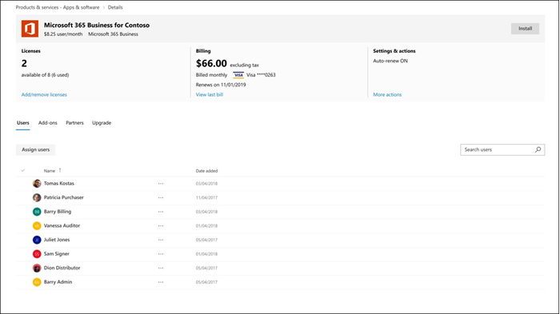
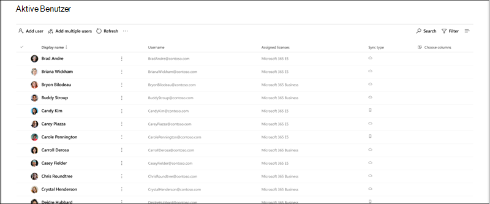
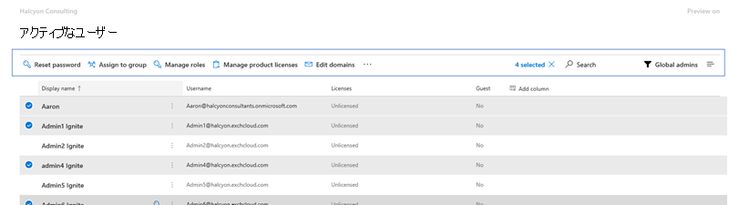

# Microsoft 365 管理センターの新機能What's new in the Microsoft 365 admin center

[Microsoft 365 管理センター](microsoft-365-admin-center-preview.md)に新機能を継続的に追加し、学習した問題を修正し、フィードバックに基づいて変更を加えています。We're continuously adding new features to [the Microsoft 365 admin center](microsoft-365-admin-center-preview.md), fixing issues we learn about, and making changes based on your feedback. お客様が現在利用できるものを確認するには、次のようにしてください。Take a look below to see what's available for you today. 一部の機能は、お客様のさまざまなスピードでロールアウトされます。Some features get rolled out at different speeds to our customers. 機能がまだ表示されていない場合は、[対象のリリースに追加してみてください](manage/release-options-in-office-365.md)。If you aren't seeing a feature yet, [try adding yourself to targeted release](manage/release-options-in-office-365.md).

他の管理センターの新機能をご希望の場合は、次のようにしてください。And if you're interested in what's new in other admin centers:

- [Microsoft 365 コンプライアンスセンターの新機能What's new in the Microsoft 365 compliance center](https://docs.microsoft.com/Office365/SecurityCompliance/whats-new)
- [SharePoint 管理センターの新機能What's new in the SharePoint admin center](https://docs.microsoft.com/sharepoint/what-s-new-in-admin-center)

## 2020年1月-新年おめでとう。January 2020 - Happy New Year!

> [!NOTE]
> YouTube に関する Microsoft 365 ビデオシリーズの[新機能](https://go.microsoft.com/fwlink/p/?linkid=2118096)についてご存知ですか?Did you know that there's a [What's New in Microsoft 365](https://go.microsoft.com/fwlink/p/?linkid=2118096) video series on YouTube? ユーザーに展開された最新の機能が強調されています。It highlights the latest features that we've rolled out to users. 毎月、「[ビデオ、トレーニング、およびドキュメント](#videos-training-and-docs)」の最後のエピソードへのリンクを開始します。Every month, we'll start linking to the latest episode in the [Videos, training, and docs](#videos-training-and-docs) section.     January's エピソード: [2020 年1月-Microsoft での新機能 365](https://go.microsoft.com/fwlink/p/?linkid=2118096)Here's January's episode: [January 2020 - What's New in Microsoft 365](https://go.microsoft.com/fwlink/p/?linkid=2118096)

### ダークモードDark mode

最初に暗色モードを展開したときは、ホームページ上でのみ使用できます。When we first rolled out dark mode, it was only available on the Home page. 暗いモードはプレビューができないようになり、管理センターのほとんどのページで対象となるリリースにあります。Dark mode is now out of preview and is in Targeted release across most pages in the admin center.

1. 最初に、対象指定リリースを有効にする必要があります。 [**設定** \>の**設定** \> ] [**組織プロファイル** \>の**リリース環境**設定] に移動します。First, you'll need to turn on Targeted Release: Go to **Settings** \> **Settings** \> **Organization profile** \> **Release preferences**. 
1. 次に、暗色モードを有効にするには、**ホーム**ページに移動し、[**暗色モード**] ボタンを選択します。And then to turn on dark mode, go to the **Home** page, and then select the **Dark mode** button. (これは**検索**フィールドと、この記事の**最新情報**のリンクの後にあります)。(It's next to the **Search** field and this article's **What's new** link.)
1. 暗色モードを使用できる任意のページでは、ボタンがページの上部に表示され、**新しい管理センターの**横にトグルが表示されます。For any page that has dark mode available, the button is at the top of the page, next to **The new admin center** toggle.

### Office の新機能の管理Office What's New management

管理者は、Microsoft が Office アプリのユーザーに "新機能" を連絡する方法を制御する必要があります。これで、このコントロールを使用できるようになります。Admins want control over how Microsoft communicates "What's New" to their users in the Office apps - and you now have that control. [**設定** \> ] に移動して、**新しい管理プレビュー**を表示します。Go to **Settings** \> **Office What's New management Preview**. 詳細を表示する機能を選択し、[**ユーザーに表示**しない] ボタンを選択すると、ユーザーに特定の "新機能" メッセージが表示されないようにすることができます。Select a feature to view its details, and then you can select the **Hide from users** button if you don't want your users to see a particular "what's new" message. たとえば、組織内のすべてのユーザーがその機能についてトレーニングを受けるまで、その機能についてユーザーに知らせることができます。For example, your organization might be waiting to let users know about a feature until everyone in your org is trained on it.

この機能は、最初は11月にリリースされましたが、次の点について理解しておく必要がある機能更新プログラムがあります。 [Office の新機能プレビューの更新プログラムが利用可能になり](https://techcommunity.microsoft.com/t5/microsoft-365-blog/office-what-s-new-management-preview/ba-p/1020438)ましたThis feature was first released to preview in November, but there have been a few feature updates that you should know about: [Office What's New management preview updates now available](https://techcommunity.microsoft.com/t5/microsoft-365-blog/office-what-s-new-management-preview/ba-p/1020438)

### パートナーPartners
パートナーについてHowdy, Partners! (自分で手助けできませんでした)今月も更新プログラムをご用意しました。(Couldn't help myself.) We've got an update for you this month, as well. パートナーが、管理センターの [**課金アカウント**] セクションで Microsoft カスタマーアグリーメント (MCA) に同意するオプションを選択できるようにする新機能が用意されています。There's a new feature that allows Partners to give CSP customers the option to accept their Microsoft Customer Agreement (MCA) in the **Billing accounts** section of the admin center. この新しい機能について:In this new experience:

1. お客様は、パートナー関係と MCA を受け入れるためのリンクを含む招待メールを受信します。The customer receives an invitation email with a link to accept the partner relationship and the MCA.
2. お客様は、サインインした後、MCA とパートナーのアクセス許可を管理センターから表示して承諾することができます。After the customer signs in, they can view and accept the MCA and partner permissions - right from the admin center.

### リソース メールボックスResource mailboxes

リソースメールボックスリストが新しいスタイルに更新されました。The Resource mailboxes list has been updated to the new style. Microsoft 365 管理センターで、[**リソース** \> **ルーム & 装置**] に移動します。In the Microsoft 365 admin center, go to **Resources** \> **Rooms & equipment**.

### ビデオ、トレーニング、ドキュメントVideos, training, and docs

1月にリリースされた small business 管理者トレーニングを確認します。Check out the small business admin training that we released in January:

- [ビジネス web サイトを作成するCreate your business website](https://support.office.com/article/3325d50e-d131-403c-a278-7f3296fe33a9)
- [回答とヘルプを検索するFind answers and help](https://support.office.com/article/7f681212-c649-4a3e-a43b-32b1d1e58988)
- [ヘルプまたはサポートを取得するGet help or support](https://support.office.com/article/18948a4c-3eb1-4b30-b1bc-a4cc29eb7655)
- [ユーザーを削除するDelete a user](https://support.office.com/article/6bcdad7b-732a-4260-997a-8c176bc3d9d6)
- [Microsoft サブスクリプションを選択するChoose a Microsoft subscription](https://support.office.com/article/b9f7c78e-430f-4117-89ec-2eeb1dced2ca)
- [Microsoft 365 Business security の概要Overview of Microsoft 365 Business security](https://support.office.com/article/3274b159-a825-46d7-9421-7d6e209389d1)

## 2019年11月と12月November and December 2019

Ignite 後に提供するお知らせが非常に少ないため、11月と12月のニュースを統合しています。We're combining November's and December's news because after Ignite we had very few announcements to make. 新しい年を参照してください。See you in the new year!

### クレジットカードから請求書の支払への変更Change from credit card to invoice payment

支払い方法をクレジットカードから請求書に変更する機能を展開し始めています。We've starting to roll out the ability to change your payment method from credit card to an invoice. [ **Billing** \> **Products & services**] に移動して、サブスクリプションを選択し、クレジットカードの支払いの横にある [**編集**] リンクを選択します。Go to **Billing**\> **Products & services**, select a subscription, and then select the **Edit** link next to the credit card payment.

![[画面キャプチャ]: 支払い方法としてクレジットカードを使用して、サブスクリプションカードの請求セクション。](../media/MAC-BillingEditCreditCard.png)

詳細については、「」を参照してください。Want to read more about it? [クレジット カードまたは銀行口座から請求書に変更するChange from credit card or bank account to invoice](../commerce/billing-and-payments/change-payment-method.md#change-from-credit-card-or-bank-account-to-invoice)

### グローバル閲覧者Global reader

[Ignite Edition 2019](#october-2019---ignite-edition)ではグローバルリーダーの役割について説明していましたが、より広範に展開されているため、いくつかの詳細について説明します。We mentioned the Global reader role in the [October 2019 - Ignite Edition](#october-2019---ignite-edition), but as it’s rolling out more broadly, let’s discuss some details:

- グローバルリーダーの役割は、グローバル管理者の役割に対応する読み取り専用の役割です。The Global reader role is the read-only counterpart to the Global admin role. グローバルリーダーは、グローバル管理者がアクセス許可を持っているすべてのものを表示できます。The Global reader can see everything that the Global admin has permission to do.
- 一部のコンプライアンス機能やセキュリティ機能といったいくつかの例外により、グローバル閲覧者は、組織で使用するライセンスを持っているすべての Microsoft cloud admin センターを表示するアクセス権を持っています。With a few exceptions, like some compliance and security features, Global readers have access to view all of the Microsoft cloud admin centers that your org is licensed to use.
- グローバル閲覧者の役割は、計画、監査、調査に必要なユーザーに割り当てます。Assign the Global reader role to users who need it for planning, audits, and investigations.
- グローバル閲覧者の役割を、アクセス許可が少ない別の役割と組み合わせることもできます。You can also combine the global reader role with another role that has fewer permissions. たとえば、小規模な企業の所有者に**課金管理** + の**グローバル閲覧**者の役割が割り当てられていることがあります。これにより、課金を支払い、クラウド組織への変更を常に把握することができます。For example, a small business owner might be assigned the **Billing admin** + **Global reader** roles so that they can pay the bills and stay on top of changes to their cloud organization.
- グローバル閲覧者は、Microsoft 365 管理センターの任意のページに移動できます。Global readers can go to any page in the Microsoft 365 admin center. 編集可能なページを開くと、変更を保存する権限がないことを示す警告が表示され、[保存] ボタンは無効になります。When they open an editable page,  there will be a warning at the top telling them that they don't have permission to save changes, and the save button will be disabled.

グローバルリーダーの役割と、今後表示する役割に基づくアクセス許可についてのフィードバックをお寄せいただけます。We’d love to get your feedback about the global reader role and any of the role-based permissions that you’d like to see in the future. [役割に基づくアクセス許可のフィードバックを提供するGive feedback for role-based permissions](https://office365.uservoice.com/forums/273493-office-365-admin/suggestions/10115430-have-a-consistent-experience-when-assigning-admin)

### [新しい設定] ページNew Settings page

[**組織プロファイル**]、[**セキュリティ & プライバシー**]、および [**サービス &** ] の各ページはすべて、縦に3つのタブがある1つのページにまとめられています。The **Organization profile**, **Security & privacy**, and **Services & add-ins** pages have all been combined into one page with 3 vertical tabs. また、ベストパーツ--1 つの場所から、すべての設定を検索できるようになりました。And the best part -- from one single location, you can now search for all settings.
![画面のキャプチャ: ページの上部で強調表示された [すべての設定の検索] フィールドがある [設定] ページ。](../media/MAC-SettingsMultiPivotSearch.png)

### & ドキュメントのトレーニングTraining & Docs

このセクションでは、この記事の新機能について説明します。新しいトレーニングとドキュメントへのリンクを開始します。ここでは、興味があると思われます。This section is a new feature of this article, where we'll start linking to new training and documentation that we think you will find interesting.

11月には、IT 担当者が Microsoft 365 について学習し、トレーニングを受けることができるようにするための、 [microsoft](https://docs.microsoft.com/learn/)ラーニング web サイトへのいくつかの学習パスをリリースしました。In November, we released quite a few learning paths to [Microsoft Learn](https://docs.microsoft.com/learn/) website to help IT pros learn about and get trained on Microsoft 365. 確認してください。Check them out:

- [Microsoft 365 の基本事項Microsoft 365 fundamentals](https://docs.microsoft.com/learn/paths/m365-fundamentals/)
- [Office の基本事項を拡張するExtend Office fundamentals](https://docs.microsoft.com/learn/paths/extend-office-fundamentals/)
- [Microsoft 365 - Windows 10 および Office 365 ProPlus でエンタープライズ展開をモダン化します。Microsoft 365 - Modernize your enterprise deployment with Windows 10 and Office 365 ProPlus](https://docs.microsoft.com/learn/paths/m365-getmodern/)
- [Microsoft 365 でエンタープライズ展開を管理するManage your enterprise deployment with Microsoft 365](https://docs.microsoft.com/learn/paths/manage-enterprise-deployment-m365/)
- [大規模な IT 向け Microsoft Office のアップグレードUpgrade Microsoft Office for IT at scale](https://docs.microsoft.com/learn/paths/m365-office-for-it/)
- [Windows 仮想デスクトップを使用して Azure からリモートデスクトップとアプリを配信するDeliver remote desktops and apps from Azure with Windows Virtual Desktop ](https://docs.microsoft.com/learn/paths/m365-wvd/)
- [Microsoft 365 と Surface for Business で職場を最新化するModernize your workplace with Microsoft 365 and Surface for Business](https://docs.microsoft.com/learn/paths/modernize-workplace-with-m365-and-surface/)
- [Microsoft 365 での ID の保護とアクセスProtect identity and access with Microsoft 365](https://docs.microsoft.com/learn/paths/m365-identity/)
- [Microsoft 365 で企業情報を保護するProtect enterprise information with Microsoft 365](https://docs.microsoft.com/learn/paths/m365-information-protection/)
- [Microsoft 365 を使用してセキュリティを管理するManage security with Microsoft 365](https://docs.microsoft.com/learn/paths/m365-security-management/)
- [Microsoft 365 と Microsoft Threat Protection を使用して脅威から保護するDefend against threats with Microsoft 365 and Microsoft threat protection](https://docs.microsoft.com/learn/paths/m365-security-threat-protection/)
- [Microsoft Teams を使用してチームの共同作業を管理するManage team collaboration with Microsoft Teams](https://docs.microsoft.com/learn/paths/m365-manage-team-collaboration/)
- [Microsoft 365 で SharePoint を使用して共同作業するCollaborate with SharePoint in Microsoft 365](https://docs.microsoft.com/learn/paths/m365-teams-sharepoint/)

## 2019年10月-Ignite エディションOctober 2019 - Ignite Edition

Microsoft 365 管理センターの [新機能] の Ignite Edition へようこそ!Welcome to the Ignite Edition of the What's new in the Microsoft 365 admin center! もちろん、これはお知らせの完全なリストではありませんが、いくつかの重要な点があります。Of course, this isn't a complete list of announcements, but here are a few highlights. また、リリースに関する詳細な情報については、Ignite ブログをご覧ください。Also, check out the Ignite blogs for more great info about releases:

- [Microsoft 365 の管理者セキュリティ、生産性、およびネットワーク機能の強化](https://techcommunity.microsoft.com/t5/Microsoft-365-Blog/ADMIN-Security-Productivity-and-Network-Enhancements-for/ba-p/964019)。[ADMIN - Security, Productivity, and Network Enhancements for Microsoft 365](https://techcommunity.microsoft.com/t5/Microsoft-365-Blog/ADMIN-Security-Productivity-and-Network-Enhancements-for/ba-p/964019).
- [Microsoft Teams の新機能-Ignite 2020](https://techcommunity.microsoft.com/t5/Microsoft-Teams-Blog/What-s-New-in-Microsoft-Teams-Ignite-2019/ba-p/937025)。[What's New in Microsoft Teams - Ignite 2020](https://techcommunity.microsoft.com/t5/Microsoft-Teams-Blog/What-s-New-in-Microsoft-Teams-Ignite-2019/ba-p/937025).

### 役割ベースのアクセス制御Role-based access control 

6月にロールアウトを開始して以来、管理センターの役割には多くの変更が加えられています。There have been a lot of changes for Roles in the admin center since we started rolling out in June:

- **役割の比較**-最大3つの役割を選択して、それぞれのアクセス許可を比較します。**Compare roles** - Select up to 3 roles to compare the permissions for each one. これは、ユーザーに割り当てる最低限の制限のない役割を見つけるのに役立ちます。This will help you find the least permissive role to assign to users. [**役割**] に移動し、最初の列の [複数選択] チェックボックスを使用して [最大3つのロール] を選択し、[**ロールの比較**] を選択します。Go to **Roles**, use the multi-select checkbox in the first column to choose up to 3 roles, and then select **Compare roles**.

    

- **お気に入り**-お気に入りまたはよく使用する役割に星を追加して、列を並べ替えたりフィルターを作成したりして簡単に見つけられるようにすることができます。**Favorites** - You can add a star to your favorite or most-used roles, so that you can easily find them by sorting the column or creating a filter.
- **アクティブユーザー** > の**役割の管理**-これは、役割の変更に合わせて更新されました。**Active users** > **Manage roles** - This has been updated to align with the changes in Roles. 役割リストと同様に、役割の既定の一覧を最も有用なものにスコープを設定しましたが、すべての役割を表示するには、[**カテゴリ別にすべて表示**] を展開します。As with the Roles list, we've scoped the default list of roles to the most useful, but you can see all roles by expanding **Show all by category**.
- **グローバル閲覧**者の役割-要求されたのは!**Global reader role** - You asked for it! そうです！You got it! [グローバルな閲覧](add-users/about-admin-roles.md#roles-available-in-the-microsoft-365-admin-center)者の役割The [Global reader](add-users/about-admin-roles.md#roles-available-in-the-microsoft-365-admin-center) role!

### 問題を報告するReport an issue

サービス正常性が新しいスタイルに更新され、サービス正常性ダッシュボードに表示されない問題の影響を受ける場合は、Microsoft に知らせるための**問題を報告**することができます。Service health has been updated to the new style and if you are impacted by an issue that is not showing up on your Service health dashboard, you can **Report an issue** to let Microsoft know. [**正常性** > **サービスの正常性**] に移動します。Go to **Health** > **Service health**.

### 「ウイルス」サブスクリプション"Viral" subscriptions

ご存知のとおり、ユーザーは Power BI とアプリ接続のような無数の製品に対する無料サブスクリプションを有効にすることができます。As you know, users can turn on free subscriptions to a myriad of products like Power BI and App Connect. これで、ユーザーが試行していた "ウイルスされたサブスクリプション" が表示されるようになりました。You can now see the "viral subscriptions" that your users have been trying. [**課金**] > [**製品とサービス**] の順に移動します。Go to **Billing** > **Products & services**. ユーザーが購入したサブスクリプションを表示するには、[サブスクリプション] タブの [**アカウントの種類**のフィルター] を選択します。Select the **Account type** filter on the subscriptions tab to see the user-purchased subscriptions. 必要であれば、アカウントからこれらのサブスクリプションを削除することができます。If needed, you now have the ability to remove these subscriptions from your account.

### ユーザー テンプレートUser templates

テンプレートを使用すると、これらのユーザーの共有設定を保存して再利用することで、多くのユーザーを簡単に追加できます。Templates allow you to easily add many users by saving and reusing the shared settings for these users. 役割、割り当てられたライセンス、連絡先情報、場所などの値を保存できます。You can save values for roles, licenses assigned, contact information, location, and more. テンプレートを使用して新しいユーザーを作成すると、これらの設定の保存した値が自動的に取得されます。When you use the template to create a new user, they will automatically get the saved value for these settings. [ > **アクティブな\*\*\*\*ユーザー] に移動**し、**ユーザーテンプレート**を選択して、試してみます。Go to **Users** > **Active users**, and then select **User templates** to try it out.

### Office の [新機能] 管理 (プレビュー)Office "What's New" management (Preview)
Office アプリに重要な Office 機能がリリースされると、ユーザーは新機能について説明する "新機能" カードを入手できます。When an important ‎Office‎ feature is released to an Office app, users will get a "What's new" card to learn about the new feature. ユーザーにカードが表示されないようにするには、そのカードを非表示にします。If you don't want users to see the card, you can hide it. また、ユーザーがカードを表示するタイミングを選択することもできます。You can also choose when you'd like users to see the card by showing it. [**設定** > ]**の [Office の新機能**] で、確認してください。Go to **Settings** > **Office What's New management** to check it out.

### SharePoint URL の変更SharePoint URL change
技術的には、このことはマイクロソフトの365管理センターのニュースではありませんが、このニュースが表示されるようにしたいと考えています。Technically, this isn't the Microsoft 365 admin center's news to tell, but we're so excited we wanted to make sure you see this news:
> [!IMPORTANT]
> 通常の URL を使用して SharePoint 管理センターにアクセスできるようになります。https://admin.microsoft.com/SharePointYou can now get to the SharePoint admin center with a regular URL: https://admin.microsoft.com/SharePoint

詳細については、「 [SharePoint 管理センターの新機能](https://docs.microsoft.com/sharepoint/what-s-new-in-admin-center)」を参照してください。For more info, see [What's new in the SharePoint admin center](https://docs.microsoft.com/sharepoint/what-s-new-in-admin-center)

## 2019 年 9 月September 2019

Ignite 2019 では、いくつかのエキサイティングな機能リリースに対して、現在、9月にリリースされたいくつかの新機能を発表しています。We are ramping up for some exciting feature releases at Ignite 2019, so we're only announcing a few new features that were released in September. しかし、来月の記事については、Ignite の最初の日に公開されることにご注目ください。But stay tuned for next month's article, it'll be published on the first day of Ignite!

### 特集フィードバックの修正–削除されたユーザーのメールボックスを共有メールボックスに変換するオプションがバックアップされます。Featured Feedback Fix – The option to convert the deleted user’s mailbox to a shared mailbox is back!

フィードバックに反応がなく、削除されたユーザーのメールボックスに他のユーザーがアクセスできるようにする機能が、**共有メールボックス**に変換されていたことを耳にしました。We heard your feedback loud and clear and we brought back the ability to give someone else access to a deleted user’s mailbox by converting it to a **shared mailbox**. これをユーザーの削除ウィザードに追加すると、データに対して行う処理を決定できます。Adding this back to the delete user wizard lets you decide what to do with the data:

- メール: 削除されたユーザーのメールボックスに他のユーザーがアクセスできるようにするには、共有メールボックスに変換します。Email: Give someone else access to the deleted user's mailbox by converting it to a shared mailbox.
- ファイル: OneDrive ファイルを保存して、他のユーザーにアクセス権を付与します。Files: Save their OneDrive files and give someone else access.
- アクセス許可: 他のユーザーがこのメールボックスにアクセスできる場合に、アクセス許可を削除します。Permissions: Remove permissions if others had access to this mailbox.
- エイリアス: メールエイリアスを削除して、他のユーザーがすぐに使用できるようにします。Aliases: Remove email aliases so they are available to use for another user right away.

### 最初のセットアップInitial setup

最初のセットアップウィザードの別の更新プログラムがあります: Microsoft 365 for business。There's been an update to another of our initial setup wizards: Microsoft 365 for business. 手順は合理化されており、セットアップタスクの2つをセットアップページに移動しました。The steps have been streamlined and we've moved two of the set up tasks into the Setup page:

- **セキュリティで保護された windows 10 コンピューター** -ポリシーを設定して、ハッカーによる windows 10 デバイスのウイルス、マルウェア、攻撃からの保護を強化します。**Secure Windows 10 computers** - set up policies to better protect your Windows 10 devices from viruses, malware, and attacks by hackers.
- **Office を自動的にインストール**する-この機能をオンにし、ユーザーが Pc を Microsoft 365 Business に接続している場合は、そのコンピューターが最新の Office アプリに自動的に更新され、最新の状態に保たれます。**Automatically install Office** - When you turn this on and users have connected their PCs to Microsoft 365 Business, their computers will automatically update to the latest Office apps - and stay up to date.

## 2019 年 8 月August 2019

### 支払いBilling

今月の請求書とサブスクリプションの更新プログラムが提供されています。We've got some updates for billing and subscriptions this month:

- デバイスベースのサブスクリプション: Microsoft 365 管理センターのデバイスに**対して、Office 365 ProPlus For 教育 (デバイス)** ライセンスを割り当てるか、または割り当てを解除することができます。Device-based subscriptions: You can assign or unassign **Office 365 ProPlus for Education (device)** licenses to devices in the Microsoft 365 admin center. **Office 365 ProPlus (デバイス)** は、ユーザーがデバイスにライセンスを割り当てることができるアドオンライセンスです。**Office 365 ProPlus for Education (device)** is an add-on license that will lets you to assign a license to a device. [ **Billing** > **Products & services** ] に移動して、ライセンスを検索して購入します。Go to **Billing** > **Products & services** to find and purchase the license.
- ユーザーベースのライセンス管理:**ユーザー** > の**アクティブユーザー**のライセンスを新しいスタイルに割り当てる方法を更新しました。User-based license management: We've updated how you assign licenses in **Users** > **Active users** to the new style. 詳細については、以下を参照してください。For more information, see:
    - [ユーザーにライセンスを割り当てるAssign licenses to users](manage/assign-licenses-to-users.md)
    - [ユーザーからライセンスの割り当てを解除するUnassign licenses from users](manage/remove-licenses-from-users.md)

### セットアップページの更新Setup page updates

セットアップにはカテゴリとセクションが用意されています。このセクションには、機能を有効にして組織をセットアップする際に、次の手順を**実行すること**をお勧めします。Setup now has categories and sections, including a **Recommended for you** section where we intelligently suggest your next step in turning on features and setting up your organization. セットアップするための新機能も追加しました。We've also added a new feature to set up:

- **Office Advanced Threat Protection** -組織が office ATP を使用するためにライセンスされていて、まだ構成されていないか、またはまだ有効になっていない場合は、このページが表示されます。**Office Advanced Threat Protection** - If your org is licensed to use Office ATP and you haven't configured it or turned it on yet, you'll see this page. [**セットアップ**] に移動して試してみてください。Go to **Setup** to try it out.

### 問題を報告するReport an issue

サービス正常性ダッシュボードに表示されていない問題の影響を受けている場合は、[**問題の報告**] 機能を使用すると、迅速かつ簡単にお知らせを得ることができます。If you are impacted by an issue that is not showing up on your Service health dashboard, the **Report an issue** feature will provide you with a quick and easy way to let us know. [**正常性** > **サービスの正常性**] に移動します。Go to **Health** > **Service health**.

## 2019 年 7 月July 2019

### メッセージ センターMessage center

メッセージセンターは新しいデザインに更新され、見栄えがよくなりました。The Message center has been updated to the new design and it looks amazing! 

![画面の取り込み: [すべてのアクティブなメッセージ] タブが選択され、[フィルター] メニューが開いたメッセージセンターが更新されました。](../media/MAC-MessageCenterUpdated.png)

- **状態別にメッセージ**を表示できるようになりました。You can now view **Messages by status**. いずれかのタブを選択します。**すべてのアクティブなメッセージ**、**重要度の高い\*\*\*\*メッセージ、未開封**のメッセージ、**メッセージは無視**されます。Just select one of the tabs: **All active messages**, **High importance**, **Unread messages**, and **Dismissed messages**.
- カテゴリ**データのプライバシー**を使用してフィルター処理したり、**変更を計画**したり、**問題を解決**したり、メッセージカテゴリを**通知**したりすることもできます。You can also filter by category **Data privacy**, **Plan for change**, **Prevent or fix issues**, and **Stay informed** message categories.
- リストからメッセージを選択すると、コマンドバーにいくつかのオプションがあります。 [**閉じる**]、[開封済みにする] または [**未読**にする] または [**共有**] として**マーク**します。Select a message from the list and you have a few options in the command bar: **Dismiss**, **Mark as read** or **Mark as unread**, or **Share**. 
- また、メッセージを開くときには、さらに次のオプションがあります。And when you open a message, you have even more options:
    - 後で保存したり、同僚と共有したりするには、メッセージのリンクをクリップボードにコピーします。Copy a link of the message to your clipboard to save it for later or to share it with colleagues. 
    -  メッセージを**開封**済みまたは**未読**としてマークします。Mark messages as **Read** or **Unread**. 
    -  メッセージについてのフィードバックを提供します。 [ **Like** ] または [**気に入ら**ない] を選択すると、このメッセージに関するフィードバックを提供するように求めるフィードバックウィンドウが開きます。Give feedback about a message by selecting **Like** or **Dislike**, a feedback pane opens asking you to provide specific feedback on what you liked or didn't like about this message.

### ナビゲーションウィンドウのインテリジェンスNavigation pane intelligence

 これで、ナビゲーションウィンドウには最後の操作が記憶され、最後の状態で作業中のウィンドウが表示されます。The navigation pane now remembers your last actions and shows you the pane in the last state that you left it in. また、頻繁に使用されるアイテムが既定で表示されるようになります。It will also make frequently used items visible by default.

### セットアップページ & 最初のセットアップInitial setup & the Setup page
お客様の組織をセットアップするのに役立ついくつかの変更が加えられました。We've got some exciting changes to help you get your organization set up. 最初に、**セットアップ**と**セットアップページ**の違いについて説明します。First off, let's discuss the difference between **setup** and the **Setup page**. **セットアップ**は、Microsoft のオンラインサービスへのオンボードに使用した初期セットアップウィザードを参照します。**Setup** refers to the initial setup wizard that you used to onboard to Microsoft's online services. これには、通常、**ドメインの接続**、**ユーザーの追加**、および**Office アプリのダウンロードの**3 つの手順が含まれています。That usually includes three specific steps: **Connect a domain**, **Add users**, and **Download the Office apps**. [**セットアップ] ページ**は、ライセンスを購入した機能をオンにするなど、サブスクリプションを最大限に活用できるようにするために推奨されるタスクを設定した管理センターのページです。The **Setup page** is the page in the admin center that has recommended set up tasks to ensure that you're getting the most out of your subscriptions - like turning on features you've purchased licenses for.

- **セットアップ**- **Office 365 for Business**サブスクリプションの初期セットアップウィザードが更新されました。**Setup** - The initial setup wizard has been updated for **Office 365 for Business** subscriptions. この新しい設計により、新しい組織はウィザードを迅速に、さらに成功することができます。This new design will help new organizations get through the wizard faster and with greater success.
- [**セットアップ] ページ**-[**セットアップ**] ページでは、サブスクリプションに付属するサービスのセットアップとセキュリティの設定を完了するのに役立つ情報が表示されます。**Setup page** - The **Setup** page helps you finish setting up and securing the services that come with your subscriptions. [**セットアップ**] ページで、非表示の推奨事項を確認することもできます。You can also see any dismissed recommendations on the **Setup** page. サブスクリプションで利用できるかどうかを確認するには、 **Microsoft 365 管理センター** > の**セットアップ**に移動します。To see if it's available for your subscriptions yet, go to the **Microsoft 365 admin center** > **Setup**.

### 請求 & のサブスクリプションBilling & subscriptions

- **ソフトウェア**製品の種類-クラウドサービスプロバイダー (CSP) を通じて購入されたソフトウェア製品を表示できるようになりました。**Software** product type - You can now view software products purchased through a Cloud Service Provider (CSP). ダウンロードとキーを表示するには、[ **Billing** > **Products & services** > **Software** ] タブに移動します。To see your downloads and keys, go to **Billing** > **Products & services** > **Software** tab.
- Microsoft またはサードパーティプロバイダーから購入したかどうかにかかわらず、Microsoft 365 管理センターから最新の Azure 製品とサービスを表示することができます。You can view Modern Azure products and services from the Microsoft 365 admin center, whether you purchased them from Microsoft or a third-party provider. 最近使用した Azure 製品の例を以下に示します。Examples of Modern Azure products included:
    - Azure で予約されている仮想インスタンスAzure Reserved Virtual Instances
    - Azure サポートプランAzure Support Plans
    - Azure ハイブリッド使用の利点 (AHUB)Azure Hybrid Use Benefits (AHUB)
    - アプリケーションを管理するManage Applications
    - デバイスサービスDevice Services
    - Azure サブスクリプションAzure Subscriptions

### 多要素認証を簡素化するSimplify multi-factor authentication

管理者は、組織内の機密情報にアクセスできます。Admins have access to sensitive information in your organization. すべての管理者に、サインイン時に多要素認証を使用するように要求します。Require all admins to use multi-factor authentication when signing in. 新しいウィザードは、1つの手順で完了するのに役立つ情報を得られます。The new wizard helps you get it done with just one step. 試してみるには、**セットアップ** > の [**サインインのセキュリティを強化**する] に移動します。To try it out, go to **Setup** > **Strengthen sign-in security**.

### ユーザーUsers

**削除さ**れたユーザーおよび**ゲストユーザー**ページが新しいスタイルに更新されました。The **Deleted users** and **Guest users** pages were updated to the new style.

- **ゲストユーザー**: SharePoint または OneDrive からファイルを表示または共有するように招待することにより、ゲストユーザーを追加します。**Guest users**: You add guest users by inviting them to view or share files from SharePoint or OneDrive. **ユーザー** > は**ゲスト**ユーザーを表示できます。You can view guest users from **Users** > **Guest users**.
- **削除**されたユーザー: 更新された**削除済みのユーザー**ページで、以前の管理センターですべての操作を実行できますが、列を追加および削除することになりました。**Deleted users**: On the updated **Deleted users** page, you can do all the actions that you could in the older admin center, but now you add and remove columns. また、さまざまな列オプションを選択できます。And we have a lot of column options to choose from. 実際には、[**アクティブなユーザー** ] ページで選択できるのと同じ列です。In fact, it's the same columns that you can choose on the **Active users** page.

## 2019 年 6 月June 2019

### おすすめのフィードバック要求-ダークモードFeatured feedback request - Dark mode

管理センターを暗いモードで表示することはプレビューにあります。Viewing the admin center in dark mode is in preview! すぐに**ホーム**ページでテストすることができます。You can test it out on the **Home** page only right now. [**ホーム**] ページでは、コマンドバーの [**新機能**] リンクの横に [**濃色モード**] ボタンが表示されます。On the **Home** page, the **Dark mode** button is in the command bar next to the **What's new** link.

### 役割管理Roles management

6月末に、管理者の役割を管理するための新しい方法を展開し始めました。At the end of June we started rolling out new way to manage admin roles. 利用できるようになったら、[**役割** > の**役割**] に移動します。When it's available for you, go to **Roles** > **Roles**. それまでは、すばらしいことになります。Until then, take a look - it's awesome!
    

この新しい機能により、管理者のアクセス許可を持つユーザーを簡単に確認できるようになり、管理者に適切なレベルのアクセス権を付与する役割を割り当てることができます。This new experience makes it easier to see who has admin permissions and to assign roles that grant the right level of access to your admins. また、複数の管理センターに時間を浪費しないように、Azure AD からの役割も追加しました。And we also added more roles from Azure AD so that you don't waste time going to multiple admin centers.
他にどのような方法がありますか。What else can you do here?
- Microsoft 365 で Azure Active Directory の役割が割り当てられている組織内のすべての管理者の一覧をエクスポートします。Export a list of all admins in your org who are assigned Azure Active Directory roles in Microsoft 365.  
- 特定の役割に割り当てられたすべての管理者を表示したり、特定の役割に対して管理者を追加または削除したり、名前とキーワードで役割を検索したり、各役割でユーザーが実行できる操作を調べたりできます。View all admins assigned to a specific role, add or remove admins from a specific role, search for roles by name and keyword, and learn more about what each role allows a user to do. 
- 特定の役割をすばやく検索し、フィルターを作成します。Quickly search for a specific role and create filters.

### 支払い方法Payment method
サブスクリプションの支払い方法が更新されました。We've updated how you pay for your subscriptions. **課金請求書** > **&** > 支払い**方法**に移動します。Go to **Billing** > **Bills & payments** > **Payment methods**. 支払い方法はリストビューに表示されます。You can see your payment methods in a list view. リスト内のアイテムを選択して削除し、編集して、その支払い方法が関連付けられているサブスクリプションを簡単に確認します。Select any item in the list to remove it, edit it, and easily see which subscription that payment method is associated with.

## 2019 年 5 月May 2019

### おすすめの修正プログラム-大文字と小文字が区別されるMay's featured fix - Case sensitivity
これで、共有メールボックス、連絡先、リソース、およびメールボックスのアクセス許可を検索するときに、検索用語を大文字と小文字を区別する必要はありません。Now when you search for shared mailboxes, contacts, resources, and mailbox permissions, your search terms don't have to be case-sensitive. 

**ユーザーおよびグループの管理**今月は、**ブロックユーザー**、パスワードの**リセット**、**連絡先**リストビュー、**グループ**リストビュー、および**グループ**の詳細ページを新しい管理センターのスタイルに更新しました。**User and group management** This month, we updated **Block user**, **Reset password**, **Contacts** list view, **Groups** list view, and the **Groups** details pages to the new admin center style.
- [新しい**グループ**] リストビューでは、グループに関する豊富なデータが得られます。また、データの表示方法をカスタマイズしたり、データの表示方法を記憶するグループの一覧をカスタマイズしたりできます。With the new **Groups** list view, you get richer data about your groups, and you can customize the way you see your data -- and the groups list remembers how you want to see your data. たとえば、 **teams を使用**してグループにフィルターを適用して、グループがチームの一部であるかどうかを確認し、teams の [**状態**] 列を追加できるようになります。For example, you can now filter on **Groups with Teams** to see if your groups are part of a Team and you can add the **Teams status** column.
- また、[グループ] リストには、クイックアクションやコンテキストコマンドバーなど、ユーザー管理のリストの経験に加えられたすべての機能強化が含まれます。The groups list also brings with it all the improvements we made to the list experience in user management, including quick actions and the contextual command bar. 

**推奨****Recommendations** 
管理センターに新しい推奨事項ポップアップが表示されることがあります。これで、4つの新しい記事が追加されました。You might see a new recommendation pop-up in your admin center - we just added 4 new ones. お客様の組織にとってメリットがあると思われる場合にのみ、推奨事項が表示されます。Of course, you'll only see recommendations if we think it will benefit your organization. ただし、カードライブラリから追加できる推奨事項が表示されるまで待機しないでください。But don't wait until we show you the recommendation - you can add it from the card library.
- **パスワードの有効期限**-パスワードを**無期限**に設定することをお勧めします。**Password expiry** - We recommend that passwords get set to **Never expire**. また、組織の設定が異なる場合は、この推奨事項が表示されることがあります。And if your org has a different setting, you might just see this recommendation. 
- グローバル管理者の数が多すぎるため、グローバル管理者が多すぎるために**セキュリティ上の**脅威が発生した場合、グローバル管理者が4人を超えると、この推奨事項が表示されます。**Too many global admins** - Because having too many global admins is a security threat, if you have more than 4 global admins, you'll see this recommendation. ユーザーには、自分の作業を完了するために必要なアクセスのみを許可することをお勧めします。We suggest giving users only the access they need to get their job done.
- **Intune デバイス保護**-ライセンスに intune が含まれていて、intune の設定が完了していないか、デバイスを登録していないことが検出された場合は、ユーザーがモバイルデバイスからアクセスしたときに組織のファイルを保護するための intune ポリシーを作成することをお勧めします。**Intune device protection** - If your licenses include Intune and we detect that you either haven't finished setting up Intune or enrolled your devices, we'll recommend that you create an Intune policy to protect your organization's files when users access them from their mobile devices.
- **Office の月単位の機能の更新プログラムを入手**してください。 office の月単位の更新プログラムを取得すると、ユーザーの満足度が高くなるというご意見をお待ちしています。**Get monthly Office feature updates** - We've gotten feedback from our very small customers that when they get monthly Office feature updates, their users are  happier. そのため、非常に小規模な企業で、6か月ごとに Office 機能の更新プログラムを入手している場合は、この推奨事項が表示されます。So, if you're a very small business and you're currently get your Office feature updates every six months, you'll see this recommendation.

**設定****Settings**  
設定については、大幅に変更が加えられています。As for settings, there have been quite a few changes. ほとんどの場合、既存の設定を新しい管理センターのスタイルに更新するだけです。Mostly, just updating the existing settings to the new admin center style. 前に見たことがない新しい設定を追加して、その設定を追加していくと、ここで紹介します。As we're moving forward and add new settings that you've never seen before, we'll start mentioning them here. また、「**先進認証**」という1つの設定をアナウンスしました。And we've got one-whole setting to announce: **Modern authentication**. はい、**モダン認証**を有効にするための新しい設定があります。Yes, there is a new setting to turn on **Modern authentication**! これを確認するには、[ **Settings** > **Services & アドイン** > の**モダン認証**] に移動します。To check it out, go to **Settings** > **Services & add-ins** > **Modern authentication**.

## 2019 年 4 月April 2019

管理センターでは、どのようなものが見栄えよく表示されます。Things are looking great for the admin center. フィードバックと提案を読んで、ほとんどの質問に回答しています。実際には、心に答える必要があります。We've been reading your feedback and suggestions, answering most of them, and really taking all you have to say to heart. もちろん、以前の管理センターとの間ですべてが確実にパリティになるように、作業を行っています。Of course, we're still doing the work to make sure everything is up to parity with the old admin center. 新機能を展開すると、すぐには取得できない場合があることを覚えておいてください。And please remember - as we roll out new features, you might not get it right away.

### おすすめ機能-ユーザーを追加するFeatured feature - Add users

4月に、**ユーザーの追加**ウィザードが表示され、手順を追って説明しています。待機時間ユーザーを追加する。For April, we're featuring the **Add user** wizard that walks you through...wait for it...adding users. これは、電子メールや表示名などのユーザーの基本情報を追加し、ライセンスと役割を割り当て、連絡先情報を追加した後、ユーザーのアカウントを確認するための、コミット前の手順です。It's a step-by-step to add the user's basic info like email and display name, assigning a license and a role, adding their contact information, and then reviewing the user's account before you commit. **なぜこの変更を行ったのですか。****Why did we make this change?** 以前の経験でユーザーを追加するために、ほぼ無限のスクロールを使用していなかったというフィードバックを聞きました。We heard your feedback that you didn't like the nearly infinite scroll to add users in the previous experience.
    

確認するには、次の2つの方法があります。There are two ways you can check it out:  

1. **ホーム**ページで、[**ユーザー管理**カードから**ユーザーを追加**する] を選択します。From the **Home** page, select **Add user** from the **User management** card. ウィザードはすぐに開きます。そのため、**ホーム**ページで実行している作業から移動する必要はありません。The wizard opens right there, so you don't have to navigate from any work you're doing on the **Home** page.
2. [**ユーザー** > の**アクティブユーザー**] に移動して、コマンドバーから [**ユーザーの追加**] を選択します。Go to **Users** > **Active users**, and then select **Add user** from the command bar.
  
**ユーザー管理**にいくつかの変更が加えられました。次に、簡単な一覧を示します。We've made a few more changes to **user management**, here's a quick list:
- [**役割の管理**] ウィンドウが新しいスタイルに更新され、アクセス可能になりました。The **Manage roles** pane has been updated to the new style and is accessible. また、[ユーザーの**ブロック**] を更新し、ユーザーウィンドウを新しいスタイルに**削除**しました。We've also updated the **Block user** and **Delete user** panes to the new style.
- **製品ライセンスの管理**コマンドバーで変更された位置を管理します。**Manage product licenses** changed position in the command bar.
- ユーザーの写真の変更が簡単になりました。Changing a user's photo is now easier. [**アクティブなユーザー** ] で、ユーザーを選択し、画像の下にある**写真を変更**します。In **Active users** select a user, and then **Change photo** under their picture.

### しかし、しばらくお待ちください。But wait! 他にもまだあります。。。There's more...
- **ホーム**ページには、ドメインの追加、ユーザーの追加、Office アプリのダウンロードなどのセットアップの手順をまだ完了していない場合に表示される新しいセットアップバナーが用意されています。There's a new setup banner on the **Home** page that you'll see if you haven't finished the set up steps, like adding a domain, adding users, and downloading the Office apps.
- **グループ**の一覧と詳細ウィンドウが新しいスタイルに更新されました。The **Group** list and details pane have been updated to the new style. [**グループ** > **グループ**] に移動して変更を表示します。Go to **Groups** > **Groups** to view the changes. 
    - グループについては、「 **Microsoft Teams** 」タブをグループの詳細ウィンドウに追加し、Office 365 グループをチームに切り替えることができます。Speaking of groups, we've also added a **Microsoft Teams** tab to the groups details pane where you can turn any Office 365 group into a Team. グループを "teamify" にするには、一覧から任意の Office 365 グループを選択し、[ **Microsoft Teams** ] タブを選択して、[**チームの作成**] をクリックします。To "teamify" a group select any Office 365 group from the list, select the **Microsoft Teams** tab, and then **Create Team**. グループが既にチームの場合は、 **Teams 管理センター**から管理するためのリンクが表示されます。If the group is already a Team, you'll get a link to manage it from the **Teams admin center**.
    - 最後に、 **Teams の状態**を**グループ**リストに追加することができます。Finally, you can add the **Teams status** to the **groups** list. 列見出しで、[**列** > の**チームの状態** > の**保存**] を選択します。On the column header, select **Choose columns** > **Teams status** > **Save**.
- **新しい制限付き管理者の役割**-ユーザーに必要なアクセスのみをユーザーに提供できるように、いくつかの新しい管理者の役割を解放しました。**New limited admin roles** - We've release some new admin roles so that you can give users only the access they need.
    -  **Kaizala admin**: この役割のユーザーには、Microsoft Kaizala 内のすべての管理タスクを実行するアクセス許可があります。これには、Kaizala ディレクトリでのユーザーの作成と管理、Kaizala グループの管理、アクションカードおよびコネクタの管理、およびサービス要求の作成が含まれます。**Kaizala admin**: Users in this role have permission to perform all management tasks within Microsoft Kaizala, including create and manage users in Kaizala directory, manage Kaizala groups, manage action cards and connectors, and create service requests.
    - **検索管理者**: この役割のユーザーには、microsoft 365 管理センターのすべての microsoft 検索管理機能への完全なアクセス権があります。**Search admin**: Users in this role have full access to all Microsoft Search management features in the Microsoft 365 admin center. 検索管理者は、検索管理者と検索エディターの役割をユーザーに委任し、ブックマーク、Q&のアイテム、場所などのコンテンツを作成および管理できます。Search admins can delegate the Search admin and Search editor roles to users, and create and manage content, like bookmarks, Q&A items, and locations. さらに、これらのユーザーは、メッセージセンターの表示、サービスの正常性の監視、およびサービス要求の作成を行うことができます。Additionally, these users can view the Message center, monitor service health, and create service requests.
    - **検索エディター**: この役割のユーザーは、ブックマーク、Q&のアイテム、場所など、microsoft 365 管理センターで microsoft Search のコンテンツを作成、管理、および削除できます。**Search editor**: Users in this role can create, manage, and delete content for Microsoft Search in the Microsoft 365 admin center, including bookmarks, Q&A items, and locations.
- 今月の**請求**変更には、bonanza があります。There's a bonanza of **Billing** changes this month...
    - 既存のクレジットカードを削除して再度追加することなく、CVV を更新できるようになりました。You can now update the CVV for existing credit cards without having to delete it and add it again. CVV を更新するには、[ \*\*\*\* > **支払い方法**(請求書) に進みます。You can update the CVV by going to **Bills** > **Payment methods**.
    - お客様の**請求書**を見つけて、自分のアカウントが持つことができる請求の問題を把握することが容易になりました。We've made it easier to locate your **Invoices** and understand any billing issues your account may be having. これで、PDF をダウンロードするのではなく、web ブラウザーで請求書を表示できるようになります。And now you can see your Bills in the web browser instead of having to download the PDF. [ > **請求書** **] に移動します**。Go to **Bills** > **Invoices**.
    - [ **Products & services** ] ページで、同じ種類の複数のサブスクリプションを取得した場合は、サブスクリプション情報を集計します。On the **Products & services** page, we now aggregate your subscription information if you've got multiple subscriptions of the same type.

## 2019年3月-管理センターが正式にリリースされました。March 2019 - We've officially released the admin center!

おもしろいニュースを見逃した場合、新機能と強化された Microsoft 365 管理センターを正式にリリースしています。Well, if you missed the exciting news, we've officially release the new and improved Microsoft 365 admin center! これを発表したブログ投稿は次のとおりです。[新しい Microsoft 365 管理センターが現在利用可能](https://techcommunity.microsoft.com/t5/Microsoft-365-Blog/The-new-Microsoft-365-admin-center-available-today/ba-p/377870)です。Here's the blog post where we announced it: [The new Microsoft 365 admin center available today](https://techcommunity.microsoft.com/t5/Microsoft-365-Blog/The-new-Microsoft-365-admin-center-available-today/ba-p/377870). 3月の場合は、ブログの投稿を参照してリリースされた機能をチェックアウトします。また、近日中にリリースされている機能の投稿を読むこともできます。これは、コアコンテンツでは許可されていません。For March, we'll rely on the blog post for you to check out the features released - plus, you can also read the post for the features that are getting released in the near future, which we're not allowed to do in core content.
    
ご説明したいと考えている**課金 &** の [サブスクリプション] 領域には、1つの変更があります。We do have one change to the **Billing & subscriptions** area that we'd like to mention. ここでは、概要を理解していなかったということです。I mean, y'all didn't think we were done with improving it, did you? !Because we're not! 実際、今月は **、課金** > **アカウント**へのパートナー関係を管理する機能を追加しました。In fact, this month we added added the ability to manage your partner relationships to **Billing** > **Billing accounts**. ここから、アドバイザー、CSP、および間接リセラー間でパートナー関係を確認できます。From here you can review your partner relationships across Advisor, CSP, and Indirect resellers. また、代理管理者のアクセス許可を含む、パートナーとの新しい関係要求を受け付けることもできます。You can also accept new partner relationship requests, including delegated admin permissions.

常にお客様からのフィードバックは重要なので、そのままにしておいてください。As always, your feedback is important to us, so keep it coming! 管理センターの任意のページで、右下の [**フィードバック**の送信] を選択してフィードバックを送信することができます。次に、[**ヘルプが必要ですか?]** をクリックします。On any page in the admin center, you can give feedback by selecting **Give feedback** in the bottom-right, next to **Need help?**

## 2019年2月、請求 & サブスクリプションのエディションFebruary 2019 - Billing & Subscriptions Edition

今月は、「課金とサブスクリプション」と呼ばれるエリア affectionately に加えたすべての機能強化について取り上げます。This month, we're going to focus on all the improvements we've made to the areas affectionately referred to as "Billing and subscriptions". 以前は、affectionately を参照しなかったことがありますが、ここではご存知でしょう。In the past, you probably didn't refer to those things affectionately, but we think you will now...

- **支払い方法**-お支払い方法の更新に関するフィードバックは困難でしたが、それに関するさまざまな変更が加えられました。**Payment methods** - We heard your feedback that updating your payment method was difficult and we've made a lot of changes around it.  > **支払い方\法\*\*\**に移動します**。Go to **Billing** > **Payment methods**. Visa カードなどの支払い方法と、それに関連付けられているサブスクリプションを簡単に確認できます。You can easily see your payment methods, like your Visa card, and which subscription it is associated with. 支払い方法の一覧で、[**その他**] メニュー (有効期限の横に3つの小さな点) を選択し、[**サブスクリプションの表示**] を選択します。In your list of payment methods, select the **More** menu (3 little dots next to the expiration date), and then select **View subscriptions**. [**その他**] メニューを使用して、支払い方法を編集および削除することもできます。You can also edit and delete your payment methods using the **More** menu.
- **課金アカウント**-対象のリリースのお客様には、最初に新しい課金アカウントページが表示されます。その後、世界全体に展開します。**Billing account** - Targeted release customers will see the new Billing account page first and then we'll roll it out to world-wide. 利用可能になったら、**課金** > **アカウント**に移動します。When it's available for you, go to **Billing** > **Billing account**. 新しい課金アカウントページでできることWhat can you do on the new billing account page? おめでとうございます。I'm glad you asked:
  - 組織プロファイル内のアドレスやその他の連絡先情報をこのページから直接更新します。Update the address and other contact information in your organizational profile directly from this page. 必要でない限り、[**設定** > ]**組織プロファイル**に移動する必要はありません。You don't have to go to **Settings** > **Organization profile**, unless you want to.
  - また、直接またはボリュームライセンスのお客様にとっても、お客様は**課金アカウント**を使用して顧客契約を承諾して確認することができます。And we're making life easier for Direct or Volume licensing customers, you can accept and review customer agreements from **Billing accounts**. また、他の組織と接続することにより、またはを相互にリンクしてライセンスとリソースを共有することもできます。You can also connect with other orgs allowing you to link the orgs together to share licenses and resources.
- また、いくつかの小さな機能強化とバグ修正も行いました。We've also done a few smaller enhancements and bug fixes:
  - 請求書の支払いを使用してサブスクリプションを再アクティブ化するReactivate a subscription with an Invoice payment
  - サブスクリプションのサービス使用法のアドレスを編集するEdit the service usage address for your subscriptions
  - [インベントリの詳細] ページでは、通知の拡張機能が追加されています。ここでは、作業を行うことができる実際のページにリンクします。また、インベントリの詳細カードには、さらに多くの操作があります。And on the Inventory details page, we've added some notification enhancements, we link you to the actual page where you can do the work, and there are more actions on the inventory details card. 請求書\*\*\*\* > **の請求書** > の**詳細を表示**します。Go to **Billing** > **Bills** > **View details** on any invoice.

## 2019年1月-新年おめでとう。January 2019 - Happy New Year!

- 引き続き**services & アドイン**を追加しました。 [アドイン] ページ **& > services の設定**を更新しました。Still adding in **Services & add-ins** - We've updated more of the **Settings > Services & add-ins** pages. 統合されたアプリまたはレポートを試して、最新のを確認します。Try Integrated Apps or Reports to see the latest.
- **改善点を検索する****Searching for improvements?** コマンドバーの**検索**ボックス以外は表示されません。Look no further than the **Search** box in the command bar. タスクを検索できるように更新されました。It's been updated to let you search for tasks. たとえば、[パスワードのリセット] または [ユーザーの追加] を試してみてください。For example, try "password reset" or "add a user".

### 特集フィードバックの修正-ライセンスとアプリFeatured Feedback Fix - Licenses and apps

ユーザーの詳細ウィンドウで、**ライセンスとアプリ**をフィードバックに基づいて再統合しました。We re-combined **Licenses and apps** in the user details pane based on your feedback. 最初に2つの機能を分離して、すべてのライセンスの詳細とすべてのアプリの可能性を提供しています。We initially separated the two features to provide space for the details of all license and all app possibilities. ご存知のように、ライセンスとアプリを2つのウィンドウに分けて混乱させることができました。We heard from you that separating licenses and apps into two panes added confusion. ライセンスとアプリケーションが1つのタブにまとめられています。これで、1つのウィンドウでユーザーに割り当てられたすべてのライセンスでアプリが無効になるようにすることができます。We listened, and brought licenses and apps back together into one tab. Now you can make sure that an app is turned off in all licenses assigned to a user in one pane. 牛乳および cookie。Milk and cookies. ライセンスとアプリ。Licenses and apps. これで取得します。We get it now.

チェックアウト: ユーザーが**アクティブなユーザー >** ユーザー **> ライセンスとアプリを**編集または追加 >。Check it out: **Users > Active users > Edit** or **Add user > Licenses and Apps**.

## 2018 年 12 月December 2018

- **サービス & アドイン**-10 月に、新しいデザインスタイルで**設定** \> **サービス & アドイン**を更新しましたが、すべての設定ページは従来のスタイルのままです。**Services & add-ins** - In October we updated **Settings** \> **Services & add-ins** with our new design style, but all of the settings pages were still in the classic style. 今月は、実際の設定を新しいデザインに更新し始めています。This month, we've started updating the actual settings to the new design. **予約**をチェックアウトして新しい外観を表示します。Check out **Bookings** to see the new look.
- **ユーザー管理**-ユーザー名、エイリアス、プライマリ電子メールアドレスを管理します。**User management** - Manage username, alias, primary email address.
- ライブラリに2つのホームカードを追加しました。We've added two Home cards to the library. ライブラリの詳細については、「」を参照してください。You can read their full descriptions in the library.
  - **Intune デバイスの登録****Intune Device enrollment**
  - **ドメイン****Domains**
- **推奨事項**-管理センターに新しいアドバイスポップアップが表示される場合があります。**Recommendations** - You might see a new recommendation pop-up in your admin center. お客様の組織にとってメリットがあると思われる場合にのみ、推奨事項が表示されます。Of course, you'll only see recommendations if we think it will benefit your organization. ただし、カードライブラリから追加できる推奨事項が表示されるまで待機しないでください。But don't wait until we show you the recommendation - you can add it from the card library.
  - **機密情報を保護**する-機密情報を含むアイテムを組織外のユーザーと共有する場合に、データ損失防止 (DLP) ポリシーを使用して検出するようにすることをお勧めします。**Protect sensitive info** - We recommend creating a data loss prevention (DLP) policy to detect when items containing sensitive info are shared with people outside your organization.

## 2018 年 11 月November 2018

- 検索ボックスが戻るThe Search box is back! 少しだけ移動しました。And we moved it slightly. これはホームページの上部にありますが、[**カードの追加**] ボタンの近くのページの右側にあります。It's still at the top of the Home page, but it's now on the right-side of the page near the **Add card** button.   

- ダッシュボードのカードを追加しました。We've added cards for the dashboard. 管理センターに移動し、[**カードの追加**] を選択して新しいカードを表示するだけです。Just go to the admin center and select **Add card** to see the new cards:
  - **Office 365 のアクティブユーザーレポート**-購入した office 365 サービスの使用状況を監視します。**Office 365 Active users report** - Monitor the usage of the Office 365 services you've purchased.
  - **Office 365 software** -Office 365 ProPlus ソフトウェアをインストールまたは展開し、ライセンス認証されたユーザー数を確認します。**Office 365 software** - Install or deploy Office 365 ProPlus software and see how many licensed users have activated it.
  - **Azure Active Directory** -セルフサービスのパスワードのリセット、サインインのカスタマイズ、アプリの追加などの一般的な Azure AD タスクにすばやくアクセスできます。**Azure Active Directory** - Gives you quick access to common Azure AD tasks like self-serve password resets, customizing sign-in, and adding apps.
- [**ユーザーのエクスポート**] クイックタスクが [アクティブなユーザー] ページのコマンドバーに追加されました。The **Export users** quick task has been added to command bar on the Active users page. ![ユーザーがコマンドバーの [更新] の横にエクスポートされたことを示す画面キャプチャ。](../media/M365PreviewExportUsersQT.png)
- 購入サービスには11月の追加の機能拡張があります。Purchase services has additional enhancements for November. これらはすべて良好です。And they are ALL good! そのためには、課金 > 購入サービスに移動します。To get there, go to Billing > Purchase services.  ![3つの新しい拡張機能を備えた [購入サービス] ページを表示している画面取り込み。](../media/M365PreviewBillingPurchasServices.png)
  > 1.  ページの上部で、ビジネスプランと教育プランの間でピボットを行うことができます。At the top of the page, you can pivot between Business and Education plans. これは、探しているものを見つけるのに役立ちます。That will help you find what you're looking for.
  > 2.  検索ボックスを追加して、探しているものを見つけるために無限にスクロールする必要がないようにしました。We added a search box so you don't have to scroll endlessly to find what you're looking for.
  > 3.  最後に、展開したり折りたたんだりできるセクションに購入できるプランを論理的に並べ替えています。Finally, we logically sorted the plans you can purchase into sections that you can expand and collapse. **Office アプリとサービス**を購入する必要はありませんか?Don't need purchase any of the **Office apps and services**? そのセクションを折りたたんで、Microsoft 365 プランに注目します。Collapse that section and focus on Microsoft 365 plans.

## 2018 年 10 月October 2018

- Microsoft 365 管理センターでサブスクリプションを購入するための新しい方法が用意されています。There's a new way to buy subscriptions in the Microsoft 365 admin center. [**購入サービス**] に移動すると、完全に再設計されたショッピング環境が表示され、検索、プランの比較、およびサブスクリプションの購入を容易にする新機能が向上します。Go to **Purchase services** to see the completely redesigned shopping experience that makes it easy to search, compare plans, and other great new features that helps make purchasing a subscription easier.  

- [**サービスと**アドイン] ページは新しいルックアンドフィールに更新されましたが、すべての機能はまったく同じように動作します。The **Services and add-ins** page has been updated to the new look and feel, but everything else works exactly the same. たとえば、フィルターを適用してリストをコンパクトビューに変更するなど、新しい事柄を確認するには、コマンドバーを確認する必要があります。Of course, you should check out the command bar to see what new things you can do, like filtering and changing the list to compact view. ナビゲーションウィンドウで、[**設定** \> ] [**サービス&amp;アドイン**] に移動して確認します。In the navigation pane, go to **Settings** \> **Services &amp; add-ins** to check it out.  ![Microsoft 365 管理センタープレビューの [設定とアドイン] ページ](../media/af9a3ed3-bfe6-438b-b4b5-2ca4164f8e3f.png)

## 2018 年 9 月September 2018

- **ホームの機能強化**ホームページは完全に再作成されているため、試してみることはできず、お客様のご意見をお待ちしています。**Home improvements** The Home page has been completely re-done and we can't wait for you to try it out and see what you think. これは個人のホームページで、組織内の他の管理者のホームページには影響しません。This is your personal Home page and you won't affect the Home pages of other admins in your organization.  

  - ホームページカードの追加、削除、およびホームページへの移動を行うことができます。You can add, remove, and move home page cards around the Home page. 右上隅にある [ **+ カードの追加**] を選択し、カードライブラリで利用可能なカードを確認してから、ホームページ上の任意の場所にドラッグします。Select **+ Add card** in the top right corner to see which cards are available in the card library, and then drag them anywhere on the Home page. 着陸した場所は好きではありませんか?Don't like where it landed? 目的の場所にドラッグします。Drag it to where you want it. これ以上保存する必要はありません。You don't even have to save any more.

  - カードをセクションごとにグループ化して、組織を次のレベルに移動します。Take organization to the next level by grouping cards into sections. 次の2つの既定のセクションが作成されています。**基本**と**デバイスと更新プログラム。**We've created two default sections for you: **Basics** and **Devices and updates.** すぐに、セクションを追加、削除、および名前変更して、機能するホームページを設計することができます。Very soon, you'll be able to add, remove, and rename sections to design a Home page that works for you.

  - ほとんどのカードは、わかりやすく、実用的なものであり、日常のタスクを迅速かつ効率的に実行するのに役立つジャストインタイムの情報が提供されることを意味します。Most of the cards are informative and actionable, which means that you'll be provided with just-in-time information to help you do your daily tasks faster and smarter.

  - ナビゲーションウィンドウは再編成されており、クイックタスク用にカスタマイズすることができます。The navigation pane has been re-organized and you can customize it for your quick tasks. ナビゲーションウィンドウの下部にある [**編集**] を選んで、カスタマイズを開始します。Just select **Edit** from the bottom of the navigation pane to start customizing.  

- **請求書**Microsoft 365 管理センターの [課金] セクションには、次のような大きな変更点がいくつかあります。**Billing** You'll probably notice some of the biggest changes to the Microsoft 365 admin center in the Billing section. Microsoft または他のベンダーから購入したサブスクリプションとアプリを管理できます。これには、在庫管理、注文履歴、支払い方法、請求に関する新しいエクスペリエンスが含まれます。You can manage subscriptions and apps you've bought from Microsoft or another vendor, including new experiences for inventory management, order history, payment methods, and invoicing.

  - サブスクリプション管理は再設計されており、アプリ、ソフトウェア、アドインなど、より多くの製品の種類に対して新しいインベントリ管理を提供しています。追加された新しい製品の種類のサポートをより深く反映するために、**製品&amp;サービス**と呼ばれます。Subscription management has been redesigned to give you a new inventory management experience for more product types including apps, software, and add-ins. It's now called **Products &amp; services** to better reflect the support for new product types being added. 製品とサービスのカードまたは表を表示するかどうかを選択できるようになります。また、検索とフィルターを使用して、探しているものをすばやく見つけることができます。You can now choose to have a card or table view of the products and services, and you can search and filter to quickly find what you're looking for.  

  - ユーザーに製品ライセンスを割り当てることがこれまでになく簡単になりました。It's now easier than ever to assign a product license to your users. 購入した製品を選択してから、製品を割り当てることができます。Select your purchased product and then you can assign the product. 特定の製品が既に割り当てられているユーザーを確認することもできます。You can also see which users have already been assigned a particular product.  

  - **スイッチプラン**は、\* \* アップグレード \* \* となり、最後にサブスクリプションのアップグレードが実行されるため、アップグレードの完了を監視する必要はありません。**Switch plans** is now called \*\* Upgrades \*\* and finally the subscription upgrades happen behind the scenes so you don't have to watch the upgrade complete. 最後に、アップグレードのライセンスの制限がなくなりました。Lastly, there is no longer a license limitation on upgrades.

- **ユーザー管理**ユーザー管理に多くの変更が加えられ、作業効率を向上させることができました。**User management** We've made a lot of changes to user management to help you get your work done faster. \* \* アクティブユーザー \* \* ページとユーザーの詳細ウィンドウを更新しました。We've updated the \*\* Active users \*\* page and the user's details pane. すばらしい変更のいくつかを次に示します。Here's some of the more awesome changes:

  - [**アクティブなユーザー** ] ページには新しいデザインと新しいレイアウトがあります。There's a new design and new layout to the **Active users** page. リストが表示されないようにするDon't like the way the list looks? [**ビューの変更**] ( **[フィルター**] の横) を選択すると、リストを**標準リスト**から**圧縮リスト**に変更できます。Select **Change view** (next to **Filter**) and you can change the list from **Normal list** to **Compact list**. コンパクトリストは、組織内のユーザー数が多い場合に特に役立ちます。Compact list is especially helpful if you've got a lot of users in your organization.  ![プレビューの [アクティブなユーザー] ページ](../media/4dd9f1c9-ef23-4194-9ff8-5206ba2930f8.png)

  - コマンドバー (**検索**の場所) は動的であり、選択したユーザー数に応じて、ユーザー、1人、または複数のユーザーがいないと、アクションの一覧が変わります。The command bar (where **Search** lives) is dynamic and the list of actions will change depending on the number of users you've selected: no users, one user, or multiple users. また、[**検索**] の横に選択したユーザーの数も表示されます。You'll also see how many users you have selected next to **Search**.  

  - 1つまたは複数のユーザーのパスワードをリストビューから直接リセットするなどのクイックタスクを実行できます。You can perform quick tasks like resetting passwords for single or multiple users directly from the list view.

  - ユーザーの詳細と設定は、**アカウント**、**デバイス**、**ライセンス**、**アプリ**、**メール**、および**OneDrive**によって、次のタブで構成されるようになりました。The User's details and settings are now organized by the following tabs: **Account**, **Devices**, **Licenses**, **Apps**, **Mail**, and **OneDrive**. 以前は、これらの設定の多くは複数の画面間に配置されていました。Previously, many of these settings were located across multiple screens.  ![管理センタープレビューの [ユーザー詳細] ウィンドウ](../media/60c6b9d3-d62f-4b8d-97db-41ff247b1bf0.png) 
