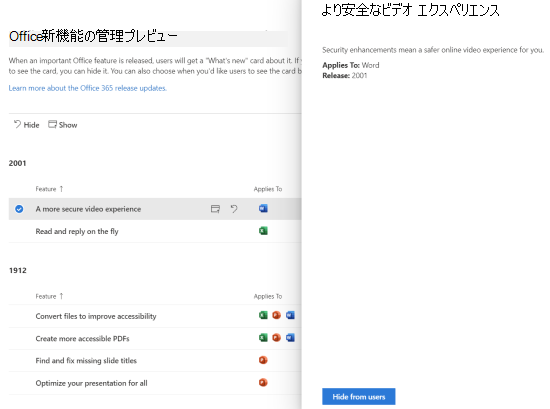

# Microsoft 365 管理センターの新機能

::: moniker range="o365-21vianet"

> [!NOTE]
> この記事の情報の一部は、21Vianet が運用している Office 365 には適用されない場合があります。

::: moniker-end

[Microsoft 365 管理センター](microsoft-365-admin-center-preview.md)に新機能を継続的に追加し、学習した問題を修正し、フィードバックに基づいて変更を加えています。 お客様が現在利用できるものを確認するには、次のようにしてください。 一部の機能は、お客様のさまざまなスピードでロールアウトされます。 機能がまだ表示されていない場合は、[対象のリリースに追加してみてください](manage/release-options-in-office-365.md)。

> [!IMPORTANT]
> **3月以降の "クラシック" 管理センターの退職**  
Microsoft 365 管理センターにサインインすると、毎回新しい管理センターに移動することになります。 そして3月に、従来の管理センターに切り替える機能を無効にし始めました。 現時点では、引き続き切り替えることはできますが、新しい管理センターにはパリティが設定され、それを超えると、すべての組織のスイッチがオフになります。    *最終更新日: 2020 年5月11日*

他の Microsoft クラウドサービスの新機能に興味がある場合は、次のことをご検討ください。

- [Exchange Online の新機能](https://go.microsoft.com/fwlink/?linkid=2119714)
- [Microsoft Intune の新機能](https://docs.microsoft.com/mem/intune/fundamentals/whats-new)
- [Microsoft 365 コンプライアンスセンターの新機能](https://docs.microsoft.com/microsoft-365/compliance/whats-new)
- [SharePoint 管理センターの新機能](https://docs.microsoft.com/sharepoint/what-s-new-in-admin-center)
- [Exchange 管理センターの新機能](https://docs.microsoft.com/Exchange/whats-new)
- [Office 更新プログラム](https://docs.microsoft.com/OfficeUpdates/)

## 2020 年 4 月

### Intune の役割管理

ご存知ですが、! 統合された役割の経験に対して2番目の手順を実行し、Microsoft 365 管理センターで Intune の役割を管理できるようになりました。 また、役割を検索したり、役割のアクセス許可を表示したりする機能を利用することもできます。 つまり、Microsoft 365 と Intune の役割を管理するために2つの別個のツールは必要ありません。 Microsoft 365 管理センターにサインインすると、[役割] ページには、Azure AD 用と Intune 用の2つのピボットがあることがわかります。

:::image type="content" source="../media/MAC-WN-IntuneRoles.png" alt-text="Intune ピボットが選択された [ロール] ページ":::

### メッセージセンターの投稿を Planner に同期させる

5月から、対象のリリースの管理者が、メッセージセンターの「Planner 同期」ボタンの表示を開始します。 アクションが必要なメッセージを追跡したり、追跡するメッセージの種類を選択したり、タスクとして追跡するメッセージを割り当てたり、後で確認するためにメッセージにタグを付けたりすることができるようになりました。

[目的指定リリースに参加](manage/release-options-in-office-365.md)して、作業を開始しましょう。

### "ヘルプが必要ですか" Teams 管理センター & セキュリティ/コンプライアンスセンターで開始される

Teams 管理センター、セキュリティセンター、コンプライアンスセンターが同じ "ヘルプが必要ですか?" を使用しています。 Microsoft 365 管理センターがヘルプを検索し、サポートに連絡するために使用する機能。 同じレベルのヘルプとサポートを必要としている管理者から多くのフィードバックを受け取りましたが、お客様にご提供いたします。 ご意見をお聞かせください。

#### チャットは必要ですか?

お客様のサポート担当者は、自宅で作業していても、お客様の場合は、インターネット帯域幅に関する制限を受ける一方で、お客様の通話品質に影響する可能性があります。 引き続きお客様をサポートするために、Microsoft 365 管理センターの商用のお客様向けに live chat のサポートオプションを開始しました。

サービスリクエストを作成すると、電話と電子メールに加えて、オプションとしてチャットが表示されるようになります。 コミュニケーションの優先チャネルとして [チャット] を選択し、要求を作成します。 要求を作成したら、Microsoft エージェントとチャットする準備ができたら、チャットを開始できます。

### Teams の更新

Teams の使用率が向上したため、管理に役立ついくつかの機能が追加されました。

- 管理センターのホームページの新しい推奨カードには、Teams を30日間使用していないユーザーが表示されます。 これらのユーザーにトレーニング用の電子メールを送信して、Teams を使用して開始できるようにすることができます。
- **Teams を使用**してユーザーをまとめる: [**セットアップ**] に移動して、ライセンスを持つユーザーのために teams を有効にし、ゲストアクセスを許可するための新しいページを表示します。これにより、teams で外部の顧客を操作することができます。
- これで、Microsoft Teams カードがホームページに既定で固定されます。 Teams が有効になっているかどうか、およびゲストアクセスが許可されているかどうかが表示されます。 また、新たにライセンスを付与された Teams ユーザーのセットアップ状態を確認し、ネットワークの問題が Teams ユーザーに影響を与える可能性があるかどうかを確認することもできます。
- 最後に、teams を含むライセンスを購入した場合、Teams は初期設定フローのステップになります。

### 生産性スコア

生産性スコアは、ユーザーが Microsoft クラウドサービスをどのように使用しているか、またそれらをサポートするテクノロジエクスペリエンスについての洞察を提供します。 スコアは従業員とテクノロジの実績に対して組織のパフォーマンスを反映し、自分のスコアを自分のような組織と比較します。 今月は、次のような新しい概念をプレビュー環境で紹介しています。

- ホームページおよびカテゴリ詳細ページに表示されるプライマリインサイトの傾向ビュー-エンドポイント分析とネットワーク接続のカテゴリがテクノロジに追加されました。
- 従業員の Experience カテゴリに表示される関連するテクノロジ環境の洞察
- 従業員の職歴の一部としての新しいコミュニケーションカテゴリ
- 従業員の Experience カテゴリに組織のメタデータが含まれるユーザーの詳細

詳細については、「ブログ: microsoft の[生産性スコアを使用して microsoft 365 の実績を評価し、改善](https://techcommunity.microsoft.com/t5/microsoft-365-blog/measure-and-improve-the-microsoft-365-experience-with-microsoft/ba-p/1348618)する」を参照してください。 生産性スコアは、現在プライベートプレビューになっています。 開始するに[は、生産性スコアのプライベートプレビューに参加](https://aka.ms/productivityscorepreview)します。

### グループの更新

今月のグループには、2つの更新プログラムがあります。

- Office 365 グループ (Outlook のグループとも呼ばれます) の電子メールアドレスを編集し、すぐに Microsoft 365 グループとして知らせることができるようになりました。
- フィードバックを聞き、グループを Microsoft チームに変換できない理由については、より明確なエラーメッセージを追加しています。

### ドキュメント、ビデオ、トレーニング

**Microsoft 365 ビデオシリーズの新機能**: 今月の記事では、microsoft Teams のロールアウト方法や、クライアントとパートナーとの接続を維持するためのリモート作業トレーニングリソース、新しい Microsoft 365 Business Voice plan など、リモート作業への小規模なビジネスへの移行を支援するためのヒントとリソースを紹介します。 [Microsoft 365 の新機能](https://go.microsoft.com/fwlink/p/?linkid=2118096)

#### ユーザーの場合

- [会議のスケジュールを設定する](https://support.office.com/article/c61b4f61-ee62-4a06-8bf7-0a1cd302700a)
- [Teams 会議に参加する](https://support.office.com/article/join-a-teams-meeting-078e9868-f1aa-4414-8bb9-ee88e9236ee4)
- [組織全体のチームを作成する](https://support.office.com/article/create-a-company-wide-team-037bb27a-bcc9-48fe-8d72-44d9482420a3)
- [チームを作成してゲストを追加する](https://support.office.com/article/create-a-team-with-guests-11fbb083-52ee-434d-8c6e-63711fdafac7)
- [ゲストとしてチームに参加する](https://support.office.com/article/join-a-team-as-a-guest-928d1eef-61e2-49ec-b754-c2fe86b34824)
- [グループ電子メールアドレスを作成する](https://support.office.com/article/create-a-company-email-address-ded875f9-a9de-437f-b559-2ae4f235bb2b)

#### 管理者およびビジネスオーナー向け

- [リモート作業でスモールビジネスを支援する](https://support.office.com/article/empower-your-small-business-with-remote-work-9b91a85a-39b4-40a6-a590-0f9bea0ba8e6) 
- [リモート小規模ビジネスを実行する](https://support.office.com/article/sign-up-for-a-microsoft-subscription-9ac1a0f1-789b-4143-b954-5821d5d89298)
- [Microsoft Business Basic にサインアップする](https://support.office.com/article/sign-up-for-a-microsoft-subscription-9ac1a0f1-789b-4143-b954-5821d5d89298)
- [2要素サインインの設定](https://support.office.com/article/sign-up-for-a-microsoft-subscription-9ac1a0f1-789b-4143-b954-5821d5d89298)

## 2020 年 3 月

### 特集フィードバックの修正: ライセンスの "ユーザーの追加" の信頼性を向上させる

ユーザーを追加する際にライセンスを割り当てることがどれほど難しいかについて、管理者から多くのフィードバックを受け取りました。 この修正プログラムに対する最初の更新プログラムを作成し、これらの要求を処理するために、より信頼性の高いバックグラウンドサービスに移行しました。 問題が発生した場合は、エラーメッセージが表示され、もう一度試してみることができます。

:::image type="content" source="../media/MAC-WN-ImprovedLicensing.png" alt-text="エラーを含むユーザー確認ページを追加します。":::

### Microsoft Teams ホームページカード

Teams の使用状況において uptick を使用すると、一部の組織は、teams をより見つけやすくするための固定されたダッシュボードカードを取得します。 また、このカードには、組織のリモート作業への移行を支援するためのトレーニングとドキュメントへのリンクもあります。 **ホーム**ページに移動するだけで新しいカードが表示されます。

:::image type="content" source="../media/MAC-WN-TeamsCard.PNG" alt-text="Microsoft Teams ホームページカード":::

### 組織の SharePoint モバイルアプリのテーマをカスタマイズする

Microsoft 365 管理センターを使用すると、iOS 用の SharePoint モバイルアプリと Android 用の SharePoint モバイルアプリで組織のテーマをカスタマイズできるようになりました。 この機能により、SharePoint Online と一致するモバイルイントラネットアプリの環境を、外出先で利用することができます。 テーマのカスタマイズには、ロゴの画像、ナビゲーションバーの色、テキストとアイコンの色、およびアクセントの色が含まれており、認識が容易になります。

:::image type="content" source="../media/MAC-WN-CustThemeSP.png" alt-text="管理センターの設定をモバイルアプリにマッピングする図。":::

:::image-end:::

### グループの追加ウィザードの機能強化

管理者が新しいグループを作成し、それを同時にチームにした場合、Teams を含むライセンスを持たない所有者を割り当てることができます。 そして、いくつかの頭痛がありました。 所有者が Teams のライセンスを持っていることを確認するためにウィザードフローを更新しましたが、グループをチームに切り替えられないようにするオプションが無効になっている場合。

### 小規模および中規模企業向けの Microsoft 365 オファーリング

これは来月のお知らせであることがわかっていますが、準備が整っていることを確認してください。

4月21日から、中小企業向けの Office 365 サブスクリプションと Office 365 ProPlus に関連する変更を行っています。 これらの製品は、Microsoft 365 ブランドを使用するようになります。

新しい製品名は2020年4月21日に有効になります。 これは製品名のみに変更され、現時点では価格または機能が変更されません。

|現在の名前 |新しい名前  |
|---------|---------|
|Office 365 Business Essentials     |   Microsoft 365 Business Basic      |
|Office 365 Business Premium     |    Microsoft 365 Business Standard     |
|Microsoft 365 Business     |    Microsoft 365 Business Premium     |
|Office 365 Business     |    Microsoft 365 Apps for business       | 
|Office 365 ProPlus    |   エンタープライズ向け Microsoft 365 アプリ      |

### ビデオ、トレーニング、ドキュメント

[Microsoft 365 web シリーズの新](https://go.microsoft.com/fwlink/p/?linkid=2118096)機能: 今月のエピソードでは、microsoft Teams の3年の記念日を強調しています。また、オンライン会議での音声品質の向上、交代アプリを使用した最初の回線管理者のための通信の対象化、Teams および Skype コンシューマーとの相互運用性などの新機能についても説明します。

## 2020 年 2 月

### 特集フィードバックの修正: 複数組織の切り替え

複数の Microsoft cloud または g を管理するという課題について、パートナーと管理者から多くのフィードバックを受けました。 最初の複数組織管理機能の1つとして、**組織の切り替え**があります。これにより、管理する組織を2回のクリックだけで変更できます。
> [!TIP]
> 少なくとも1つの組織のレコードのパートナーである限り、組織の切り替えが表示されないようにするには、何もする必要はありません。

1. Microsoft 365 管理センターで、組織名を選択します。
![[画面キャプチャ]: [組織] プロファイル名と [スイッチャー] アイコンが表示されているホームページの上部。](../media/MAC-Organization-switcher.png)

2. [組織の切り替え] で、管理する組織を選択します。
![[画面キャプチャ]: [組織] プロファイル名と [スイッチャー] アイコンが表示されているホームページの上部。](../media/MAC-OrgSwitcherSelected.png)

これは文字どおり!!!

### グループ

今月のグループ領域には、次の2つの変更が加えられています。

- **グループ名で並べ替え**: [**グループ名**] 列を選択することにより、グループの一覧をアルファベット順に並べ替えることができます。
- **削除された microsoft 365 グループを復元**する: 削除された microsoft 365 グループを復元するために、Exchange 管理センターに移動する必要はありません。 **Microsoft 365 管理センター** \> **グループ**の \> **削除された**グループに移動 \> します (リストからグループを選択) \> **復元グループ**。 グループを [**グループ**] ボックスの一覧に戻し、グループのメール、会話、ノートブック、ファイル、予定表を復元します。

### ビデオ、トレーニング、ドキュメント

- **Microsoft 365 ビデオシリーズの新**機能: 今月は、SharePoint Online のカスタム検索機能に重点を置いています。 Office の [新機能] 管理機能により、エンドユーザーは、アプリ内のヘルプウィンドウで特定の機能を表示または非表示にすることができます。また、Yammer の最新のセキュリティとコンプライアンスの更新プログラムを使用できます。 最新のエピソード: [Microsoft 365 の新機能](https://go.microsoft.com/fwlink/p/?linkid=2118096)

- **Docs 引っ越し**: Office 365 管理 web の記事を Microsoft 365 のコンテンツと組み合わせたもので、新しい URL に気付いたかもしれません。 たとえば、この記事は、 **docs.microsoft.com/Office365/Admin/whats-new-in-preview**にホストされていますが、URL は ' **docs.microsoft.com/microsoft-365/admin/whats-new-in-preview**"になります。 ページのブックマークがある場合は、リンクを更新する必要があります。ただし、コンテンツリンクは新しいコンテンツリポジトリにリダイレクトされます。

## 2020年1月-新年

> [!NOTE]
> YouTube に関する Microsoft 365 ビデオシリーズの[新機能](https://go.microsoft.com/fwlink/p/?linkid=2118096)についてご存知ですか? ユーザーに展開された最新の機能が強調されています。 毎月、「[ビデオ、トレーニング、およびドキュメント](#videos-training-and-docs)」の最後のエピソードへのリンクを開始します。     最新のエピソード: [Microsoft 365 の新機能](https://go.microsoft.com/fwlink/p/?linkid=2118096)

### ダークモード

最初に暗色モードを展開したときは、ホームページ上でのみ使用できます。 暗いモードはプレビューができないようになり、管理センターのほとんどのページで対象となるリリースにあります。

1. 最初に、対象指定リリースを有効にする必要があります。 [**設定**の設定] [ \> **Settings** \> **組織プロファイル**のリリース環境設定] に移動 \> **Release preferences**します。
1. 次に、暗色モードを有効にするには、**ホーム**ページに移動し、[**暗色モード**] ボタンを選択します。 (これは**検索**フィールドと、この記事の**最新情報**のリンクの後にあります)。
1. 暗色モードを使用できる任意のページでは、ボタンがページの上部に表示され、**新しい管理センターの**横にトグルが表示されます。

### Office の新機能の管理

管理者は、Microsoft が Office アプリのユーザーに "新機能" を連絡する方法を制御する必要があります。これで、このコントロールを使用できるようになります。 [**設定**] に移動して、 \> **新しい管理プレビュー**を表示します。 詳細を表示する機能を選択し、[**ユーザーに表示**しない] ボタンを選択すると、ユーザーに特定の "新機能" メッセージが表示されないようにすることができます。 たとえば、組織内のすべてのユーザーがその機能についてトレーニングを受けるまで、その機能についてユーザーに知らせることができます。

この機能は、最初は11月にリリースされましたが、次の点について理解しておく必要がある機能更新プログラムがあります。 [Office の新機能プレビューの更新プログラムが利用可能になり](https://techcommunity.microsoft.com/t5/microsoft-365-blog/office-what-s-new-management-preview/ba-p/1020438)ました

### パートナー

パートナーについて (自分で手助けできませんでした)今月も更新プログラムをご用意しました。 パートナーが、管理センターの [**課金アカウント**] セクションで Microsoft カスタマーアグリーメント (MCA) に同意するオプションを選択できるようにする新機能が用意されています。 この新しい機能について:

1. お客様は、パートナー関係と MCA を受け入れるためのリンクを含む招待メールを受信します。
2. お客様は、サインインした後、MCA とパートナーのアクセス許可を管理センターから表示して承諾することができます。

### リソース メールボックス

リソースメールボックスリストが新しいスタイルに更新されました。 Microsoft 365 管理センターで、[**リソース** \> **ルーム & 装置**] に移動します。

### ビデオ、トレーニング、ドキュメント (1 月)

1月にリリースされた small business 管理者トレーニングを確認します。

- [ビジネス web サイトを作成する](https://support.office.com/article/3325d50e-d131-403c-a278-7f3296fe33a9)
- [回答とヘルプを検索する](https://support.office.com/article/7f681212-c649-4a3e-a43b-32b1d1e58988)
- [ヘルプまたはサポートを取得する](https://support.office.com/article/18948a4c-3eb1-4b30-b1bc-a4cc29eb7655)
- [ユーザーを削除する](https://support.office.com/article/6bcdad7b-732a-4260-997a-8c176bc3d9d6)
- [Microsoft サブスクリプションを選択する](https://support.office.com/article/b9f7c78e-430f-4117-89ec-2eeb1dced2ca)
- [Microsoft 365 for business のセキュリティの概要](https://support.office.com/article/3274b159-a825-46d7-9421-7d6e209389d1)

## 2019年11月と12月

Ignite 後に提供するお知らせが非常に少ないため、11月と12月のニュースを統合しています。 新しい年を参照してください。

### クレジットカードから請求書の支払への変更

支払い方法をクレジットカードから請求書に変更する機能を展開し始めています。 [製品の**請求**] に移動し、 \> **Your products**サブスクリプションを選択してから、クレジットカードの支払いの横にある [**編集**] リンクを選択します。

![[画面キャプチャ]: 支払い方法としてクレジットカードを使用して、サブスクリプションカードの請求セクション。](../media/MAC-BillingEditCreditCard.png)

詳細については、「」を参照してください。 [クレジット カードまたは銀行口座から請求書に変更する](../commerce/billing-and-payments/change-payment-method.md)

### グローバル閲覧者

[Ignite Edition 2019](#october-2019---ignite-edition)ではグローバルリーダーの役割について説明していましたが、より広範に展開されているため、いくつかの詳細について説明します。

- グローバルリーダーの役割は、グローバル管理者の役割に対応する読み取り専用の役割です。 グローバルリーダーは、グローバル管理者がアクセス許可を持っているすべてのものを表示できます。
- 一部のコンプライアンス機能やセキュリティ機能といったいくつかの例外により、グローバル閲覧者は、組織で使用するライセンスを持っているすべての Microsoft cloud admin センターを表示するアクセス権を持っています。
- グローバル閲覧者の役割は、計画、監査、調査に必要なユーザーに割り当てます。
- グローバル閲覧者の役割を、アクセス許可が少ない別の役割と組み合わせることもできます。 たとえば、小規模な企業の所有者に**課金管理**のグローバル閲覧者の役割が割り当てられていることがあり  +  **Global reader**ます。これにより、課金を支払い、クラウド組織への変更を常に把握することができます。
- グローバル閲覧者は、Microsoft 365 管理センターの任意のページに移動できます。 編集可能なページを開くと、変更を保存する権限がないことを示す警告が表示され、[保存] ボタンは無効になります。

グローバルリーダーの役割と、今後表示する役割に基づくアクセス許可についてのフィードバックをお寄せいただけます。 [役割に基づくアクセス許可のフィードバックを提供する](https://office365.uservoice.com/forums/273493-office-365-admin/suggestions/10115430-have-a-consistent-experience-when-assigning-admin)

### [新しい設定] ページ

[**組織プロファイル**]、[**セキュリティ & プライバシー**]、および [**サービス &** ] の各ページはすべて、縦に3つのタブがある1つのページにまとめられています。 また、ベストパーツ--1 つの場所から、すべての設定を検索できるようになりました。
![画面のキャプチャ: ページの上部で強調表示された [すべての設定の検索] フィールドがある [設定] ページ。](../media/MAC-SettingsMultiPivotSearch.png)

### & ドキュメントのトレーニング

このセクションでは、この記事の新機能について説明します。新しいトレーニングとドキュメントへのリンクを開始します。ここでは、興味があると思われます。

11月には、IT 担当者が Microsoft 365 について学習し、トレーニングを受けることができるようにするための、 [microsoft](https://docs.microsoft.com/learn/)ラーニング web サイトへのいくつかの学習パスをリリースしました。 確認してください。

- [Microsoft 365 の基本事項](https://docs.microsoft.com/learn/paths/m365-fundamentals/)
- [Office の基本事項を拡張する](https://docs.microsoft.com/learn/paths/extend-office-fundamentals/)
- [Microsoft 365-エンタープライズ展開を Windows 10 および Microsoft 365 アプリでエンタープライズ向けに改革する](https://docs.microsoft.com/learn/paths/m365-getmodern/)
- [Microsoft 365 でエンタープライズ展開を管理する](https://docs.microsoft.com/learn/paths/manage-enterprise-deployment-m365/)
- [大規模な IT 向け Microsoft Office のアップグレード](https://docs.microsoft.com/learn/paths/m365-office-for-it/)
- [Windows 仮想デスクトップを使用して Azure からリモートデスクトップとアプリを配信する](https://docs.microsoft.com/learn/paths/m365-wvd/)
- [Microsoft 365 と Surface for Business で職場を最新化する](https://docs.microsoft.com/learn/paths/modernize-workplace-with-m365-and-surface/)
- [Microsoft 365 での ID の保護とアクセス](https://docs.microsoft.com/learn/paths/m365-identity/)
- [Microsoft 365 で企業情報を保護する](https://docs.microsoft.com/learn/paths/m365-information-protection/)
- [Microsoft 365 を使用してセキュリティを管理する](https://docs.microsoft.com/learn/paths/m365-security-management/)
- [Microsoft 365 と Microsoft Threat Protection を使用して脅威から保護する](https://docs.microsoft.com/learn/paths/m365-security-threat-protection/)
- [Microsoft Teams を使用してチームの共同作業を管理する](https://docs.microsoft.com/learn/paths/m365-manage-team-collaboration/)
- [Microsoft 365 で SharePoint を使用して共同作業する](https://docs.microsoft.com/learn/paths/m365-teams-sharepoint/)

## 2019年10月-Ignite エディション

Microsoft 365 管理センターの [新機能] の Ignite Edition へようこそ! もちろん、これはお知らせの完全なリストではありませんが、いくつかの重要な点があります。 また、リリースに関する詳細な情報については、Ignite ブログをご覧ください。

- [Microsoft 365 の管理者セキュリティ、生産性、およびネットワーク機能の強化](https://techcommunity.microsoft.com/t5/Microsoft-365-Blog/ADMIN-Security-Productivity-and-Network-Enhancements-for/ba-p/964019)。
- [Microsoft Teams の新機能-Ignite 2020](https://techcommunity.microsoft.com/t5/Microsoft-Teams-Blog/What-s-New-in-Microsoft-Teams-Ignite-2019/ba-p/937025)。

### 役割ベースのアクセス制御

6月にロールアウトを開始して以来、管理センターの役割には多くの変更が加えられています。

- **役割の比較**-最大3つの役割を選択して、それぞれのアクセス許可を比較します。 これは、ユーザーに割り当てる最低限の制限のない役割を見つけるのに役立ちます。 [**役割**] に移動し、最初の列の [複数選択] チェックボックスを使用して [最大3つのロール] を選択し、[**ロールの比較**] を選択します。

    

- **お気に入り**-お気に入りまたはよく使用する役割に星を追加して、列を並べ替えたりフィルターを作成したりして簡単に見つけられるようにすることができます。
- **アクティブユーザー**  > **役割を管理**する-これは、役割の変更に合わせて更新されました。 役割リストと同様に、役割の既定の一覧を最も有用なものにスコープを設定しましたが、すべての役割を表示するには、[**カテゴリ別にすべて表示**] を展開します。
- **グローバル閲覧**者の役割-要求されたのは! そうです！ [グローバルな閲覧](add-users/about-admin-roles.md#roles-available-in-the-microsoft-365-admin-center)者の役割

### 問題の報告

サービス正常性が新しいスタイルに更新され、サービス正常性ダッシュボードに表示されない問題の影響を受ける場合は、Microsoft に知らせるための**問題を報告**することができます。 [**正常性**  >  **サービスの正常性**] に移動します。

### 「ウイルス」サブスクリプション

ご存知のとおり、ユーザーは Power BI とアプリ接続のような無数の製品に対する無料サブスクリプションを有効にすることができます。 これで、ユーザーが試行していた "ウイルスされたサブスクリプション" が表示されるようになりました。 [ **Billing**  >  **製品の**請求] に移動します。 ユーザーが購入したサブスクリプションを表示するには、[サブスクリプション] タブの [**アカウントの種類**のフィルター] を選択します。 必要であれば、アカウントからこれらのサブスクリプションを削除することができます。

### ユーザー テンプレート

テンプレートを使用すると、これらのユーザーの共有設定を保存して再利用することで、多くのユーザーを簡単に追加できます。 役割、割り当てられたライセンス、連絡先情報、場所などの値を保存できます。 テンプレートを使用して新しいユーザーを作成すると、これらの設定の保存した値が自動的に取得されます。 **Users**  >  [**アクティブな**ユーザー] に移動し、**ユーザーテンプレート**を選択して、試してみます。

### Office の [新機能] 管理 (プレビュー)

Office アプリに重要な Office 機能がリリースされると、ユーザーは新機能について説明する "新機能" カードを入手できます。 ユーザーにカードが表示されないようにするには、そのカードを非表示にします。 また、ユーザーがカードを表示するタイミングを選択することもできます。 [**設定**]  >  **の [Office の新機能**] で、確認してください。

### SharePoint URL の変更

技術的には、このことはマイクロソフトの365管理センターのニュースではありませんが、このニュースが表示されるようにしたいと考えています。
> [!IMPORTANT]
> 通常の URL を使用して SharePoint 管理センターにアクセスできるようになります。[https://admin.microsoft.com/SharePoint](https://admin.microsoft.com/SharePoint)

詳細については、「 [SharePoint 管理センターの新機能](https://docs.microsoft.com/sharepoint/what-s-new-in-admin-center)」を参照してください。

## 2019 年 9 月

Ignite 2019 では、いくつかのエキサイティングな機能リリースに対して、現在、9月にリリースされたいくつかの新機能を発表しています。 しかし、来月の記事については、Ignite の最初の日に公開されることにご注目ください。

### 特集フィードバックの修正–削除されたユーザーのメールボックスを共有メールボックスに変換するオプションが戻る

フィードバックに反応がなく、削除されたユーザーのメールボックスに他のユーザーがアクセスできるようにする機能が、**共有メールボックス**に変換されていたことを耳にしました。 これをユーザーの削除ウィザードに追加すると、データに対して行う処理を決定できます。

- メール: 削除されたユーザーのメールボックスに他のユーザーがアクセスできるようにするには、共有メールボックスに変換します。
- ファイル: OneDrive ファイルを保存して、他のユーザーにアクセス権を付与します。
- アクセス許可: 他のユーザーがこのメールボックスにアクセスできる場合に、アクセス許可を削除します。
- エイリアス: メールエイリアスを削除して、他のユーザーがすぐに使用できるようにします。

### 最初のセットアップ

最初のセットアップウィザードの別の更新プログラムがあります: Microsoft 365 for business。 手順は合理化されており、セットアップタスクの2つをセットアップページに移動しました。

- **セキュリティで保護された windows 10 コンピューター** -ポリシーを設定して、ハッカーによる windows 10 デバイスのウイルス、マルウェア、攻撃からの保護を強化します。
- **Office を自動的にインストール**する-この機能をオンにし、ユーザーが Pc を Microsoft 365 Business に接続している場合は、そのコンピューターが最新の Office アプリに自動的に更新され、最新の状態に保たれます。

## 2019 年 8 月

### 請求

今月の請求書とサブスクリプションの更新プログラムが提供されています。

- デバイスベースのサブスクリプション: microsoft 365 管理センターのデバイスに**対して、microsoft 365 アプリの教育 (デバイス)** ライセンスを割り当てるか、または割り当てを解除することができます。 **Microsoft 365 の教育機関向けアプリ (デバイス)** は、ライセンスをデバイスに割り当てることができるアドオンライセンスです。 [製品**の請求**] に移動し  >  **Your products** 、ライセンスを検索して購入します。
- ユーザーベースのライセンス管理:**ユーザー**の  >  **アクティブユーザー**のライセンスを新しいスタイルに割り当てる方法を更新しました。 詳細については、以下を参照してください。
  - [ユーザーにライセンスを割り当てる](manage/assign-licenses-to-users.md)
  - [ユーザーからライセンスの割り当てを解除する](manage/remove-licenses-from-users.md)

### セットアップページの更新

セットアップにはカテゴリとセクションが用意されています。このセクションには、機能を有効にして組織をセットアップする際に、次の手順を**実行すること**をお勧めします。 セットアップするための新機能も追加しました。

- **Office Advanced Threat Protection** -組織が office ATP を使用するためにライセンスされていて、まだ構成されていないか、またはまだ有効になっていない場合は、このページが表示されます。 [**セットアップ**] に移動して試してみてください。

### 問題を報告する (8 月)

サービス正常性ダッシュボードに表示されていない問題の影響を受けている場合は、[**問題の報告**] 機能を使用すると、迅速かつ簡単にお知らせを得ることができます。 [**正常性**  >  **サービスの正常性**] に移動します。

## 2019 年 7 月

### メッセージ センター

メッセージセンターは新しいデザインに更新され、見栄えがよくなりました。

![画面の取り込み: [すべてのアクティブなメッセージ] タブが選択され、[フィルター] メニューが開いたメッセージセンターが更新されました。](../media/MAC-MessageCenterUpdated.png)

- **状態別にメッセージ**を表示できるようになりました。 いずれかのタブを選択します。**すべてのアクティブなメッセージ**、**重要度の高い****メッセージ、未開封**のメッセージ、**メッセージは無視**されます。
- カテゴリ**データのプライバシー**を使用してフィルター処理したり、**変更を計画**したり、**問題を解決**したり、メッセージカテゴリを**通知**したりすることもできます。
- リストからメッセージを選択すると、コマンドバーにいくつかのオプションがあります。 [**閉じる**]、[開封済みにする] または [**未読**にする] または [**共有**] として**マーク**します。
- また、メッセージを開くときには、さらに次のオプションがあります。
  - 後で保存したり、同僚と共有したりするには、メッセージのリンクをクリップボードにコピーします。
  - メッセージを**開封**済みまたは**未読**としてマークします。
  - メッセージについてのフィードバックを提供します。 [ **Like** ] または [**気に入ら**ない] を選択すると、このメッセージに関するフィードバックを提供するように求めるフィードバックウィンドウが開きます。

### ナビゲーションウィンドウのインテリジェンス

 これで、ナビゲーションウィンドウには最後の操作が記憶され、最後の状態で作業中のウィンドウが表示されます。 また、頻繁に使用されるアイテムが既定で表示されるようになります。

### セットアップページ & 最初のセットアップ

お客様の組織をセットアップするのに役立ついくつかの変更が加えられました。 最初に、**セットアップ**と**セットアップページ**の違いについて説明します。 **セットアップ**は、Microsoft のオンラインサービスへのオンボードに使用した初期セットアップウィザードを参照します。 これには、通常、**ドメインの接続**、**ユーザーの追加**、および**Office アプリのダウンロードの**3 つの手順が含まれています。 [**セットアップ] ページ**は、ライセンスを購入した機能をオンにするなど、サブスクリプションを最大限に活用できるようにするために推奨されるタスクを設定した管理センターのページです。

- **セットアップ**- **Microsoft 365 for business**サブスクリプションの初期セットアップウィザードが更新されました。 この新しい設計により、新しい組織はウィザードを迅速に、さらに成功することができます。
- [**セットアップ] ページ**-[**セットアップ**] ページでは、サブスクリプションに付属するサービスのセットアップとセキュリティの設定を完了するのに役立つ情報が表示されます。 [**セットアップ**] ページで、非表示の推奨事項を確認することもできます。 サブスクリプションで利用できるかどうかを確認するには、 **Microsoft 365 管理センター**のセットアップに移動し  >  **Setup**ます。

### 請求 & のサブスクリプション

- **ソフトウェア**製品の種類-クラウドサービスプロバイダー (CSP) を通じて購入されたソフトウェア製品を表示できるようになりました。 ダウンロードとキーを表示するには、 **Billing**[  >  **製品**  >  **ソフトウェア**の請求] タブに移動します。
- Microsoft またはサードパーティプロバイダーから購入したかどうかにかかわらず、Microsoft 365 管理センターから最新の Azure 製品とサービスを表示することができます。 最近使用した Azure 製品の例を以下に示します。
  - Azure で予約されている仮想インスタンス
  - Azure サポートプラン
  - Azure ハイブリッド使用の利点 (AHUB)
  - アプリケーションを管理する
  - デバイスサービス
  - Azure サブスクリプション

### 多要素認証を簡素化する

管理者は、組織内の機密情報にアクセスできます。 すべての管理者に、サインイン時に多要素認証を使用するように要求します。 新しいウィザードは、1つの手順で完了するのに役立つ情報を得られます。 試してみるには、**セットアップ**の [  >  **サインインのセキュリティを強化**する] に移動します。

### ユーザー

**削除さ**れたユーザーおよび**ゲストユーザー**ページが新しいスタイルに更新されました。

- **ゲストユーザー**: SharePoint または OneDrive からファイルを表示または共有するように招待することにより、ゲストユーザーを追加します。 **ユーザー**はゲストユーザーを表示でき  >  **Guest users**ます。
- **削除**されたユーザー: 更新された**削除済みのユーザー**ページで、以前の管理センターですべての操作を実行できますが、列を追加および削除することになりました。 また、さまざまな列オプションを選択できます。 実際には、[**アクティブなユーザー** ] ページで選択できるのと同じ列です。

## 2019 年 6 月

### おすすめのフィードバック要求-ダークモード

管理センターを暗いモードで表示することはプレビューにあります。 すぐに**ホーム**ページでテストすることができます。 [**ホーム**] ページでは、コマンドバーの [**新機能**] リンクの横に [**濃色モード**] ボタンが表示されます。

### 役割管理

6月末に、管理者の役割を管理するための新しい方法を展開し始めました。 利用できるようになったら、[**役割**の役割] に移動し  >  **Roles**ます。 それまでは、すばらしいことになります。
    

この新しい機能により、管理者のアクセス許可を持つユーザーを簡単に確認できるようになり、管理者に適切なレベルのアクセス権を付与する役割を割り当てることができます。 また、複数の管理センターに時間を浪費しないように、Azure AD からの役割も追加しました。
他にどのような方法がありますか。

- Microsoft 365 で Azure Active Directory の役割が割り当てられている組織内のすべての管理者の一覧をエクスポートします。  
- 特定の役割に割り当てられたすべての管理者を表示したり、特定の役割に対して管理者を追加または削除したり、名前とキーワードで役割を検索したり、各役割でユーザーが実行できる操作を調べたりできます。
- 特定の役割をすばやく検索し、フィルターを作成します。

### 支払い方法

サブスクリプションの支払い方法が更新されました。 **課金請求書**  >  **&** 支払い  >  **方法**に移動します。 支払い方法はリストビューに表示されます。 リスト内のアイテムを選択して削除し、編集して、その支払い方法が関連付けられているサブスクリプションを簡単に確認します。

## 2019 年 5 月

### おすすめの修正プログラム-大文字と小文字が区別される

これで、共有メールボックス、連絡先、リソース、およびメールボックスのアクセス許可を検索するときに、検索用語を大文字と小文字を区別する必要はありません。

**ユーザーおよびグループの管理**今月は、**ブロックユーザー**、パスワードの**リセット**、**連絡先**リストビュー、**グループ**リストビュー、および**グループ**の詳細ページを新しい管理センターのスタイルに更新しました。

- [新しい**グループ**] リストビューでは、グループに関する豊富なデータが得られます。また、データの表示方法をカスタマイズしたり、データの表示方法を記憶するグループの一覧をカスタマイズしたりできます。 たとえば、 **teams を使用**してグループにフィルターを適用して、グループがチームの一部であるかどうかを確認し、teams の [**状態**] 列を追加できるようになります。
- また、[グループ] リストには、クイックアクションやコンテキストコマンドバーなど、ユーザー管理のリストの経験に加えられたすべての機能強化が含まれます。

**推奨** 
管理センターに新しい推奨事項ポップアップが表示されることがあります。これで、4つの新しい記事が追加されました。 お客様の組織にとってメリットがあると思われる場合にのみ、推奨事項が表示されます。 ただし、カードライブラリから追加できる推奨事項が表示されるまで待機しないでください。

- **パスワードの有効期限**-パスワードを**無期限**に設定することをお勧めします。 また、組織の設定が異なる場合は、この推奨事項が表示されることがあります。
- グローバル管理者の数が多すぎるため、グローバル管理者が多すぎるために**セキュリティ上の**脅威が発生した場合、グローバル管理者が4人を超えると、この推奨事項が表示されます。 ユーザーには、自分の作業を完了するために必要なアクセスのみを許可することをお勧めします。
- **Intune デバイス保護**-ライセンスに intune が含まれていて、intune の設定が完了していないか、デバイスを登録していないことが検出された場合は、ユーザーがモバイルデバイスからアクセスしたときに組織のファイルを保護するための intune ポリシーを作成することをお勧めします。
- **Office の月単位の機能の更新プログラムを入手**してください。 office の月単位の更新プログラムを取得すると、ユーザーの満足度が高くなるというご意見をお待ちしています。 そのため、非常に小規模な企業で、6か月ごとに Office 機能の更新プログラムを入手している場合は、この推奨事項が表示されます。

**設定**  
設定については、大幅に変更が加えられています。 ほとんどの場合、既存の設定を新しい管理センターのスタイルに更新するだけです。 前に見たことがない新しい設定を追加して、その設定を追加していくと、ここで紹介します。 また、「**先進認証**」という1つの設定をアナウンスしました。 はい、**モダン認証**を有効にするための新しい設定があります。 これを確認するには、[ **Settings**  >  **Services & アドイン**の  >  **モダン認証**] に移動します。

## 2019 年 4 月

管理センターでは、どのようなものが見栄えよく表示されます。 フィードバックと提案を読んで、ほとんどの質問に回答しています。実際には、心に答える必要があります。 もちろん、以前の管理センターとの間ですべてが確実にパリティになるように、作業を行っています。 新機能を展開すると、すぐには取得できない場合があることを覚えておいてください。

### おすすめ機能-ユーザーを追加する

4月に、**ユーザーの追加**ウィザードが表示され、手順を追って説明しています。待機時間ユーザーを追加する。 これは、電子メールや表示名などのユーザーの基本情報を追加し、ライセンスと役割を割り当て、連絡先情報を追加した後、ユーザーのアカウントを確認するための、コミット前の手順です。 **なぜこの変更を行ったのですか。** 以前の経験でユーザーを追加するために、ほぼ無限のスクロールを使用していなかったというフィードバックを聞きました。
    

確認するには、次の2つの方法があります。  

1. **ホーム**ページで、[**ユーザー管理**カードから**ユーザーを追加**する] を選択します。 ウィザードはすぐに開きます。そのため、**ホーム**ページで実行している作業から移動する必要はありません。
2. [**ユーザー**  >  の**アクティブユーザー**] に移動して、コマンドバーから [**ユーザーの追加**] を選択します。
  

**ユーザー管理**にいくつかの変更が加えられました。次に、簡単な一覧を示します。

- [**役割の管理**] ウィンドウが新しいスタイルに更新され、アクセス可能になりました。 また、[ユーザーの**ブロック**] を更新し、ユーザーウィンドウを新しいスタイルに**削除**しました。
- **製品ライセンスの管理**コマンドバーで変更された位置を管理します。
- ユーザーの写真の変更が簡単になりました。 [**アクティブなユーザー** ] で、ユーザーを選択し、画像の下にある**写真を変更**します。

### しかし、しばらくお待ちください。 他にもまだあります

- **ホーム**ページには、ドメインの追加、ユーザーの追加、Office アプリのダウンロードなどのセットアップの手順をまだ完了していない場合に表示される新しいセットアップバナーが用意されています。
- **グループ**の一覧と詳細ウィンドウが新しいスタイルに更新されました。 [**グループ**グループ] に移動し  >  **Groups**て変更を表示します。
  - グループについては、「 **Microsoft Teams** 」タブを [グループの詳細] ウィンドウに追加しました。これにより、microsoft 365 グループをチームに切り替えることができます。 グループを "teamify" にするには、一覧から Microsoft 365 グループを選択し、[ **Microsoft Teams** ] タブを選択して、[**チームの作成**] を選択します。 グループが既にチームの場合は、 **Teams 管理センター**から管理するためのリンクが表示されます。
  - 最後に、 **Teams の状態**を**グループ**リストに追加することができます。 列見出しで、[**列**のチームの状態の保存] を選択し  >  **Teams status**  >  **Save**ます。
- **新しい制限付き管理者の役割**-ユーザーに必要なアクセスのみをユーザーに提供できるように、いくつかの新しい管理者の役割を解放しました。
  - **Kaizala admin**: この役割のユーザーには、Microsoft Kaizala 内のすべての管理タスクを実行するアクセス許可があります。これには、Kaizala ディレクトリでのユーザーの作成と管理、Kaizala グループの管理、アクションカードおよびコネクタの管理、およびサービス要求の作成が含まれます。
  - **検索管理者**: この役割のユーザーには、microsoft 365 管理センターのすべての microsoft 検索管理機能への完全なアクセス権があります。 検索管理者は、検索管理者と検索エディターの役割をユーザーに委任し、ブックマーク、Q&のアイテム、場所などのコンテンツを作成および管理できます。 さらに、これらのユーザーは、メッセージセンターの表示、サービスの正常性の監視、およびサービス要求の作成を行うことができます。
  - **検索エディター**: この役割のユーザーは、ブックマーク、Q&のアイテム、場所など、microsoft 365 管理センターで microsoft Search のコンテンツを作成、管理、および削除できます。
- 今月の**請求**変更には、bonanza があります。
  - 既存のクレジットカードを削除して再度追加することなく、CVV を更新できるようになりました。 CVV を更新するには、[ **Bills**  >  **支払い方法**(請求書) に進みます。
    - お客様の**請求書**を見つけて、自分のアカウントが持つことができる請求の問題を把握することが容易になりました。 これで、PDF をダウンロードするのではなく、web ブラウザーで請求書を表示できるようになります。 [請求**書] に移動**  >  **Invoices**します。
    - [**製品**] ページで、同じ種類の複数のサブスクリプションを取得した場合は、サブスクリプション情報を集計することになりました。

## 2019年3月-管理センターが正式にリリースされました。

おもしろいニュースを見逃した場合、新機能と強化された Microsoft 365 管理センターを正式にリリースしています。 これを発表したブログ投稿は次のとおりです。[新しい Microsoft 365 管理センターが現在利用可能](https://techcommunity.microsoft.com/t5/Microsoft-365-Blog/The-new-Microsoft-365-admin-center-available-today/ba-p/377870)です。 3月の場合は、ブログの投稿を参照してリリースされた機能をチェックアウトします。また、近日中にリリースされている機能の投稿を読むこともできます。これは、コアコンテンツでは許可されていません。
    
ご説明したいと考えている**課金 &** の [サブスクリプション] 領域には、1つの変更があります。 ここでは、概要を理解していなかったということです。 ! 実際、今月は **、課金アカウントへの**パートナー関係を管理する機能を追加しました  >  **Billing accounts**。 ここから、アドバイザー、CSP、および間接リセラー間でパートナー関係を確認できます。 また、代理管理者のアクセス許可を含む、パートナーとの新しい関係要求を受け付けることもできます。

常にお客様からのフィードバックは重要なので、そのままにしておいてください。 管理センターの任意のページで、右下の [**フィードバック**の送信] を選択してフィードバックを送信することができます。次に、[**ヘルプが必要ですか?]** をクリックします。

## 2019年2月、請求 & サブスクリプションのエディション

今月は、「課金とサブスクリプション」と呼ばれるエリア affectionately に加えたすべての機能強化について取り上げます。 以前は、affectionately を参照しなかったことがありますが、ここではご存知でしょう。

- **支払い方法**-お支払い方法の更新に関するフィードバックは困難でしたが、それに関するさまざまな変更が加えられました。 **Billing**  >  **支払い方法**に移動します。 Visa カードなどの支払い方法と、それに関連付けられているサブスクリプションを簡単に確認できます。 支払い方法の一覧で、[**その他**] メニュー (有効期限の横に3つの小さな点) を選択し、[**サブスクリプションの表示**] を選択します。 [**その他**] メニューを使用して、支払い方法を編集および削除することもできます。
- **課金アカウント**-対象のリリースのお客様には、最初に新しい課金アカウントページが表示されます。その後、世界全体に展開します。 利用可能になったら、**課金**  >  **アカウント**に移動します。 新しい課金アカウントページでできること おめでとうございます。
  - 組織プロファイル内のアドレスやその他の連絡先情報をこのページから直接更新します。 **Settings**  >  必要でない限り、[設定]**組織プロファイル**に移動する必要はありません。
  - また、直接またはボリュームライセンスのお客様にとっても、お客様は**課金アカウント**を使用して顧客契約を承諾して確認することができます。 また、他の組織と接続することにより、またはを相互にリンクしてライセンスとリソースを共有することもできます。
- また、いくつかの小さな機能強化とバグ修正も行いました。
  - 請求書の支払いを使用してサブスクリプションを再アクティブ化する
  - サブスクリプションのサービス使用法のアドレスを編集する
  - [インベントリの詳細] ページでは、通知の拡張機能が追加されています。ここでは、作業を行うことができる実際のページにリンクします。また、インベントリの詳細カードには、さらに多くの操作があります。 **Billing**  >  **Bills**  >  請求書の請求書の**詳細を表示**します。

## 2019年1月-新年

- 引き続き**services & アドイン**を追加しました。 [アドイン] ページ **& > services の設定**を更新しました。 統合されたアプリまたはレポートを試して、最新のを確認します。
- **改善点を検索する** コマンドバーの**検索**ボックス以外は表示されません。 タスクを検索できるように更新されました。 たとえば、[パスワードのリセット] または [ユーザーの追加] を試してみてください。

### 特集フィードバックの修正-ライセンスとアプリ

ユーザーの詳細ウィンドウで、**ライセンスとアプリ**をフィードバックに基づいて再統合しました。 最初に2つの機能を分離して、すべてのライセンスの詳細とすべてのアプリの可能性を提供しています。 ご存知のように、ライセンスとアプリを2つのウィンドウに分けて混乱させることができました。 ライセンスとアプリケーションが1つのタブにまとめられています。これで、1つのウィンドウでユーザーに割り当てられたすべてのライセンスでアプリが無効になるようにすることができます。 牛乳および cookie。 ライセンスとアプリ。 これで取得します。

チェックアウト: ユーザーが**アクティブなユーザー >** ユーザー **> ライセンスとアプリを**編集または追加 >
