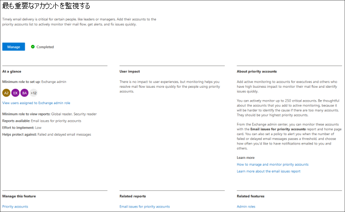
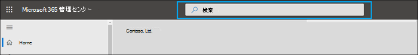
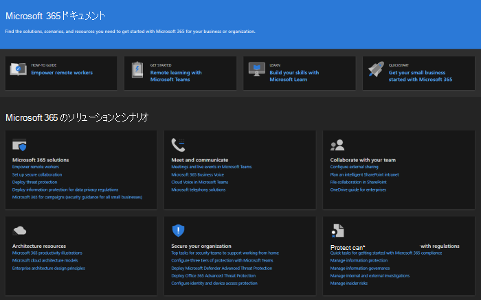

# 新しい機能Microsoft 365 管理センター

::: moniker range="o365-21vianet"

> [!NOTE]
> この記事の一部の情報は、21Vianet がOffice 365に適用されない場合があります。

::: moniker-end

[Microsoft 365 管理センター](Microsoft 365 管理センター](admin-overview/admin-center-overview.md の概要)に継続的に新機能を追加し、学習した問題を修正し、フィードバックに基づいて変更を加えます。 以下を見て、今日利用可能な機能を確認してください。 一部の機能は、お客様に異なる速度で展開されます。 まだ機能が表示されない場合は、ターゲットリリース [に自分自身を追加してみてください](manage/release-options-in-office-365.md)。

他の Microsoft クラウド サービスの新機能を知りたい場合は、次の手順を実行します。

- [新しい機能Azure Active Directory](/azure/active-directory/fundamentals/whats-new)
- [管理センターの新機能Exchange](/Exchange/whats-new)
- [Microsoft Intune の新機能](/mem/intune/fundamentals/whats-new)
- [新しい機能Microsoft 365 コンプライアンス センター](/Office365/SecurityCompliance/whats-new)
- [Microsoft 365 Defender の新機能](../security/mtp/whats-new.md)
- [SharePoint 管理センターの新機能](/sharepoint/what-s-new-in-admin-center)
- [Office 更新プログラム](/OfficeUpdates/)
- [リリースの正常性をWindowsする方法](/windows/deployment/update/check-release-health)

## 2022 年 3 月

### Microsoft 365 Lighthouse GA

中小企業は、多くの場合、信頼できる IT パートナーを利用して IT 環境を管理します。 Managed Service Providers (MSP) のマルチテナント管理ポータル[である Microsoft 365 Lighthouse](https://aka.ms/March1SMBPartnerBlog) の一般提供により、パートナーは大規模な顧客のセキュリティ保護を容易にしています。 Microsoft 365 Lighthouseパートナーは、脅威、異常なサインイン、デバイスコンプライアンスアラートを迅速に識別して対処し、安全に保つ力を提供することで、お客様に完全なエクスペリエンスを提供します。

:::image type="content" source="../media/lighthouse.png" alt-text="スクリーンショット: Microsoft 365 Lighthouseダッシュボード":::

Microsoft 365 Lighthouse IT パートナー サービスのみであり、クラウド ソリューション プロバイダー (CSP) プログラムに登録され、Microsoft 365 Business Premium で最大 1000 人のライセンスユーザーを持つ顧客を管理しているパートナーが利用できます。Microsoft 365 E3(プレビュー Microsoft Defender for Business)サブスクリプションを使用します。 Microsoft CSP に登録されている IT パートナーの場合、Microsoft 365 Lighthouseは組織に無料で提供され、ビジネスの規模と拡大を支援するように設計されています。 詳細については、[Microsoft 365 Lighthouseヘルプ ライブラリ](../lighthouse/m365-lighthouse-overview.md)を参照してください。

アプリの使用を開始するにはMicrosoft 365 Lighthouse、「[サインアップする」を参照Microsoft 365 Lighthouse](../lighthouse/m365-lighthouse-sign-up.md)。 パートナー、Defender for Business、Microsoft 365 Lighthouseの詳細については、パートナー のウェビナー シリーズMicrosoft 365 Business Premium[参加してください](https://aka.ms/M365MDBSeries)。

## 2022 年 2 月

### 正味プロモーター スコア (NPS) アンケートの分析情報

これで、NPS アンケート データと分析情報をユーザーの分析情報で表示Microsoft 365 管理センター。 この新機能を使用すると、エンド ユーザーからの NPS アンケート回答からアクション可能な分析情報を取得し、問題や懸念事項に対処することで、エンド ユーザーの喜びを高くすることができます。

管理センターで、[**HealthProduct** >  feedbackNPS **]** >  **アンケートの分析情報に移動します**。

:::image type="content" source="../media/feedback-whatsnew.png" alt-text="スクリーンショット: フィードバック ページを画面に表示Microsoft 365 管理センター":::

ユーザーからのフィードバックから共通のテーマを特定しました。 その後、機械学習モデルの手法を使用してデータ セットをトレーニングし、フィードバックを自動的に Top Topics に整理しました。

利用可能なトピックは 9 つ。 今後の更新に関するその他のトピックを参照してください。

:::image type="content" source="../media/feedback-nine-topics.png" alt-text="スクリーンショット: 9 つの新しいフィードバック トピックを表示する":::

NPS アンケートインサイト ダッシュボードには、次の 3 つの新しいレポートとピボットも含まれる。

- 過去 12 か月間の NPS 月次 NPS 傾向ボリューム
- パッシブ、プロモーター、およびデトラクターを特定できる
- プラットフォームとアプリごとの NPS ボリューム

NPS アンケートインサイト ダッシュボードを使用してより良いエクスペリエンスを提供するには、次の方法を実行します。

- エンド ユーザーにフィードバックの送信を促す
- 製品内アンケート ポリシーが有効になっているか確認する
- システムをオンにして診断をWindows エラー報告

詳しくは、 [組織の Microsoft 製品 NPS フィードバックとインサイトをご覧ください](manage/manage-feedback-product-insights.md)。  

> [!NOTE]
> デザイン セッションに参加する場合は、次の場所にメールを送信 prosight@microsoft.com

### Microsoft 365 管理センタートレーニング

ビデオ トレーニングの更新Microsoft 365 管理センターしました。 [管理者トレーニング ビデオ [ライブラリ] ページに移動](admin-video-library.yml)して、ビジネス向けコンテンツの設定と管理Microsoft 365確認します。

:::image type="content" source="../media/admin-library-vid-training.png" alt-text="スクリーンショット: 管理センターのビデオ トレーニング ライブラリを表示する":::

## 2021 年 7 月

### Microsoft 365 管理センター検索

これで、インシデントの 1 つでインシデントの<a href="https://go.microsoft.com/fwlink/p/?linkid=2091030" target="_blank">MICROSOFT 365 管理センター。</a> 現在のインシデントについては、ソーシャル メディア、業界の出版物、または他の管理者から確認できます。 これで、管理センターに移動してインシデントの詳細を確認し、組織への影響を理解できます。 管理センターでインシデント ID を検索します。

:::image type="content" source="../media/incident-id.png" alt-text="スクリーンショット: 管理センターでインシデント ID を検索する":::

### プレミア組織のチケットインサイトをサポートする

サポートボリュームに関する視覚的な分析情報を提供するために、製品別のボリューム傾向とボリューム傾向と呼ばれる 2 つのグラフが追加されました。

[ボリュームの傾向 **] タブの下** のライナー グラフは、サポート ケースが月の間に組織の月の増加または減少している場合の傾向を強調表示します。 グラフにカーソルを合わせると、毎月作成されたサポート ケースの数を確認できます。

:::image type="content" source="../media/SuppInsight-voltrnd.PNG" alt-text="スクリーンショット: Graph月のサポート ケースが増加または減少している場合の傾向を強調するページ":::

製品 **別のボリューム傾向グラフには** 、サポート ケースが最も高い毎月の上位 3 つの製品が表示されます。 表でフィルター処理が有効になっているので、結果を[製品]、[重大度]、および [日付] でフィルター **処理できます**。

:::image type="content" source="../media/SuppInsight-voltrndproduct.PNG" alt-text="スクリーンショット: Graphサポート ケースが最も高い各月の上位 3 つの製品が表示されます。":::

また、[サービス要求の表示] テーブルに 2 つの新しいフィールド  [重大度] と  [終了日] が追加され、チケットに関する詳細な分析情報が得られます。 

:::image type="content" source="../media/SuppInsight-date-sev.PNG" alt-text="スクリーンショット: サポート チケットの並べ替えを重大度と日付で示す表。":::

これらの更新プログラムを <a href="https://go.microsoft.com/fwlink/p/?linkid=2166757" target="_blank">確認するにはMicrosoft 365 管理センター</a>左側のナビゲーション ウィンドウの **[SupportView** >  **Service 要求**] に移動します。

## 2021 年 6 月

### Microsoft 365 管理センター検索

検索機能にいくつかの新しいカテゴリが追加されました。

- 管理者の役割をMicrosoft 365して、グローバル検索から役割の割り当てを簡単に表示および管理できます。 たとえば、管理者を **Intuneします**。

- 簡単なセットアップ エクスペリエンスは、次の手順でグローバル検索。 これにより、新しい機能の使い方を簡単に始めることができます。 たとえば、有効期限が切 **れないパスワードを設定する検索を行います**。

管理センターでの検索の詳細については、「検索」を参照[Microsoft 365 管理センター](manage/search-in-the-mac.md)。

## 2021 年 5 月

### Admin モバイル アプリ

### 管理モバイル アプリを使用してサポート チケットの更新を追跡する

テナントで作成されたサービス要求すべてについて、チケットの状態を追跡し、チケットの詳細を表示し、メモと添付ファイルを追加して追加情報を提供/要求&できます。

:::image type="content" source="../media/Keep-track-support-ticket-updates2.PNG" alt-text="スクリーンショット: サポート チケットの更新を追跡する":::

### アプリとサブスクリプションに関する主要な更新プログラムをMicrosoft 365する

- メッセージ センタープッシュ通知 (現在は既定で有効) を使用して、Microsoft 365サブスクリプションに関する主要な更新プログラムの上に残ります。

- [新機能] セクションを使用して、アプリで利用可能な最新 **の機能を追跡** します。 [**新しい** 設定 > **]に移動します。**

:::image type="content" source="../media/Stay-on-top-of-updates.PNG" alt-text="スクリーンショット: 主要な更新プログラムと機能を追跡する":::

## 2021 年 4 月

### Admin モバイル アプリ

### 管理モバイル アプリからライセンスと請求書を管理する

- これで、サブスクリプションのすべての利用可能なライセンスと割り当てられたライセンスを表示できます。 ユーザーにライセンスを割り当てるか、または割り当て解除したり、ライセンスを追加または削除したりできます。
- アプリで詳細な請求書を表示できます。
- これらの更新プログラムは、 [Android](https://go.microsoft.com/fwlink/p/?linkid=2159786) デバイスと [iOS デバイスの両方で利用](https://go.microsoft.com/fwlink/p/?linkid=2159787) できます。

:::image type="content" source="../media/assign-license-mobile-app2.png" alt-text="スクリーンショット: 管理者のモバイル アプリ割り当てライセンス ページ":::
:::image type="content" source="../media/license-screen-mobile-app2.png" alt-text="スクリーンショット: ユーザーとそのライセンスを含むモバイル アプリの管理画面":::
:::image type="content" source="../media/invoice-summary-mobile-app.png" alt-text="スクリーンショット: [管理] モバイル アプリの請求書の概要ページ":::

### 管理モバイル アプリのメッセージ センター フィードを更新しました

- これで、メッセージ センター フィードの読み取りエクスペリエンスが柔軟になります。 これで、サービスまたはタグに基づいてメッセージをフィルター処理し、メッセージをお気に入りとしてマークする機能が追加されています。 メッセージを読み取り、未読、またはアーカイブとしてマークする一括アクションも追加されました。
- これらの更新プログラムは、 [Android](https://go.microsoft.com/fwlink/p/?linkid=2159786) デバイスと [iOS デバイスの両方で利用](https://go.microsoft.com/fwlink/p/?linkid=2159787) できます。

:::image type="content" source="../media/mc-feed-mobile-app.png" alt-text="スクリーンショット: 管理モバイル アプリ [メッセージ センター フィード] ページ":::

## Ignite 2021 (3 月)

Microsoft Ignite へようこそ。 Microsoft [Ignite 2021](https://myignite.microsoft.com/sessions) のいずれかのセッションに参加できたらと思います。 Ignite で話したいくつかの点を次に示します。
> [!NOTE]
> すべての機能が、すべてのユーザーがすぐ利用できるとは思ってはいられません。 新機能が表示されない場合は、対象リリース [に参加します](manage/release-options-in-office-365.md)。

### メッセージ センター

メッセージ センターが刷新され、関連するメッセージの検出に役立ち、より柔軟な読み取りエクスペリエンスが追加されました。 メッセージが適用されるサービスをスキャンし、サービスおよび他のメタデータによってメッセージをフィルター処理するために、新しい [サービス] 列が追加されました。 メッセージをお気に入りに設定して、フォローアップのマークを付け、メッセージ リストに表示する列を選択し、戻るボタンと次のボタンを使用してメッセージ間を移動できます。 また、メッセージ センターの投稿に関するフィードバックを簡単に提供するプロセスも改善されました。

:::image type="content" source="../media/message-center.png" alt-text="スクリーンショット: 受信トレイとメッセージを示すメッセージ センターのホーム ページ":::

新機能の詳細については、「メッセージ センター」を [参照してください](manage/message-center.md)。

### 新機能

アプリ内のユーザーの "新機能" 機能の表示方法が改善Officeしました。 これで、ユーザーが表示できる [新機能] ウィンドウにリッチ コンテンツを表示できます。 また、機能についてユーザーに知らせる前に、この機能の詳細を確認できます。 詳細については、「新機能」にOffice[機能を管理するを参照してください](manage/show-hide-new-features.md)。

:::image type="content" source="../media/power-bi-whats-new2.png" alt-text="スクリーンショット: Officeの改善点を示す新しいページをアプリにPower BI":::

## Ignite 2020 (8 月 & 9 月)

Microsoft Ignite へようこそ - 最初のオンライン専用 Ignite。 Microsoft [Ignite 2020 セッション カタログ](https://myignite.microsoft.com/sessions)のいずれかのセッションでお会いできます。 Ignite で話し合う点のほんの一部を次に示します。
> [!NOTE]
> すべての機能が、すべてのユーザーがすぐ利用できるとは思ってはいられません。 新機能が表示されない場合は、対象リリース [に参加します](manage/release-options-in-office-365.md)。

### マルチテナント管理

複数テナントの管理者が仕事をより迅速かつ効率的に完了するための一連の機能を開発しました。 詳細については、「複数のテナント [を管理する」を参照してください](multi-tenant/manage.md)。

- **テナント:** 管理するテナントをすばやく切り替えます。
- **すべてのテナント**: すべてのテナントのサービスの正常性、開いているサービス要求、製品と課金、推奨されるセットアップ タスク、そのテナント内のユーザー数をすばやく確認できる新しいページ。
- **セットアップ**: マルチテナントセットアップ ページには、[セットアップ] ページのリスト ビューが表示されますが、多くのテナント用に整理されています。 有効にしていない機能、すべてのテナントに対して完了するタスク、テナントがまだ完了する必要があるタスクを確認できます。 このビューは、機能の導入を追跡し、推奨されるセキュリティセットアップ タスクが常に実行されるのを確認するのに役立ちます。
- **サービス正常性**: サービス正常性ビューには、テナントに影響を与えるインシデントやアドバイザリが表示されます。 また、影響を受ける管理テナントの数も示されます。 インシデントを選択して[概要] タブの詳細を取得し、[テナントの影響を受ける] タブに切り替えて、そのテナントをドリルダウンしてサポートします。
- **テナント間メールボックスの移行** は、パブリック プレビューの新しいサービスで、オフボードメールボックスとオンボード メールボックスを必要とせずにテナント間でメールボックスを移動できます。 
- **テナント間のドメイン共有**: すぐに、複数のテナント間でドメインを共有できる機能のプライベート プレビューに参加できます。 たとえば、Contoso が Wingtip Toys を取得した場合、Contoso はドメインを Wingtip Toys と共有して、両方のテナントのユーザーが電子メール アドレスとして "contoso.com" を使用できます。

![サービス正常性が選択され、[テナントの影響を受ける] タブが開いているマルチテナントのページを開きます。 ナビゲーション メニューには、すべてのテナント、セットアップ、およびサービス正常性オプションがあります。](../media/MAC-WN-MTinServiceHealth.png)

### 最も重要なアカウントを監視する

ビジネスに大きな影響を与えるユーザー (CEO など) に送信された、失敗または遅延した電子メール メッセージを監視および追跡できます。 優先度アカウントを追跡するには、ユーザーを優先アカウントリストに追加<a href="https://go.microsoft.com/fwlink/p/?linkid=2024339" target="_blank">Microsoft 365 管理センター。</a> 機密情報または優先度の高い情報にアクセスできる役員、リーダー、マネージャー、その他のユーザーを追加します。

優先度アカウントは、次の両方の要件を満たす組織でのみ使用できます。

- Office 365 E3またはMicrosoft 365 E3、またはOffice 365 E5またはMicrosoft 365 E5。
- 少なくとも 10,000 ライセンスと 50 以上の月次アクティブユーザー Exchange Onlineします。

開始するには、次の 2 つの方法があります。

- [ユーザー] **に移動** し、3 つの点 (その他のアクション) メニューで [優先度アカウントの管理] を選択 **して、ユーザー** をリストに追加します。
- [セットアップ] **に移動** し、セットアップ タスクを見 **つけて、最** も重要なアカウントを監視し、[アカウント] **を** 概要。

優先度アカウントの詳細については、「優先度アカウントの監視 [」を参照してください](./setup/priority-accounts.md)。

### 検索を高速化し、任意のページからより良い結果を得る

管理センターの新しい検索エクスペリエンスを展開し始めました。試してみるのを待つ必要があります。 

- [検索] ボックスはヘッダー領域に移動し、"Microsoft 365 管理センター" と表示されたので、ホーム ページではなく、任意のページから検索します。 Alt + S というショートカット **も追加しました**。
- 検索の方がスマートで、より良い結果が得られます。さらに速くなります。 「2fa」と入力して開始してください。
- 検索結果は、実行できるアイテムまたはアクションの種類によって整理されます。
  - **ユーザー**: ユーザーの名前を選択し、そのユーザーを編集できます。 名前の横にある 3 つのドット (その他のアクション) メニューを選択すると、パスワードをリセットできます。 表示名、名、名、ユーザー名またはプライマリ メール アドレス、および電子メール エイリアスで検索できます。 ただし、完全一致を取得するには、プライマリ メール アドレスまたはユーザー名で検索します。
  - **グループ**: 任意のページからグループを編集し、メンバーを追加し、所有者を割り当てる。
  - **アクション**: ユーザーを検索してパスワードをリセットする方法と同様に、任意のページから "パスワードのリセット" を検索し、ユーザーのパスワードを 1 つ以上リセットすることもできます。
  - **ナビゲーション**: [ナビゲーション] の下の結果は、管理センターのページにすばやくアクセスするのに役立ちます。 たとえば、"roles" を検索すると、[役割] ページに移動して、ユーザーの役割Azure AD表示されます。
  - **設定**: 組織、サブスクライブしているサービス、セキュリティとプライバシーの設定に関連する設定を検索します。 
  - **ドメイン**: ドメインへのクイック リンクを見つけて、そのドメインの [概要と正常性] ページに移動します。
  - **ドキュメント**: 検索結果が見つからなかった場合は、役立つドキュメントを探します。 一致する記事の一覧を見つけるには少し時間がかかるので、検索で結果を見つけるのにもう少し時間がかかります。 
  - **フィードバック**: 探していた情報が見つからなかったか。 検索からフィードバックをお寄せください。 管理センター全体で、より多くのページと機能の検索機能を追加します。

### Microsoft 365管理モバイル アプリ

サブスクリプション[Microsoft 365](https://www.microsoft.com/microsoft-365/business/manage-office-365-admin-app)含まれている管理者モバイル アプリを使用すると、モバイル デバイスから Microsoft 365 を管理し、デスクから離れて毎日のタスクを実行できます。 実際、アプリには 90 を超える機能があります。さらにいくつか追加しました。

- **Microsoft Intune のモバイル** アプリケーション管理ポリシーと条件付きアクセス ポリシーのサポート: 組織が Intune のモバイル アプリケーション管理ポリシーと条件付きアクセス ポリシーを有効にしている場合でも、個人用デバイスを使用して Microsoft 365 を管理できるようになりました。
- **メッセージ センター通知**: 新しいメッセージ  >  センターの投稿に関する通知を受け取る設定 **Notifications** でメッセージ センター通知を有効にします。 通知を通じて、テナント全体の重要な情報とイベントに関する情報を確実に提供します。
- **課金通知**: サブスクリプションの有効期限が近い場合は、**設定** > **Notifications** で請求通知を有効にすることもできます。
- **ダーク モード**: モバイル アプリの暗い側へようこそ。 これは、最も要求された機能の 1 つでした。 [**オン設定** > **オンにする**] に移動します。
- **問題を報告** する: アプリで問題を報告したり、他の管理者が報告した問題を表示したりできます。 詳細 **サービス正常性** を確認してください。

![メッセージ センター、サービスMicrosoft 365課金通知の通知を含む管理アプリの [正常性] ページ。](../media/MAC-WN-AdminMobileApp.png)

### 中小企業向け利用状況に関する推奨事項

組織の一部のユーザーが Teams、OneDrive、または Office アプリを積極的に使用していない場合、中小企業はホーム ページで推奨事項を受け取る可能性があります。 推奨事項を表示すると、非アクティブなユーザーに Microsoft トレーニングをすばやくメールで送信して、アプリの使用を開始し、サブスクリプションから完全な値を取得できます。

### リモートワーク コレクション

10 月には、小規模なビジネス所有者とそのスタッフがオンラインでリモートで作業するためのリモート ワーク コレクションを追加します。  **リモート作業の必需品** のセットアップは、リモート作業を安全に有効にし、効果的に共同作業するために Microsoft が推奨するすべての機能の一覧です。 数週間後には、「**SetupRemote** >  work essentials」で試してみてください。

リモート作業を安全に許可する方法と、簡単に覚えて共有できる便利な Web アドレスの詳細については、「aka.ms/remote-business」 [を参照してください](https://aka.ms/remote-business)。

### ヘルプが必要ですか?より多くの管理センターに移動する

製品の変更に対応するために、コンテンツとツールを継続的に見て更新しています。 問題の迅速かつ効率的な解決に役立つセルフサービス診断ツールが多数追加されています。 最近追加されたいくつかの情報を次に示します。

- Web サービスExchangeポリシーを変更する
- 特定のユーザーに対Teamsと検証の状態を確認する
- DKIM セットアップに関する問題の解決方法
- ユーザー Intuneエラーを診断する

また、他の管理センターの一部にMicrosoft 365 管理センターサポート エクスペリエンスを展開しています。 Teams管理センターとセキュリティ管理センターとコンプライアンス管理センターには、既にこの新しいエクスペリエンスがあります。 すぐに、**Exchangeセンター**、SharePoint管理センター、**Office.com** が管理者向けこの新しいヘルプ エクスペリエンスと共に更新されます。 

### 変更を管理するには、Microsoft Planner

5 月に、メッセージ センターの投稿を Microsoft Planner に同期し、すべてのユーザーが使用できると発表しました。  これで、メッセージからタスクを作成し、割り当て、完了まで追跡できます。 最初に、[Planner **syncing** ] を選択すると、適切なプランに接続する必要があります。

![[基本設定] ボタンの横にあるコマンド バーで [プランナーの同期] が強調表示されたメッセージ センター ページ。](../media/MAC-WN-MCPlannerSync.png)

詳細については、この記事とビデオを参照して、その動作を確認してください。Planner でメッセージ センターの投稿 [を追跡する](/Office365/Planner/track-message-center-tasks-planner)

### ドキュメント、トレーニング、およびビデオ

- Microsoft Ignite--[The Virtual Hub に新しく、ちょうど間に合います](https://adoption.microsoft.com/virtual-hub/)。 IT のプロと開発者向けのテクニカル トレーニングについて詳しい説明をします。 今年の Ignite 管理者トラックの名前である、#SIDETRACKED 20 件の新しいビデオをすばやく見つける。
- [Microsoft 365](https://www.youtube.com/watch?v=OVjb2lGJ4GU&t=2s) ビデオ シリーズの新機能: 今月は、Teams および web のホワイトボードで利用できる新機能、Azure AD へのユーザー プロビジョニングを自動化する方法、Teams での新しい Power Automate トリガーとアクションなどについて説明します。 そして、来月に向け、Ignite で起こっているすべての素晴らしいことを要約します。
- 最初にソリューションに焦点を当てたMicrosoft 365[ドキュメント](/microsoft-365) ページの再設計を行いました。 このページで利用可能になった新しいソリューションを強調表示しますので、目を離す必要があります。

## 2020 年7 月

### Ignite 2020 の準備

Microsoft で Ignite シーズンに移行する中で、セッション中に多くの情報を得る必要があるほど多くの機能をリリースする予定ではありません。

この記事の次の更新は、最初のオンライン専用 Ignite の初日に行います。 今年は無料で参加できます! チェックアウトし、サインアップしてください: [Microsoft Ignite 2020](https://www.microsoft.com/ignite)。

### 製品

サブスクリプション管理では、ページの読み込み速度を速くし、探しているコンテンツを見つけ、Web アクセシビリティ標準 ([WCAG 2.1](http://www.w3.org/TR/WCAG21/) ガイドライン) を満たすために多くの作業が行われがありました。

- **テーブルの再** 設計: 同様のサブスクリプションをグループ化できるよう、テーブルが再設計されました。 **[課金]** > **[製品]** に移動します。
- **製品の詳細**: 一覧で製品を選択して、サブスクリプションに関するこれまで以上の詳細を取得します。
- **ここからすべて実行します。** また、1 つの製品を管理するために複数のページをジャンプする必要はありません。 たとえば、サブスクリプションを取り消す必要がある場合は、パネルが開き、そこでアクションを実行します。

![[サブスクリプションのキャンセル] パネルが開いた [製品] ページ。](../media/MAC-WN-SubscrDetails.png)

### ドメイン

ドメイン管理は複雑になる可能性があります。また、それを容易にするために新しい機能をリリースしました。 [ドメイン設定 >] に移動し、ドメインを選択して、ドメインとドメインの正常性に関する詳細を取得します。

:::image type="content" source="../media/MAC-WN-DomainDNS.PNG" alt-text="ドメインの詳細ページを contoso.com。":::

### ドキュメント、トレーニング、ビデオ (2020 年 7 月)

[Microsoft 365](https://youtu.be/m1Nu8WJgCDY) ビデオ シリーズの新機能: 今月は、Web とモバイル向け新しい Yammer エクスペリエンス、Microsoft Teams の Yammer コミュニティ アプリを統合する方法、Firstline ワーカーとマネージャーをサポートする新しいポリシー パッケージなどについて説明します。

## 2020 年 6 月

### 最新のOffice管理について

数か月前に、ユーザーのアプリに表示される新しいメッセージを管理できる設定がOfficeされました。 今月、組織のユーザーに表示する新しいメッセージをすばやく処理し、追跡するのに役立つ新しいホーム ページ カードがリリースされました。

### ドキュメント、トレーニング、ビデオ (6 月)

- [ユーザー設定のTeams](https://support.microsoft.com/office/6723dc43-dbc0-46e6-af49-8a2d1c5cb937)

## 2020 年 5 月

### ユーザーの新しい更新Office

5 月 12 日に、新しい更新プログラム チャネル (Office: 月次更新プログラム チャネルEnterpriseしました。 この更新プログラム チャネルは、月に 1 Office月の第 2 火曜日に新しい機能をユーザーに提供します。

ユーザーがポータルからサイトを自己Office許可する場合は、[月次] Enterpriseを選択できます。 この操作を行うには、Microsoft 365 管理センター にサインインし、[ >  >すべて表示設定 **Org** <a href="https://go.microsoft.com/fwlink/p/?linkid=2053743" target="_blank">**settingsServices**</a> >  >  **Officeソフトウェアダウンロード設定] に移動します**。 [月 **1 回 (** 月 1 回Enterprise チャネル) を選択すると、月次チャネルを使用するように Officeの新しい自己インストールがEnterpriseされます。

Monthly Enterprise チャネルのリリースに合わせて、既存の更新プログラム チャネルの名前も変更しています。 たとえば、月次チャネルの名前が現在のチャネルに変更されています。 新しい名前は、2020 年 6 月 9 日に有効になります。

詳細については、「[Microsoft 365 Apps の更新プログラム チャネルの変更](/DeployOffice/update-channels-changes)」を参照してください。

### 新しい管理者ロール

管理者ロールに新しいAzure Active Directoryが追加<a href="https://go.microsoft.com/fwlink/p/?linkid=2024339" target="_blank">Microsoft 365 管理センター。</a>

- ハイブリッド ID 管理者の役割を使用すると、ユーザーはクラウド プロビジョニングサービスと認証サービスを管理できます。
- ネットワーク管理者の役割を使用すると、ユーザーはネットワークの場所を管理し、Microsoft 365サービス アプリのネットワーク分析情報を確認できます。
- プリンター管理者の役割は、プリンターとプリンター接続のすべての側面を管理するアクセス許可を付与します。
- プリンター技術者は、ユーザーがプリンターを登録および登録解除し、プリンターの状態を更新できるプリンター管理者の役割のサブセットです。
これらの役割の詳細については、「管理者の役割 [について」を参照してください](./add-users/about-admin-roles.md)。

### グループリストのエクスポート

多くの管理者から、グループとその利用状況に関する情報を管理センターにアクセスできないユーザーと共有する必要があるという話を聞いたことがあります。 監査の目的でグループ リストを CSV ファイルにエクスポートできます。つまり、古い PowerShell スクリプトをスローすることができます。 試しに行く場合は、**GroupsGroups** >  **に移動** し、コマンド バーから **[** グループのエクスポート] を選択します。

### Microsoft 365 ソリューションおよびアーキテクチャ センター

ちょうど今月、[docs.microsoft.com で Microsoft 365](../solutions/index.yml) ソリューションとアーキテクチャ センターという新しいサイトをリリースしました。このサイトでは、安全で準拠したコラボレーションのための統合 Microsoft 365 ソリューションを理解し、計画し、実装するために必要な技術的なガイダンスをまとめました。 このセンターには、次の情報が表示されます。

- 基礎ソリューションのガイダンス
- ワークロード ソリューションとシナリオ のガイダンス
- ソリューションとアーキテクチャの図 (ポスター!!!)
- 業界固有のガイダンス
- Enterprise設計プリンシパル

### ドキュメント、トレーニング、ビデオ (5 月)

- **Microsoft 365** ビデオ シリーズの新機能: 今月は、Teams 管理者とセキュリティ/コンプライアンス センターでの新しいサポート エクスペリエンス、Planner とメッセージ センターとの統合、Microsoft Teams の新しい 3x3 ビデオ レイアウトについて取り上します。 
- [[Microsoft 365 管理センターヘルプ ハブ](./index.yml)] ページが更新され、必要な情報をすばやく見つけるのに役立ちます。 今すぐそのページを見に行く場合は、重要な更新と変更を通知するカードが追加されました。
