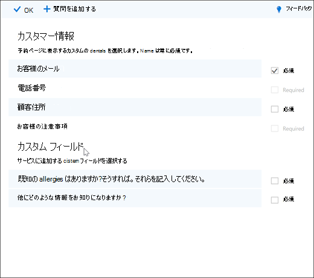
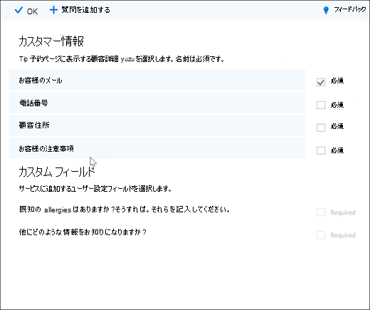

# 予約ページにカスタムおよび必須の質問を追加する

予約を使用すると、顧客が予定を予約するときに質問を作成できます。 また、必要な質問を選択できます。

質問をサービスに関連付けるので、各サービスに異なる質問セットを設定できます。 たとえば、ヘアスタイリストは、ヘアカラーの予定を予約している顧客に、ブリーチやティントに対する既知のアレルギーを持っている場合に尋ねる場合があります。 これにより、ユーザーと顧客は予定の到着時間を節約できます。

予約ページで予定を作成するときに、カスタムの質問が表示されます。 スタッフは、予約カレンダーから新しい予約を作成するか、既存の予定を表示するときに、カスタムの質問を表示します。 Bookings は、すべての質問をマスター リストに保存し、すべてのサービスに対して同じ質問を再作成する必要が生じないのでします。 また、質問が必須かオプションかを選択できます。

> [!NOTE]
> 質問に対する顧客の回答は、予約カレンダーで予定を確認すると確認できます。

予約ページをカスタマイズしてカスタマイズする方法の詳細については、「予約ページをカスタマイズ [する」を参照してください](customize-booking-page.md)。

## サービスにカスタム質問を追加する

1. サインインして[予約] Microsoft 365に **移動します**。

1. [サービス] **に移動** し、既存のサービスを編集するか、[ **サービスの追加] を選択します**。

1. [ユーザー設定フィールド] **セクションまで下にスクロール** し、[変更] を **選択します**。

   顧客の電子メール、電話番号、顧客住所、顧客メモなど、基本的な顧客情報に関する質問が既に追加されています。 これを初めて行う場合、顧客情報の質問は灰色で強調表示されます。 つまり、ユーザーにこの質問が表示されます。 質問を選択すると、その周囲の強調表示ボックスが表示されなくなり、顧客にはその質問は表示されません。

   この例では、電話番号と顧客メモがオフになっていて、2 つの新しいカスタム質問を作成しました。

   

1. 質問を必須にする場合は、[必須] チェック **ボックスをオン** にします。 顧客が必要な質問に答えるまで、予約を完了できない。

1. カスタム質問を作成するには、パネル **の上部から** [質問の追加] を選択します。 質問を書き込み、[保存] を **選択します**。

1. 質問をクリックして有効にしてください。 強調表示されたボックスが周囲に表示され、質問が有効になります。

1. ページ **の上部にある [OK]** をクリックし、[サービス **の保存] をクリックします**。

予約では、すべてのカスタム質問がマスター リストに保存されますので、同じ質問を繰り返し入力する必要なく、各サービスに簡単に質問を追加できます。 たとえば、別のサービスを開いた場合、最初のサービス用に作成した質問は [ユーザー設定フィールド] セクションに表示されますが、無効になります。 強調表示された四角形が表示され、質問が有効な場合は、質問をクリックします。

この例では、最初のサービスに追加された質問が、このサービスで利用できるのを確認できます。 このサービスに対して作成した質問は、すべてのサービスで利用できます。

   

予約ページが既に公開されている場合は、他に何もする必要はありません。 顧客は、次回一緒に予約する場合に質問を表示します。 予約ページがまだ公開されていない場合は、予約ページに移動し、[保存して発行] Outlook on the webを **選択します**。

> [!WARNING]
> マスター リストから質問を削除できます。 ただし、質問を削除すると、すべてのサービスから削除されます。 質問を選択して、他のサービスに影響を及ぼすことを確認して無効にすることをお勧めします。 強調表示された四角形に囲まれない場合は、質問が無効になっているのを確認できます。

## カスタマー エクスペリエンス

顧客が予定を予約すると、基本的な顧客情報の質問が [詳細の追加 **] セクションに表示** されます。 追加するカスタマイズされた質問は、[追加情報の提供 **] セクションに表示** されます。

## スタッフエクスペリエンス

顧客が予定を予約すると、スタッフは予約カレンダーに質問と顧客の回答を表示します。 それを表示するには、[予約カレンダー] **に移動** \> **し** 、予定を開きます。

