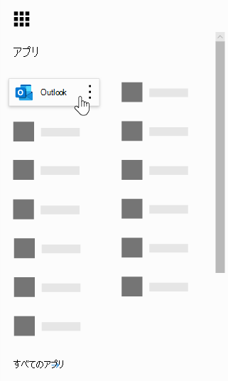
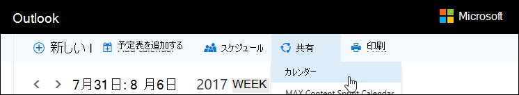

# Microsoft 予約のよく寄せられる質問Microsoft Bookings Frequently Asked Questions

## 全般General

### Microsoft 予約とはWhat is Microsoft Bookings?

Microsoft の予約は、予定のスケジュール設定と管理を簡単に行う Microsoft 365 アプリです。Microsoft Bookings is a Microsoft 365 app that makes scheduling and managing appointments easy. 予約 incudes Web ベースの予約予定表を使用して、従業員の予定表を最適化するために Outlook と統合し、お客様にとって最適な時間を提供できるようにお客様に柔軟性を提供します。Bookings incudes a Web-based booking calendar and integrates with Outlook to optimize your staff’s calendar, giving your customers flexibility to book a time that works best for them. 自動化された通知メールは、何も表示しないようにするため、組織は時間を節約し、繰り返しスケジュールタスクを減らすことができます。Automated notification emails reduce no-shows, and organizations save time with a reduction in repetitive scheduling tasks. 予約は、Skype または Microsoft Teams を使用して仮想の予定を簡単に実行できるようにするもので、Teams で予約アプリを使用して日常のスケジュール管理に役立てることができます。Bookings helps you easily conduct virtual appointments via Skype or Microsoft Teams, and helps you manage day-to-day scheduling via the Bookings app in Teams. 組み込みのカスタマイズ機能により、予約は組織の複数のパーツのニーズを満たすように設計されています。With built-in ability to customize, Bookings is designed to meet the needs of multiple parts of any organization.

### Microsoft の予約を使用するにはどうすればよいですか?How do I use Microsoft Bookings?

予約はオンラインサービスであるため、何もダウンロードする必要はありません。Bookings is an online service, so you don't need to download anything. Microsoft 365 Web experience でアプリの選択ウィンドウに移動します。Just go to the app chooser within the Microsoft 365 Web experience. また、管理者は、予約コンパニオンアプリを使用して、顧客とその予定に関する最新情報を最新の状態に保つことができます。Administrators can also use the Bookings companion app to stay current with the latest information about customers and their appointments.

### Microsoft の予約にアクセスできるユーザーWho has access to Microsoft Bookings?

予約は既定で利用可能であり、Microsoft 365 Business Premium、A3、A5、E3、および世界中の E5 のお客様に対して有効になっています。Bookings is available and active by default for Microsoft 365 Business Premium, A3, A5, E3, and E5 customers worldwide. 予約は、21Vianet が運用している Office 365 でも使用できます。Bookings is also available in Office 365 operated by 21Vianet.

### お客様に個人またはビジネスの予定表が表示されますか。Will my customers see my personal or business calendar?

お客様には、登録を選択したサービス、時間、スタッフに対してオンラインで公開した予約カレンダーのみが表示されます。Your customers will only see the Bookings calendar that you publish online for the services, times, and staff that you choose to register.

### エンドユーザーが予約アプリにアクセスする方法How do end users access the Bookings app?

Microsoft 365 Business Premium、A3、A5、E3、E5、または管理者のいずれかの役割でスタッフメンバーとしてライセンスされているすべてのユーザーは、Microsoft 365 Web 環境内のアプリ選択ウィンドウで予約にアクセスできます。Anyone who is licensed for Microsoft 365 Business Premium, A3, A5, E3, E5, or is added as a staff member in either the Administrator or Viewer roles can access Bookings in the app chooser within the Microsoft 365 Web experience. IOS および Android 用のコンパニオンアプリも用意されています。There is also a companion app available for iOS and Android.

### 自分の Web サイトで予約を使用できますか。Can I use Bookings in my own Web site?

はい。Yes. IFrame を使用してサイトに予約予定表を埋め込む方法が提供されています。We provide a way for you to embed your Bookings calendar in your site via an iFrame. リンクの埋め込みコードは、予約アプリの [ **予約ページ** ] タブにあります。Link embedding code is located in the **Bookings page** tab within the Bookings app.

### ビジネス用の Web ページがない場合でも予約を使用できますか。Can I use Bookings even if I don’t have a Web page for my business?

はい。Yes. Web アプリの [ **予約ページ** ] タブ内に予約ページへのリンクを提供します。We provide a link to your booking page within the **Booking page** tab in the Web app. お客様またはクライアントに対してそのリンクを提供するだけで、ビジネスのための最新の空き時間情報を表示することができます。You just need to provide that link to your customers or clients, and they will see the latest availability information for your business. または、ソーシャルメディアで予約ページを共有したり、埋め込み機能を使用して iFrame でそれをホストしたりすることもできます。Alternatively, you can share the booking page in social media or even use the embed feature to host it in an iFrame. また、ダイレクト検索エンジンのインデックス作成を無効にして、組織内のアクセスを制限することで、ページにアクセスできるユーザーを制御することもできます。You also have the ability to control who can access the page by disabling direct search engine indexing and restricting access to only those within your organization.

### IT 部門はエンドユーザーが予約にアクセスできるかどうかを制御できますか。Can our IT department control whether end users can access Bookings?

予約は、既定では、Business Premium、M365 A3/A5、E3/E5 テナントで利用できますが、管理者は Microsoft 365 管理センターで選択した場合に、この機能をオフにすることができます。Bookings is available in Business Premium, M365 A3/A5 and E3/E5 tenants by default, but administrators can turn it off in the Microsoft 365 admin center if they choose. そのためには、次の [手順に従い](turn-bookings-on-or-off.md)ます。To do so, [follow these instructions](turn-bookings-on-or-off.md).

お客様がテナント内の特定の適格なライセンスで予約へのアクセスを無効にする必要がある場合は、ユーザーはグループポリシーを使用してライセンスを制限するか、新しい予約予定表を作成できるユーザーを制限する OWA メールボックスポリシーを実装することができます。If a customer wants to disable access to Bookings for certain eligible licenses in their tenant, they can either user a group policy to restrict licenses or implement an OWA Mailbox policy that will restrict who is able to create new Bookings calendars.

OWA メールボックスポリシーを使用して予約へのアクセスを無効にした場合、すべてのユーザーに予約ライセンスが付与されますが、アプリにアクセスしようとする場合は、ポリシーの一部である場合や、既存の予約カレンダーにスタッフとして追加されている場合にのみ成功します。If you use an OWA Mailbox policy to disable access to Bookings, all users will have a Bookings license, however when they attempt to access the app, they will only be successful if they are part of the policy or if they have been added to an existing Bookings calendar as staff. 詳細については、「選択したユーザーのみに予約予定表を作成できる [ようにする](turn-bookings-on-or-off.md) 」を参照してください。Details [here](turn-bookings-on-or-off.md) in the “Allow only selected users to create Bookings calendars” section.

### 予約はカスタマイズできますか?Is Bookings customizable?

はい。予約はカスタマイズ可能で、さまざまなシナリオで使用できます。Yes, Bookings is customizable and can be used for a variety of different scenarios. 予約カレンダーを設定する場合、Web ベースのスケジューリングページの多くの側面、ビジネス情報、スタッフの詳細、サービスの種類、およびスケジュールポリシーをカスタマイズできます。When setting up a Bookings calendar, many aspects of the Web-based scheduling page, your business information, staff details, service types, and scheduling policies can be customized.

### Microsoft Teams では、元の予約 Web アプリのすべての機能を利用できますか?Is all the functionality of the original Bookings Web app available in Microsoft Teams?

簡易版の予約は、Teams のアプリとして利用できるようになりました。A lightweight version of Bookings is now available as an app in Teams. 最初のアナウンスは [こちら](https://www.microsoft.com/microsoft-365/blog/2020/03/06/empowering-care-teams-with-new-tools-in-microsoft-365/)からご確認ください。Please find the initial announcement [here](https://www.microsoft.com/microsoft-365/blog/2020/03/06/empowering-care-teams-with-new-tools-in-microsoft-365/). Web アプリには、詳細なリンク機能があるので、セットアップ後には、Teams を離れることなく、予約の毎日の使用を行うことができます。There is deep link functionality to pop out in the Web app, and after setup, day-to-day use of Bookings can be done without ever leaving Teams. プラットフォーム間での情報フロー。Information flows across platforms.

### 小規模な企業やエンタープライズオファーリング、またはその両方を予約していますか?Is Bookings a small business offering or an Enterprise offering or both?

予約は、企業および小規模企業の両方のお客様にとって、さまざまな業界で最適なソリューションです。Bookings is an ideal solution for both Enterprise and small business customers, across a variety of industries. ユースケースは次のとおりです。Use cases include:

- 金融サービスFinancial services
    - consultationsconsultations
    - 銀行および保険サービスbanking and insurance services
    - 税務申告tax filings

- 人事 (HR)Human resources (HR)
    - 面接候補candidate interviews
    - 契約onboarding
    - 利点benefits assistance
    - トレーニングとセミナーtraining and seminars

- 医療Healthcare
    - 患者訪問patient visits
    - プロバイダー間のコラボレーションprovider-to-provider collaboration
    - 保険insurance consults

- 行政機関 & 公的機関Government & Public Sector
    - 法廷 hearings およびトライアルcourt hearings and trials
    - パブリックサービスpublic services
    - 部署の予定department appointments

- 教育機関向け--K-12Education -- K-12
    - 親-教師の会議parent-teacher conferences
    - 学校の町のホールschool town hall
    - 生徒-counselor ビジットstudent-counselor visits

- 教育機関 (高等)Education -- Higher Ed
    - オフィス時間office hours
    - tutoringtutoring
    - 学生サービスstudent services
    - テストサインアップexam sign-up

- 小売Retail
    - 補助ショッピングassisted shopping
    - 請負業者のスケジュール設定contractor scheduling
    - 設計サービスdesign services

- 一般的な企業および小規模ビジネスのニーズGeneral Enterprise and small business needs
    - 顧客およびクライアントの会議customer and client meetings
    - テクニカルサポートtech support
    - 法的レビューlegal reviews
    - dtracefacilities

## 価格とライセンスPricing and licensing

### Microsoft の予約を取得するにはどうすればよいですか?How do I get Microsoft Bookings?

予約は、Microsoft 365 で、Business Premium、A3、A5、E3、および E5 のライセンスを持つお客様が iOS および Android コンパニオンアプリと共に利用できます。Bookings is available in Microsoft 365 for customers with Business Premium, A3, A5, E3, and E5 licenses, along with an iOS and Android companion app. 予約はスタンドアロンアプリとして使用できません。Bookings is not available as a standalone app. Outlook Web App または outlook on the Web では、Outlook 内でデータを保存するため、予約を使用できるようにする必要があります。Outlook Web App or Outlook on the web must be enabled to use Bookings, as it stores data within Outlook.

予約ライセンスは、予定表の作成および管理を含む、製品へのすべての機能を提供します。A Bookings license provides full functionality to the product, including creating and managing calendars. また、ユーザーが管理者または閲覧者の役割でスタッフとして追加されたときに、ユーザーが既存の予定表を表示および編集できるようにします。It also enables the ability for users to view and edit existing calendars, when those users are added as staff in an Administrator or Viewer role.

### 現在のプロバイダーから Microsoft 365 に電子メールアカウントを移行する必要がありますか。Do I need to migrate my email account from my current provider to Microsoft 365?

現在のプロバイダーは保持できますが、予約は、Microsoft 365 アカウントで使用されている電子メールにすべての通知を送信します。You can keep your current provider, but Bookings will send all notifications to the email used in your Microsoft 365 account.

### 従業員は、Microsoft 365 アカウントなしで予約を使用できますか?Can my employees use Bookings without a Microsoft 365 account?

はい。Yes. 任意の電子メールを使用してスタッフを追加しても、他のユーザーが予定を持っているときに、電子メールの確認と予定表の出席依頼を受け取ることができます。You can add your staff with any email, and they will still get the email confirmation and the calendar invite when someone books an appointment with them.

### 同じ Microsoft 365 アカウントで複数の予約予定表を作成し、それらを切り替えることはできますか。Can I create more than one Bookings calendar under the same Microsoft 365 account and switch between them?

はい。Yes. 1つのアカウントで複数の予約予定表を作成して管理することができます。You can create and manage more than one Bookings calendar with one account. 予約 Web アプリの会社名の横にあるキャレットを使用して、それらを切り替えることができます。You can switch between them using the caret next to the business name in the Bookings Web app.

### 組織で、F1/F3、E1、および E3/E5 とのライセンスが混在している場合はどうなりますか。What if my organization has mixed licenses with F1/F3, E1, and E3/E5?

多くの組織では、Microsoft 365 ライセンスが混在していることがわかっています。We recognize that many organizations have a mixture of Microsoft 365 licensing. たとえば、お客様が本社の従業員に対して M365 E3 ライセンスを所有している場合がありますが、ストアの従業員には M365 E1 (または F1 または F3) ライセンスが必要です。For example, a customer may have M365 E3 licenses for employees in their headquarters, but M365 E1 (or F1 or F3) licenses for their store employees.

この例では、M365 E3 ライセンスを持つ本社の従業員が予約への完全なアクセス権を持っています。つまり、新しい予定表の作成、設定の編集、スタッフの追加、予約ページの発行、予定表内の予定の作成と管理、およびレポートの取得を行うことができます。In this example, the headquarters employees with an M365 E3 license have full access to Bookings, which means they can create new calendars, edit settings, add staff, publish a booking page, create and manage appointments within the calendar, and pull reports.

E1/F1/F3 ライセンスを持つ従業員、またはライセンスを持たない従業員は、ゲストの役割の予定表にスタッフとして追加して予定に予約することができます。予約された場合は、確認の電子メールを受信します。Those store employees with E1/F1/F3 licenses, or with no licenses, can still be added as staff to calendars in a Guest role and then booked for appointments, and they will receive confirmation emails when they are booked. [スタッフ] タブに一覧表示されている時間帯に、利用可能/予定時間中に予約することができます。予約予定表の空き時間は、設定された時間とサービス時間によって、能の時間を制限します。They can still be booked during their available/scheduled hours as listed in the staff tab. The Bookings calendar availability constrains bookable times by their set hours and service hours.

予約 Web アプリを使用して予定が既に予約されている場合は、ストアの従業員も予約の利用不可として表示されます。The store employees will also display as unavailable in Bookings if an appointment has already been scheduled at that time through the Bookings Web app. 予約によって予約された予定は、予約内のスタッフメンバーの予定表の中でビジーとして反映されます。Appointments booked via Bookings will reflect as busy on a staff member's calendar within Bookings. 予約が有効になっていないライセンスを持つスタッフは、同じテナント内にいる限り、自分の予定表が自分の空き時間に影響することがあります。Staff with a non-Bookings enabled license can still have their personal calendar impact their availability in Bookings, provided they are within the same tenant.

ゲストの役割を持つユーザーは、最初の予定作成時にお客様が入力した情報を表示できます。People in the Guests role can view any of the information the customer has provided within the initial appointment creation. たとえば、予定に予約されているストアの担当者が、予定の前に顧客を呼び出す必要がある場合、スケジュールプロセス中に顧客が提供する情報にアクセスできます。For example, if the store representative who is booked for the appointment is required to call the customer prior to the appointment, they will have access to the information the customer provides during the scheduling process. 予約されているスタッフメンバーは、確認の電子メールに表示されるすべての情報に加えて、ics カレンダーイベント (入力されていた場合は顧客電話番号など) にアクセスできます。The staff member who is booked will have access to all information that appears in the confirmation email, as well as the .ics calendar event (such as the customer phone number if it was entered).

ゲストの役割を持つユーザーは、予約 Web アプリにアクセスして設定を変更したり、予定を表示および管理したり (追加、キャンセル、および再スケジュール) したりすることはできません。People in the Guest role will not have the ability to access the Bookings Web app to change settings or to view and manage appointments (add, cancel, and reschedule). ただし、顧客が予定を作成するのと同じ方法で、セルフサービスページを使用して、顧客に代わって予定を作成することができます。However, they can make appointments on behalf of customers using the Self-service page, in the same way that a customer would make an appointment.

ページと予定を設定および管理するには、予約対象ライセンスを使用して、各ストアのビジネスマネージャーまたは管理者にライセンスを付与することをお勧めします。We recommend licensing a business manager or administrator of each store with a Bookings-eligible license to set up and manage pages and appointments. 残りのスタッフは、予約を再スケジュールまたはキャンセルするために、予約のライセンスを使用して作業を行います。The rest of the staff would then work with the employee licensed with Bookings in order to reschedule or cancel a booking.

## 製品機能Product features

### 予約予定表は、Microsoft 365 テナントでどのように表示されますか? \* \*Where do Bookings calendars show up in my Microsoft 365 tenant?\*\*

新しい予約予定表ごとに、対応する Exchange のメールボックス、および Azure Active Directory (AAD) 内の関連エントリが作成されます。このエントリは、ライセンスのないユーザーとしてリストされます。Each new Bookings calendar creates a corresponding mailbox in Exchange, as well as a related entry in Azure Active Directory (AAD), where the entry is listed as an unlicensed user.

### 以前に作成した予約予定表を削除できますか。Can I delete a previously created Bookings calendar?

予約予定表を削除するには、Exchange で関連付けられたメールボックスを削除する必要があります。In order to delete a Bookings calendar you must delete the associated mailbox in Exchange.

### 予定表を作成した場合、他のユーザーが予約にアクセスできるようになると、自分の予定表を表示できるようになりますか?If I create a calendar and someone else has access to Bookings, would they be able to see my calendar?

(Web アプリを介して) 作成した予約予定表へのアクセス権を持つユーザーは、管理者または閲覧者の役割のいずれかでスタッフとして追加されたすべてのユーザーです。The only people who have access to Bookings calendars that you create (through the Web app) is anyone who has been added as staff, in either an Administrator or Viewer role. テナント管理者は、Exchange と AAD のすべての予約メールボックスの一覧を表示することができます。Tenant admins will be able to see a list of all Bookings mailboxes in Exchange and AAD.

### 予約アプリに統合されているビデオ会議会議ですか。Are video conferencing meetings integrated into the Bookings app?

Skype または Microsoft Teams クライアントを使用している場合、オンライン会議は予約の範囲内で使用できます。Online meetings are available within Bookings when using the Skype or Microsoft Teams clients. オンライン会議はサービスレベルで有効にすることができ、選択した会議クライアント (Skype または Teams) は、予約済みのスタッフメンバー用に既定で設定されたものになります。Online meetings can be enabled at the service-level, and the meeting client you choose (Skype or Teams) will be the one set by default for a booked staff member. オンライン会議に参加するには、各新しい予定に固有の会議リンクが割り当てられます。さらに、簡単な参加オプションがイベントと確認の電子メールに含まれています。To join the online meetings, each new appointment will have a unique meeting link attached to the appointment, and in addition, easy join options are included in the event and in confirmation emails.

### スケジュールポリシーのしくみHow does scheduling policy work?

[ **最大リードタイム** ] という設定によって、予約を行うことができる最も遠い (日数) を決定します。A setting called **Maximum lead time** determines the farthest in advance (measured in days) that a booking can be made. 少なくとも24時間 (最小リードタイム、時間単位、予約とキャンセル)、および最大リードタイムの **間である** 必要があります。There must be at least 24 hours between **Minimum lead time** (the minimum lead time, in hours, for bookings and cancellations) and Maximum lead time. 最小リードタイムが0時間に設定されている場合は、最大リードタイムを1日に設定できます。この場合は、顧客が開始時刻まで予約を取り消すことができます。また、予定が翌日にある場合にのみ予約を予約することができます。Maximum lead time can be set to one day if Minimum lead time is set to 0 hours, which in this case means a customer can cancel a booking up until the time that it starts, and customers can only schedule bookings if the appointment is within the next day.

:::image type="content" source="media/bookings-faq-scheduling.png" alt-text="予約のスケジューリング":::

### タイムゾーン間での予約のしくみHow does Bookings work across time zones?

すべての時刻は、既定では、勤務時間領域 (ローカルタイムゾーン) にあります。All times are in the business time zone (your local time zone) by default. これは、勤務時間などの予約カレンダーに対して構成したすべての設定がこのタイムゾーンに表示されることを意味します。This means any setting you configure for a Bookings calendar, such as working hours, will appear in this time zone. セルフサービスページには、すべての予定時間をエンドユーザーのタイムゾーンで表示する機能があり、必要に応じてオフにすることができます。The Self-service page has the ability to display all the appointment times in the end-user's time zone, which can be turned off if desired.[予約ページ] タブの [ **常に勤務時間帯にタイムスロットを表示する** ] チェックがオフになっている場合、ページを訪れたユーザーには、自分のローカルタイムゾーンのタイムスロットが表示されます。 If **Always show time slots in business time zone** remains unchecked on the Bookings page tab, then people visiting the page will see time slots in their own local time zones.

:::image type="content" source="media/bookings-faq-region.png" alt-text="予約地域とタイムゾーンの設定":::

予約にスタッフのタイムゾーンを設定するためのプロビジョニングはありません。There is no provision to set time zone for staff in Bookings. スタッフのタイムゾーン、つまり営業時間帯は、ビジネスタイムゾーンになります。Staff time zone, and thus business hours, will be in the business time zone.

### 電子メール通知はテナントのドメイン名として送信できますか?Can email notifications be sent as the tenant domain name?

電子メールアドレスは、Microsoft 365 設定レベルで制御および管理され、そこにあるドメイン構成設定に依存します。The email addresses are controlled and managed at the Microsoft 365 settings level and depend on the domain configuration settings there. 詳細については、 [こちら](https://docs.microsoft.com/powershell/module/exchange/get-accepteddomain)を参照してください。More information can be found [here](https://docs.microsoft.com/powershell/module/exchange/get-accepteddomain).

### 異なるサービスまたは特定の構成に依存する SMS メッセージを送信する機能はありますか。Is the ability to send SMS messages dependent on a different service or specific configuration?

現在、SMS メッセージは北米で利用でき、Skype または Twilio アカウントは SMS の配信に使用されます。SMS messages are currently available in North America, and a Skype or Twilio account will be used for SMS delivery.

### ユーザーの予定表に予定の予約を表示するにはどうすればよいですか?How can Bookings appointments show up on a person’s calendar?

予約の確認は、サービスプロバイダーとお客様の受信トレイの両方に送信されます。The confirmation of the booking is sent to both the service provider’s and customer’s inboxes. 確認メールには、\* ics ファイル添付ファイルが含まれています。これにより、関連するすべての予定の詳細をユーザーの予定表に追加することができます。The confirmation email contains an \*.ics file attachment, which can then be added to the user’s calendar with all relevant appointment details.

### サービスプロバイダーまたはスタッフおよびお客様の電子メールのトリガーWhat triggers service provider or staff and customer emails?

メールは、予約 Web アプリの [サービス] タブの設定に基づいてトリガーされます。Emails are triggered based on settings in the Services tab in the Bookings Web app. セルフサービスページまたは予約 Web アプリの [予定表] タブで、顧客によって行われた予約は、確認メッセージや通知メールをトリガーします。A booking made by the customer on the Self-service page, or on the Calendar tab in the Bookings Web app, will trigger a confirmation and/or a reminder email. 確認メールまたは Web アプリ内で予約を **管理** するボタンを使って予約を変更した場合にも、同じことが起こります。The same thing will happen when someone makes a change to the booking via the **Manage booking** button in the confirmation email or within the Web app. 予約 Web アプリの [サービス] タブで説明するように、予定の前に指定された期間にアラームの電子メールが送信されます。Reminder emails are sent at a specified time period prior to an appointment, as detailed in the Services tab in the Bookings Web app.

### 教室のスタイルの予定は、1:1 の代わりに、多くの場合、次のように予約できますか。Can I book classroom-style appointments that are 1:many instead of 1:1?

はい。複数のユーザーが同じ予定を同時に予約できるようにするグループ予約機能が用意されています (フィットネスクラスの場合など)。Yes, we have a group bookings functionality that allows multiple people to book the same appointment at the same time (such as for a fitness class). この機能の詳細については、 [ここ](https://techcommunity.microsoft.com/t5/microsoft-bookings-blog/microsoft-bookings-now-supports-online-meetings-and-group/ba-p/1214120)を参照してください。This functionality is described in detail [here](https://techcommunity.microsoft.com/t5/microsoft-bookings-blog/microsoft-bookings-now-supports-online-meetings-and-group/ba-p/1214120).

### 予定表を非公開にすることはできますが (公開はできません)、指定されたユーザーが引き続きアクセスできますか。Can calendars remain unpublished (not public-facing) but still accessible to designated users?

はい。Yes. Web アプリの [予約ページ] タブにあるチェックボックス: **Microsoft 365 または Office 365 アカウントを組織から予約する必要**があります。There is a check box on the Booking page tab in the Web app: **Require a Microsoft 365 or Office 365 account from my organization to book**. このチェックボックスをオンにすると、セルフサービスページアクセスがテナント内のユーザーにのみ制限されます。Selecting this check box restricts Self-service page access to only those that are within your tenant. Web アプリの作成と管理に含まれる予約予定表は、管理者または閲覧者の役割を持つページにスタッフとして追加された個人のみがアクセスできます。The Bookings calendar that sits within the Web app for creation and management can only be accessed by those individuals added as staff to the page with Administrator or Viewer roles.

:::image type="content" source="media/bookings-faq-access-ctrl.png" alt-text="予約のページのアクセス制御":::

### ホームページの更新頻度How frequently does the Home page update?

Web アプリが読み込まれるたびに、ホームページにリンクされている最新のデータが取得されます。The latest data linked to your Home page is retrieved  whenever the Web app is loaded. 予約によって追跡される情報の種類の詳細については、この [サポート記事](metrics-and-activity-tracking.md)を参照してください。For further details on the type of information tracked by Bookings, see this [support article](metrics-and-activity-tracking.md).

### 休暇のメール通知をオフにすることはできますか。Can I turn off the email notifications for Time Off?

予約 Web アプリ内で [レコーディング時間をオフにすると、常にスタッフメンバーへの通知電子メールをトリガーします。Recording Time Off within the Bookings Web app will always trigger a notification email to staff members. スタッフメンバーが通知に関して混乱を受けている場合は、管理者側で発生していることについてスタッフにより詳細な情報を提供することをお勧めします。If any staff members are confused about the notification, we recommend you add more detail in the notes or title of the Time Off notification, to better inform staff about what is occurring on the admin side.

### 予定表を複製または複製することができます。また、簡単に拡張できるように templatized できますか?Can Bookings calendars be cloned or duplicated, and can they be templatized for easy scaling?

ページを複製する機能は、現在 PowerShell を介して利用できます。The ability to duplicate pages is currently available via PowerShell. このプロセスでは、Graph API を使用してメールボックスの詳細を取得し、その詳細を使用して新しいメールボックスを作成します。The process would be to use the Graph API to get mailbox details, and then use those details to create a new mailbox. API ドキュメントは [こちら](https://docs.microsoft.com/graph/api/resources/booking-api-overview?view=graph-rest-beta)です。API documentation is [here](https://docs.microsoft.com/graph/api/resources/booking-api-overview?view=graph-rest-beta).

### 予約ではどのようなレポートを利用できますか?What reporting is available in Bookings?

管理者の役割に割り当てられたすべての予約スタッフは、タブで区切られた値 (をダウンロードできます。TSV) ファイルを過去120日以内に行われたすべての予約と共に使用します。All Bookings staff assigned to the Administrator role can download a tab-separated values (.TSV) file with all bookings made in the past 120 days. 予約レポートは、にダウンロードできます。[予約] ページの [ホーム] タブの [TSV] フォームBookings reports can be downloaded in .TSV form from the Home tab of the Bookings page. 予約 API は、このデータを収集して、カスタマイズされた特定の目的に使用することもできます。The Bookings API can also be used to collect this data for more customized and specific purposes.

### セルフサービスページで一度に共有できるサービスは1つだけですか。Is it possible to share only one service on the Self-service page at a time?

はい。サービスごとに個別の予約の予定表を作成するか、[サービス] タブに移動してサービスを編集することができます。また、ページの上部には、その特定のサービスに対してのみ URL を共有するオプションが表示されます。Yes, you can either create separate Bookings calendars for each service, or you can go to the Services tab, edit a service, and at the top of the page you will see an option to share a URL only for that specific service.

### 予定を予約するための同意フォームまたは公開のために、どのようなオプションを使用できますか。What options are available for embedding a consent form or disclosure for those booking an appointment?

予約ページで **顧客データ使用の同意** を有効にし、言葉をカスタマイズして組織の開示または同意の要件を適切に伝達することをお勧めします。We recommend enabling the **Customer data usage consent** check box in the Booking page and customizing the wording to properly convey your organization's disclosure or consent requirements. もう1つの方法として、同意フォームへのリンクを含むカスタムフィールドをサービスに追加し、ユーザーが予定の作成を続行する前に、フォームを完了したことを確認するようにお客様に要求することができます。Another option is to add a custom field to the service that includes a link to the consent form, and require customers to confirm that they have completed the form before they can proceed with making an appointment. 確認と事前通知の電子メールに追加のメモとして同意フォームの URL を追加することもできますが、これによってユーザーは予定を予約できなくなります。You can also add the consent form URL as additional notes in confirmation and reminder emails, but this will not prevent users from booking an appointment.

### セルフサービス予約ページのスタッフ選択機能にはどのような変更を加えることができますか。What changes can be made to the staff selection capability on the Self-service booking page?

ユーザーが予約ページまたはサービスセクションから予約オプション **に対して特定のユーザーを選択できるよう** にすることにより、お客様が特定のスタッフメンバーを完全に選択することができます。The ability for customers to select specific staff members when booking can be removed completely by de-selecting the **Allow customers to choose a specific person for the booking** option from the Booking page or the Services section. 予約は、スタッフの空き時間に基づいて、利用可能なスタッフメンバーをランダムに予約に自動的に割り当てます。Bookings will automatically assign an available staff member at random to the booking, based on staff availability.

### 多数の同時予約要求およびセルフサービスページ訪問のサポートを予約できますか。Can Bookings support many concurrent booking requests and Self-service page visits?

予約は、一度に大量の訪問者と予約をサポートできます。Booking can support a large quantity of visitors and bookings at one time. ページに大量のトラフィックが表示される場合、ユーザーは "サーバー使用中" エラーを受信します。If the page experiences a very large volume of traffic, users will receive a “server busy” error. 予定の利用可能時間は、ページが読み込まれたとき、および予約が行われたときに更新されます。Appointment availability is updated when the page is loaded, as well as when a booking is made. 複数のユーザーが同じ予定を一度に予約しようとしている場合、予約は1人のユーザーに対してその時間を予約し、他の潜在的な顧客に通知メッセージを提供し、別の時間を検索するように求めるメッセージを表示します。If multiple people are trying to book the same appointment at one time, Bookings will only let one person book that time and give a notification message to the other potential customers, and prompt them to find a different time.

## プライバシーPrivacy

### 予約データはどこに保存されますか?Where is Bookings data stored?

予約は Microsoft 365 アプリで、すべてのデータは Microsoft 365 プラットフォームと Exchange の間に格納されます。Bookings is a Microsoft 365 app, meaning all data is stored within the Microsoft 365 platform and in Exchange. 予約は、Microsoft によって設定されたすべてのデータストレージポリシーに従います。これは、すべての Office アプリに続く同じポリシーです。Bookings follows all data storage policies set by Microsoft, which are the same policies followed by all Office apps. 予約では、Exchange の共有メールボックスを使用して、顧客、スタッフ、サービス、および予定の詳細を保存します。Bookings uses shared mailboxes in Exchange to store customer, staff, service, and appointment details. Exchange の共有メールボックスのコンプライアンスポリシーは、予約メールボックスにも適用されます。Compliance policies for shared mailboxes in Exchange also apply for Bookings mailboxes. すべての顧客データ (予約時にお客様によって提供される情報を含む) は、予約で取得され、アプリ内に格納されるため、Exchange に格納されます。All customer data (including information provided by customers when booking) is captured in Bookings and is stored within the app, thus it is stored within Exchange. Microsoft の予約では、Microsoft 365 で使用されているものと同じポリシーを使用して[います。](https://www.microsoft.com/online/legal/v2/?docid=22&langid=en-us)これはこちらで入手できます。Microsoft Bookings uses the same policies used by Microsoft 365, which you can find [here.](https://www.microsoft.com/online/legal/v2/?docid=22&langid=en-us)

### すべてのユーザーの予約予定表を一元管理する方法はありますか。Is there a way to centrally manage Bookings calendars for all users?

各予約予定表は個別に管理されます。Each Bookings calendar is maintained independently. ホームページのキャレットをクリックした後、検索ドロップダウン以外の統合ビューはありません。There is no consolidated view, other than the search drop-down after clicking the caret on the home page.

### ユーザーはどのように認証されますか。How are users authenticated?

予約 Web アプリへのアクセスには、通常の Azure Active Directory (AAD) 認証による認証が伴います。Access to the Bookings Web app involves authentication through the regular Azure Active Directory (AAD) authentication. セルフサービス予約ページは、[Web ページ] リンクを使用してすべてのユーザーが利用できるようにすることができます。The Self-service booking page can be made available to everyone with the Web page link. ただし、 **[microsoft 365 または Office 365 アカウントを組織に必要** とする] 設定が選択されている場合、ページは microsoft 365 テナント内でのみ使用することができます (AAD 認証を使用)。However, when the **Require a Microsoft 365 or Office 365 account from my organization** to book setting is selected, the page is restricted for use only within the Microsoft 365 tenant (using AAD authentication).

:::image type="content" source="media/bookings-faq-access-ctrl.png" alt-text="予約のページのアクセス制御":::

### お客様のデータは何らかの理由で運用システムから出ますか?Does customer data leave the production system for any reason?

はい。予約は Exchange の一部であるため、Graph Api と Exchange Web サービス (EWS) Api をお客様がアクセス可能なデータをダウンロードすることを許可します。Yes, since Bookings is a part of Exchange, we allow Graph APIs and Exchange Web Services (EWS) APIs for the customers to download their own data to which they have access.

### 顧客からの返信の電子メールアドレスをカスタマイズすることはできますか?Is there the ability to customize email addresses for customer replies?

お客様が返信を送信する電子メールアドレスを定義することができます。There is the ability to define which email address customer send their replies to. この設定は、[ **勤務先情報** ] タブにあります。予約メールボックス名自体は、Exchange の通常の名前変更プロセスによって、Exchange 内で変更することもできます。This setting is on the **Business information** tab. The Bookings mailbox name itself can also be changed within Exchange, through usual Exchange mailbox renaming processes.

### お客様は、予約プロセスの間にお客様にご契約書を受諾したいと考えています。We would like for the customer to accept our terms and conditions during the booking process. これは可能ですか?Is that possible?

この機能は、GDPR 準拠のために既に存在します。This feature already exists for GDPR compliance. 予約ページには、カスタム同意のためのフィールドがあります。 [公開の詳細] セクションの下にあります。The Booking page has a field for custom consent, right under the publishing details section. このボックスをオンにして、独自のカスタム同意メッセージを記述するだけで、セルフサービスページに必須フィールドとして表示されます。Just check that box and write your own custom consent message and it will show up as a required field on the Self-service page. お客様が同意を付与した日時が記録されます。The date and time that the customer grants consent will be recorded.

このセクションではリッチテキストはサポートされていませんが、[勤務先情報] セクションの下にリンクを追加して、同意のチェックボックスのすぐ下に表示することができます。This section does not support rich text, but think links can be added under the business information section and would show up just below the consent check box.

### Exchange で予約関連のメールボックスを識別する方法を教えてください。How can Bookings-associated mailboxes in Exchange be identified?

次のコマンドを使用すると、すべての予約メールボックスおよびそれらにアクセスできるユーザーの情報を取得できます。The following command can be used to retrieve information of all Bookings mailboxes and users who have access to them.

`Get-Mailbox -RecipientTypeDetails SchedulingMailbox -ResultSize:Unlimited | Get-MailboxPermission |Select-Object Identity,User,AccessRights | Where-Object {($\_.user -like '\*@\*')}`

## 技術的な質問Technical Questions

### ユーザーがオンライン会議で構成されるサービスの予定をスケジュールする場合、オプションの [電子メールアドレス] フィールドを空白のままにした場合、どのようにして会議への Microsoft Teams リンクを受信することができますか。If a user schedules an appointment for a service consisting of an online meeting, how do they receive the Microsoft Teams link to the meeting if they leave the optional email address field empty?

お客様の電子メール情報がシステムにない場合は、お客様に確認メールを配信する方法はありません。そのため、Teams リンクは受け取りません。If the system does not have the customer's email information, there is no way for the confirmation mail to be delivered to the customer, and thus they will not receive a Teams link. 解決策として、メールアドレスを必須フィールドとして設定します。これは、予約の [サービス] タブで実行できます。The solution is to set the email address as a required field, which you can do on the Services tab of Bookings. 新しいサービスを予約で作成すると、既定では [顧客の電子メール] フィールドが必須フィールドに設定されることに注意してください。Note that whenever you create a new service in Bookings, the customer email field is set as a required field by default.

### [すべてのユーザー] が選択されている場合、または顧客が予定のスタッフメンバーを選択できない場合に、どのようにスタッフが予定に割り当てられるか。How are staff assigned to appointments when “Anyone” is selected, or when customers do not have the ability to choose a staff member for the appointment?

これらのシナリオでは、予定が予約されているときに使用可能なすべてのスタッフメンバーを対象として、スタッフがランダムに割り当てられます。Staff are assigned randomly in these scenarios, out of all staff members available at the time of the appointment being booked. 現時点では、スタッフのすべてのメンバーに対してランダムに割り当てられた予定を均等に分配すること、または割り当てられた予定の数を各スタッフメンバーに cap に配置することはできません。Currently there is no way to ensure equal distribution of randomly assigned appointments across all members of the staff, or to cap the number of assigned appointments to each staff member. ランダムな割り当ての数を超えたためにスタッフ間で負荷分散を行う必要がある場合は、[予約] ページ内の [予定表] タブで手動で行うことができます。If there is load-balancing that needs to be done across your staff after a number of random assignments, it can be done manually in the Calendar tab within the Bookings page.

### 以前に既に選択されている場合に、ユーザーが SMS メッセージを受信しないようにするにはどうすればよいですか。How can users opt out of receiving SMS messages if they have already opted in previously?

SMS テキストメッセージが有効になっている予定を予約する場合、ユーザーは、予約するたびに [オプトイン] ボックスを確認するように求められます。When booking an appointment with SMS text messages enabled, customers will be prompted to check the opt in box each time they book. お客様は、メッセージが停止することを希望していることを示す SMS メッセージ (SMS プロバイダー) に直接返信することもできます。その後、その電話番号にはその他のテキストは送信されません。Customers can also reply directly to the SMS message (the SMS provider) indicating that they would like the messages to cease, and then no further texts will be sent to that phone number. お客様が課金からではなく、プロバイダーからのテキストメッセージの受信を除外した場合、予約ページから除外された場合でも、今後 SMS メッセージを受信しなくなります。If the customer opts out of receiving text messages from the provider, not from Bookings itself, they will no longer receive SMS messages in the future, even when opting in from the Bookings page.

## トラブルシューティングTroubleshooting

### このスタッフメンバーの予定表を同期することはできませんThis staff member's calendar can't be synced

エラーが発生した場合は、「このスタッフメンバーの予定表を同期できません」というエラーが表示されます。このセクションには、エラーを解決するためのいくつかのトラブルシューティング手順が含まれています。If you receive the error, "This staff member's calendar can't be synced", this section contains several troubleshooting procedures to help you resolve the error.

> [!NOTE]
> 予約は、Microsoft 365 Business Standard、Microsoft 365 A3、または Microsoft 365 A5 サブスクリプションを使用しているお客様に対して、既定でオンになっています。Bookings is turned on by default for customers who have the Microsoft 365 Business Standard, Microsoft 365 A3, or Microsoft 365 A5 subscriptions. 予約は、Office 365 Enterprise E3 および Office 365 Enterprise E5 を持つお客様も利用できますが、既定ではオフになっています。Bookings is also available to customers who have Office 365 Enterprise E3 and Office 365 Enterprise E5, but it is turned off by default. 開始するには、「 [Microsoft 予約へのアクセスを取得](get-access.md)する」を参照してください。To get started, see [Get access to Microsoft Bookings](get-access.md). 予約をオンまたはオフにするには、「 [組織の予約を有効または無効](turn-bookings-on-or-off.md)にする」を参照してください。To turn Bookings on or off, see [Turn Bookings on or off for your organization](turn-bookings-on-or-off.md).

スタッフの予定表の同期に関する情報をお探しの場合は、「 [予約にスタッフを追加する](add-staff.md)」を参照してください。If you are looking for information on syncing your staff's calendar, see [Add staff to Bookings](add-staff.md). [ **スタッフの詳細** ] ページで、 **[予定表にあるイベントに影響** する] チェックボックスがオンになっていることを確認します。Make sure on the **Staff details** page, **Events on calendar affect availability** is checked.

### スタッフメンバーは予定表のアクセス許可を変更する必要があるThe staff member needs to change their calendar permissions

予約がスタッフメンバーの予定表と正しく同期するためには、各スタッフメンバーが各自の予定表を共有する必要があります。In order for Bookings to properly sync with your staff members' calendars, each staff member must share their calendar. 各スタッフメンバーは、自分の予定表を共有するために、これらの手順に従う必要があります。Each staff member must follow these instructions to share their own calendar.

1. Microsoft 365 にサインインし、アプリ起動ツールから [ **Outlook** ] を選択します。Sign in to Microsoft 365, and then select **Outlook** from the app launcher.

   

1. ページの上部で、[ **Share** \> **予定表**の共有] を選択します。At the top of the page, select **Share** \> **Calendar**.

   

1. [ **組織内のユーザー** ] セクションで、 **[自分の所属組織**] の横のドロップダウンボックスを選択し、[ **ビジー状態のときに表示する**] を選択します。In the **People inside your organization** section, select the drop-down box next to **My Organization**, and then select **Can view when I'm busy**.

> [!NOTE]
> この設定では、空き時間情報を、組織内の他のユーザーとの予約および予約と共有します。This setting shares your free/busy information with Bookings and with other users in your organization. これには、スケジュールされている予定の種類、予定を予約したユーザー、または場所など、その他の情報は含まれません。It does not include any other information, such as what type of appointment you have scheduled, who you have scheduled the appointment with, or the location.

   ![[予定表の共有] 画面の画像で、使用中の状態を確認できます。](../media/bookings-view-busy.png)

1. [**完了**] を選択します。Select **Done**.

### 組織内のスタッフメンバーを見つけることができませんWe can't find a staff member in our organization

従業員が会社を離れており、Microsoft 365 または Office 365 組織からその従業員を削除した場合は、そのユーザーを予約から削除して、予定表に表示されないようにし、顧客が予定を予約できないようにする必要があります。If an employee has left your company and you removed them from your Microsoft 365 or Office 365 organization, you still need to remove that user from Bookings so they won't show up in the calendar and to prevent customers from booking appointments with them.

1. Microsoft 365 にサインインして、[**予約**スタッフ] に移動し \> **Staff**ます。Sign in to Microsoft 365, and then go to **Bookings** \> **Staff**.

1. マウスカーソルをスタッフメンバーの名前の上に置きます。Hover your mouse cursor over the staff member's name. [**編集**] アイコンと [**削除**] アイコンが [**電話**] 列の右側に表示されます。**Edit** and **delete** icons appear to the right of the **Phone** column.

1. [ **削除** ] アイコンを選択します。Select the **Delete** icon.

1. 確認ボックスで、[ **OK]** を選択します。In the confirmation box, select **OK**.

> [!NOTE]
> 予約されている予定表が複数ある場合は、それらすべてからユーザーを削除する必要があります。If you have more than one booking calendar, you must remove the user from all of them.

複数の予定表があるかどうかを確認するには、左側のメニューで会社名の横にあるドロップダウン矢印を選択し、[ **開く**] を選択します。To check if you have more than one calendar, in the left menu, select the drop-down arrow next to your company name, and then select **Open**. カレンダーが1つだけの場合は、予約予定表を追加するオプションのみが表示されます。If you only have one calendar, then you will see only the option to add a booking calendar. この例は、"Contoso CO" という名前の2番目の予定表があることを示しています。This example shows that there is a second calendar named "Contoso CO".

   

### 識別できない同期エラーが発生していますThere's a syncing error we can't identify

これは一時的なエラーであり、通常、インターネット接続が不安定なために発生します。This is a transient error and typically occurs because of an unstable internet connection. これらの問題は、通常、数分後に解決します。These problems usually resolve themselves after a few minutes.

長期間にこのエラーが表示される場合や、頻繁に表示される場合は、サポートにお問い合わせください。If you still see this error after an extended period of time or you are seeing it often, please contact support.

## その他のリソースAdditional resources

  - [Microsoft の予約は、企業のブログで可用性を拡張します。Microsoft Bookings expands availability in the enterprises blog](https://techcommunity.microsoft.com/t5/microsoft-bookings-blog/microsoft-bookings-expands-availability-in-enterprises/ba-p/1214065)

  - [Microsoft の予約の機能に関するビデオHow Microsoft Bookings Works video](https://support.office.com/article/microsoft-bookings-69c45b78-6de4-4f28-9449-cdcc18b7ae45)

  - [Microsoft 予約の使用を開始するStart using Microsoft Bookings](get-access.md)

  - [Microsoft の予約をオンまたはオフにするTurn Microsoft Bookings on or off](turn-bookings-on-or-off.md)

  - [ユーザーを個別にまたは一括して追加するAdd users individually or in bulk](https://docs.microsoft.com/microsoft-365/admin/add-users/add-users?view=o365-worldwide.)

  - [スタッフを予約に追加するAdd staff to Bookings](add-staff.md)

  - [テンプレートが定義された後に自動化する API コンポーネントAPI components to automate after template has been defined](https://docs.microsoft.com/graph/api/bookingbusiness-post-bookingbusinesses)

  - [予定表が表示されるように予約する URLURL to Bookings Calendar for Display](https://outlook.office.com/bookings/calendar)

  - [コンプライアンスポリシーの予約Bookings compliance policies](https://docs.microsoft.com/microsoft-365/compliance/gdpr-dsr-office365?view=o365-worldwide#bookings)

  - [予約ページのカスタマイズと公開Customize and publish your booking page](customize-booking-page.md)

  - [テナントメールボックスの構成Tenant Mailbox configuration](https://docs.microsoft.com/powershell/module/exchange/get-accepteddomain)

  - [グループ予約Group Bookings](https://techcommunity.microsoft.com/t5/microsoft-bookings-blog/microsoft-bookings-now-supports-online-meetings-and-group/ba-p/1214120)

  - [予約指標とアクティビティの追跡Bookings metrics and activity tracking](metrics-and-activity-tracking.md)

  - [M365 パブリックロードマップM365 Public Roadmap](https://www.microsoft.com/microsoft-365/roadmap?filters=&searchterms=bookings)

  - [UserVoice](https://outlook.uservoice.com/forums/314907-microsoft-bookings/suggestions/39505261-365-admins-should-have-full-access-to-all-bookings)からフィードバックを送信するSubmit feedback via [UserVoice](https://outlook.uservoice.com/forums/314907-microsoft-bookings/suggestions/39505261-365-admins-should-have-full-access-to-all-bookings)
