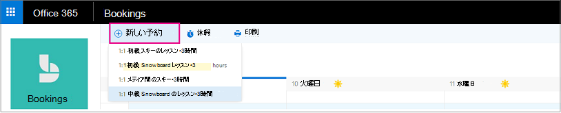

# 予約を作成する

予約のスケジュールとスタッフの割り当てには 2 つの方法があります。 最初の方法は、顧客がスタンドアロンの予約ページまたは Web サイトに追加する埋め込み予約ページを使用することです。 もう 1 つは、顧客から予約の電話がかかってきた場合のように管理者または従業員が予約を手動で入力する方法です。 この記事は手動のシナリオについて説明します。

1. Microsoft 365でアプリ起動ツールを選択し、**Bookings** を選択します。

1. In the navigation pane, select **Calendar** \> **New booking**.

   

1. 提供するサービスを選びます。 サービスのセットアップ手順については、「[Microsoft Bookingsでサービス オファリングを定義](define-service-offerings.md)する」を参照してください。

1. 顧客情報 (名前、メール アドレス、電話番号などの関連情報) を入力します。

1. サービスを提供するスタッフ メンバーを選びます。表示されるスタッフ メンバー リストは、[サービス] ページでセットアップした内容によって決まります。

   

1. サービスの詳細情報 (日付、時刻、場所などの関連情報) を入力します。 顧客の有効なメール アドレスを入力すると、確認が顧客に送信されることを示すメモが表示されます。 顧客の確認には、予定表に追加する予定に関する添付ファイルも含まれます。 選んだスタッフ メンバーにも、予定情報が記載された会議の招待が送信されるので、スタッフも自分の予定表に予定を追加できます。

1. [ **メール アラームを追加する**] を選びます。

1. リマインダーをいつ送信するか、どこに送信するか (**顧客**、 **スタッフ**、 **すべての出席者**)、およびリマインダー メッセージの内容を指定します。

1. [ **予約の作成]** を選択します。

   顧客が受け取るリマインダーの電子メールの例を次に示します。

   :::image type="content" source="media/bookings-remind-confirm-2.png" alt-text="スクリーンショット: 手動予約からの確認メールの例":::