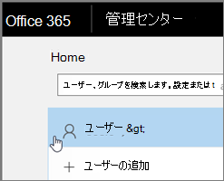

# <a name="delete-a-booking-calendar-in-bookings"></a>Bookingsで予約予定表を削除する

> [!NOTE]
> この記事は、最新バージョンのMicrosoft Bookingsを操作するのに役立ちます。 以前のバージョンは、今後数か月で廃止される予定です。

この記事では、不要な予約カレンダーを削除する方法について説明します。 Microsoft 365 管理センターで予約カレンダーを削除することも、PowerShell を使用することもできます。 Bookings予定表はExchange Onlineのメールボックスであるため、対応するユーザー アカウントを削除して予約予定表を削除します。

> [!IMPORTANT]
> 2017 以前に作成したすべての予約予定表は、このトピックの PowerShell の手順を使用して削除する必要があります。 2018 以降に作成されたすべての予約予定表は、Microsoft 365 管理センターで削除できます。

予約予定表は、その予約予定表とデータに関するすべての関連情報が格納される場所です。次のものが含まれます。

- 予約予定表の作成時に追加されたビジネス情報、ロゴ、および勤務時間
- 予約カレンダーの作成時に追加された関連スタッフとサービス
- 作成された予約予定表に追加されたすべての予約と休暇の予定。

> [!WARNING]
> 予約予定表が削除されると、この追加情報も完全に削除され、回復できません。

## <a name="delete-a-booking-calendar-in-the-microsoft-365-admin-center"></a>Microsoft 365 管理センターで予約カレンダーを削除する

1. Microsoft 365 管理センターに移動します。

1. 管理センターで、[ **ユーザー** ] を選択します。

   

1. [ **アクティブ ユーザー**] ページで、削除するユーザー名を選択して、[ **ユーザーの削除**] を選択します。

   

## <a name="delete-a-booking-calendar-using-exchange-online-powershell"></a>PowerShell を使用して予約カレンダー Exchange Online削除する

[PowerShell に接続するための](/powershell/exchange/exchange-online-powershell-v2)前提条件とガイダンスについては、PowerShell をExchange OnlineするConnect Exchange Online参照してください。

これらの手順を実行するには、"管理者として実行" オプションを選択して実行したアクティブな Microsoft PowerShell コマンド ウィンドウを使用する必要があります。

1. PowerShell ウィンドウで、次のコマンドを実行して EXO V2 モジュールを読み込みます。

   ```powershell
   Import-Module ExchangeOnlineManagement
   ```

   > [!NOTE]
   > すでに、[EXO V2 モジュールをインストール](/powershell/exchange/exchange-online-powershell-v2#install-and-maintain-the-exo-v2-module)している場合は、前のコマンドは表示のとおり機能します。
   
2. 実行する必要があるコマンドでは、次の構文を使用します。

   ```powershell
   Connect-ExchangeOnline -UserPrincipalName <UPN> 
   ```

   - _\<UPN\>_ は、ユーザー プリンシパル名の形式 (`john@contoso.com`など) のアカウントです。

3. メッセージが表示されたら、テナント管理者の資格情報を使用して、完全に削除する予約予定表をホストするMicrosoft 365 テナントにログオンします。

4. このコマンドの処理が終わったら、次のコマンドを入力して、テナントの予約メールボックスの一覧を取得します。

   ```powershell
   Get-EXOMailbox -RecipientTypeDetails SchedulingMailbox
   ```

5. 次のコマンドを入力します。

   ```powershell
   remove-mailbox [BookingCalendarToDelete]
   ```

   > [!IMPORTANT]
   > 完全に削除する予約メールボックスエイリアスの正確な名前を入力してください。

6. 予定表が削除されたことを確認するには、次のコマンドを入力します。

   ```powershell
    Get-EXOMailbox -RecipientTypeDetails SchedulingMailbox
   ```

   削除された予定表は出力に表示されません。
