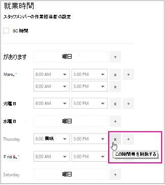

# Microsoft Bookings での従業員の勤務時間

> [!NOTE]
> この記事は、最新バージョンのMicrosoft Bookingsを操作するのに役立ちます。 以前のバージョンは、今後数か月で廃止される予定です。

従業員の勤務時間を設定すると、顧客が予約しようとしたときに、その空き状況が正確に表示されます。 既定で、各従業員の稼働時間は、Microsoft の予約 アプリで設定した勤務時間と同じです (勤務時間を設定する)。 ビジネス情報を入力するの「営業時間を設定 [する](enter-business-information.md)」セクションを参照してください。

[ **スタッフ** ] ページでは、ビジネスと従業員のニーズに合わせて従業員の勤務時間をカスタマイズできます。

スタッフ メンバーが休暇中に顧客が予約できないように、スタッフ メンバーの休暇を予約する手順については、「[休業、休暇、休暇期間のスケジュール](schedule-closures-time-off-vacation.md)」を参照してください。

## ウォッチ: 従業員の勤務時間を設定する

このビデオを見るか、以下の手順に従って従業員の勤務時間を設定します。

> [!VIDEO https://www.microsoft.com/videoplayer/embed/RWuXUq]

## 従業員の勤務時間をカスタマイズする

1. Microsoft 365で、アプリ起動ツールを選択し、**Bookings** を選択します。

1. 予定表を選択します。

1. ナビゲーション ウィンドウで [ **スタッフ**] を選び、時間を設定するスタッフ メンバーを選びます。

1. [稼働時間] で、[ **勤務時間を使用**] チェック ボックスをオフにします。

1. ドロップダウンで各日付の開始時間と終了時間を選びます。時間は 15 分単位で指定できます。

   

1. 開始時刻セレクターと終了時刻セレクターを追加する場合に選択 **+** します。

1. [保存] を選択します。

## 従業員の休暇を設定する

従業員の休暇をスケジュールすると、その従業員は予約ページで使用不可と表示されます。予約ページを使用する顧客は、その日のサービスについて、その従業員のスケジュールを設定できなくなります。

1. [勤務時間] 画面で、従業員が休暇を取る日の横にある **x** を選択します。

   

1. 以前に休暇としてマークされた日をスケジュールする場合は、スケジュールする日の **+** 横にある記号を選択します。

> [!TIP]
> 従業員の休暇時間やその他の大規模な休暇のスケジュールを設定する場合は、「休暇、休暇、休暇のスケジュール」の「従業員の休暇の [スケジュール](schedule-closures-time-off-vacation.md#schedule-employee-time-off)」セクションを参照してください。
