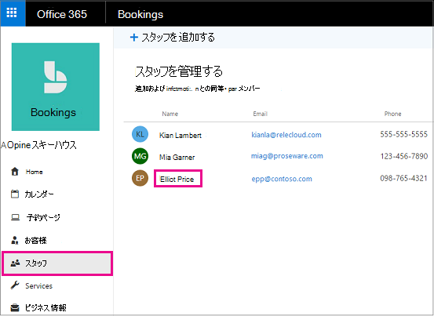

# Microsoft の予約の従業員の就業時間

従業員の就業時間を設定すると、顧客がそれらを予約しようとしたときに、その可用性が正確に表示されるようになります。 既定で、各従業員の稼働時間は、Microsoft の予約 アプリで設定した勤務時間と同じです (勤務時間を設定する)。 「 [勤務先情報を入力](enter-business-information.md#set-your-business-hours)する」の「勤務時間を設定する」セクションを参照してください。

[ **スタッフ** ] ページでは、従業員の勤務時間をカスタマイズして、業務および従業員のニーズを満たすことができます。

スタッフ メンバーが休暇中に顧客が予約できないように、スタッフ メンバーの休暇を予約する手順については、「[休業、休暇、休暇期間のスケジュール](schedule-closures-time-off-vacation.md)」を参照してください。

## 従業員の稼働時間をカスタマイズする

このビデオを見るか、次の手順に従って従業員の稼働時間を設定してください。

> [!VIDEO https://www.microsoft.com/videoplayer/embed/RWuXUq]

1. Microsoft 365 で、アプリ起動ツールを選択し、[ **予約**] を選択します。

1. ナビゲーション ウィンドウで [ **スタッフ**] を選び、時間を設定するスタッフ メンバーを選びます。

   

1. [稼働時間] で、[ **勤務時間を使用**] チェック ボックスをオフにします。

1. ドロップダウンで各日付の開始時間と終了時間を選びます。時間は 15 分単位で指定できます。

   

1. クリックし **+** て、開始および終了時のセレクターを追加します。

1. [保存] を選択します。

## 従業員の休暇を設定する

従業員の休暇をスケジュールすると、その従業員は予約ページで使用不可と表示されます。予約ページを使用する顧客は、その日のサービスについて、その従業員のスケジュールを設定できなくなります。

1. [稼働時間] 画面で、従業員が退職する日の横の [ **x** ] を選択します。

   ![[X] ボタンの上にマウスを置いた場合の予約スタッフの勤務時間画面の画像](../media/bookings-staff-time-off.png)

1. 以前に終了日としてマークされていた日のスケジュールを設定する場合は、 **+** スケジュールする日の横の記号を選択します。

> [!TIP]
> 従業員の休暇時間またはその他の長い時間帯のスケジュールを設定する場合は、「Schedule the [business の休業期間」および「休暇時間](schedule-closures-time-off-vacation.md#schedule-employee-time-off)」の「従業員の休暇時間をスケジュールする」セクションを参照してください。
