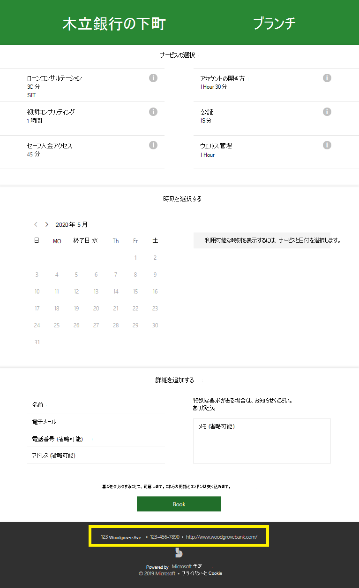
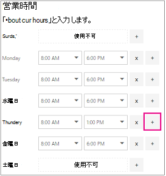

# 勤務先情報を入力する

Microsoft Bookings では、Web アプリ内の [ビジネス情報] ページには、通常、ビジネスの [概要] ページで見つけるすべての詳細が含まれている。 これらの詳細には、関連する名前、住所、電話番号、Web サイトの URL、プライバシー ポリシーの URL、ロゴ、営業時間が含まれます。

ここで提供する情報は、顧客とクライアントが予約予約に使用するページ (予約ページと呼ばれる) と、Bookings によって送信されたメッセージとリマインダーに表示されます。 予約ページのこの情報の例を以下に示します。

   

> [!NOTE]
> 開始するには [、「Microsoft Bookings へのアクセス権を取得する」を参照してください](get-access.md)。 予約をオンまたはオフにする方法については、「 [組織の予約を有効またはオフにする」を参照してください](turn-bookings-on-or-off.md)。

## 会社名と連絡先情報を指定する

1. [Microsoft 365] で[アプリ 起動ツール] を選択し、[予約]**を選択します**。

1. ナビゲーション ウィンドウで、[ビジネス **情報設定**  ->  **選択します**。

1. [基本 **の詳細]** セクションで、予約カレンダーに使用するビジネス名、住所、電話番号を入力します。

:::image type="content" source="../media/bookings-business-basic-details.png" alt-text="スクリーンショット: 基本的なビジネス情報を入力するページ":::

[ **顧客の返信を送信する**] に、予約確認とリマインダーへの電子メール返信を転送する優先メール アドレスを入力します。

[Web **サイトの URL]** フィールドに、ビジネスのホーム ページの URL を入力します。

プライバシー ポリシー **と条件** **URL &** 入力します。

1. [ビジネス **ロゴ] セクション** で、ビジネス ロゴを Bookings アプリにまだアップロードしていない場合は、ビジネス ロゴを追加します。

1. [営業時間 **の設定] セクション** で、営業時間を稼働時間に設定します。 これらは、すべての予約が制限される時間です。 予定を予約できる時間に関する追加の制限は、サービスごとに、およびサービス ページとスタッフ ページの各スタッフ **メンバーに****対して設定** できます。

[勤務先情報] ページの [勤務時間] で、ドロップダウンを使用して各日付の開始時間と終了時間を選びます。 クリック **+** して、開始時刻セレクターと終了時刻セレクターを追加します。

予約 アプリの既定の勤務時間は、月曜日から金曜日の午前 8 時から午後 5 時に設定されています。時刻は 15 分間隔で表示されます。予約には 12 時間形式の時計が使用されています。

1. **[保存]** を選択します。

### 交替制勤務の時間を設定する方法

毎日または週の一部をブロックして、スタッフ会議を開催したり、インベントリを更新したり、その他の業務のリズムの詳細を管理したりする必要があります。 Bookings アプリを使用すると、指定したタイム スロットに顧客の予定を制限できます。

たとえば、毎週木曜日の 1 時から 2 時 30 分までスタッフ会議を開催し、その時間をブロックしてすべてのスタッフメンバーが出席できるようしたいとします。 これを行うには、次の手順を実行します。

1. [勤務先情報] ページの [勤務時間] で、木曜日の開始時間と終了時間を選びます。この例では、午前 8:00 から午後 1:00 を設定します。

1. [ **+**] を選んで木曜日の新しい行を作成します。

   

1. 新しい行で開始時間に午後 2:30、終了時間に午後 6:00 を選びます。

   

1. [保存] を選択します。

    顧客が予約ページにアクセスすると、木曜日の午後 1:00 から 2:30 の時間は営業時間外と表示されます。

## アップロードを変更する

会社のロゴを Bookings アプリにまだアップロードしていない場合は、[勤務先情報] ページからアップロードできます。

1. [ビジネス情報] ページの [ロゴ] の下アップロードを選択 **します**。

1. [ **写真のアップロード**] を選びます。

   ![[写真のアップロード] ボタンの画像。](../media/bookings-upload-photo.png)

1. **[保存]** を選択します。
