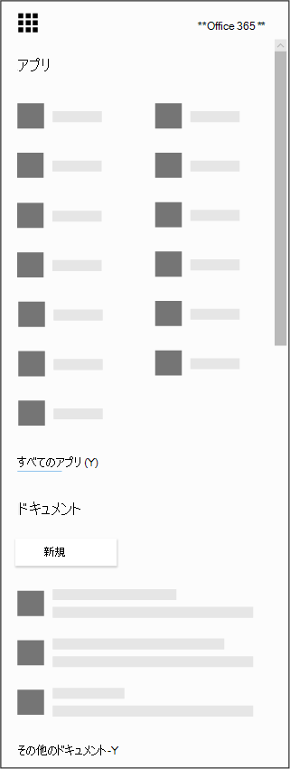

# iOS と Android 用の Microsoft Bookings アプリを取得する

Microsoft Bookings は、iOS および Android 用のモバイル アプリとして利用できます。 iOS 用の Bookings アプリは、Apple がサポートしているすべての地域と国で利用できます。 iTunes App Store から [アプリをダウンロードできます](https://apps.apple.com/app/microsoft-bookings/id1065657468)。 Android 用の Bookings アプリは、米国とカナダの [Google Play ストア](https://play.google.com/store/apps/details?id=com.microsoft.exchange.bookings) からダウンロードできます。

## はじめに

始める前に、Web で 予約 を設定する必要があります。

1. アプリ 起動ツールから [すべてのアプリ] を選択すると、利用可能なアプリのアルファベットMicrosoft 365一覧が表示されます。 そこから、特定のアプリを検索できます

   

2. ホーム ページ [のOfficeし、](https://office.com)アプリ起動ツールから [予約]**を選択します**。

3. [ **今すぐダウンロード**] を選択します。

4. 所有または実行するビジネスまたは組織の名前と種類を指定します。

5. これで、組織の予約を設定する準備ができました。 「Microsoft [Bookings」トピックの手順に従](bookings-overview.md) って、予約の設定を完了します。

## Bookings アプリをダウンロードする

Bookings Web アプリを設定したら、デバイスのオンライン ストアに移動し、Bookings アプリをダウンロードし、管理者アカウントでサインインします。

## 表示専用モード

Bookings で読み取り/書き込みアクセスが許可されていないユーザーは、ビュー専用モードでモバイル アプリを使用できます。 予約カレンダーに追加される Bookings ライセンスを持つユーザーは、自分と同僚のスケジュール、予定の詳細、ビジネス情報を確認できます。 ビュー専用アクセス権を持つユーザーは、変更や編集を行う事ができません。また、顧客リストにアクセスすることはできません。
