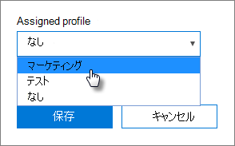

# AutoPilot プロファイルを作成し編集する

> [!NOTE]
> Microsoft Defender for Business は、2022 年 3 月 1 日以降、Microsoft 365 Business Premium のお客様に展開されます。 このオファリングでは、デバイスに追加のセキュリティ機能が提供されます。 [Defender for Business の詳細については、こちらをご覧ください](../security/defender-business/mdb-overview.md)。

## プロファイルの作成

プロファイルがデバイスまたはデバイスのグループに割り当てられます。
  
1. Microsoft 365 管理センターで **[デバイス]** \> **[AutoPilot]** を選択します。
  
2. **[AutoPilot]** ページで、**[プロフィール]** タブ\> **[プロフィールの作成]** を選択します。

3. **[プロファイルの作成]** ページで、識別に役立つプロファイルの名前を入力します。たとえば、マーケティングでは、必要な設定をオンにして **[保存]** を選びます。詳細については、「[AutoPilot プロファイルの設定について](m365bp-autopilot-profile-settings.md)」を参照してください。

    
  
### プロファイルをデバイスに適用する

プロファイルを作成した後、デバイスまたはデバイスのグループに適用することができます。[ステップ バイ ステップ ガイド](m365bp-add-autopilot-devices-and-profile.md)で既存のプロファイルを選んだり、プロファイルを新しいデバイスに適用したり、デバイスまたはデバイスのグループの既存のプロファイルを置き換えたりします。
  
1. [ **Windows の準備**] ページで、[ **デバイス**] タブを選びます。

2. デバイス名の横にあるチェック ボックスをオンにして、**[デバイス]** パネルで、**[割り当てられたプロファイル]** のドロップダウンからプロファイルを選び、\> **[保存]** を選択します。

    
  
## プロファイルの編集または削除

デバイスにプロファイルを割り当てると、そのデバイスを既にユーザーに渡していても、そのプロファイルを更新できます。デバイスをインターネットに接続すると、セットアップ プロセス中に最新バージョンのプロファイルをダウンロードします。ユーザーがデバイスを出荷時の既定の設定にリセットする場合は、デバイスはもう一度プロファイルに最新の更新プログラムをダウンロードします。
  
### プロファイルを編集する

1. [ **Windows の準備**] ページで、[ **プロファイル**] タブを選びます。

2. デバイス名の横にあるチェック ボックスをオンにして、**[プロファイル]** パネルで使用可能な設定を更新して、\> **[保存]** を選択します。

    ユーザーがデバイスをインターネットに接続する前にこの操作を行った場合、プロファイルはセットアップ プロセスに適用されます。

### プロファイルを削除する

1. [ **Windows の準備**] ページで、[ **プロファイル**] タブを選びます。

2. デバイス名の横にあるチェック ボックスをオンにして、**[プロファイル]** パネルで **[プロファイルの削除]** \> **[保存]** の順に選択します。

    プロファイルを削除すると、プロファイルが割り当てられていたデバイスまたはデバイスのグループから削除されます。

### プロフィールを削除する

1. [ **Windows の準備**] ページで、[ **デバイス**] タブを選びます。

2. デバイス名の横にあるチェック ボックスをオンにして、**[デバイス]** パネルで、**[割り当てられたプロファイル]** ドロップダウンから **[なし]** を選び、\> **[保存]** を選択します。

## 関連項目

[ビジネス プランの Microsoft 365 をセキュリティで保護するためのベスト プラクティス](../admin/security-and-compliance/secure-your-business-data.md)
