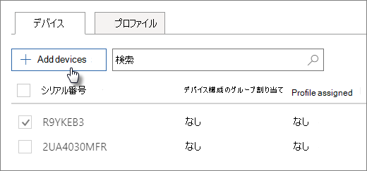

# AutoPilot デバイスを作成し編集する

> [!NOTE]
> Microsoft Defender for Business は、2022 年 3 月 1 日以降、Microsoft 365 Business Premium のお客様に展開されます。 このオファリングでは、デバイスに追加のセキュリティ機能が提供されます。 [Defender for Business の詳細については、こちらをご覧ください](../security/defender-business/mdb-overview.md)。

## デバイスの一覧をアップロードする

[[ステップ バイ ステップ ガイド]](m365bp-add-autopilot-devices-and-profile.md) を使ってデバイスをアップロードできますが、**[デバイス]** タブでアップロードすることもできます。 
  
デバイスは次の要件を満たしている必要があります。
  
- Windows 10 バージョン 1703 以降
    
- Windows out-of-box experience を行っていない新しいデバイス。

1. Microsoft 365 管理センター で、**[デバイス]** \> **[AutoPilot]** の順に選択します。
  
2. **[AutoPilot]** ページで、**[デバイス]** タブ\> **[デバイスの追加]** の順に選びます。
    
    
  
3. **[デバイスの追加]** パネルで準備した [[デバイス リスト CSV ファイル]](../admin/misc/device-list.md) を参照し、\> **[保存]** \> **[閉じる]** の順に選択します。
    
    この情報は、ハードウェアの製造元から、または CSV ファイルを生成する [Get-WindowsAutoPilotInfo PowerShell スクリプト](https://www.powershellgallery.com/packages/Get-WindowsAutoPilotInfo) を使って、入手できます。 
    
## プロファイルをデバイスまたはデバイスのグループに割り当てる

1. **[Windows の準備]** ページで **[デバイス]** タブを選択し、1 つまたは複数のデバイスの横にあるチェック ボックスをオンにします。 
    
2. [ **デバイス**] パネルで、[ **割り当てられたプロファイル**] ドロップダウンからプロファイルを選択します。 
    
    まだプロファイルがない場合は、「[AutoPilot プロファイルの作成と編集](../admin/devices/create-and-edit-autopilot-profiles.md)」の手順をご覧ください。 

## 関連項目

[ビジネス プラン用に Microsoft 365 をセキュリティで保護する上位 10 の方法](../admin/security-and-compliance/secure-your-business-data.md)
