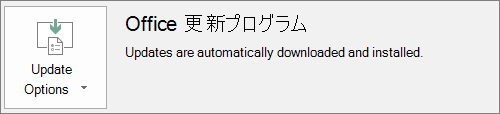

# Office アプリをクライアント コンピューターに自動的にインストールするための準備

Microsoft 365 Business Premium を使用して、32 ビット版の Office アプリを Windows 10 コンピューターに自動的にインストールし、更新プログラムで最新状態に維持します。
  
自動インストールは、次の場合のコンピューターで最適に動作します。 

- Windows 10 Business である。
  
- 既存の Office デスクトップ アプリ (Word、Excel、PowerPoint、Outlook、OneNote、Publisher、Access、OneDrive) が存在していないか、既存のバージョンのクイック実行 Office がインストールされている。

Office のクイック実行バージョンがあるかどうかを判断するには、任意の Office アプリで **[ファイル]** \> **[アカウント]** (Outlook では **[Office アカウント]**) の順に移動します。**Office の更新プログラム** が次の図のように示される場合は、クイック実行を使用してインストールされています。 
  

  
## この機能を使用する場合の要件
  
次の場合に動作します。
  
- Windows 10 Business ユーザー ライセンス、アクティブな Microsoft 365 for Business ライセンス、Windows 10 Creators Update を所有していて、Azure Active Directory に参加しているユーザー。

次の場合は動作しません。 

- 64 ビット版の Office アプリ (例: Word、Excel、PowerPoint)。64 ビット版の Office アプリが必要な場合、Microsoft 365 for Business 管理コンソールから 64 ビット版 2016 クイック実行バージョン Office をトリガーする操作がサポートされていないため、この機能は適合しません。

- すべての 2016 Windows インストーラ (MSI) スタンドアロン アプリ (Visio や Project など)。Microsoft 365 for Business は Office をクイック実行バージョンの Office 2016 にアップグレードしますが、これは Office 2016 MSI スタンドアロン アプリケーションでは動作しません。

次の表では、Microsoft 365 for Business 管理コンソールから 32 ビット版クイック実行バージョンの Office を正しく展開するために、開始時点の状態に応じて、エンド ユーザーまたは管理者が実行する必要のあるアクションを示します。 

|Office インストールの開始状態|Microsoft 365 for Business Office のインストール前に行うアクション|最終的な状態|
|:-----|:-----|:-----|
|Office スイート製品がインストールされない  |なし  |クイック実行を使用して Office 2016 の 32 ビット版をインストールする  |
|Office (2016 以前) の 32 ビット版クイック実行バージョンはあるが、単体アプリはない  |なし  |必要に応じて、最新の Office 2016 の 32 ビット版クイック実行バージョンにアップグレードする **\*** |
|Office の 32 ビット版クイック実行バージョンと、32 ビットまたは 64 ビット版クイック実行の単体 Office アプリ (Visio、Project など) がある  |なし  |単体アプリは影響を受けません。スイート製品を Office 2016 の 32 ビット版クイック実行バージョンにアップグレードする  |
|Office の 32 ビット版クイック実行バージョンと、32 ビットまたは 64 ビット版 (2016 を除く) MSI の単体 Office アプリがある  |なし  |単体アプリは影響を受けません。スイート製品を Office 2016 の 32 ビット版クイック実行バージョンにアップグレードする  |
|任意の Office の 64 ビット版クイック実行バージョンがある  |32 ビット版の Office アプリに置き換えても問題ない場合は、64 ビット版の Office アプリをアンインストールする  |64 ビット版の Office アプリを削除した場合は、32 ビット版クイック実行バージョンの Office 2016 をインストールする  |
|Office 2016 の MSI インストールがある (単体アプリの有無は関係ない)  |MSI Office 2016 をアンインストールする  |Office 2016 の 32 ビット版クイック実行バージョンをインストールする。単体アプリへの変更はなし  |
|既存の Office 2013 (以前) の MSI インストールおよび/または単体の Office アプリ  |なし  |Office 2016 の 32 ビット版クイック実行バージョンと既存の MSI Office インストール (および単体アプリ) が共存する  |

 **(\*) 注:** 既知の問題により、Office 2016 の 32 ビット版クイック実行バージョンにはアップグレードされません。これは修正中です。 

## 次の目標

[デバイス ポリシーを確認および編集する](m365bp-view-edit-create-mdb-policies.md)
  