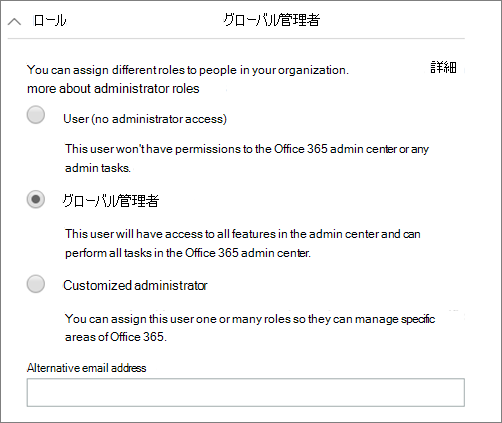

# 管理者アカウントを保護Microsoft 365 Business Premium

管理者アカウントには昇格された特権が付与されていますので、ハッカーやサイバー犯罪者にとって貴重なターゲットです。 この記事の内容

- 緊急事態に備え、追加の管理者アカウントを設定する方法。
- これらのアカウントを保護する方法。

アカウントにサインアップしてMicrosoft 365入力すると、自動的にグローバル管理者になります。グローバル管理者は、Microsoft 管理センターのユーザー アカウントと他のすべての設定を最終的に制御できますが、アクセスの程度が異なるさまざまな種類の管理アカウントがあります。 管理 [役割の種類ごとに異](/office365/admin/add-users/about-admin-roles) なるアクセス レベルの詳細については、管理者の役割に関するページを参照してください。

## 追加の管理者アカウントを作成する

管理アカウントは管理にのみ使用します。 管理者は、Office アプリを定期的に使用するための個別のユーザー アカウントを持ち、アカウントやデバイスの管理や他の管理機能の作業に必要な場合にのみ管理アカウントを使用する必要があります。 また、管理者アカウントから Microsoft 365ライセンスを削除して、支払いを行う必要がなさる必要はありません。

別の信頼できる従業員に管理者アクセス権を与えるために、少なくとも 1 つの追加のグローバル管理者アカウントをセットアップする必要があります。 ユーザー管理用に個別の管理者アカウントを作成することもできます (この役割はユーザー管理 **管理者と呼ばれています**)。 詳細については、「管理者の役割 [」を参照してください](/office365/admin/add-users/about-admin-roles)。

追加の管理者アカウントを作成するには、次の方法を実行します。

 1. 管理センターに移動 <a href="https://go.microsoft.com/fwlink/p/?linkid=837890" target="_blank">し、</a> 左側のナビゲーションで **[ユーザー** \> **のアクティブな** ユーザー] を選択します。

    ![左側のナビゲーションで [ユーザー] と [アクティブ ユーザー] の順に選択します。](../media/Activeusers.png)

 2. [アクティブ **なユーザー]** ページで、ページの上部にある [ユーザーの追加] を選択し、[新しいユーザー] パネルで名前と他の情報を入力します。
 3. [役割] **セクションを展開** し、[グローバル管理者] **を** 選択して、このユーザーにグローバル管理者アクセス権を付与します。 [カスタマイズされた管理者] **を選択し** 、表示される役割を選択することもできます。

    [代替メール アドレス] テキスト ボックス **に別のメールを** 入力します。 ロックアウトされた場合は、このアドレスを使用してパスワード情報を回復できます。グローバル管理者の場合、請求明細書もこのアドレスに送信されます。

    

 4. [製品 **ライセンス] セクション** で、[ビジネス] **のMicrosoft 365を** [オフ] に、[製品ライセンスなしでユーザーを作成する] を [オン **] に** 移動 **します**。

    

## 緊急管理者アカウントを作成する

また、多要素認証 (MFA) でセットアップされていないバックアップ アカウントを作成して、誤って自分自身をロックアウトしないようにする必要があります (たとえば、第 2 の検証形式として使用している携帯電話を紛失した場合など)。 このアカウントのパスワードが語句または 16 文字以上である必要があります。 これは、多くの場合、"break-glass アカウント" と呼ばれます。

## 自分でユーザー アカウントを作成する

ユーザー アカウントを使用して、メールの確認など、組織との共同作業に参加します。 つまり、管理者の資格情報は  *Alice.Chavez @Contoso.org* に似ている可能性があります。通常のユーザー アカウントは *Alice @Contoso.com と似ている可能性があります*。

新しいユーザー アカウントを作成するには、次の方法を実行します。

1. 管理センターに移動 <a href="https://go.microsoft.com/fwlink/p/?linkid=837890" target="_blank">し、</a> 左側のナビゲーションで **[ユーザー** \> **のアクティブな** ユーザー] を選択します。
2. [アクティブ **なユーザー]** ページで、ページの上部にある [ユーザーの追加] を選択し、[新しいユーザー] パネルで名前と他の情報を入力します。
3. [役割] **セクションを展開** し、[ **ユーザー] (管理アクセスなし) を選択します**。
4. [製品 **ライセンス] セクション** で、[ビジネス] の **セレクター Microsoft 365に** 移動 **します**。

## セキュリティの既定値を有効にする

セキュリティの既定値は、Microsoft が組織の代わりに管理する構成済みのセキュリティ設定を提供することで、組織を ID 関連の攻撃から保護するのに役立ちます。 これらの設定には、すべての管理者およびユーザー アカウントに対して多要素認証 (MFA) を有効にする機能が含まれます。 セキュリティの既定値の詳細と有効にする方法については、「セキュリティの既定値を有効 [にする」を参照してください](m365bp-conditional-access.md)。

## その他の推奨事項

- 管理者アカウントを使用する前に、関連のないブラウザー セッションとアプリ (個人用メール アカウントを含む) を閉じます。 プライベート ウィンドウまたはシークレット ブラウザー ウィンドウでも使用できます。
- 管理タスクを完了した後は、必ずブラウザー セッションからサインアウトしてください。
