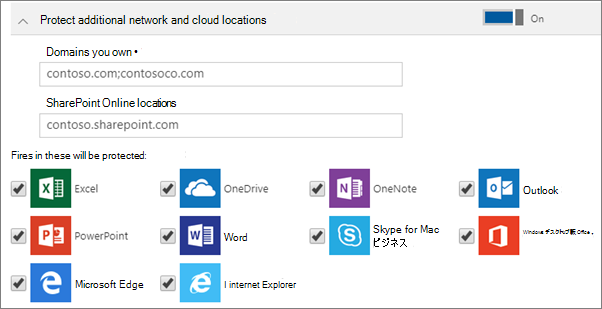

# Windows 10 デバイスのアプリケーション保護設定を設定または編集する

この記事は Microsoft 365 Business Premium に適用されます。

> [!NOTE]
> Microsoft Defender for Business は、2022 年 3 月 1 日以降、Microsoft 365 Business Premium のお客様に展開されます。 このオファリングでは、デバイスに追加のセキュリティ機能が提供されます。 [Defender for Business の詳細については、こちらをご覧ください](../security/defender-business/mdb-overview.md)。

## Windows 10 のアプリ管理ポリシーを編集する

1. <a href="https://go.microsoft.com/fwlink/p/?linkid=837890" target="_blank">https://admin.microsoft.com</a> から管理センターにアクセスします。     

2. 左側のナビゲーションで、**[デバイス]** \> **[ポリシー]** を選択します。

3. 既存の Windows アプリ ポリシーを選択してから、**[編集]** を選択します。

4. 変更する設定の横にある **[編集]** を選択してから、**[保存]** を選択します。

## Windows 10 用のアプリの管理ポリシーを作成する

ユーザーが作業タスクを実行する個人の Windows 10 デバイスを持っている場合、それらのデバイスでもデータを保護することができます。
  
1. <a href="https://go.microsoft.com/fwlink/p/?linkid=837890" target="_blank">https://admin.microsoft.com</a> の管理センターにアクセスします。 

2. 左側のナビゲーションで、**[デバイス]** \> **[ポリシー]**\>**[追加]** を選択します。

3. [ **ポリシーの追加**] ウィンドウで、このポリシーの一意の名前を入力します。 

4. [ **ポリシーの種類**] で、[ **Windows 10 のアプリケーション管理**] を選びます。

5. **[デバイスの種類]** で、**[個人所有]** または **[会社所有]** を選びます。

6. [ **作業ファイルを暗号化する**] が自動的にオンになります。 

7. 作業ファイルをユーザーの PC に保存させたくない場合は、[ **ユーザーが会社のデータを個人用のファイルにコピーすることを防止し、作業ファイルを OneDrive for Business に保存するようユーザーに強制します**] を **オン** に設定します。 

8. **[Windows デバイス上のデータの回復]** を展開します。 **[オン]** にすることをお勧めします。
    データ回復エージェント証明書を先に作成してから、その場所を参照します。 手順については、「[暗号化ファイル システム (EFS) データ回復エージェント (DRA) 証明書の作成と検証](/windows/security/information-protection/windows-information-protection/create-and-verify-an-efs-dra-certificate)」を参照してください。
    
    既定では、デバイスに保存されていてユーザーのプロファイルに関連付けられている秘密キーを使用して、作業ファイルの暗号化が行われます。該当するユーザーのみがファイル開き、暗号化を解除することができます。ただし、デバイスが失われたり、ユーザーが削除されたりした場合、ファイルを暗号化された状態に留めておくことができます。管理者は、データ回復エージェント (DRA) 証明書を使用してファイルを復号化できます。
    
    
  
9. その他のドメインまたは SharePoint Online の場所を追加してリストに表示されているアプリ内のすべてのファイルが確実に保護されるようにする場合は、**[その他のネットワークとクラウドの場所の保護]** を展開します。いずれかのフィールドに複数の項目を入力する必要がある場合は、項目間にセミコロン (;) を使用します。
    
    
  
11. Next decide **Who will get these settings?** If you don't want to use the default **All Users** security group, choose **Change**, choose the security groups who will get these settings \> **Select**.
12. 最後に、[ **追加**] を選択してポリシーを保存し、それをデバイスに割り当てます。

## 関連項目

[ビジネス プラン用に Microsoft 365 をセキュリティで保護する上位 10 の方法](../admin/security-and-compliance/secure-your-business-data.md)