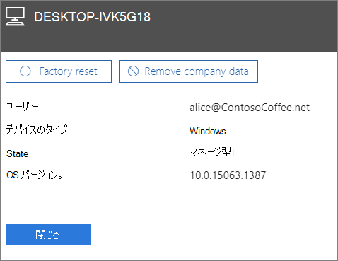

# デバイスから会社のデータを削除する

この記事は Microsoft 365 Business Premium に適用されます。

> [!NOTE]
> Microsoft Defender for Business は、2022 年 3 月 1 日以降、Microsoft 365 Business Premium のお客様に展開されます。 このオファリングでは、デバイスに追加のセキュリティ機能が提供されます。 [Defender for Business の詳細については、こちらをご覧ください](../security/defender-business/mdb-overview.md)。

## 会社データを削除する

Microsoft 365 for Business を使って、ユーザーが Microsoft 365 で保護されている自分の [デバイス](m365bp-app-protection-settings-for-android-and-ios.md)または [Windows PC](m365bp-protection-settings-for-windows-10-devices.md) にある会社データを削除できます。**デバイスから会社データを削除すると、後でデータを復元することはできません**。 
  
1. <a href="https://go.microsoft.com/fwlink/p/?linkid=837890" target="_blank">https://admin.microsoft.com</a> から管理センターにアクセスします。
    
2. 左側のナビゲーションで、**[デバイス]** \> **[管理]** を選択します。
  
3. **[管理]** ページで、データを削除するユーザーを選択または検索し、名前を選択します。 
    
4. 次のウィンドウで、**[デバイス]** リストから 1 つまたは複数のデバイスを選択します。 開いたデバイス ウィンドウで、デバイスの種類に応じて、デバイスを工場出荷時の設定にリセットするか、会社のデータを削除するかを選択できます。 
    
    
  
5. 確認ウィンドウで、**[確認]** \> **[閉じる]** を選択します。
    

## 関連項目

[ビジネス プランの Microsoft 365 をセキュリティで保護するためのベスト プラクティス](../admin/security-and-compliance/secure-your-business-data.md)