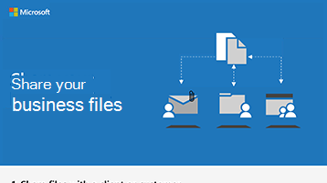

# ファイルやビデオを共有する

もう 1 つの注意すべき点は、組織のすべてのメンバーがファイルを表示および編集できるユーザーを制御し、適切なアクセス許可が適用された安全な場所に保存されるようにすることです。 ユーザーは Microsoft Teams を使用してファイルを保存し、Microsoft Teams を使用するか SharePoint リンクを送信して、会社、プラクティス、またはキャンペーンの内部または外部でファイルを共有できます。 メールの添付ファイルではなくリンクを送信すると、ファイルを表示および変更しているユーザーがわかっており、許可なく表示または変更することはできません。

![メニューの [ファイル] タブと [取得] リンクを示す Microsoft Teams ウィンドウの図。](../media/m365-democracy-teams-sharefiles.png)

Microsoft Teams と SharePoint のファイルを使用すると、必要に応じて変更を追跡して、ファイルを一緒に作業およびレビューすることもできます。 Teams では、ファイルは会社、練習、またはキャンペーン内で共有されます。 組織外のユーザーと外部で共有する必要がある場合は、ゲストとしてチームに追加するか、セキュリティで保護された SharePoint リンクを送信できます。

Microsoft Stream を使用して、ビデオを内部的に保存および共有することもできます。 これらのビデオは一般に公開されないため、社内メッセージングやキャンペーン メッセージングに最適です。

## ベスト プラクティス

ユーザーが次の方法を使用してファイルとビデオを安全に共有していることを確認します。

1. Microsoft Teams または SharePoint にファイルを保存し、それらのファイルにアクセスする必要があるユーザーにのみファイルが提供されていることを確認します。
2. 共有する場合は、ファイルをメールに添付しないでください。 代わりに [**Microsoft Teams または SharePoint からリンク を取得する**] を選択し、リンクを電子メールで送信します。
3. ファイルを外部で共有するには、ユーザーをゲストとしてチームに追加するか、SharePoint を使用してそのファイルのみを共有するためのセキュリティで保護されたリンクを取得します。
4. Microsoft Stream を使用して、キャンペーンに表示するビデオをホストします。
5. Microsoft Teams または SharePoint を使用して、チームが共同作業や共有に必要なビデオ ファイルを保存します。

## 設定

組織のメンバーは、次の手順でチームを作成し、広告主や提携パートナーなどのゲストを追加できます。

> [!VIDEO https://www.microsoft.com/videoplayer/embed/RE1FQMp]

Microsoft Teams を使用せずに、セキュリティで保護されたリンクをゲストと共有するには、次の手順に従います。

> [!VIDEO https://www.microsoft.com/videoplayer/embed/RE22Yf0]

ビデオを作成して共有するには、次の手順に従います。

> [!VIDEO https://www.microsoft.com/videoplayer/embed/RWrv0F]

[PDF](https://go.microsoft.com/fwlink/?linkid=2079435) または [PowerPoint](https://go.microsoft.com/fwlink/?linkid=2079438) のインフォグラフィックをダウンロードして、ファイルを共有する方法の簡単な概要を確認してください。

## 次の目標

この目標が完了したら、チームの[コミュニケーション サイトを作成](create-communications-site.md)します。

