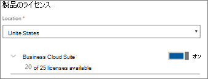

# ユーザーを追加する

この記事は、Microsoft 365 Business Premium に適用されます。

## 新しいユーザーを追加する

ユーザーの追加に関する短いビデオを視聴します。   

> [!VIDEO https://www.microsoft.com/videoplayer/embed/RE1FOfN] 

このビデオがお役に立った場合には、「[complete training series for small businesses and those new to Microsoft 365 (小規模企業および Microsoft 365 を初めて使用する企業向けのトレーニング シリーズ)](https://support.office.com/article/6ab4bbcd-79cf-4000-a0bd-d42ce4d12816)」をご覧ください。

ユーザーを追加するには、次のようにします。

1. <a href="https://go.microsoft.com/fwlink/p/?linkid=837890" target="_blank">https://admin.microsoft.com</a> で管理センターにアクセスします。 
2. 左側のナビゲーションウィンドウで、[**ユーザー**の \> **アクティブなユーザー**] を選択します。
3. [**アクティブなユーザー** ] ページで、[**ユーザーの追加**] を選択します。
4. [**新しいユーザー** ] パネルで、必要な情報を入力します。 
  
    [**連絡先情報**] の下に詳細情報を入力し、[**パスワード**の設定] でパスワードを設定する方法と、[**役割**] で役割を割り当てることができます。
      
    
      
    [製品ライセンス] セクションで、[ **Microsoft 365 Business Premium** Product license] 設定を **[オン**] に設定します。
      
    
  
ユーザーの追加の詳細について[は、「ユーザーを個別にまたは一括](https://docs.microsoft.com/office365/admin/add-users/add-users)して追加する」を参照してください。
  
