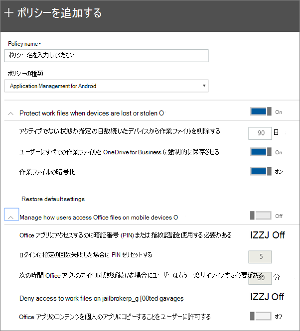

# Android または iOS デバイスのアプリ保護設定を設定する

この記事は、このMicrosoft 365 Business Premium。

## アプリの管理ポリシーを作成する

1. <a href="https://go.microsoft.com/fwlink/p/?linkid=837890" target="_blank">https://admin.microsoft.com</a> から管理センターにアクセスします。 
    
2. 左側のナビゲーションで、[デバイス ポリシー **の** \> **追加] を** \> **選択します**。
  
3. [ **ポリシーの追加**] ウィンドウで、このポリシーの一意の名前を入力します。 
    
4. [ **ポリシーの種類]** で、作成するポリシーのセットに応じて **、[Android** 用アプリケーション管理] または **[iOS** 用アプリケーション管理] を選択します。 
    
5. [**デバイスが紛失または盗難された** 場合に作業ファイルを保護する] を展開し、ユーザーがモバイル デバイス上Officeファイルにアクセスする **方法を管理します**。 必要な設定を構成します。 **ユーザーがモバイル デバイスOfficeファイル** にアクセスする方法を管理するには、既定で [オフ] を選択しますが、オンにし、既定値を受け入れすることをお勧めします。 詳細については、「使用可能な設定 [」を参照してください](#available-settings)。 
    
    [ **既定の設定に戻す**] リンクを使用すれば、既定の設定にいつでも戻すことができます。 
    
    
  
6. Next decide **Who will get these settings?** 既定の [すべてのユーザー] セキュリティグループを使用しない場合は、[変更] を選択し、これらの設定を取得するセキュリティ グループを選択 \> **します**。
    
7. 最後に、[ **完了**] を選択してポリシーを保存し、それをデバイスに割り当てます。 
    
## アプリの管理ポリシーを編集する

1. [ポリシー] **カードで、[** ポリシーの編集] **を選択します**。
    
2. [ **ポリシーの編集**] ウィンドウで、変更するポリシーを選択します。 
    
3. 各設定の横にある [ **編集**] を選び、ポリシーの値を変更します。 値を変更すると、ポリシーに自動的に保存されます。
    
4. 完了したら、[ポリシーの編集] **ウィンドウを閉** じます。 
    
## アプリの管理ポリシーを削除する

1. [ポリシー **] ページで** ポリシーを選択し、[削除] を **クリックします**。
    
2. [ポリシー **の削除] ウィンドウで** 、[確認] **を選択** して、選択したポリシーまたはポリシーを削除します。 
    
## 利用可能な設定

次の表に、デバイス上の作業ファイルを保護するために使用できる設定と、ユーザーがモバイル デバイスからファイルにアクセスする方法を制御するOffice詳細な情報を示します。
  
 詳細については、「Intune の設定[にマップするMicrosoft 365 Business Premium方法」を参照してください](map-protection-features-to-intune-settings.md)。 
  
### 作業ファイルを保護する設定

次の設定は、ユーザーのデバイスが紛失したり盗難された場合に、作業ファイルを保護するために使用できます。

|Setting    |説明    |
|:-----|:-----|
|この日数後、非アクティブなデバイスから作業ファイルを削除する    |ここで指定した日数のデバイスを使用しない場合、デバイスに保存されている作業ファイルは自動的に削除されます。    |
|ユーザーにすべての作業ファイルを OneDrive for Business に強制的に保存させる    |この設定が **[オン] の場合**、作業ファイルに使用できる保存場所は、OneDrive for Business。    |
|作業ファイルの暗号化    |作業ファイルが暗号化によって保護されるように、この設定は常に **オン** にします。 デバイスが紛失または盗まれた場合でも、誰も会社のデータを読み取ることはありません。    |
   
### ユーザーがモバイル デバイスで Office ファイルにアクセスする方法を制御する設定

次の設定は、ユーザーが Office 作業ファイルにアクセスする方法を管理するために使用できます。

|Setting    |説明    |
|:-----|:-----|
|Office アプリにアクセスするのに暗証番号 (PIN) または指紋認証を使用する必要がある    |この設定が **[オン] の** 場合、ユーザーはモバイル デバイスでアプリを使用する前に、ユーザー名とパスワードに加えて、別の形式の認証Office必要があります。  |
|ログインに指定の回数失敗した場合に PIN をリセットする    |承認されていないユーザーが PIN をランダムに推測するのを防ぐため、指定した回数、エントリを間違うと、PIN がリセットされます。    |
|次の時間 Office アプリのアイドル状態が続いた場合にユーザーはもう一度サインインする必要がある    |この設定は、ユーザーが再度サインインするように求めるメッセージが表示されるまでアイドル状態にできる期間を決定します。    |
|脱獄またはルート化したデバイスでの作業ファイルへのアクセスを拒否する    |賢いユーザーは、脱獄またはルート化されたデバイスを持っている場合があります。これは、ユーザーがオペレーティング システムを変更できるため、デバイスがマルウェアの危険にさらされる可能性が高くなることを意味します。この設定を **オン** にすると、これらのデバイスはブロックされます。    |
|ユーザーがアプリから個人用アプリにコンテンツをコピー Office許可しない    |これは既定で許可していますが、設定が **オン** の場合、ユーザーは作業ファイル内の情報を個人のファイルにコピーできます。 この設定が **オフ** の場合、ユーザーは職場アカウントから個人用アプリまたは個人のアカウントに情報をコピーすることはできません。    |
