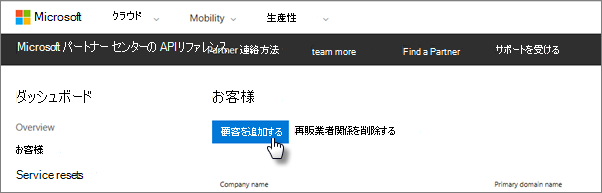

# Microsoft 365 Business Premium を取得する

## Microsoft からMicrosoft 365 Business Premiumを取得する

パートナーがいない場合は、ここでMicrosoft 365 Business Premium購入[できます](https://www.microsoft.com/en-US/microsoft-365/business)。

詳細[な手順については、「Microsoft 365 Business Premium](sign-up.md)サインアップ」を参照してください。

また、ユーザーにアクセスして、Microsoft Store[購入Microsoft 365 Business Premium](https://www.microsoft.com/en-us/store/locations/find-a-store?icid=en_US_Store_UH_FAS)セットアップ のヘルプを受け取る方法を説明します。
  
## Microsoft パートナー Microsoft 365 Business Premiumから情報を取得する

1. クラウド サービス プロバイダー (CSP) プログラムに登録するときに作成した資格情報を使用して、[Microsoft パートナー センター](https://go.microsoft.com/fwlink/p/?linkid=849910)にサインインします。 
    
2. [パートナー ダッシュボード] で、[**顧客**] を選択し、顧客を選択するか、新しい顧客を追加してからMicrosoft 365 Business Premium。
    
    
  
3. 顧客の [サブスクリプション] ページ **で**、[サブスクリプションの追加] を選択し、[カタログ] の [小規模ビジネス] オプションを選択し、[サブスクリプション]**を** Microsoft 365 Business Premium。 
    
    必要なライセンス数 (最大 300) を選びます。 ユーザーが 300 人を超える場合は、代わりに「Microsoft 365 Enterprise」[を](../enterprise/index.yml)参照してください。 
    
    ![[新しいサブスクリプション] ページで、[小規模ビジネス] を選択します。](../media/52d99e89-2175-4974-84bb-dd626048541b.png)
  
    ビジネス名を含む、新しい顧客を追加するための残りの手順を完了します。
