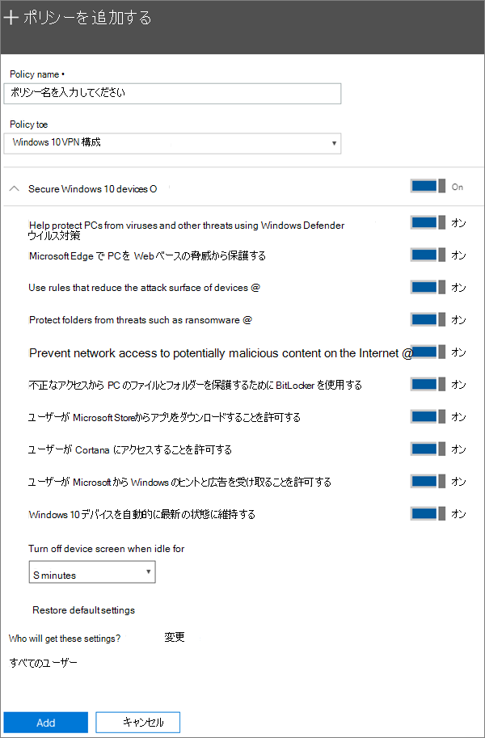

# Windows 10 の PC のデバイス保護設定を設定するSet device protection settings for Windows 10 PCs

## Windows 10 デバイスをセキュリティで保護するSecure Windows 10 devices

Microsoft 365 for business を使用して Windows 10 デバイスをセキュリティで保護する方法に関するビデオを参照してください。View a video on how to secure Windows 10 devices with Microsoft 365 for business:
  
> [!VIDEO https://www.microsoft.com/videoplayer/embed/a5734146-620a-4cec-8618-536b3ca37972?autoplay=false]
  
1. <a href="https://go.microsoft.com/fwlink/p/?linkid=837890" target="_blank">https://admin.microsoft.com</a> で管理センターにアクセスします。Go to the admin center at <a href="https://go.microsoft.com/fwlink/p/?linkid=837890" target="_blank">https://admin.microsoft.com</a>. 
    
2. 左側のナビゲーションで、[**デバイス** \> **ポリシー** \>の**追加**] を選択します。On the left nav, choose **Devices** \> **Policies** \> **Add**.
  
3. [ **ポリシーの追加**] ウィンドウで、このポリシーの一意の名前を入力します。On the **Add policy** pane, enter a unique name for this policy. 
    
4. [ **ポリシーの種類**] で、[ **Windows 10 デバイスの構成**] を選びます。Under **Policy type**, choose **Windows 10 Device Configuration**.
    
5. Expand **Secure Windows 10 Devices** \> configure the settings how you would like.Expand **Secure Windows 10 Devices** \> configure the settings how you would like. 詳細については、「[使用可能な設定](#available-settings)」を参照してください。For more information, see [Available settings](#available-settings). 
    
    [ **既定の設定に戻す**] リンクを使用すれば、既定の設定にいつでも戻すことができます。You can always use the **Reset default settings** link to return to the default setting. 
    
    
  
6. Next decide **Who will get these settings?** If you don't want to use the default **All users** security group, Choose **Change**, search for the security group who will get these settings \> **Select**.Next decide **Who will get these settings?** If you don't want to use the default **All users** security group, Choose **Change**, search for the security group who will get these settings \> **Select**.
    
7. 最後に、[ **完了**] を選択してポリシーを保存し、それをデバイスに割り当てます。Finally, choose **Done** to save the policy, and assign it to devices. 
    
## 利用可能な設定Available settings

既定では、すべての設定が **オン**になっています。By default all settings are **On**. 次の設定を使用できます。The following settings are available.
  
詳細については、「 [Microsoft 365 Premium の保護機能を Intune 設定にマップする方法](map-protection-features-to-intune-settings.md)」を参照してください。For more information, see [How do protection features in Microsoft 365 Premium map to Intune settings](map-protection-features-to-intune-settings.md). 
  
|||
|:-----|:-----|
|設定Setting    |説明Description    |
|Windows Defender ウイルス対策を使用して PC をウイルスとその他の脅威から保護するHelp protect PCs from viruses and other threats using Windows Defender Antivirus    |インターネットに接続されている危険から PC を保護するには、ウイルス対策をオンにする必要があります。Requires that Windows Defender Antivirus is turned on to protect PCs from the dangers of being connected to the internet.    |
|Microsoft Edge で PC を Web ベースの脅威から保護するHelp protect PCs from web-based threats in Microsoft Edge    |ユーザーを悪意のあるサイトやダウンロードから保護するために役立つ、Microsoft Edge の設定をオンにします。Turns on settings in Edge that help protect users from malicious sites and downloads.    |
|デバイスに対する攻撃を回避するルールを使用するUse rules that reduce the attack surface of devices    |オンにすると、攻撃の回避により、デバイス感染のためにマルウェアが通常使用するアクションやアプリをブロックすることができます。Windows Defender ウイルス対策がオンに設定されている場合にのみこの設定を利用できます。詳細については、「[攻撃の回避](https://docs.microsoft.com/windows/security/threat-protection/microsoft-defender-atp/exploit-protection)」を参照してください。  When turned On, attack surface reduction helps block actions and apps typically used by malware to infect devices. This setting is only available if Windows Defender Antivirus is set to On. See [Reduce attack surfaces](https://docs.microsoft.com/windows/security/threat-protection/microsoft-defender-atp/exploit-protection) to learn more.    |
|ランサムウェアなどの脅威からフォルダーを保護するProtect folders from threats such as ransomware    |この設定は、フォルダーへのアクセスを制御することによって、ランサムウェアなどの不審なまたは悪意のあるアプリケーションによる書き換えから会社のデータを保護します。This setting uses controlled folder access to protect company data from modification by suspicious or malicious apps, such as ransomware. こうした種類のアプリケーションは、保護されているフォルダーで変更を行うことができないようにブロックされます。These types of apps are blocked from making changes in protected folders. Windows Defender ウイルス対策がオンに設定されている場合にのみこの設定を利用できます。This setting is only available if Windows Defender Antivirus is set to On. 詳細については、「[フォルダーを制限付きフォルダーアクセスで保護](https://docs.microsoft.com/configmgr/protect/deploy-use/create-deploy-exploit-guard-policy#bkmk_CFA)する」を参照してください。See [Protect folders with Controlled folder access](https://docs.microsoft.com/configmgr/protect/deploy-use/create-deploy-exploit-guard-policy#bkmk_CFA) to learn more.    |
|インターネット上の悪意がある可能性のあるコンテンツに対するネットワーク アクセスを防止するPrevent network access to potentially malicious content on the Internet    |この設定を使用して、フィッシング詐欺、悪用、またはその他の悪意のあるコンテンツをホストする可能性がある低評価のインターネット上の場所への送信ユーザー接続をブロックします。Use this setting to block outbound user connections to low-reputation Internet locations that may host phishing scams, exploits, or other malicious content. この設定は、Windows Defender ウイルス対策が **[オン**] に設定されている場合にのみ使用できます。This setting is only available if Windows Defender Antivirus is set to **On**. 詳細については、「[ネットワークを保護する](https://docs.microsoft.com/windows/security/threat-protection/windows-defender-antivirus/configure-real-time-protection-windows-defender-antivirus)」を参照してください。For more information, see [Protect your network](https://docs.microsoft.com/windows/security/threat-protection/windows-defender-antivirus/configure-real-time-protection-windows-defender-antivirus).    |
|不正なアクセスから PC のファイルとフォルダーを保護するために BitLocker を使用するHelp protect files and folders on PCs from unauthorized access with BitLocker    |BitLocker は、コンピューターのハード ドライブを暗号化することによってデータを保護し、コンピューターの紛失や盗難時にデータの漏えいを防ぎます。Bitlocker protects data by encrypting the computer hard drives and protect against data exposure if a computer is lost or stolen. 詳細については、「Bitlocker に関する[FAQ](https://go.microsoft.com/fwlink/?linkid=871000)」を参照してください。For more information, see [Bitlocker FAQ](https://go.microsoft.com/fwlink/?linkid=871000).    |
|ユーザーが Microsoft Storeからアプリをダウンロードすることを許可するAllow users to download apps from Microsoft Store    |ユーザーが Microsoft Storeからアプリをダウンロードしてインストールできるようにします。アプリにはゲームから生産性向上ツールまであらゆるものが含まれるため、この設定を **オン**のままにしていますが、セキュリティを強化するためにオフにすることもできます。  Lets users download and install apps from the Microsoft Store. Apps include everything from games to productivity tools, so we leave this setting **On**, but you can turn it off for extra security.    |
|ユーザーが Cortana にアクセスすることを許可するAllow users to access Cortana    |Cortana は非常に役に立つ場合があります。Cortana can be very helpful! Cortana では、設定を有効または無効にしたり、案内を表示したり、予定に時間があるかどうかを確認したりすることができます。**この設定は既定でオンに**しておきます。Cortana can turn settings on or off for you, give directions, and make sure you're on time for appointments, so we keep this setting **On** by default.    |
|ユーザーが Microsoft から Windows のヒントと広告を受け取ることを許可するAllow users to receive Windows tips and advertisements from Microsoft    |Windows のヒントは役に立つ場合があり、新機能がリリースされたときにユーザーが適応するのに役立ちます。Windows tips can be handy and help orient users when new features are released.    |
|Windows 10 デバイスを自動的に最新の状態に維持するKeep Windows 10 devices up to date automatically    |Windows 10 デバイスが、最新の更新プログラムを自動的に受け取るようにします。Makes sure that Windows 10 devices automatically receive the latest updates.    |
|この時間アイドル状態になったときにデバイスの画面をオフにするTurn off device screen when idle for this amount of time    |ユーザーがアイドル状態になった場合に、会社のデータが保護されるようにします。ユーザーは、喫茶店などの公共の場所で作業を行っていて、その場から離れたり、一瞬気を取られたりして、デバイスが無作為な視線に対して無防備な状態になってしまう可能性があります。この設定では、画面の電源をオフにする前にユーザーがアイドル状態になる可能性のある時間を管理できます。Makes sure that company data is protected if a user is idle. A user may be working in a public location, like a coffee shop, and step away or be distracted for just a moment, leaving their device vulnerable to random glances. This setting lets you control how long the user can be idle before the screen shuts off.    |
