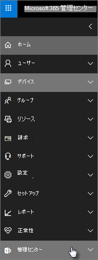

# Microsoft 365 Business Premiumおよびコンプライアンス機能

Microsoft 365 Business Premiumは、PC、電話、タブレット上のデータを保護するための簡略化されたセキュリティ機能を提供します。
    
## Microsoft 365 管理センターセキュリティ機能

管理センターでは、Microsoft 365 Business Premium機能の多くを管理できます。これにより、これらの機能を簡単にオンまたはオフにできます。 管理センターでは、次の操作を実行できます。
  
- [Android デバイスまたは iOS デバイスのアプリケーション管理設定を設定します](app-protection-settings-for-android-and-ios.md) 。 
    
    これらの設定には、一定の期間が終了した後に非アクティブなデバイスからファイルを削除する、作業ファイルを暗号化する、ユーザーが PIN を設定する必要があるなどです。
    
- [デバイスのアプリケーション保護設定をWindows 10します](protection-settings-for-windows-10-devices.md)。 
    
    これらの設定は、会社所有または個人所有の両方のデバイス上の会社のデータに適用できます。
    
- [デバイスのデバイス保護設定をWindows 10します](protection-settings-for-windows-10-pcs.md)。 
    
    [BitLocker](/windows/security/information-protection/bitlocker/bitlocker-frequently-asked-questions)暗号化を有効にして、デバイスが紛失または盗難に備えデータを保護し、Windows [Exploit Guard](/windows/security/threat-protection/microsoft-defender-atp/enable-exploit-protection)がランサムウェアに対する高度な保護を提供することを可能にします。 
    
- [デバイスから会社のデータを削除する](remove-company-data.md)
    
    デバイスが紛失、盗難、または従業員が会社を離れた場合は、会社のデータをリモートで消去できます。
    
- [デバイスWindows 10工場出荷時の設定にリセットします](reset-devices-to-factory-settings.md)。 
    
    デバイス保護設定が適用Windows 10デバイスをリセットできます。
    
## その他のセキュリティ機能 

Microsoft 365 Business Premium の高度な機能を使用すると、サイバー アタックからビジネスを保護し、機密情報を保護できます。
  
- **[Microsoft Defender for Office 365](../security/office-365-security/defender-for-office-365.md)**
    
    Microsoft Defender for Office 365は、従業員や顧客情報を侵害するように設計された高度なフィッシング攻撃やランサムウェア攻撃からビジネスを守るのに役立ちます。 以下の機能があります。
    
  - 危険なメッセージを検出して破棄する高度な添付ファイルスキャンと AI による分析。
    
  - 電子メール内のリンクがフィッシングスキームの一部である場合に評価するための自動チェック。 これにより、安全でない Web サイトに安全にアクセスできます。

- **[Azure portal での Intune の完全な機能](/mem/intune/fundamentals/what-is-intune)**
    
    Azure portal の Intune 管理センターにアクセスすると、macOS デバイス、iPhone、Android デバイスの管理などの追加のセキュリティ機能と、Microsoft 365 管理センター では使用できない Windows の高度なデバイス管理をセットアップできます。
- **プラン [と同じ](/azure/active-directory/conditional-access/overview)条件付Azure AD Premium P1アクセス**

    条件付きアクセスは、サインインリスクから組織を保護したり、予期しないネットワークやロケールからのアクセス試行、危険なデバイスの種類からのアクセス試行などから組織を保護するのに役立ちます。 条件付きアクセス ポリシーは、最初の認証が完了した後に適用され、最初の認証イベントからの信号を使用して、アクセスの承認、拒否、または証拠の追加 (2 番目の形式の識別など) が必要かどうかを判断します。

    条件付きアクセス機能は次のとおりです。

    - ユーザー名、グループ、および役割に基づくアクセス
    - アプリ [に基づくアクセス](/azure/active-directory/conditional-access/app-based-conditional-access) 
    - [場所に基づくアクセス](/azure/active-directory/authentication/howto-registration-mfa-sspr-combined#conditional-access-policies-for-combined-registration)。 信頼できる IP 範囲または特定の国からのアクセスのみを許可する 
    - アクセスに MFA を要求する
    - 従来の認証を使用するアプリへの [アクセスをブロックする](/azure/active-directory/conditional-access/block-legacy-authentication)
    - アプリで Intune アプリ保護 [を使用する必要がある](/azure/active-directory/conditional-access/app-protection-based-conditional-access)
    - サードパーティ プロバイダーを使用した MFA などのカスタム認証 (DUO など)。
   
    その他の機能:
    - ハイブリッド Azure[アプリケーションのセルフサービス](/azure/active-directory/authentication/concept-sspr-customization)パスワードのリセットAD
    
## コンプライアンス機能

お客様Microsoft 365 Business Premiumサブスクリプションには、コンプライアンスと規制基準の維持に役立つ機能が含まれています。

- **[データ損失防止について学ぶ](../compliance/dlp-learn-about-dlp.md))** (DLP)。 
    
    DLP を設定して、クレジット カード番号、社会保障番号などの機密情報を自動的に検出し、会社外での不注意な共有を防止できます。
    
- **[Exchange Online Archiving](https://products.office.com/exchange/microsoft-exchange-online-archiving-email)**
    
    Exchange Online Archivingライセンスを使用すると、継続的なデータ バックアップを使用してメッセージを簡単にアーカイブできます。 後で検出または復元に必要な場合に備え、削除済みアイテムを含むすべてのユーザーの電子メールが保存されます。 さらに、さまざまな保持ポリシーを使用して、訴訟ホールド、電子情報開示、またはコンプライアンス要件を満たすために電子メール データを保持できます。
    
- **[秘密度ラベル](../compliance/sensitivity-labels.md)**

   Microsoft 365 Business Premiumには[、Azure Information Protection Plan 1 のすべての機能が含まれています](https://go.microsoft.com/fwlink/p/?linkid=871407)。 この計画では、電子メールやドキュメント内の機密情報へのアクセスを制御できる機密ラベルを作成できます。"転送しない" や "コピーしない" などのコントロールを使用します。 機密情報を "Confidential" として分類し、機密情報をビジネスの外部および内部で共有する方法を指定できます。 Enterpriseの暗号化は、電子メールやドキュメントに簡単に適用して、情報を非公開にできます。 また、アプリの Azure Information Protection クライアント アドインをインストールOfficeすることもできます。 詳細については、「[Azure Information Protection 統合ラベル付けクライアント](/azure/information-protection/rms-client/unifiedlabelingclient-version-release-history)」を参照してください。 [感度] ラベルの場合は、次 **のAzInfoProtection_UL.exe。**

これらの機能は、セキュリティ コンプライアンス センター &amp; と Intune 管理センターで管理できます。 時間がたつ間に、簡略化されたコントロールがコントロールにMicrosoft 365 管理センター。
  
    
## よくあるご質問 (FAQ)

 ### これらのセキュリティ機能は、すべての市場で利用できますか?
  
はい、これらの機能は、販売されているすべてのMicrosoft 365 Business Premium利用できます。
  
### セキュリティ コンプライアンス センターを &amp; 見つける方法
  
1. [管理者資格情報を使用してMicrosoft 365 Business Premium](https://portal.microsoft.com/)にサインインします。 
    
2. 左側のナビゲーションで、管理センター **を見つけて** 展開します。 
    
    
  
3. [セキュリティ **コンプライアンス &amp; ] を** 選択して、[セキュリティ コンプライアンス センター &amp; ] に移動します。
