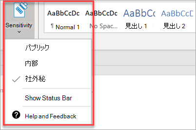

# コンプライアンス機能をセットアップするSet up compliance features

ユーザー Microsoft 365 Business Premiumデータとデバイスを保護し、ユーザーと顧客の機密情報を安全に保つ機能が付属しています。Your Microsoft 365 Business Premium comes with features to protect your data and devices, and help you keep your and your customers' sensitive information secure.

## DLP 機能のセットアップSet up DLP features

個人 [データの損失から保護する](../compliance/create-a-dlp-policy-from-a-template.md) ポリシーを設定する方法の例については、「テンプレートから DLP ポリシーを作成する」を参照してください。See [Create a DLP policy from a template](../compliance/create-a-dlp-policy-from-a-template.md) for an example on how to set up a policy to protect against protect loss of personal data. 
  
DLP には、多くの異なる地域ですぐに使用できるポリシー テンプレートが多数付属しています。DLP comes with many ready-to-use policy templates for many different locales. たとえば、オーストラリアの財務データ、カナダの個人情報法、米国の財務データなどです。For example, Australia Financial Data, Canada Personal Information Act, U.S. Financial Data, and so on. 完全 [なリストについては、「DLP ポリシー テンプレートに含まれる](../compliance/what-the-dlp-policy-templates-include.md) もの」を参照してください。See [What the DLP policy templates include](../compliance/what-the-dlp-policy-templates-include.md) for a full list. これらのテンプレートはすべて、PII テンプレートの例と同様に有効にできます。All of these templates can be enabled similar to the PII template example. 
  
## メールの保持を設定するには、Exchange Online ArchivingSet up email retention with Exchange Online Archiving

 **Exchange Online Archiving** 機能は、電子情報開示用の電子メール コンテンツを保持することで、コンプライアンスと規制の標準を維持するのに役立ちます。**Exchange Online Archiving** license features help maintain compliance and regulatory standards by preserving email content for eDiscovery. また、訴訟が発生した場合のリスクを軽減し、セキュリティ侵害後または削除済みアイテムを回復する必要がある場合にデータを回復する方法を提供します。It also helps reduce your risk if there is a lawsuit, and provides a way to recover data after a security breach or when you need to recover deleted items. 訴訟ホールドを使用して、すべてのユーザーのコンテンツを保持したり、保持ポリシーを使用して保持する内容をカスタマイズすることができます。You can use litigation hold to preserve all of a user's content, or use retention policies to customize what you want to preserve.
  
**訴訟ホールド:** ユーザーのメールボックス全体を訴訟ホールドに設定することで、削除済みアイテムを含むすべてのメールボックス コンテンツを保持できます。**Litigation hold:** You can preserve all mailbox content including deleted items by putting a user's entire mailbox on litigation hold. 
    
メールボックスを訴訟ホールドに設定するには、管理センターで次の処理を行います。To place a mailbox on litigation hold, in the Admin center:
    
1. 左側のナビゲーションで、[ユーザーのアクティブな **ユーザー]** \> **に移動します**。In the left nav, go to **Users** \> **Active users**.
    
2. 訴訟ホールドにメールボックスを配置するユーザーを選択します。Select a user whose mailbox you want to place on litigation hold. ユーザー ウィンドウで、[メールの設定]**を展開** し、[その他の設定] の横にある **[プロパティ** の編集] Exchange **します**。In the user pane, expand **Mail settings**, and next to **More settings**, choose **Edit Exchange properties**.
    
3. ユーザーのメールボックス ページで、左側のナビゲーションで \*\* メールボックス機能 \*\* を選択し、[訴訟ホールド] の [有効にする] リンク **を選択します**。On the mailbox page for the user, choose \*\* mailbox features \*\* on the left nav, and then choose the **Enable** link under **Litigation hold**.
    
4. [訴訟 **ホールド] ダイアログ** ボックスで、[訴訟ホールド期間] フィールドで訴訟ホールド **期間を指定** できます。In the **litigation hold** dialog box, you can specify the litigation hold duration in the **Litigation hold duration** field. 無限ホールドを設定する場合は、フィールドを空のままにします。Leave the field empty if you want to place an infinite hold. メモを追加して、訴訟ホールドの詳細を説明する必要がある Web サイトにメールボックスの所有者を指示できます。You can also add notes and direct the mailbox owner to a website you might have to explain more about the litigation hold. \>**保存 .**\> **Save**.
    
**保持:** たとえば、カスタマイズした保持ポリシーを有効にして、特定の時間保持したり、保持期間の終わりにコンテンツを完全に削除したりできます。**Retention:** You can enable customized retention policies, for example, to preserve for a specific amount of time or delete content permanently at the end of the retention period. 詳細については、「アイテム保持ポリシー [の概要」を参照してください](../compliance/retention.md)。To learn more, see [Overview of retention policies](../compliance/retention.md).

## [感度ラベルの設定]Set up Sensitivity labels

感度ラベルには、Azure Information Protection (AIP) プラン 1 が付き、ラベルを適用してドキュメントと電子メールを分類し、必要に応じて保護するのに役立ちます。Sensitivity labels come with Azure Information Protection (AIP) Plan 1, and help you classify, and optionally protect your documents and emails, by applying labels. ラベルは、ルールと条件を定義する管理者、ユーザーが手動で、またはユーザーに推奨される組み合わせを使用して自動的に適用できます。Labels can be applied automatically by administrators who define rules and conditions, manually by users, or by using a combination where users are given recommendations.

[感度ラベル] を設定するには、[感度 [ラベルの作成と管理] ビデオを表示](../business-video/create-sensitivity-labels.md) します。To set up Sensitivity labels, view [create and manage sensitivity labels](../business-video/create-sensitivity-labels.md) video.

### Azure Information Protection クライアントを手動でインストールするInstall the Azure Information Protection client manually

AIP クライアントを手動でインストールするには、次の手順を実行します。To manually install the AIP client:

1. Microsoft **ダウンロードAzinfoProtection_UL.exe** ダウンロード [センターからダウンロードします](https://www.microsoft.com/download/details.aspx?id=53018)。Download **AzinfoProtection_UL.exe** from [Microsoft download center](https://www.microsoft.com/download/details.aspx?id=53018).
 
2. Word ドキュメントを表示し、[ホーム] タブで [感度] オプションを使用して、インストールが機能したと **確認** できます。You can verify that the installation worked by viewing a Word document and making sure that the **Sensitivity** option is available on the **Home** tab.
 ![Word ドキュメントの [保護] タブ のドロップダウン。](../media/word-sensitivity.png)

詳細については、「クライアントのインストール [」を参照してください](/azure/information-protection/infoprotect-tutorial-step3)。For more information, see [Install the client](/azure/information-protection/infoprotect-tutorial-step3).