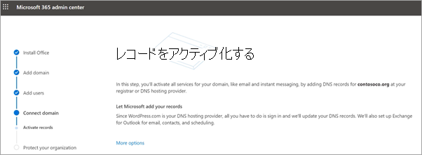
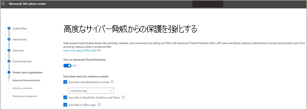

# セットアップウィザードで Microsoft 365 Business Premium をセットアップする

Microsoft 365 Business Premium のセットアップの概要については、このビデオをご覧ください。  

> [!VIDEO https://www.microsoft.com/videoplayer/embed/RE1FYSM] 

このビデオが役に立った場合には、「[complete training series for small businesses and those new to Microsoft 365 (小規模企業および Microsoft 365 を初めて使用する企業向けのトレーニング シリーズ)](https://support.office.com/article/6ab4bbcd-79cf-4000-a0bd-d42ce4d12816)」をご覧ください。

## ドメイン、ユーザーを追加し、ポリシーをセットアップする

Microsoft 365 Business Premium を購入する場合は、所有しているドメインを使用するか、[サインアップ](sign-up.md)中に1つ購入するかを選択できます。

- サインアップ時に新しいドメインを購入した場合、ドメインはすべてセットアップされており、ユーザーを[追加してライセンスを割り当てる](#add-users-and-assign-licenses)ことができます。

### サインインを個人用に設定するためにドメインを追加する

1. グローバル管理者の資格情報を使用して、 [Microsoft 365 管理センター](https://admin.microsoft.com)にサインインします。 

2. [**セットアップに移動**] を選択してウィザードを開始します。

    ![[セットアップに移動] を選択します。](../media/gotosetupinadmincenter.png)

3. [ **Office アプリのインストール**] ページで、必要に応じて、自分のコンピューターにアプリをインストールすることもできます。
    
4. [**ドメインの追加**] ステップで、使用するドメイン名 (contoso.com など) を入力します。

    > [!IMPORTANT]
    > サインアップ中にドメインを購入した場合は、ここに [**ドメインの追加**] 手順は表示されません。 代わりに、[[ユーザーの追加](#add-users-and-assign-licenses)] に移動します。

    ![[サインインのカスタマイズ] ページのスクリーンショット。](../media/adddomain.png)

    
4. ウィザードの手順に従って、ドメインを所有していることを確認する[Office 365 用の任意の dns ホスティングプロバイダーで dns レコードを作成](https://docs.microsoft.com/office365/admin/get-help-with-domains/create-dns-records-at-any-dns-hosting-provider)します。 ドメインホストがわかっている場合は、「[ホスト固有の指示](https://docs.microsoft.com/office365/admin/get-help-with-domains/set-up-your-domain-host-specific-instructions)」も参照してください。

    ホスティングプロバイダーが GoDaddy、または[ドメイン接続](https://docs.microsoft.com/office365/admin/get-help-with-domains/domain-connect)を使用して他のホストが有効になっている場合、このプロセスは簡単であり、サインインして Microsoft に代わって認証を行うように自動的に求められます。

    ![[GoDaddy のアクセス確認] ページで、[承認] を選択します。](../media/godaddyauth.png)

### ユーザーを追加して、ライセンスを割り当てる

ウィザードでユーザーを追加することはできますが、[後](add-users-m365b.md)で管理センターでユーザーを追加することもできます。 また、ローカルドメインコントローラーがある場合は、 [AZURE AD Connect](https://docs.microsoft.com/azure/active-directory/hybrid/how-to-connect-install-express)を使用してユーザーを追加できます。

#### ウィザードでユーザーを追加する

ウィザードで追加したユーザーには、Microsoft 365 Business Premium ライセンスが自動的に割り当てられます。

![ウィザードの [新しいユーザーの追加] ページのスクリーンショット](../media/addnewuserspage.png)

1. Microsoft 365 Business Premium サブスクリプションに既存のユーザーが含まれている場合 (たとえば、Azure AD Connect を使用した場合)、すぐにライセンスを割り当てるオプションが表示されます。 続行して、これらのユーザーにもライセンスを追加します。

2. ユーザーを追加すると、追加した新しいユーザーと資格情報を共有するためのオプションも表示されます。 それらを印刷、メール、またはダウンロードできます。

### ドメインを接続する

> [!NOTE]
> . Onmicrosoft ドメインを使用することを選択した場合、または Azure AD Connect を使用してユーザーを設定した場合は、この手順は表示されません。
  
サービスを設定するには、DNS ホストまたはドメイン レジストラーにあるレコードを更新する必要があります。
  
1. セットアップ ウィザードでは通常、ユーザーのレジストラーが検出され、レジストラーの Web サイトで NS レコードを更新するための詳しい操作手順へのリンクが表示されます。 含まれていない場合は、ネームサーバーを[変更して、任意のドメインレジストラーで Office 365](https://docs.microsoft.com/microsoft-365/admin/get-help-with-domains/change-nameservers-at-any-domain-registrar)をセットアップします。 

    - 既存の DNS レコード (既存の web サイトなど) があるが、DNS ホストが[ドメイン接続](https://docs.microsoft.com/office365/admin/get-help-with-domains/domain-connect)に対して有効になっている場合は、[**レコードの追加**] を選択します。 [**オンラインサービスの選択**] ページで、すべての既定値をそのまま使用し、[**次へ**] を選択して、DNS ホストのページで [**承認**] を選択します。
    - 他の DNS ホスト (ドメイン接続に対して有効になっていません) に既存の dns レコードがある場合は、独自の DNS レコードを管理して、既存のサービスが常に接続していることを確認する必要があります。 詳細については、「[ドメインの基礎](https://docs.microsoft.com/office365/admin/get-help-with-domains/dns-basics)」を参照してください。

        

2. ウィザードの手順を実行すると、電子メールとその他のサービスが設定されます。

### 組織を保護する 

ウィザードで設定したポリシーは、*すべてのユーザー*と呼ばれる[セキュリティグループ](https://docs.microsoft.com/office365/admin/create-groups/compare-groups#security-groups)に自動的に適用されます。 管理センターで、ポリシーを割り当てるための追加のグループを作成することもできます。

1. **高度なサイバー脅威からの保護を強化**するには、office [365 の事前の脅威保護](https://docs.microsoft.com/microsoft-365/security/office-365-security/office-365-atp)で office アプリのファイルとリンクをスキャンできるように、既定値をそのまま使用することをお勧めします。

    

2. [**機密データのリークを防止**する] ページで、既定値をそのまま使用して Office 365 データ損失防止 (DLP) を有効にし、office アプリの機密データを追跡し、誤って組織外で共有されないようにします。

3. [ **Office for mobile のデータを保護**する] ページで、[モバイルアプリの管理] を選択したまま、設定を展開して確認し、[**モバイルアプリ管理ポリシーの作成**] を選択します。

    ![[Office for mobile のデータを保護する] ページのスクリーンショット](../media/protectdatainmobile.png)

## Windows 10 Pc をセキュリティで保護する

左側のナビゲーションで、[**セットアップ**] を選択し、[**サインインとセキュリティ**] で [ **Windows 10 コンピューターのセキュリティ保護**] を選択します。 [**表示**] を選んで開始します。 詳細な手順については[、「Windows 10 コンピューターのセキュリティ保護](secure-win-10-pcs.md)」を参照してください。

## Office 365 クライアントアプリを展開する

セットアップ時に Office アプリを自動的にインストールすることを選択した場合、ユーザーが作業の資格情報を使用して、Windows デバイスから Azure AD にサインインすると、アプリが Windows 10 デバイスにインストールされます。

モバイル iOS または Android デバイスに Office をインストールするには、「 [Microsoft 365 Business Premium ユーザーのモバイルデバイスのセットアップ](set-up-mobile-devices.md)」を参照してください。

Office を個別にインストールすることもできます。 手順について[は、「PC または Mac に Office をインストールする](https://support.office.com/article/4414eaaf-0478-48be-9c42-23adc4716658)」を参照してください。

## 関連項目

[一般法人向け Microsoft 365 のトレーニング ビデオ](https://support.office.com/article/6ab4bbcd-79cf-4000-a0bd-d42ce4d12816)
