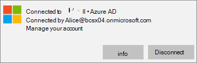

# Windows 10 PC でアプリの保護設定を検証する

## ユーザーが会社データを企業のデバイスの個人用ファイルにコピーできないことを確認する

[アプリの保護ポリシーを設定](protection-settings-for-windows-10-devices.md) した後は、ポリシーがユーザーのデバイスに影響を与えるまで最大で数時間かかる場合があります。 [ユーザーが会社のデータを個人用ファイルにコピーし、会社所有のデバイスの作業ファイルを **OneDrive for Business** に保存するように強制する] 設定をオンにした場合は、Azure AD に接続してサインインした後、ユーザーのデバイスでこれを確認できます。 
  
 **接続の設定を確認する**
  
1. Microsoft 365 Business Premium 資格情報を使用してサインインし、「Microsoft 365 Business Premium ユーザー用 [の Windows](set-up-windows-devices.md)デバイスのセットアップ」の説明に従って Azure AD に接続した後、[Windows 設定アカウント アクセスの仕事または学校] に \>  \> **移動します**。 [Azure **に接続] \<tenant name\> をAD** し、[情報] を **選択します**。
    
    
  
2. [**管理] ページで**、次の図に示すように、管理サーバー アドレスを含む接続 \<tenant name\> 情報を確認できます。   
    
    
  
 **管理されていないアプリに会社のデータを貼り付けできないことを確認する**
  
1. ユーザー Outlook 2016によってインストールされたファイルを開Microsoft 365 Business Premium。
    
2. メールを開き、そこから一部のコンテンツをコピーします。
    
    メモ帳を開き、そこにコンテンツを貼り付けようとします。
    
    アプリがコンテンツにアクセスできないというエラーが表示されます。
    
    
  
    ただし、同じコンテンツを Word 2016 には貼り付けることができます。
    
## ユーザーが会社データを個人用デバイスの個人用ファイルにコピーできないことを確認する

 **接続の設定を確認する**
  
1. ローカル ユーザー Windows 10ログインしている個人用デバイスで、[Windows 設定] に移動し、[アカウントアクセスの仕事または学校] をクリックまたは \> **タップします**。
    
2. [ **職場または学校にアクセスする**] の下で [ **接続**] を選びます。
    
3. [仕事Microsoft 365 Business Premiumアカウントの設定] ダイアログに資格情報を入力 **します** \> 。サインイン **します**。
    
4. [ **職場または学校にアクセスする**] ページで、[ **職場または学校アカウント**] を選んで、[ **情報**] を選びます。
    
    ![[仕事または学校のアカウント] ダイアログで [情報] をクリックまたはタップします。](../media/63bd8b32-cb32-4afa-8ce0-6070ac403abc.png)
  
5. [アクセス **の作業時間または** 学校] ページで、次の図に示すような管理サーバー アドレスを含む接続情報を確認できます。その中に wip と *mam* という単語が含まれています。 
    
    
  
 **管理されていないアプリに会社のデータを貼り付けできないことを確認する**
  
1. アカウントOutlook 2016開き、必要に応Microsoft 365 Business Premiumアカウントを追加し、資格情報を使用Microsoft 365 Business Premiumします。
    
2. メールを開き、そこから一部のコンテンツをコピーします。
    
    メモ帳を開き、そこにコンテンツを貼り付けようとします。
    
    アプリがコンテンツにアクセスできないというエラーが表示されます。
    
    
  
    ただし、同じコンテンツを Word 2016 には貼り付けることができます。
    

