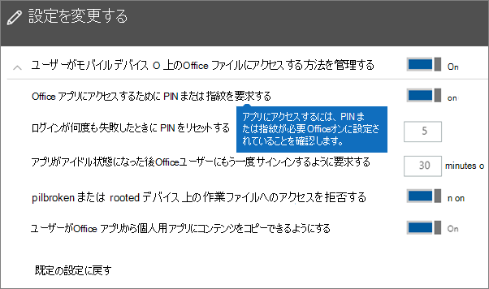
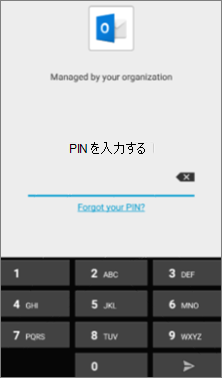
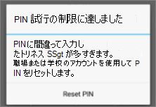

# Android または iOS デバイスのアプリ保護設定を検証する

Android または iOS デバイスのアプリ保護設定を検証するには、以下のセクションの手順に従います。
  
## Android
  
### アプリ保護の設定がユーザーのデバイスで動作していることを確認する

[Android デバイス用のアプリの構成を設定](app-protection-settings-for-android-and-ios.md) し、アプリを保護したら、次の手順に従って、選択した設定が機能することを検証できます。 
  
最初に、検証するアプリケーションにポリシーが適用されていることを確認してください。
  
1. Microsoft 365 Business Premium[管理センター](https://portal.office.com)で、[ポリシー編集**ポリシー] に移動** \> **Edit policy**します。
    
2. セットアップ時に作成した設定または作成した別のポリシーに対する**Android 用のアプリケーションポリシー**を選択し、それが Outlook に対して適用されることを確認します (例:)。 
    
    
  
### Office アプリにアクセスするのに必要な PIN または指紋認証を検証する

[ **ポリシーの編集**] ウィンドウで、[ **Office ドキュメントのアクセス制御**] の横の [ **編集**] を選び、[ **ユーザーによるモバイル デバイスの Office ファイルのアクセス方法を管理する**] を展開し、[ **Office アプリにアクセスするのに暗証番号 (PIN) または指紋認証を使用する必要がある**] が **オン**に設定されていることを確認します。
  

  
1. ユーザーの Android デバイスで、Outlook を開き、ユーザーの Microsoft 365 Business Premium 資格情報を使用してサインインします。
    
2. また、PIN の入力や指紋の使用を求めるメッセージが表示されます。
    
    
  
### [PIN をリセットする試行の失敗回数] を検証する

[**ポリシーの編集**] ウィンドウで、[ **office ドキュメントのアクセス制御**] の横にある [**編集**] を選択し、[**ユーザーがモバイルデバイスで Office ファイルにアクセスする方法を管理**する] を展開して、[試行回数が次の数になっ**たら PIN を再**設定する] をいくつかの番号に設定します。 既定では5です。 
  
1. ユーザーの Android デバイスで、Outlook を開き、ユーザーの Microsoft 365 Business Premium 資格情報を使用してサインインします。
    
2. ポリシーで指定された回数だけ不正な PIN を入力します。 Pin のリセットに、Pin の**試行制限に達し**たことを示すメッセージが表示されます。 
    
    
  
3. [ **PIN のリセット**] を押します。 ユーザーの Microsoft 365 Business Premium 資格情報を使用してサインインするように求められ、新しい PIN を設定する必要があります。
    
### [OneDrive for Business へすべての作業ファイルを保存するようユーザーに強制する] を検証する

[ **ポリシーの編集**] ウィンドウで、[ **デバイスの紛失または盗難に対する保護**] の横の [ **編集**] を選び、[ **デバイスの紛失または盗難時の作業ファイルの保護**] を展開し、[ **OneDrive for Business へすべての作業ファイルを保存するようユーザーに強制する**] が **オン**に設定されていることを確認します。
  

  
1. ユーザーの Android デバイスで、Outlook を開き、ユーザーの Microsoft 365 Business Premium 資格情報を使用してサインインし、要求された場合は PIN を入力します。
    
2. 添付ファイルを含むメールを開き、添付ファイルの情報の横にある下矢印アイコンをタップします。
    
    
  
    画面の下部に [**デバイスに保存できません**] が表示されます。 
    
    
  
    > [!NOTE]
    > この時点では、OneDrive for Business への保存は Android に有効になっていないため、ローカルに保存がブロックされていることだけが確認できます。 
  
### [Office アプリがアイドルになってからユーザーにもう一度サインインを求める時間] を確認する

[**ポリシーの編集**] ウィンドウで、[ **office ドキュメントのアクセス制御**] の横にある [**編集**] を選択し、[**ユーザーがモバイルデバイスで Office ファイルにアクセスする方法を管理**する] を展開し、[ **office アプリがアイドル状態になった後にユーザーが再度サインインする**ように要求する時間 (分)] に設定します。 これは既定で30分です。 
  
1. ユーザーの Android デバイスで、Outlook を開き、ユーザーの Microsoft 365 Business Premium 資格情報を使用してサインインし、要求された場合は PIN を入力します。
    
2. Outlook の受信トレイが表示されます。Android デバイスを少なくとも 30 分間 (またはポリシーに設定した時間よりも長い時間) 触れずにアイドル状態にします。多くの場合、デバイスが暗くなります。
    
3. Android デバイス上の Outlook に再度アクセスします。
    
4. Outlook に再びアクセスするには、PIN の入力を求められます。
    
### 暗号化で作業ファイルの保護を検証する

[ **ポリシーの編集**] ウィンドウで、[ **デバイスの紛失または盗難に対する保護**] の横の [ **編集**] を選び、[ **デバイスの紛失または盗難時の作業ファイルの保護**] を展開し、[ **暗号化を使用して作業ファイルを保護する**] が **オン**、[ **OneDrive for Business へすべての作業ファイルを保存するようユーザーに強制する**] が **オフ**に設定されていることを確認します。
  
1. ユーザーの Android デバイスで、Outlook を開き、ユーザーの Microsoft 365 Business Premium 資格情報を使用してサインインし、要求された場合は PIN を入力します。
    
2. いくつかの画像ファイル添付ファイルが含まれている電子メールを開きます。
    
3. 添付ファイルの情報の横にある下矢印アイコンをタップして、添付ファイルを保存します。
    
    
  
4. Outlook にデバイス上の写真、メディア、ファイルへのアクセスを許可するように求められる場合があります。[ **許可**] をタップします。
    
5. 画面の下部で、[ **デバイスに保存する**] を選び、 **ギャラリー** アプリを開きます。 
    
6. リストに暗号化された写真 (複数の画像の添付ファイルを保存した場合は複数の写真) が表示されます。これは、白い感嘆符が入った白い円が中心にある灰色の四角形として写真リストに表示される場合があります。
    
    
  
## iOS
  
### ユーザーのデバイスでアプリ保護設定が機能していることを確認する

[iOS デバイス用のアプリの構成を設定](app-protection-settings-for-android-and-ios.md) し、アプリを保護したら、次の手順に従って、選択した設定が機能することを検証できます。 
  
最初に、検証するアプリケーションにポリシーが適用されていることを確認してください。
  
1. Microsoft 365 Business Premium[管理センター](https://portal.office.com)で、[ポリシー編集**ポリシー] に移動** \> **Edit policy**します。
    
2. セットアップ時に作成した設定または作成した別のポリシーに対して**iOS 用のアプリケーションポリシー**を選択し、そのポリシーが Outlook 用に適用されているかどうかを確認します。 
    
    
  
### Office アプリにアクセスするのに必要な PIN を検証する

[ **ポリシーの編集**] ウィンドウで、[ **Office ドキュメントのアクセス制御**] の横の [ **編集**] を選び、[ **ユーザーによるモバイル デバイスの Office ファイルのアクセス方法を管理する**] を展開し、[ **Office アプリにアクセスするのに暗証番号 (PIN) または指紋認証を使用する必要がある**] が **オン**に設定されていることを確認します。
  

  
1. ユーザーの iOS デバイスで、Outlook を開き、ユーザーの Microsoft 365 Business Premium 資格情報を使用してサインインします。
    
2. また、PIN の入力や指紋の使用を求めるメッセージが表示されます。
    
    
  
### [PIN をリセットする試行の失敗回数] を検証する

[**ポリシーの編集**] ウィンドウで、[ **office ドキュメントのアクセス制御**] の横にある [**編集**] を選択し、[**ユーザーがモバイルデバイスで Office ファイルにアクセスする方法を管理**する] を展開して、[試行回数が次の数になっ**たら PIN を再**設定する] をいくつかの番号に設定します。 既定では5です。 
  
1. ユーザーの iOS デバイスで、Outlook を開き、ユーザーの Microsoft 365 Business Premium 資格情報を使用してサインインします。
    
2. ポリシーで指定された回数だけ不正な PIN を入力します。 Pin のリセットに、Pin の**試行制限に達し**たことを示すメッセージが表示されます。 
    
    
  
3. [ **OK**] を押します。 ユーザーの Microsoft 365 Business Premium 資格情報を使用してサインインするように求められ、新しい PIN を設定する必要があります。
    
### [OneDrive for Business へすべての作業ファイルを保存するようユーザーに強制する] を検証する

[ **ポリシーの編集**] ウィンドウで、[ **デバイスの紛失または盗難に対する保護**] の横の [ **編集**] を選び、[ **デバイスの紛失または盗難時の作業ファイルの保護**] を展開し、[ **OneDrive for Business へすべての作業ファイルを保存するようユーザーに強制する**] が **オン**に設定されていることを確認します。
  

  
1. ユーザーの iOS デバイスで、Outlook を開き、ユーザーの Microsoft 365 Business Premium 資格情報を使用してサインインし、要求された場合は PIN を入力します。
    
2. 添付ファイルを含むメールを開き、添付ファイルを開き、画面の下部で [ **保存**] を選びます。 
    
    
  
3. OneDrive for Business のオプションのみが表示されます。 含まれていない場合は、[**アカウントの追加**] をタップし、[**ストレージアカウントの追加**] 画面から [ **OneDrive for business** ] を選択します。 プロンプトが表示されたらサインインするために、エンドユーザーの Microsoft 365 Business Premium を提供します。 
    
    [ **保存**] をタップして、[ **OneDrive for Business**] を選びます。
    
### [Office アプリがアイドルになってからユーザーにもう一度サインインを求める時間] を確認する

[**ポリシーの編集**] ウィンドウで、[ **office ドキュメントのアクセス制御**] の横にある [**編集**] を選択し、[**ユーザーがモバイルデバイスで Office ファイルにアクセスする方法を管理**する] を展開し、[ **office アプリがアイドル状態になった後にユーザーが再度サインインする**ように要求する時間 (分)] に設定します。 これは既定で30分です。 
  
1. ユーザーの iOS デバイスで、Outlook を開き、ユーザーの Microsoft 365 Business Premium 資格情報を使用してサインインし、要求された場合は PIN を入力します。
    
2. Outlook の受信トレイが表示されます。iOS デバイスを少なくとも 30 分間 (またはポリシーに設定した時間よりも長い時間) 触れずに放置します。多くの場合、デバイスが暗くなります。
    
3. IOS デバイス上の Outlook に再度アクセスします。
    
4. Outlook に再びアクセスするには、PIN の入力を求められます。
    
### 暗号化で作業ファイルの保護を検証する

[ **ポリシーの編集**] ウィンドウで、[ **デバイスの紛失または盗難に対する保護**] の横の [ **編集**] を選び、[ **デバイスの紛失または盗難時の作業ファイルの保護**] を展開し、[ **暗号化を使用して作業ファイルを保護する**] が **オン**、[ **OneDrive for Business へすべての作業ファイルを保存するようユーザーに強制する**] が **オフ**に設定されていることを確認します。
  
1. ユーザーの iOS デバイスで、Outlook を開き、ユーザーの Microsoft 365 Business Premium 資格情報を使用してサインインし、要求された場合は PIN を入力します。
    
2. いくつかの画像ファイル添付ファイルが含まれている電子メールを開きます。
    
3. 添付ファイルをタップし、その下にある [ **保存**] オプションをタップします。 
    
4. ホーム画面から **写真**アプリを開きます。保存され暗号化された写真 (複数の画像の添付ファイルを保存した場合は複数の写真) が表示されます。 
    
---

