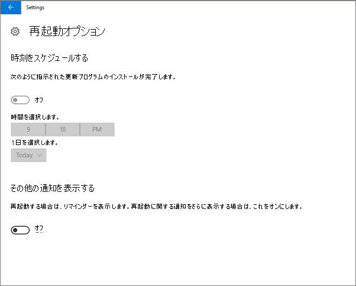

# Windows 10 PC でデバイス保護設定を検証するValidate device protection settings on Windows 10 PCs

## Windows 10 デバイス ポリシーが設定されていることを確認するVerify that Windows 10 device policies are set

[デバイス ポリシーを設定](protection-settings-for-windows-10-pcs.md) した後は、ポリシーがユーザーのデバイスに影響を与えるまで最大で数時間かかる場合があります。After you [set up devices policies](protection-settings-for-windows-10-pcs.md), it may take up to a few hours for the policy to take effect on users' devices. ユーザーのデバイス上でさまざまな Windows の設定画面を表示して、ポリシーが反映されていることを確認できます。You can confirm that the policies took effect by looking at various Windows Settings screens on the users' devices. ユーザーは Windows 10 デバイスで windows Update および Windows Defender ウイルス対策の設定を変更できないため、多くのオプションが灰色表示されます。Because the users won't be able to modify the Windows Update and Windows Defender Antivirus settings on their Windows 10 devices, many options will be grayed out.
  
1. [**設定**\>**更新&amp;セキュリティ** **Windows Update** \> **Restart options** Windows update の再起動オプション] に移動し、すべての設定が淡色表示になっていることを確認します。 \>Go to **Settings** \> **Update &amp; security** \> **Windows Update** \> **Restart options** and confirm that all settings are grayed out. 
    
    
  
2. [**設定** \> ] [ \*\* &amp;セキュリティ\*\* \> **Windows update** \>セキュリティ **] [詳細オプション]** の順に移動し、すべての設定が淡色表示になっていることを確認します。Go to **Settings** \> **Update &amp; security** \> **Windows Update** \> **Advanced options** and confirm that all settings are grayed out. 
    
    
  
3. Go to **Settings** \> **Update &amp; security** \> **Windows Update** \> **Advanced options** \> **Choose how updates are delivered**.Go to **Settings** \> **Update &amp; security** \> **Windows Update** \> **Advanced options** \> **Choose how updates are delivered**.
    
    一部の設定が非表示になっているか、組織によって管理されており、すべてのオプションが灰色表示されていることを確認してください (赤)。Confirm that you can see the message (in red) that some settings are hidden or managed by your organization, and all the options are grayed out.
    
    
  
4. To open the Windows Defender Security Center, go to **Settings** \> **Update &amp; security** \> **Windows Defender** \> click **Open Windows Defender Security Center** \> **Virus &amp; thread protection** \> **Virus &amp; threat protection settings**.To open the Windows Defender Security Center, go to **Settings** \> **Update &amp; security** \> **Windows Defender** \> click **Open Windows Defender Security Center** \> **Virus &amp; thread protection** \> **Virus &amp; threat protection settings**. 
    
5. すべてのオプションが淡色表示になっていることを確認します。Verify that all options are grayed out. 
    
    
  
## 関連項目Related Topics

[Microsoft 365 for business のドキュメントとリソースMicrosoft 365 for business documentation and resources](https://go.microsoft.com/fwlink/p/?linkid=853701)
  
[Microsoft 365 for business の使用を開始するGet started with Microsoft 365 for business](microsoft-365-business-overview.md)
  
[Microsoft 365 for business の管理Manage Microsoft 365 for business](manage.md)
  
[Windows 10 の PC のデバイス構成を設定するSet device configurations for Windows 10 PCs](protection-settings-for-windows-10-pcs.md)
  

