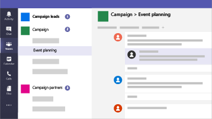
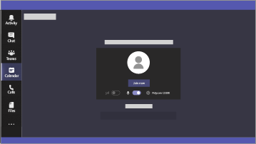
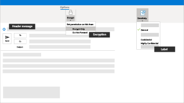
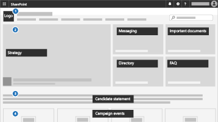
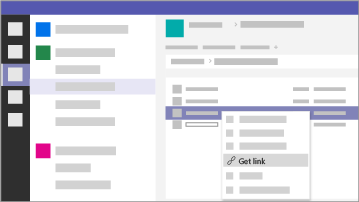

# Microsoft 365 for smaller businesses and campaigns

現代の社会において、データと通信を安全に保つことは、とりわけ医療および法務実務、政治キャンペーン、および他の多くの小規模ビジネスの分野において重要な事項です。 小規模ビジネス内で安全に共同作業Microsoft 365 Business Premiumセキュリティ機能を活用します。 このソリューションでは、お客様とお客様のデータを保護するための一連の推奨事項を提供しています。 このライブラリには、ビジネスの種類にかかわらず、推奨される環境をセットアップして使用するためのヘルプが用意されています。

この構成には、ビジネスを保護するための生産性、共同作業、ファイル ストレージ、メール、デバイス、および ID に関する以下のガイダンスが含まれています。

| 保護の対象 | 説明 | リンク |
| ----- | ----- | ----- | ----- |
|メール | 多要素認証、ATP 高度なフィッシング保護、ATP の安全なリンク機能、安全な添付ファイルを使用し、機密情報には暗号化されたメールを使用します。| [多要素認証のセットアップ](m365-campaigns-multifactor-authenication.md)、[フィッシング攻撃からの保護](m365-campaigns-phishing-and-attacks.md)、[機密性の高いメールの暗号化またはラベル付け](send-encrypted-email.md) |
|iOS および Android デバイス |多要素認証を使用し、Microsoft のモバイル アプリをセットアップし、PIN を要求する | [多要素認証をセットアップする](m365-campaigns-multifactor-authenication.md)、[モバイル デバイスをセットアップする](../business/set-up-mobile-devices.md?toc=/microsoft-365/campaigns/toc.json)|
|Bring-your-own-devices (BYOD) Mac および Windows 10 PC |Office や OS を最新の状態に保ち、セキュリティ機能を有効にします。 | [非管理対象の Windows 10 PC と Mac を保護する](m365-campaigns-protect-pcs-macs.md) |
|ファイルを安全に保存して共有する | Microsoft Teams、OneDrive、SharePoint、Microsoft Stream からファイルやビデオを共有し、機密データを保護します。| [ファイルやビデオを共有する](share-files-and-videos.md) |
|管理された Windows 10 デバイス |管理されたデバイスを主要なスタッフに提供し、これらのデバイスを保護します。 | [管理されたデバイスをセットアップする](../business/set-up-windows-devices.md?toc=/microsoft-365/campaigns/toc.json) |

## Microsoft 365 Business Premium の推奨セキュリティ構成

この Microsoft 365 Business Premium の推奨される安全な構成は、お客様に以下のサービスを提供します。

- 信頼できるビジネス生産性と共同作業ツール (Outlook、Word、Excel、その他の Office 製品など) に依存します。
- iOS、Android、Windows 10 のすべてのデバイス上の作業ファイルを、管理が容易なエンタープライズ レベルのセキュリティで保護します。
- ユーザー アカウントと ID に追加の保護を適用します。

> [!VIDEO https://www.microsoft.com/videoplayer/embed/RE3clbH]

米国の連邦および一部の州での選挙キャンペーンは、Microsoft 365 Business Premium の Microsoft 365 for Campaigns サービスの[特別価格](get-microsoft-365-campaigns.md)の対象となりますが、Business Premium プランを採用している組織は、このガイダンスを利用して強化されたセキュリティを構成し、安全に共同作業を行う方法について学ぶことができます。

このライブラリの内訳は次のとおりです。

- セキュリティを強化する際に規範となるセットアップ ガイダンス。
- セキュリティで保護されたアクセスができるよう、デバイスをセットアップするためのヘルプ。
- セキュイティで保護された共同作業および共有を行う方法を示したガイダンス。

含まれる機能の詳細については、[[Microsoft 365 Business Premium]](https://www.microsoft.com/microsoft-365/business)を参照してください。

## 作業の開始

以下の手順に従って開始しましょう。

- キャンペーンの場合:「[Microsoft 365 for Campaigns を入手する](get-microsoft-365-campaigns.md)」
- 各種ビジネスの場合:「[ユーザーが Microsoft 365 を使用する方法について説明](m365-campaigns-users.md)」
- 各種ビジネスの場合:「[Set up Microsoft 365 (Microsoft 365 のセットアップ)](microsoft-365-campaigns-setup-overview.md)」

## ビジネス向けのソリューション

セキュリティで保護された Microsoft 365 環境をセットアップした後は、次のソリューションを使用して作業できます。

| 共同作業のためのチームを作成する | オンライン会議を設定する |
| ------------- | ------------- |
|  |  |
| 主要なスタッフ、すべてのスタッフ、およびパートナーまたはベンダーのチームと協力します。 [チームを作成する](create-teams-for-collaboration.md) | Microsoft Teams でオーディオ、ビデオ、共有を使用して会議をスケジュールします。 [会議を設定する](set-up-meetings.md) |

| 機密情報を暗号化またはラベル付けする | コミュニケーション サイトを作成する |
| ------------- | ------------- |
|  |  |
| 機密情報や機密情報を含むメールを保護するには、暗号化と機密ラベルを使用します。 [暗号化された電子メールを送信する](send-encrypted-email.md) | SharePoint で作成した内部のコミュニケーションサイトで、イベント、メッセージ、画像などをチームと共有できます。 [サイトを作成する](create-communications-site.md) |

| ファイルやビデオを共有する |
| ------------- |
|  |
| ファイルとビデオをクラウドに保存して、  適切なすべてのユーザーが利用できるようにします。 [共有の開始](share-files-and-videos.md) |
